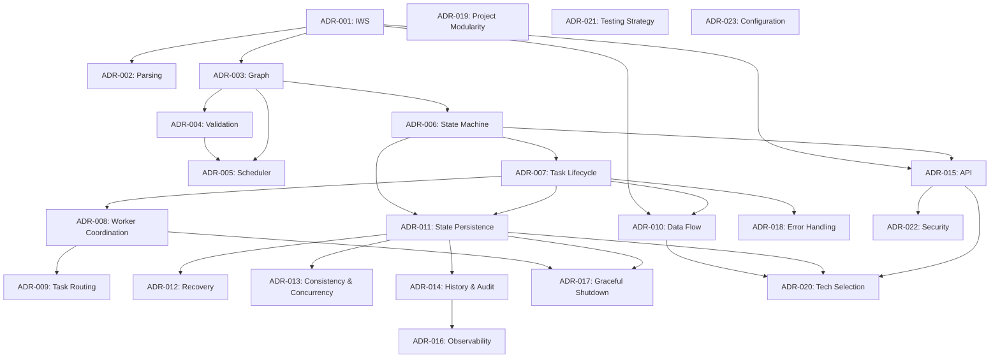
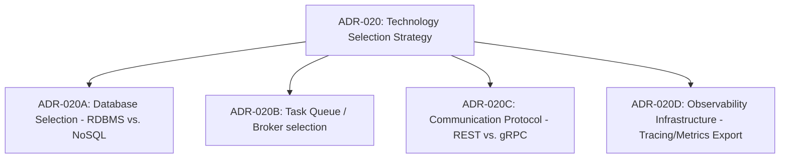

# Architecture Decision Register (ADR Register)

* **Status**: Approved (Frozen)
* **Last Updated**: 2026-08-05
* **Deciders**: Technical Architect (Antigravity), Project Owner

---

## 1. Purpose & How to Use
The Architecture Decision Register is the master index and roadmap for all critical design decisions within NexusFlow. It operates as the central planning artifact for system architecture, establishing:
1. **Decision Traceability**: Links all design choices back to Knowledge Transfers (KTs), Functional Requirements (FRs), and Non-Functional Requirements (NFRs).
2. **Implementation Sequence**: Defines design, documentation, and implementation order.
3. **Concept Ownership**: Defines which ADR is responsible for maintaining the invariants of each architectural domain.

---

## 2. Architecture Principles
These permanent engineering principles guide every architectural decision, trade-off evaluation, and implementation choice in NexusFlow:

*   **Correctness Over Performance**
    *   *Why*: Workflow orchestration coordinates critical business processes. Latency overhead is acceptable; state corruption, double progression, or lost execution completions are completely unacceptable.
    *   *Influences*: Storage persistence layers, state transitions, event updates.
    *   *Key ADRs*: ADR-011 (Persistence), ADR-013 (Concurrency).
*   **Explicit Behaviour Over Implicit Behaviour**
    *   *Why*: Implicit logic makes debugging distributed systems impossible. State changes, timeout schedules, and worker dispatches must be logged explicitly with transparent tracing metadata.
    *   *Influences*: State-machine transitions, lifecycle tracking.
    *   *Key ADRs*: ADR-006 (State Machine), ADR-014 (History & Audit).
*   **Technology Independence Before Implementation**
    *   *Why*: Decoupling core orchestration logic from external technology selection prevents proprietary engine lock-in and facilitates migration.
    *   *Influences*: Core scheduling, domain modeling, IWS definition.
    *   *Key ADRs*: ADR-001 (IWS), ADR-020 (Tech Selection).
*   **Recovery as a First-Class Capability**
    *   *Why*: In a distributed engine, crashes are expected runtime conditions. Self-healing/recovery loops must be built into the core design from day one rather than as an operational afterthought.
    *   *Influences*: Boot-up reconcilers, persistence checks.
    *   *Key ADRs*: ADR-012 (Recovery).
*   **Deterministic State Transitions**
    *   *Why*: Reproducible execution paths are required for auditability, replay capabilities, and debugging. State machines must reject side-effect injections.
    *   *Influences*: DAG traversal, event processing.
    *   *Key ADRs*: ADR-005 (Scheduler), ADR-006 (State Machine).
*   **Observability by Design**
    *   *Why*: Orchestrators run opaque, distributed business code. Tracking tasks across heterogeneous pools requires tracing headers and metrics to be designed into every component interface.
    *   *Influences*: Task dispatches, payload transfers.
    *   *Key ADRs*: ADR-016 (Observability).
*   **Simplicity Before Optimization**
    *   *Why*: Readability and system comprehensibility are critical for maintenance and portfolios. Avoid premature distributed-consensus overhead in V1.
    *   *Influences*: Clustering, sharding designs.
    *   *Key ADRs*: ADR-019 (Modularity), ADR-021 (Testing).
*   **Every Abstraction Must Solve a Real Problem**
    *   *Why*: Avoids enterprise architecture bloat. Each abstract layer (e.g., IWS translation) must serve to fulfill a core capability or NFR (e.g., format portability).
    *   *Influences*: Domain entities, graph models.
    *   *Key ADRs*: ADR-001 (IWS), ADR-003 (Graph).
*   **Extensibility Without Rewriting Core Architecture**
    *   *Why*: Allows the engine to support future features (e.g., Python SDK, versioning) strictly through modular extension.
    *   *Influences*: API gateway, modularity boundaries.
    *   *Key ADRs*: ADR-019 (Modularity), ADR-024 (Versioning).
*   **Clear Ownership and Separation of Responsibilities**
    *   *Why*: Prevents monolith coupling. The orchestrator determines *when/where* to run; workers execute the *what* (business logic).
    *   *Influences*: Worker interfaces, API boundaries.
    *   *Key ADRs*: ADR-008 (Worker Coordination).

---

## 3. Architecture Progress Dashboard

| Domain | Total ADRs | Completed ADRs | Current Progress |
| :--- | :---: | :---: | :--- |
| **Foundation** | 4 | 0 | ░░░░░░░░░░ 0% |
| **Execution** | 6 | 0 | ░░░░░░░░░░ 0% |
| **Reliability** | 6 | 0 | ░░░░░░░░░░ 0% |
| **Platform** | 7 | 0 | ░░░░░░░░░░ 0% |
| **Future** | 4 | 0 | [Deferred] |
| **Total V1** | **23** | **0** | **░░░░░░░░░░ 0%** |

---

## 4. ADR Exit Criteria (Definition of Done)
An ADR is considered complete and can transition to the **Approved** status only when it meets the following criteria:
1.  **Problem Definition**: The technical problem, context, and requirements are clearly stated.
2.  **Alternative Evaluation**: At least two alternative approaches are evaluated with explicit pros/cons.
3.  **Tradeoff Preservation**: Decisive engineering tradeoffs are identified and justified.
4.  **Traceability**: Mappings to functional/non-functional requirements and invariants are explicitly listed.
5.  **Decision Validation Checklist**: The checklist at the end of the ADR is completed with no empty justifications.
6.  **Review & Signoff**: Peer-reviewed by the Technical Architect and approved by the Deciders list.

---

## 5. ADR Standard Content Reference
Every individual ADR document authored within NexusFlow must contain the following standardized sections to ensure consistency and SDE-2 interview defensibility:
1.  **Purpose**: Summary of the decision's intent.
2.  **Context**: Background and technical drivers.
3.  **Problem Statement**: The core architectural question or challenge.
4.  **Requirements Covered**: Mapped FR-xxx and NFR-xxx IDs.
5.  **Constraints**: Relevant operational or resource limitations.
6.  **Goals & Non-Goals**: Scope boundaries for the decision.
7.  **Candidate Solutions**: Detailed technical breakdowns of options evaluated.
8.  **Detailed Evaluation**: Pros, cons, and tradeoffs for each option.
9.  **Decision**: The chosen solution.
10. **Decision Rationale**: Concrete justification for the selection.
11. **Tradeoffs**: What is sacrificed in exchange for the benefits.
12. **Consequences**: Downstream impacts on the codebase, performance, and structure.
13. **Failure Modes**: Known ways this decision can fail and how they are mitigated.
14. **Debugging Considerations**: How logs, metrics, or traces expose this subsystem's behavior.
15. **Testing Considerations**: How this component will be unit tested and failure-simulated.
16. **Operational Considerations**: Run-time configuration and resource footprints.
17. **Maintenance Considerations**: Extensibility and evolution hazards.
18. **Future Evolution**: Upgrade paths for V2 (e.g., how to clustering-enable this component).
19. **Rejected Alternatives**: Detailed record of why other options were discarded.
20. **Decision Evolution**: Record of modifications if the decision is updated in the future.
21. **Common Misconceptions**: Documentation of pitfalls or misunderstandings.
22. **Open Questions**: Known unknowns to resolve later.
23. **Interview Discussion**: SDE-2 style defensive questions and answers for architectural reviews.
24. **References**: Documentation links and industrial comparisons.
25. **Traceability**: Structural dependencies to other ADRs and code files.
26. **Decision Validation Checklist**: The 13-item verification questionnaire.

---

## 6. Architecture Review Checklist
Before any ADR is moved from `Under Review` to `Approved`, the deciders must verify the following checklist:
*   [ ] Is the problem statement decoupled from specific database/broker technologies?
*   [ ] Are the functional requirements (FRs) and non-functional requirements (NFRs) traced?
*   [ ] Were at least two realistic candidate designs critically evaluated?
*   [ ] Are the tradeoffs clear (what are we giving up for simplicity or correctness)?
*   [ ] Does the design preserve all mapped system invariants (from KT-8)?
*   [ ] Does this decision avoid introducing tight coupling between modules?
*   [ ] Are the potential failure modes (network partitions, power loss, database restarts) mapped?
*   [ ] Is there a clear explanation of how this design behaves during a graceful shutdown?
*   [ ] Are the debugging strategies (critical logs, correlation tracing) defined?
*   [ ] Does the testing strategy explain how to simulate failures and recovery?
*   [ ] Are the performance limits and resource footprints qualitatively identified?
*   [ ] Is the future evolution path to HA or multi-tenant deployment explained?
*   [ ] Can this decision be defended during an SDE-2 engineering review?

---

## 7. Architectural Rules

### 7.1 ADR Lifecycle Statuses
ADRs transition through the following states during the project:
*   **Planned**: The topic is identified as a necessary architectural decision, but design has not started.
*   **Draft**: The ADR is actively being authored and candidate solutions are under evaluation.
*   **Under Review**: The draft is complete and presented for architecture review and feedback.
*   **Approved**: The decision is finalized, validated, and signed off. It represents active design guidance.
*   **Frozen**: The decision is locked for implementation. Changes require an explicit mutation ADR.
*   **Deprecated**: The decision is no longer active but is retained for historical traceability.
*   **Superseded**: The decision has been replaced by a newer ADR, with a link pointing to the successor.

### 7.2 ADR Criticality Levels
*   **Critical**: Structural pivot point. Core correctness, recovery, or durability cannot function without this choice.
*   **Core**: Foundational for Version 1 capabilities (e.g., DSL parser structure, scheduler loops).
*   **Supporting**: Focuses on developer velocity, modularity, or environment isolation (e.g., config structures, testing frameworks).
*   **Future**: Outside Version 1 scope; tracked to ensure current decisions do not block future extensibility.

### 7.3 ADR Relationship Types
ADRs maintain bidirectional relationships using the following definitions:
*   **Depends On**: Design cannot proceed without the output of the referenced ADR.
*   **Implements**: Provides the concrete design for a capability or functional requirement.
*   **Extends**: Adds supplemental rules or sub-components to an existing decision.
*   **Related To**: Shares common design bounds or cross-system concerns.
*   **Supersedes**: Replaces and invalidates a previous ADR.

---

## 8. When Should a New ADR Be Created?

### 8.1 Mandate for a New ADR
A new ADR must be created when a proposed design change:
1.  **Correctness**: Changes the engine's consistency models, data structures, or transaction boundaries.
2.  **Persistence**: Modifies the storage paradigm (e.g., moving from Event Sourcing to State-Space).
3.  **Lifecycle**: Alters the valid state transitions of workflow executions or task executions.
4.  **Scheduling**: Changes how task eligibility is evaluated (e.g., changing DAG traversal logic).
5.  **Concurrency**: Modifies locking mechanisms or conflict resolution strategies.
6.  **Recovery**: Changes the boot-up state-rebuilding or execution-resumption logic.
7.  **Public API**: Modifies the gateway communication protocol (REST, gRPC) or response contracts.
8.  **Domain Model**: Introduces or deletes a core domain vocabulary term (e.g., adding compensation states).
9.  **Observability**: Redesigns tracing headers, metrics collection, or operational dashboards.

### 8.2 Updating an Existing ADR Instead
An existing ADR should be updated (without creating a new one) if:
*   **Clarification**: The change only clarifies ambiguous text without altering design rules.
*   **Typos/Formatting**: Fixing documentation errors or broken reference links.
*   **Refinement**: Making minor internal modifications to an approved choice that does not violate mapped requirements or invariants.
*   *Note*: When updating an approved ADR, preserve historical logs in the "Decision Evolution" section.

---

## 9. Master ADR Catalog

### Foundation (Definition & Representation)
| ID | Title | Status | Criticality | Owner | Relationships |
| :--- | :--- | :--- | :--- | :--- | :--- |
| **ADR-001** | Internal Workflow Specification (IWS) | Planned | **Critical** | Core Data Model | • **Implements**: Capability 1<br>• **Related To**: ADR-002, ADR-003 |
| **ADR-002** | Workflow Definition Parsing Strategy | Planned | **Core** | Parser Engine | • **Depends On**: ADR-001<br>• **Implements**: FR-WDV-001, FR-WDV-004 |
| **ADR-003** | Canonical Workflow Graph Representation | Planned | **Critical** | Graph Core | • **Depends On**: ADR-001<br>• **Implements**: Capability 4 |
| **ADR-004** | Workflow Validation Strategy | Planned | **Core** | Graph Validator | • **Depends On**: ADR-003<br>• **Implements**: FR-WDV-008, FR-WDV-009 |

### Execution & Worker Coordination
| ID | Title | Status | Criticality | Owner | Relationships |
| :--- | :--- | :--- | :--- | :--- | :--- |
| **ADR-005** | Scheduler Architecture | Planned | **Critical** | Scheduler Behavior | • **Depends On**: ADR-003, ADR-004<br>• **Implements**: Capability 3 |
| **ADR-006** | Workflow Execution State Machine | Planned | **Critical** | Workflow Lifecycle | • **Depends On**: ADR-003<br>• **Implements**: Capability 6 |
| **ADR-007** | Task Execution Lifecycle & Attempt Model | Planned | **Critical** | Task Lifecycle | • **Depends On**: ADR-006<br>• **Implements**: Capability 7 |
| **ADR-008** | Worker Coordination & Liveness Model | Planned | **Core** | Worker Coordination | • **Depends On**: ADR-007<br>• **Implements**: Capability 5 |
| **ADR-009** | Task Routing Strategy | Planned | **Supporting** | Task Routing | • **Depends On**: ADR-008<br>• **Related To**: ADR-005 |
| **ADR-010** | Workflow Data Flow Model | Planned | **Core** | Payload Handling | • **Depends On**: ADR-001, ADR-007<br>• **Implements**: Capability 10 |

### Reliability & Durability
| ID | Title | Status | Criticality | Owner | Relationships |
| :--- | :--- | :--- | :--- | :--- | :--- |
| **ADR-011** | State Persistence Strategy | Planned | **Critical** | Persistence | • **Depends On**: ADR-006, ADR-007<br>• **Implements**: Capability 10 |
| **ADR-012** | Recovery Strategy | Planned | **Critical** | Recovery | • **Depends On**: ADR-011<br>• **Implements**: Capability 12 |
| **ADR-013** | Consistency & Concurrency Strategy | Planned | **Critical** | Consistency | • **Depends On**: ADR-011<br>• **Implements**: NFR-COR-001 |
| **ADR-014** | History & Audit Model | Planned | **Core** | Execution History | • **Depends On**: ADR-011<br>• **Implements**: Capability 11 |
| **ADR-017** | Graceful Shutdown Strategy | Planned | **Supporting** | Lifecycle Drain | • **Depends On**: ADR-008, ADR-011<br>• **Implements**: NFR-REL-003 |
| **ADR-018** | Error Handling Philosophy | Planned | **Core** | Exception Handling | • **Depends On**: ADR-007<br>• **Related To**: ADR-012 |

### Platform & Integration
| ID | Title | Status | Criticality | Owner | Relationships |
| :--- | :--- | :--- | :--- | :--- | :--- |
| **ADR-015** | API Architecture | Planned | **Core** | API Contracts | • **Depends On**: ADR-001, ADR-006<br>• **Implements**: Capability 13 |
| **ADR-016** | Observability Architecture | Planned | **Supporting** | Observability | • **Depends On**: ADR-014<br>• **Implements**: Capability 14 |
| **ADR-019** | Project Modularity & Service Boundaries | Planned | **Supporting** | Module Topography | • **Related To**: ADR-001 |
| **ADR-020** | Technology Selection Strategy | Planned | **Core** | Technology Choices | • **Depends On**: ADR-010, ADR-011, ADR-015 |
| **ADR-021** | Testing Strategy | Planned | **Supporting** | Testing | • **Implements**: NFR-TST-001 |
| **ADR-022** | Security Model (Version 1) | Planned | **Supporting** | Security Policies | • **Depends On**: ADR-015 |
| **ADR-023** | Configuration Strategy | Planned | **Supporting** | Configuration | • **Implements**: NFR-POR-003 |

### Future (Deferred to Version 2+)
| ID | Title | Status | Criticality | Owner | Relationships |
| :--- | :--- | :--- | :--- | :--- | :--- |
| **ADR-024** | Workflow Versioning Strategy | Future | **Future** | Version Migration | • **Extends**: ADR-001, ADR-006 |
| **ADR-025** | High Availability & Clustering | Future | **Future** | Consensus/Clustering | • **Extends**: ADR-012, ADR-013 |
| **ADR-026** | Multi-language SDK Architecture | Future | **Future** | Client Libraries | • **Extends**: ADR-015 |
| **ADR-027** | Dashboard Architecture | Future | **Future** | Operations UI | • **Extends**: ADR-016 |

---

## 10. ADR Dependency Graph
The following Mermaid diagram outlines the strict architectural dependencies that govern design.



---

## 11. Multiple Ordering Views

### 7.1 Design Order (Conceptual Mapping)
Design order is driven by logical dependencies. We must establish data models and state representations before determining scheduler rules or database locking.
1.  **Wave 1 (Definitions)**: ADR-001, ADR-003, ADR-002, ADR-004.
2.  **Wave 2 (Execution Core)**: ADR-006, ADR-005, ADR-007, ADR-008, ADR-010.
3.  **Wave 3 (Reliability & Persistence)**: ADR-011, ADR-013, ADR-014, ADR-012, ADR-017, ADR-018.
4.  **Wave 4 (Platform & Gateways)**: ADR-019, ADR-021, ADR-023, ADR-015, ADR-022, ADR-016, ADR-020.

### 7.2 Documentation Order (Logical Narrative)
Documentation order maps to the reading path of an external auditor or new engineer studying the architectural memory. It is grouped cleanly by subsystem domain rather than design wave.
1.  **Subsystem 1: Foundation** (ADR-001 to ADR-004)
2.  **Subsystem 2: Execution** (ADR-005 to ADR-010)
3.  **Subsystem 3: Reliability** (ADR-011 to ADR-014, ADR-017, ADR-018)
4.  **Subsystem 4: Platform** (ADR-015, ADR-016, ADR-019 to ADR-023)

### 7.3 Implementation Order (Pragmatic Construction)
Implementation order differs from design order because we can write mock interfaces. Testing can be written early.
1.  **Phase 1: Project Skeleton & Utilities** (ADR-019 Modularity, ADR-021 Testing, ADR-023 Configuration).
2.  **Phase 2: Graph Engine** (ADR-001, ADR-003, ADR-004, ADR-002) — Can be developed and unit-tested entirely in-memory.
3.  **Phase 3: Scheduling Engine & In-Memory Runner** (ADR-006, ADR-005, ADR-007, ADR-008, ADR-010) — Build the scheduling loop executing in-memory mocks.
4.  **Phase 4: Persistence Integration** (ADR-020 Tech Selection, ADR-011 Persistence, ADR-013 Concurrency, ADR-014 History, ADR-012 Recovery).
5.  **Phase 5: Exposure & Edge Cases** (ADR-015 API, ADR-022 Security, ADR-016 Observability, ADR-017 Shutdown, ADR-018 Errors).

---

## 12. Technology Selection Evolution Strategy
ADR-020 (**Technology Selection Strategy**) is currently a single planning ADR defining the guidelines, constraints, and criteria for choosing technology stacks.

### Future Evolution Plan
During the execution of Wave 3 and Wave 4, ADR-020 is designed to branch into distinct, specialized technology ADRs to prevent a single document from becoming bloated. These sub-ADRs will maintain strict traceability back to the parent ADR-020 and their corresponding functional requirements:


This branching strategy keeps each selection isolated, ensuring that database selection trade-offs (e.g., isolation levels) do not get mixed with protocol selection trade-offs (e.g., streaming capabilities).

---

## 13. Version 1 Out-of-Scope
The following features are explicitly excluded from the Version 1 implementation of NexusFlow. Postponing these keeps development focused on building a solid single-instance core scheduling engine:

*   **Leader Election, HA & Distributed Consensus**
    *   *Why Postponed*: Adds severe infrastructure complexity (consensus algorithms, split-brain management). V1 executes as a single-instance orchestrator process; database locks (OCC/locking) are sufficient for concurrency safety.
    *   *Future Owner*: ADR-025 (HA & Clustering).
*   **Workflow Versioning**
    *   *Why Postponed*: Dynamic code rewriting checks increase AST parser complexity. V1 will assume registered definitions are immutable during active executions.
    *   *Future Owner*: ADR-024 (Workflow Versioning).
*   **Compensation Workflows & Rollbacks**
    *   *Why Postponed*: Requires managing automated saga logic and backward DAG execution pathways. V1 focuses on straight-line failure retry loops.
    *   *Future Owner*: Planned for Version 2 (subsystem: Execution).
*   **Cron & Time-based Schedulers**
    *   *Why Postponed*: Requires cron parser and persistent daemon threads evaluating cron schedules. V1 triggers executions manually via API.
    *   *Future Owner*: Planned for Version 2 (subsystem: Execution).
*   **Dashboard, UI & CLI**
    *   *Why Postponed*: Decoupled front-end visualizers can be built at any time once API JSON contracts are frozen.
    *   *Future Owner*: ADR-027 (Dashboard).
*   **Multi-Language SDKs**
    *   *Why Postponed*: Implementing runtime interceptors in multiple client languages takes time. V1 communicates using clean HTTP/JSON endpoints.
    *   *Future Owner*: ADR-026 (Multi-language SDK).
*   **RBAC, Secrets Management & Multi-Tenancy**
    *   *Why Postponed*: Authentication scopes do not affect the scheduling state-machine correctness. Security in V1 is limited to interface network isolation.
    *   *Future Owner*: ADR-022 (Security).
*   **Horizontal Autoscaling & Advanced Scheduling Policies**
    *   *Why Postponed*: Worker auto-scaling can be driven by downstream metrics (queue size) without modifying core scheduler logic.
    *   *Future Owner*: Planned for Version 3 (subsystem: Execution).

---

## 14. Traceability Guidance
Traceability in NexusFlow must evolve bidirectionally across the software lifecycle. Every engineered module and test suite should be traces back to a core design choice.

### Intended Traceability Flow
```
Knowledge Transfers (KT)
         ↓
Architecture Decisions (ADR Catalog)
         ↓
High-Level Design (Subsystem Topography)
         ↓
Low-Level Design (Interface & Struct Specs)
         ↓
Implementation Modules (Source Code Directories)
         ↓
Repositories (Storage layer code)
         ↓
Tests (Unit/Integration suites)
         ↓
Benchmarks (Performance logs)
         ↓
Operational Scenarios (Troubleshooting runbooks)
         ↓
Interview Questions (System Design defense logs)
```
Each level must contain explicit anchors (e.g., referencing `FR-WDV-001` or `ADR-007` in code comments and unit test titles) to ensure auditability during design changes.

---

## 15. Architecture Vocabulary (Glossary)
A concise reference for canonical terms used in NexusFlow:

*   **Workflow Definition**: Language-independent schema detailing tasks and graph relationships. (Owner: [ADR-001](#adr-001---internal-workflow-specification-iws)).
*   **Workflow Execution**: An active instance run of a Workflow Definition. (Owner: [ADR-006](#adr-006---workflow-execution-state-machine)).
*   **Task Definition**: A blueprint node in a Workflow Definition describing a task. (Owner: [ADR-003](#adr-003---canonical-workflow-graph-representation)).
*   **Task Execution**: A stateful instance of a Task Definition during execution. (Owner: [ADR-007](#adr-007---task-execution-lifecycle--attempt-model)).
*   **Execution Attempt**: A single execution run of a Task Execution (incremented on retry). (Owner: [ADR-007](#adr-007---task-execution-lifecycle--attempt-model)).
*   **Worker**: External consumer pulling/receiving task dispatches to execute business logic. (Owner: [ADR-008](#adr-008---worker-coordination--liveness-model)).
*   **Activity Type**: Category designation of the business function a worker executes. (Owner: [ADR-008](#adr-008---worker-coordination--liveness-model)).
*   **Execution Context**: Variables, inputs, outputs, and metadata associated with a run. (Owner: [ADR-010](#adr-010---workflow-data-flow-model)).
*   **Dependency Graph**: Directed DAG expressing execution ordering rules. (Owner: [ADR-003](#adr-003---canonical-workflow-graph-representation)).
*   **Internal Workflow Specification (IWS)**: Canonical specification format parsed by the engine. (Owner: [ADR-001](#adr-001---internal-workflow-specification-iws)).
*   **Scheduler**: Engine component evaluating task eligibility based on completed inputs. (Owner: [ADR-005](#adr-005---scheduler-architecture)).
*   **Orchestrator**: Master engine directing lifecycle, state persistence, and worker routing. (Owner: [ADR-006](#adr-006---workflow-execution-state-machine)).
*   **Recovery**: Rebuilding engine memory state from DB to resume interrupted executions. (Owner: [ADR-012](#adr-012---recovery-strategy)).
*   **State**: The current dynamic state values (workflow or task status, attempt counters). (Owner: [ADR-011](#adr-011---state-persistence-strategy)).
*   **History**: Immutable chronological append-log of execution-lifecycle events. (Owner: [ADR-014](#adr-014---history--audit-model)).

---

## 16. Architectural Validation & Recommendations

#### 16.1 Final Validation
*   **Register Scopes Focused**: Confirmed. Focus remains strictly on single-node correctness, transactional boundaries, and worker interfaces.
*   **No Duplications**: Verified. The relationship mapping explicitly resolves boundaries between scheduling eligibility (ADR-005) and execution logging (ADR-014).
*   **Maintenance & Onboarding**: The additions of explicit vocabulary, dod checklist, and out-of-scope boundaries significantly ease the process of onboarding new engineers or reviewing decisions during interviews.

#### 16.2 Recommendation
The Architecture Decision Register is now permanently frozen. 

**It is recommended to proceed to Wave 1: ADR-001 (Internal Workflow Specification).**
