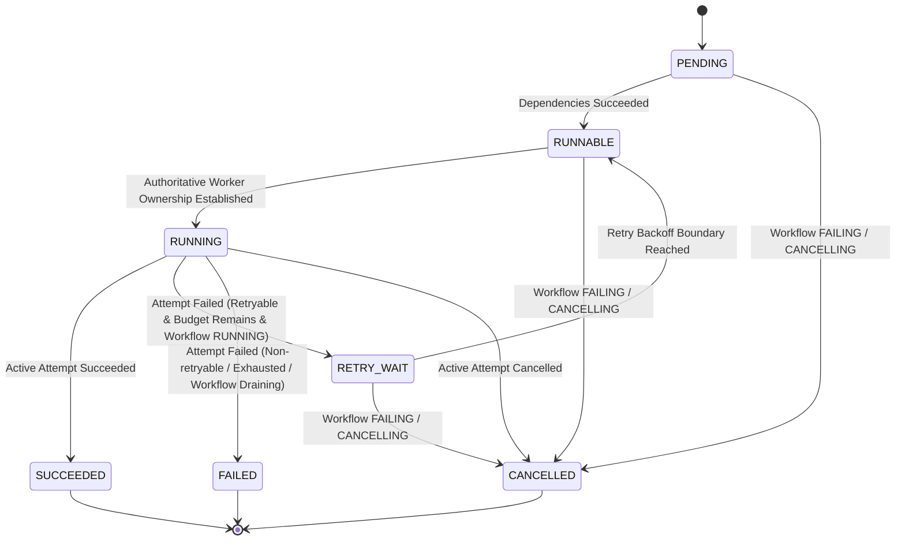
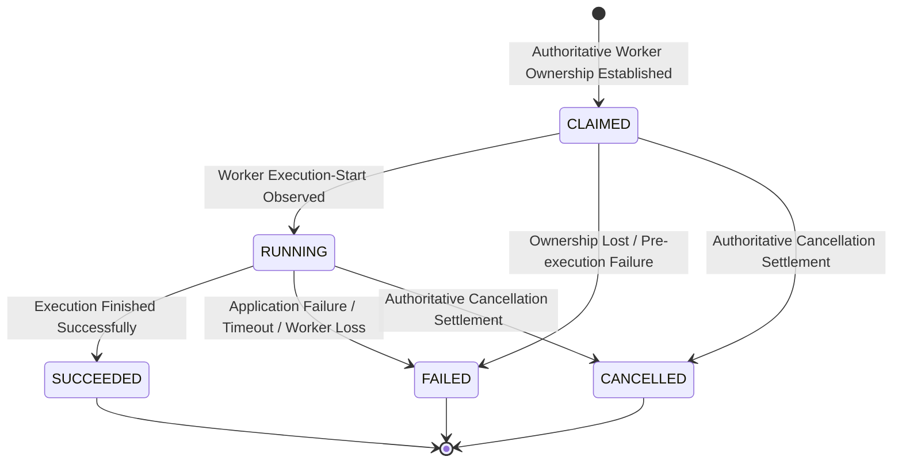

# ADR-007 — Task Execution Lifecycle & Attempt Model

*   **Status**: Approved
*   **Last Updated**: 2026-09-05
*   **Deciders**: Project Owner
*   **Domain**: Execution (Task Lifecycle & Attempt Coordination)
*   **Criticality**: Critical
*   **Relationships**:
    *   **Depends On**: [ADR-005: Workflow Task Scheduling & Dispatch Architecture](adr-005-workflow-task-scheduling-and-dispatch-architecture.md), [ADR-006: Workflow Execution State Machine](adr-006-workflow-execution-state-machine.md)
    *   **Enables**: [ADR-008: Worker Coordination & Liveness Model](00-architecture-decision-register.md#L203), [ADR-009: Task Routing Strategy](00-architecture-decision-register.md#L204), [ADR-010: Workflow Data Flow & Parameter Passing](00-architecture-decision-register.md#L205), [ADR-011: State Persistence Strategy](00-architecture-decision-register.md#L210), [ADR-012: Recovery Strategy](00-architecture-decision-register.md#L211), [ADR-013: Consistency & Concurrency Strategy](00-architecture-decision-register.md#L212), [ADR-014: History & Audit Model](00-architecture-decision-register.md#L213), [ADR-018: Error Handling Philosophy](00-architecture-decision-register.md#L215)
    *   **Related To**: [ADR-001: Internal Workflow Specification](adr-001-internal-workflow-specification.md), [ADR-003: Canonical Workflow Graph Representation](adr-003-canonical-workflow-graph-representation.md), [ADR-017: Graceful Shutdown Strategy](00-architecture-decision-register.md#L214)

---

## 1. Purpose
This document defines the authoritative execution lifecycle for individual tasks and their execution attempts in NexusFlow. It establishes the domain separation between logical task executions and physical worker execution attempts, standardizes state transitions, defines retry accounting and backoff semantics, fixes the boundary for attempt creation at authoritative worker ownership, handles timeouts and worker losses without state-space explosion, resolves cancellation and completion races, and enforces terminal-state immutability and stale-result fencing.

---

## 2. Context
NexusFlow models workflow definitions via [ADR-001](adr-001-internal-workflow-specification.md) and represents static dependency topologies as immutable Directed Acyclic Graphs via [ADR-003](adr-003-canonical-workflow-graph-representation.md). Runtime task progression is governed by [ADR-005](adr-005-workflow-task-scheduling-and-dispatch-architecture.md), which establishes transition-driven scheduling and eager instantiation of logical task entities. Top-level execution lifecycle, failure direction, and cancellation drain are owned by [ADR-006](adr-006-workflow-execution-state-machine.md).

ADR-007 sits directly underneath ADR-005 and ADR-006:
* **ADR-005 Contract**: Evaluates dependency satisfaction based on task-level terminal outcomes and progresses tasks when dependencies are met, but does not own worker execution, attempt retries, or task failure handling.
* **ADR-006 Contract**: Requires task outcomes sufficient to classify:
  1. *Terminal successful* (`SUCCEEDED`)
  2. *Definitive workflow-failing* (`FAILED`)
  3. *Active / non-terminal* (`PENDING`, `RUNNABLE`, `RUNNING`, `RETRY_WAIT`)
  4. *Terminal non-executable / drain-resolved* (`CANCELLED`)
  Furthermore, ADR-006 mandates that all child task executions reach terminal states before a workflow execution commits `FAILED` or `CANCELLED`.

Without a rigorous task lifecycle and attempt model:
* Schedulers cannot distinguish transport delivery retries from application execution retries, burning user retry budgets prematurely on transient network drops.
* Stale callbacks from timed-out or crashed workers overwrite subsequent retries, causing state corruption and phantom completions.
* Systems conflate logical task progression with physical worker process states, leading to deadlocks when remote processes lag.
* Error handling and retry policies become intertwined with transport mechanisms, breaking portability across queue, pull, or RPC architectures.

---

## 3. Problem Statement
How should NexusFlow model the logical execution of a task and its temporal execution attempts so that retries, timeouts, worker losses, cancellations, and duplicate or late callbacks remain deterministic, race-defensible, and recoverable, while strictly preserving single active attempt semantics and terminal-state immutability?

---

## 4. Requirements Covered
*   **Capability 7**: Task Execution Lifecycle & Attempt Tracking.
*   **System Invariant (KT-8)**: "Exactly one logical TaskExecution exists per TaskDefinition per WorkflowExecution."
*   **System Invariant (KT-8)**: "Retries create new ExecutionAttempts; they never duplicate or overwrite TaskExecutions."
*   **System Invariant (KT-8)**: "At most one authoritative active ExecutionAttempt may exist for a TaskExecution."
*   **System Invariant (KT-8)**: "Terminal TaskExecution and ExecutionAttempt states are immutable."
*   **System Invariant (KT-8)**: "Successful completion (`SUCCEEDED`) is the only task outcome that satisfies downstream dependencies in V1."
*   **Core Principle**: Correctness Over Performance.
*   **Core Principle**: Explicit Behaviour Over Implicit Behaviour.
*   **Core Principle**: Deterministic State Transitions.
*   **Core Principle**: Technology Independence Before Implementation.
*   **Core Principle**: Clear Ownership and Separation of Responsibilities.

---

## 5. Constraints
*   **Two-Tier Domain Distinction**: Must maintain a strict separation between logical task progression (`TaskExecution`) and physical execution tries (`ExecutionAttempt`).
*   **Eager Creation Invariant**: All logical `TaskExecution` records are instantiated eagerly when a workflow execution is initialized ([ADR-005](adr-005-workflow-task-scheduling-and-dispatch-architecture.md), [ADR-006](adr-006-workflow-execution-state-machine.md)).
*   **Global Fail-Fast Compatibility**: Under [ADR-006](adr-006-workflow-execution-state-machine.md), any definitive task failure immediately directs the parent workflow to `FAILING`, stopping new task progression across the entire DAG.
*   **Logical Settlement over Remote Physical Guarantees**: Orchestrator state updates are authoritative; physical remote worker shutdown may lag and cannot be assumed synchronous across network boundaries.
*   **Technology Neutrality**: Lifecycle models must remain valid across pull-based queues, push-based RPC, and broker-mediated execution without encoding transport-specific constructs.
*   **Downstream Boundaries**: Worker liveness mechanisms, database schemas, crash recovery sweeps, and atomic concurrency primitives are owned by downstream ADRs ([ADR-008](00-architecture-decision-register.md#L203), [ADR-011](00-architecture-decision-register.md#L210), [ADR-012](00-architecture-decision-register.md#L211), [ADR-013](00-architecture-decision-register.md#L212)).

---

## 6. Goals
*   Establish a 7-state lifecycle model for `TaskExecution`: `PENDING`, `RUNNABLE`, `RUNNING`, `RETRY_WAIT`, `SUCCEEDED`, `FAILED`, `CANCELLED`.
*   Establish a 5-state lifecycle model for `ExecutionAttempt`: `CLAIMED`, `RUNNING`, `SUCCEEDED`, `FAILED`, `CANCELLED`.
*   Bind the creation of an `ExecutionAttempt` strictly to the authoritative establishment of worker execution ownership, isolating transport retries from task execution budgets.
*   Define retry semantics using canonical `max_attempts` vocabulary, where `max_attempts = N` permits at most $N$ authoritative execution attempts.
*   Model timeouts and worker losses as failure causes under `FAILED` rather than creating independent lifecycle states.
*   Reject an operational `BLOCKED` state for V1; represent all non-executable terminal tasks as `CANCELLED` qualified by structured causal metadata.
*   Enforce single-winner race resolution between worker completion, failure, and workflow cancellation.
*   Fence stale or superseded attempt results from mutating active task state or historical records.

---

## 7. Non-Goals
*   Selecting worker heartbeat intervals, liveness lease mechanisms, or worker registration protocols (deferred to [ADR-008](00-architecture-decision-register.md#L203)).
*   Selecting worker routing algorithms, queue topologies, or worker pool partitioning (deferred to [ADR-009](00-architecture-decision-register.md#L204)).
*   Defining payload serialization, parameter passing, or artifact storage (deferred to [ADR-010](00-architecture-decision-register.md#L205)).
*   Defining database schemas, table layouts, or persistence technologies (deferred to [ADR-011](00-architecture-decision-register.md#L210)).
*   Designing operational crash recovery scan loops or reconciliation algorithms (deferred to [ADR-012](00-architecture-decision-register.md#L211)).
*   Selecting atomic concurrency control mechanisms (e.g., CAS, row locking, transaction isolation) (deferred to [ADR-013](00-architecture-decision-register.md#L212)).
*   Designing historical audit log formats or event-sourcing schemas (deferred to [ADR-014](00-architecture-decision-register.md#L213)).
*   Supporting speculative execution, hedged attempts, or parallel retry attempts in V1.

---

## 8. Candidate Solutions

### Alternative A: Single Entity Lifecycle (Mutable Retry Counters)
A single `TaskExecution` entity tracks retries via an integer counter (`retry_count`).
*   *Mechanism*: When a task fails retryably, its state resets to `PENDING` or `RUNNABLE`, overwriting previous execution timestamps, worker IDs, and error details.
*   *Pros*: Single entity, fewer database records, minimal initial design.
*   *Cons*: Complete loss of diagnostic and audit history for prior attempts; impossible to reliably fence stale results from slow or zombie workers; cannot correlate timeouts or errors to specific worker instances; severely degrades debugging and recovery.

### Alternative B: Direct Mirroring Lifecycle
`TaskExecution` mirrors fine-grained attempt states (`DISPATCHED`, `CLAIMED`, `RUNNING`, `TIMED_OUT`, `LOST`).
*   *Mechanism*: Every transport step and worker interaction updates both the attempt record and the task execution record simultaneously.
*   *Pros*: Task-level state directly reflects transport events.
*   *Cons*: Tight coupling between transport mechanics and domain lifecycle; requires multi-entity synchronized updates across distributed boundaries; state explosion at the task level; leaks transport choices into scheduling logic.

### Alternative C: Selected Architecture (Decoupled Two-Tier Model with Causal Metadata)
`TaskExecution` governs logical scheduling and dependency progression across 7 states; `ExecutionAttempt` governs concrete worker execution opportunities across 5 technology-neutral states.
*   *Mechanism*: An `ExecutionAttempt` is created only when worker execution ownership is authoritatively established. Retries instantiate new sequential attempt records. Timeouts and worker losses are captured as structured failure causes on terminal `FAILED` attempts. Non-executed tasks resolve to `CANCELLED` with causal metadata.
*   *Pros*: Clean domain separation; isolates transport delivery retries from task execution budgets; immutable attempt history; straightforward stale-result fencing via authoritative attempt correlation; full compatibility with ADR-005 and ADR-006.
*   *Cons*: Requires managing two distinct entities and sequential attempt associations.

### Alternative D: Event-Sourced Lifecycle Only
No explicit state enumerations; state is derived dynamically by replaying a stream of execution events.
*   *Mechanism*: Every state transition is recorded as an immutable append-only event.
*   *Pros*: Complete historical fidelity; natural audit log.
*   *Cons*: High complexity for V1; requires snapshotting and event replay machinery to evaluate simple scheduling conditions; excessive overhead for a single-developer project.

### Alternative E: Concurrent / Hedged Attempt Model
Allows multiple active execution attempts to run concurrently for a single task execution (hedging against slow workers).
*   *Mechanism*: The orchestrator dispatches speculative duplicate attempts; the first worker to complete wins.
*   *Pros*: Reduces tail latency in large distributed clusters.
*   *Cons*: Massively complicates concurrency control, result fencing, resource consumption, and idempotency guarantees; entirely unsuitable for single-developer V1 scope.

---

## 9. Detailed Evaluation

| Evaluation Criteria | Alt A: Single Entity | Alt B: Direct Mirroring | Alt C: Decoupled Two-Tier (Selected) | Alt D: Event-Sourced | Alt E: Hedged Attempts |
| :--- | :--- | :--- | :--- | :--- | :--- |
| **Correctness & Stale Fencing** | Poor (overwrites state) | Moderate | **High (authoritative ID fencing)** | High | Low (race-prone) |
| **History & Auditability** | Poor (prior tries erased) | Moderate | **High (immutable attempt log)** | Very High | Moderate |
| **Transport Independence** | Poor | Poor (leaks transport) | **High (neutral ownership boundary)** | Moderate | Low |
| **Recovery Feasibility** | Moderate | Complex | **Clean (explicit durable states)** | Complex | Complex |
| **V1 Implementation Complexity** | Low | High | **Medium (Pragmatic & Clean)** | Very High | Very High |
| **Single-Developer Defensibility**| Weak | Weak | **Strong** | Weak | Weak |

---

## 10. Decision

NexusFlow adopts **Alternative C: Decoupled Two-Tier Lifecycle Model with Causal Metadata**.

### 10.1 Domain Entity Separation
The domain model strictly separates logical task orchestration from physical execution:

```
TaskDefinition (Immutable DAG blueprint, ADR-001/003)
     │
     ▼ (Eagerly instantiated once per workflow run, ADR-005/006)
TaskExecution (Logical task progression & dependency settlement)
     │
     ▼ (Instantiated sequentially upon authoritative worker ownership)
ExecutionAttempt (1..N concrete physical worker execution tries)
```

1. **`TaskExecution`**: Represents the single, authoritative, logical execution of a `TaskDefinition` within one `WorkflowExecution`. Exactly one logical `TaskExecution` exists per `TaskDefinition` per workflow run. It tracks dependency satisfaction, scheduling eligibility, retry backoff, and logical outcome.
2. **`ExecutionAttempt`**: Represents one concrete execution opportunity assigned to an authoritative worker. A `TaskExecution` contains a sequential series of 1..$N$ attempts over time. Retries create new `ExecutionAttempt` records; they **never** duplicate or overwrite the parent `TaskExecution`.

### 10.2 TaskExecution Lifecycle & States
A `TaskExecution` progresses through exactly 7 states:



*   **`PENDING`**: Instantiated eagerly during workflow initialization. Dependencies are not yet satisfied.
*   **`RUNNABLE`**: All declared upstream dependencies have reached `SUCCEEDED`, the workflow permits progression (`RUNNING`), and the task is eligible for execution ownership. No active attempt exists.
*   **`RUNNING`**: Exactly one authoritative active `ExecutionAttempt` exists for this task execution. (Note: Does not require that remote application code has physically executed yet).
*   **`RETRY_WAIT`**: The prior execution attempt failed retryably, retry budget remains, no active attempt exists, and the task is held waiting for a durable retry eligibility boundary (`next_retry_eligible_at`) to elapse.
*   **`SUCCEEDED`**: Terminal state. The task completed successfully. This is the **only** state that satisfies downstream dependencies in V1.
*   **`FAILED`**: Terminal state. The task experienced a definitive non-retryable failure, exhausted its retry budget, or failed while the workflow was draining. This is the **only** task state that independently triggers workflow fail-fast.
*   **`CANCELLED`**: Terminal state. Execution was authoritatively prevented or terminated because the workflow lifecycle no longer permitted continued or new execution.

**Terminal State Immutability**: `SUCCEEDED`, `FAILED`, and `CANCELLED` are strictly immutable. Once a `TaskExecution` enters any terminal state, no further transitions, retries, or attempts are permitted.

### 10.3 ExecutionAttempt Lifecycle & States
An `ExecutionAttempt` progresses through exactly 5 technology-neutral states:



*   **`CLAIMED`**: Active state. Authoritative execution ownership has been established for one worker execution opportunity, but worker execution-start has not yet been authoritatively observed.
*   **`RUNNING`**: Active state. Worker execution-start has been authoritatively observed.
*   **`SUCCEEDED`**: Terminal state. The attempt produced an accepted, verified successful outcome.
*   **`FAILED`**: Terminal state. The attempt terminated in failure (e.g., application exception, execution timeout, or lost worker coordination).
*   **`CANCELLED`**: Terminal state. The attempt's execution authority was authoritatively revoked or resolved because the workflow lifecycle was cancelled or draining.

**Active States**: `CLAIMED`, `RUNNING`.  
**Terminal States**: `SUCCEEDED`, `FAILED`, `CANCELLED`. Terminal attempt states are immutable.

### 10.4 Attempt Creation Boundary
An `ExecutionAttempt` is created **if and only if** execution ownership for a `TaskExecution` is authoritatively established for one worker execution opportunity.
*   Scheduler dispatch intent, queue message publishing, or network transport attempts do **not** create an `ExecutionAttempt`.
*   If dispatch or routing fails before authoritative worker execution ownership is established, the `TaskExecution` remains `RUNNABLE`.
*   Transport delivery failures before ownership do **not** consume the task's retry budget.

### 10.5 Retry Budget & Numbering Semantics
*   **Vocabulary**: `max_attempts` is the canonical policy term, defining the total permitted authoritative execution attempts (including the initial execution).
*   **Accounting**: `max_attempts = N` permits at most $N$ authoritative attempts. Attempt 1 is the initial execution; Attempts 2..$N$ are retries.
*   **Monotonic Sequence**: `attempt_number` is a 1-based, strictly monotonically increasing integer per `TaskExecution` (1, 2, 3...).
*   **No Reclamation**: Once an `ExecutionAttempt` is created, it permanently consumes its sequence number. Attempt numbers are never reclaimed or reused, even if the attempt fails before application code starts or is cancelled.
*   **Exhaustion**: When an attempt reaches `FAILED` and `attempt_number >= max_attempts`, retry budget is exhausted and `TaskExecution` transitions directly to `FAILED`.

### 10.6 Handling Failures, Timeouts, and Worker Loss
To prevent state explosion, timeouts and worker losses are captured as structured failure causes on terminal `FAILED` attempts, rather than distinct lifecycle states:
*   **Execution Timeout**: When an attempt exceeds its configured execution duration after observed start, it is authoritatively resolved as `FAILED` with a timeout failure cause.
*   **Worker Loss**: When worker coordination ([ADR-008](00-architecture-decision-register.md#L203)) determines an assigned worker or attempt is no longer live or usable, the attempt is authoritatively resolved as `FAILED` with a worker-loss failure cause.
*   **Infrastructure Failures**: Transient orchestrator, database, or transport errors must **never** be fabricated as business task execution failures. Infrastructure errors remain in recoverable/retryable operational loops.
*   **Retryability Evaluation**: An attempt in `FAILED` triggers task-level `RETRY_WAIT` if and only if:
    1. The failure cause is classified as retryable by policy;
    2. `attempt_number < max_attempts`;
    3. `WorkflowExecution` is currently in `RUNNING`.

### 10.7 Rejection of BLOCKED State
`BLOCKED` is rejected as an operational `TaskExecution` state for V1. Because [ADR-006](adr-006-workflow-execution-state-machine.md) enforces global fail-fast, any definitive task failure immediately halts all unstarted tasks across the entire workflow. Distinguishing an upstream dependency failure from a sibling task halt does not produce different scheduling, dispatch, or recovery behavior. All unstarted tasks resolve to `CANCELLED`, qualified by structured causal metadata (e.g., `CAUSE_UPSTREAM_FAILURE`, `CAUSE_WORKFLOW_DRAIN`, `CAUSE_USER_CANCELLED`).

### 10.8 Invariants & Concurrency Fencing
1. **Single Authoritative Active Attempt**: At any time, at most one authoritative active `ExecutionAttempt` (`CLAIMED` or `RUNNING`) exists per `TaskExecution`. A new attempt cannot be created until the prior attempt is terminal.
2. **No Physical Single-Execution Guarantee**: Distributed failures mean an old, logically terminated worker process may physically linger in remote environments. ADR-007 guarantees single *authoritative* execution, not physical absence of zombies.
3. **Current Attempt Correlation**: `TaskExecution` maintains a reference to its current authoritative attempt. Any callback from a superseded, stale, or unknown attempt is strictly barred from mutating task state or downstream dependencies.
4. **First-Winner Terminal Race Resolution**: If cancellation intent races with worker completion, the first valid authoritative terminal transition committed to state wins. Stale contradictory callbacks cannot mutate terminal records.

---

## 11. Decision Rationale

1. **Isolation of Transport from Execution Budgets**:
   Binding attempt creation to authoritative worker ownership ensures that network dropped packets, queue partitions, or broker disconnects do not burn application retry budgets. A task only exhausts retries when a worker was actually granted ownership.
2. **Decoupled States (`CLAIMED` vs. `RUNNING`) Without Transport Leaks**:
   Differentiating ownership establishment (`CLAIMED`) from execution observation (`RUNNING`) cleanly defines when execution timeouts begin, aids debugging of stalled worker pickups, and supports crash recovery without requiring assumptions about heartbeats, leases, or specific queue protocols.
3. **Prevention of State-Space Explosion**:
   Treating timeouts and worker losses as structured causes under `FAILED` avoids multiplying state transitions across both attempts and tasks, keeping the state machine deterministic and maintainable for a single developer.
4. **Monotonic Terminal Settlement Under Workflow Drain**:
   Allowing active attempts to settle naturally as `SUCCEEDED`, `FAILED`, or `CANCELLED` during workflow `FAILING` or `CANCELLING` ensures that real execution results are captured for auditability without reversing the workflow's committed termination direction.

---

## 12. Tradeoffs

*   **What is Gained**:
    *   Rigorous auditability and history via immutable attempt records.
    *   Protection against retry budget exhaustion during transport disruptions.
    *   Safe, race-defensible execution under distributed worker lag.
    *   Simplicity in workflow-level dependency evaluation (only `SUCCEEDED` satisfies dependencies).
*   **What is Sacrificed**:
    *   Storage footprint: Retaining sequential attempt entities consumes more storage than a simple mutable counter.
    *   Granular operational states: Rejecting `BLOCKED`, `TIMED_OUT`, and `LOST` requires consumers to inspect metadata fields for detailed diagnostics.
    *   Physical single-execution: Does not prevent remote zombie processes from running, relying on result fencing at the orchestrator boundary.

---

## 13. Consequences

### 13.1 Upstream & Downstream Impact
*   **ADR-005 (Scheduler)**: Reacts to `TaskExecution` reaching `SUCCEEDED` (to evaluate dependents) and `FAILED` (to trigger workflow fail-fast). Scheduler progression strictly targets `RUNNABLE` tasks.
*   **ADR-006 (Workflow State Machine)**: Evaluates terminal workflow convergence once all child `TaskExecution` entities reach `SUCCEEDED`, `FAILED`, or `CANCELLED`.
*   **ADR-008 (Worker Coordination)**: Must supply authoritative events for worker ownership claim, execution-start observation, and worker liveness resolution.
*   **ADR-011 (Persistence)**: Must persist `TaskExecution` records, sequential `ExecutionAttempt` records, and durable retry eligibility timestamps (`next_retry_eligible_at`).
*   **ADR-013 (Concurrency)**: Must provide atomic mechanisms to enforce single-winner transitions and active attempt exclusivity.

### 13.2 Workflow Lifecycle Interaction Matrix

| Workflow State | TaskExecution Progression Allowed? | Attempt Creation Allowed? | Active Attempt Outcome Settlement |
| :--- | :--- | :--- | :--- |
| `RUNNING` | Full (`PENDING` $\to$ `RUNNABLE` $\to$ `RUNNING` $\to$ `RETRY_WAIT` / Terminal) | Allowed | `SUCCEEDED` $\to$ Task `SUCCEEDED`<br>`FAILED` (retryable) $\to$ Task `RETRY_WAIT`<br>`FAILED` (exhausted) $\to$ Task `FAILED`<br>`CANCELLED` $\to$ Task `CANCELLED` |
| `FAILING` | Unstarted tasks settle to `CANCELLED` (cause: workflow drain) | **Prohibited** | `SUCCEEDED` $\to$ Task `SUCCEEDED`<br>`FAILED` $\to$ Task `FAILED` (retries suppressed)<br>`CANCELLED` $\to$ Task `CANCELLED` |
| `CANCELLING` | Unstarted tasks settle to `CANCELLED` (cause: cancellation) | **Prohibited** | `SUCCEEDED` $\to$ Task `SUCCEEDED`<br>`FAILED` $\to$ Task `FAILED` (retries suppressed)<br>`CANCELLED` $\to$ Task `CANCELLED` |
| Terminal | None (all tasks already terminal) | **Prohibited** | Rejected (tasks already terminal) |

---

## 14. Failure Modes

| Failure Mode | Direct Consequence | Architectural Mitigation | Owning ADR |
| :--- | :--- | :--- | :--- |
| **Duplicate Worker Success Callback** | Same attempt completion arrives multiple times. | Idempotent transition handling; subsequent callbacks acknowledged with no state mutation. | ADR-007, ADR-013 |
| **Conflicting Duplicate Result** | Attempt in `SUCCEEDED` receives subsequent `FAILED`. | Terminal immutability rejects mutation; event logged as protocol anomaly. | ADR-007, ADR-014 |
| **Late Result from Superseded Attempt** | Old attempt (timed out) reports success after retry spawned. | Current attempt correlation fences callback; old attempt remains `FAILED`; task unaffected. | ADR-007, ADR-013 |
| **Worker Loss / Crash Mid-Execution** | Remote worker dies while attempt is `RUNNING`. | Worker coordination detects loss; attempt resolves `FAILED(cause=WORKER_LOST)`; retries evaluated. | ADR-007, ADR-008 |
| **Task Execution Timeout** | Business logic exceeds configured duration. | Attempt authoritatively resolved as `FAILED(cause=TIMEOUT)`; retries evaluated if allowed. | ADR-007, ADR-008 |
| **Transport Send Failure Pre-Claim** | Network or queue fails before worker claims ownership. | Task remains `RUNNABLE`; no attempt created; retry budget unconsumed. | ADR-007, ADR-009 |
| **Two Workers Claim Same Task** | Race during task assignment. | Concurrency control ensures single claim wins; losing worker claim rejected. | ADR-007, ADR-013 |
| **Orchestrator Crash During `RETRY_WAIT`** | Engine restarts while task is waiting for retry delay. | Durable `next_retry_eligible_at` survives restart; recovery progresses task when time elapses. | ADR-007, ADR-011, ADR-012 |
| **Infrastructure / DB Write Failure** | State persistence fails while recording task completion. | State write is retried; infrastructure failure is not converted to a business task failure. | ADR-007, ADR-011 |

---

## 15. Debugging

Diagnostic traceability is achieved by correlating:
* `workflow_execution_id`: Parent workflow scope.
* `task_execution_id`: Logical task scope.
* `attempt_id`: UUID for the specific worker execution try.
* `attempt_number`: 1-based sequential try index (correlates retry history).
* `worker_id`: Worker identity bound to the attempt during `CLAIMED`.
* `failure_cause`: Structured error classification (`APPLICATION_ERROR`, `TIMEOUT`, `WORKER_LOST`, etc.).
* `non_execution_cause`: Causal explanation for `CANCELLED` tasks (`UPSTREAM_FAILURE`, `WORKFLOW_DRAIN`, `USER_CANCELLED`).
* `next_retry_eligible_at`: Timestamp indicating when retry backoff completes.

---

## 16. Testing

The following unit and simulation test suites must be developed to validate ADR-007 implementation:
*   **Task State Transition Tests**: Validate all legal transitions in the 7-state model and assert that illegal transitions throw deterministic errors.
*   **Attempt State Transition Tests**: Validate all legal transitions in the 5-state attempt model.
*   **Terminal Immutability Tests**: Assert that callbacks cannot mutate `SUCCEEDED`, `FAILED`, or `CANCELLED` tasks or attempts.
*   **Retry Accounting Tests**: Verify that `max_attempts = N` permits exactly $N$ attempts and that attempt numbers increment monotonically.
*   **Pre-Claim Transport Failure Tests**: Simulate dispatch transport failure and verify the task remains `RUNNABLE` with zero attempts created.
*   **Stale Attempt Fencing Tests**: Simulate Attempt 1 timing out, Attempt 2 being created, and Attempt 1 returning `SUCCEEDED`; assert Attempt 1 result is rejected and Attempt 2 governs the task.
*   **Cancellation vs. Completion Race Tests**: Simulate simultaneous worker success and workflow cancellation; assert the first committed transition wins deterministically.
*   **Workflow Drain Coupling Tests**: Assert that retryable failures during workflow `FAILING` transition tasks to `FAILED` instead of `RETRY_WAIT`.
*   **Crash Recovery Simulation**: Test engine recovery when tasks are recovered in `PENDING`, `RUNNABLE`, `RUNNING`, and `RETRY_WAIT`.

---

## 17. Operational Considerations
*   **State Inspection**: Operators can immediately distinguish tasks waiting on dependencies (`PENDING`), waiting on worker capacity (`RUNNABLE`), actively executing (`RUNNING`), or waiting out retry backoff (`RETRY_WAIT`).
*   **Resource Impact**: Maintaining sequential attempts increases row count linearly with retries. Attempt tables should be indexed by `task_execution_id` and `attempt_number`.
*   **Backoff Timing**: The engine relies on durable eligibility timestamps (`next_retry_eligible_at`) rather than in-memory sleep timers, ensuring memory footprint remains low during long retry delays.

---

## 18. Maintenance
*   **Preserving Domain Boundaries**: Modifying worker coordination or communication protocols in [ADR-008](00-architecture-decision-register.md#L203) must not alter the abstract attempt states (`CLAIMED`, `RUNNING`).
*   **Extending Failure Causes**: New failure classifications (e.g., memory limits, sandbox violations) must be introduced as causal metadata on `FAILED`, not as new lifecycle states.

---

## 19. Future Evolution
*   **V2 Speculative / Hedged Execution**: If tail latency reduction is required in V2, the attempt model can be extended to support multiple concurrent active attempts per task under explicit consensus fencing.
*   **V2 Task-Specific Cancellation**: In V1, cancellation is driven by workflow lifecycle. V2 can expose APIs to cancel individual tasks without terminating the entire workflow.
*   **V2 Conditional Skipping**: If workflow DSL introduces conditional branches, a dedicated `SKIPPED` terminal state can be cleanly introduced alongside `CANCELLED`.

---

## 20. Rejected Alternatives

*   **No Separate Attempt Entity (Mutable Counter)**: Rejected because it erases audit history, breaks crash recovery, and prevents stale-result fencing against zombie workers.
*   **Operational `BLOCKED` State**: Rejected for V1 because global fail-fast halts the entire workflow upon any task failure, eliminating any operational behavioral difference between blocked dependencies and workflow drain.
*   **`TIMED_OUT` as an Attempt State**: Rejected to prevent state-space explosion; modeled cleanly as `FAILED` with a timeout failure cause.
*   **`LOST` as an Attempt State**: Rejected to prevent state explosion; modeled cleanly as `FAILED` with a worker-loss failure cause.
*   **`CANCELLING` State at Task or Attempt Level**: Rejected for V1 to keep state models lean; unstarted tasks settle directly to `CANCELLED`, while running attempts settle via single-winner race resolution.
*   **Attempt Creation at Dispatch Intent**: Rejected because network or queue failures before worker claim would unfairly consume the task's retry budget.
*   **Guaranteed Physical Single Execution**: Rejected because network partitions and uncooperative remote runtimes make absolute physical execution guarantees impossible in distributed environments.

---

## 21. Decision Evolution
*   *2026-09-05 (Architectural Review & Refinement)*:
    *   Separated domain entities into `TaskExecution` and `ExecutionAttempt`.
    *   Established 7-state model for `TaskExecution` and 5-state model for `ExecutionAttempt`.
    *   Eliminated operational `BLOCKED` state in favor of `CANCELLED` with causal metadata under global fail-fast.
    *   Decoupled attempt creation from dispatch intent, fixing it strictly at authoritative worker ownership.
    *   Standardized retry vocabulary to canonical `max_attempts`.
    *   Removed transport/technology leakage (leases, heartbeats, SIGTERM/SIGKILL) to preserve clean downstream boundaries for ADR-008.

---

## 22. Common Misconceptions

*   **Misconception: "TaskExecution RUNNING means business logic is executing on CPU."**
    *   *Reality*: `TaskExecution.RUNNING` means an authoritative active `ExecutionAttempt` exists. The attempt may be `CLAIMED` (assigned to worker, awaiting start) or `RUNNING` (executing).
*   **Misconception: "NexusFlow guarantees a task will physically execute at most once."**
    *   *Reality*: NexusFlow guarantees at most one *authoritative* active attempt and fences late results. A crashed or partitioned remote worker may physically execute business code in the background, but its results cannot mutate the orchestrator.
*   **Misconception: "A task timeout is a distinct terminal state."**
    *   *Reality*: A timeout is an authoritative failure cause that resolves an attempt to `FAILED`, which then feeds the task's retry policy.
*   **Misconception: "Transport failures burn task retries."**
    *   *Reality*: An attempt is created only when worker ownership is authoritatively established. If a message fails to publish or route, the task remains `RUNNABLE` with zero attempts consumed.

---

## 23. Open Questions
*   No architectural questions remain open for ADR-007. Specific persistence schema representations, recovery reconciliation loops, and worker liveness algorithms are explicitly delegated to [ADR-008](00-architecture-decision-register.md#L203), [ADR-011](00-architecture-decision-register.md#L210), [ADR-012](00-architecture-decision-register.md#L211), and [ADR-013](00-architecture-decision-register.md#L212).

---

## 24. Interview Discussion

*   **Q: Why separate TaskExecution from ExecutionAttempt instead of using a retry counter?**
    *   *A*: A single entity with a mutable retry counter destroys historical telemetry and makes distributed race resolution impossible. In distributed workflows, a worker running Attempt 1 might hang or partition, causing the engine to retry Attempt 2. If Attempt 1 later wakes up and posts a completion, a single-entity model cannot distinguish the stale result from the valid one. Separating `ExecutionAttempt` preserves immutable history, binds each attempt to a specific worker, and allows the orchestrator to strictly fence stale callbacks using the authoritative attempt ID.
*   **Q: Why does attempt creation happen at worker claim rather than dispatch?**
    *   *A*: Dispatch is an asynchronous transport operation (e.g., publishing to a message broker). If the broker is temporarily unreachable or the network drops the packet, no worker ever received the task. If an attempt was created at dispatch, that transient network glitch would count against the user's `max_attempts`, causing tasks to fail prematurely. Creating attempts at authoritative claim strictly isolates transport reliability from business execution budgets.
*   **Q: Why reject an operational BLOCKED state in V1?**
    *   *A*: In a workflow engine with global fail-fast (ADR-006), the moment any task permanently fails, the entire workflow enters `FAILING` and halts all unstarted tasks. From an operational and scheduling perspective, a task blocked by an upstream dependency and an unstarted task halted on an independent branch behave identically: neither will ever run, neither claims worker resources, and both must reach terminal settlement before the workflow can finalize. Creating a separate `BLOCKED` state adds transition complexity with zero behavioral difference. Causal metadata on `CANCELLED` provides identical diagnostic clarity without state explosion.
*   **Q: How does NexusFlow handle a race between task completion and workflow cancellation?**
    *   *A*: NexusFlow enforces single-winner atomic state transitions. If a worker completion reaches the orchestrator and commits the transition to `SUCCEEDED` before cancellation intent is processed, the task outcome is recorded as `SUCCEEDED`. If cancellation intent commits the transition to `CANCELLED` first, the attempt is terminalized as `CANCELLED`, and any subsequent completion signal from the worker is rejected as a stale callback.

---

## 25. References
*   [ADR-001: Internal Workflow Specification](adr-001-internal-workflow-specification.md)
*   [ADR-003: Canonical Workflow Graph Representation](adr-003-canonical-workflow-graph-representation.md)
*   [ADR-005: Workflow Task Scheduling & Dispatch Architecture](adr-005-workflow-task-scheduling-and-dispatch-architecture.md)
*   [ADR-006: Workflow Execution State Machine](adr-006-workflow-execution-state-machine.md)
*   [00-Architecture Decision Register](00-architecture-decision-register.md)

---

## 26. Traceability

| Artifact / Requirement | Addressed in ADR-007 |
| :--- | :--- |
| **Capability 7** | Fully defined via two-tier domain model, 7-state `TaskExecution`, and 5-state `ExecutionAttempt`. |
| **ADR-005 Scheduler** | Defines `RUNNABLE` contract and provides `SUCCEEDED` as the sole dependency satisfaction outcome. |
| **ADR-006 State Machine** | Provides terminal task classifications and enforces monotonic settlement under workflow drain. |
| **KT-8 Invariants** | Enforces single logical task execution, single active attempt, and terminal immutability. |
| **ADR-008 Worker Coordination** | Defines the abstract lifecycle interface consumed by worker coordination. |
| **ADR-011 Persistence** | Defines the domain entities and durable retry boundaries required for schema design. |
| **ADR-012 Recovery** | Establishes the recovery interpretations for all non-terminal task states. |
| **ADR-013 Concurrency** | Defines the single-winner transition requirements and attempt correlation fencing. |

---

## 27. Decision Validation Checklist

*   [x] **Exactly one TaskExecution per task per workflow run?** Yes (Section 10.1).
*   [x] **Retries create new Attempts, not TaskExecutions?** Yes (Section 10.1).
*   [x] **Exactly 7 TaskExecution states?** Yes (`PENDING`, `RUNNABLE`, `RUNNING`, `RETRY_WAIT`, `SUCCEEDED`, `FAILED`, `CANCELLED`, Section 10.2).
*   [x] **Exactly 5 ExecutionAttempt states?** Yes (`CLAIMED`, `RUNNING`, `SUCCEEDED`, `FAILED`, `CANCELLED`, Section 10.3).
*   [x] **Only SUCCEEDED satisfies dependencies?** Yes (Section 10.2).
*   [x] **FAILED is definitive workflow-failing task outcome?** Yes (Section 10.2).
*   [x] **BLOCKED rejected for V1?** Yes, justified by global fail-fast (Section 10.7).
*   [x] **RUNNABLE durable?** Yes (Section 10.2).
*   [x] **RETRY_WAIT durable?** Yes (Section 10.2).
*   [x] **Attempt created only at authoritative worker ownership?** Yes (Section 10.4).
*   [x] **Pre-ownership transport failure does not consume attempt?** Yes (Section 10.4).
*   [x] **max_attempts includes initial attempt?** Yes (Section 10.5).
*   [x] **Attempt numbering monotonic?** Yes, 1-based (Section 10.5).
*   [x] **At most one authoritative active Attempt?** Yes (Section 10.8).
*   [x] **No exactly-once physical execution claim?** Yes, explicitly disclaimed (Section 10.8, 22).
*   [x] **Timeout represented as failure cause?** Yes (Section 10.6).
*   [x] **Worker loss represented as failure cause?** Yes (Section 10.6).
*   [x] **Infrastructure failure not fabricated as task failure?** Yes (Section 10.6).
*   [x] **No retry outside WorkflowExecution RUNNING?** Yes (Section 10.6, 13.2).
*   [x] **Active Attempt can settle success/failure/cancel during workflow drain?** Yes (Section 13.2).
*   [x] **Workflow direction never regresses?** Yes (Section 13.2).
*   [x] **Late stale results cannot mutate state?** Yes (Section 10.8).
*   [x] **Duplicate results are lifecycle-idempotent?** Yes (Section 14).
*   [x] **Terminal states immutable?** Yes (Section 10.2, 10.3).
*   [x] **Recovery semantics are technology-neutral?** Yes (Section 10.6, 14).
*   [x] **ADR-008 boundary preserved?** Yes, no premature commitments to leases/heartbeats (Section 7, 10.6).
*   [x] **ADR-011/012/013 boundaries preserved?** Yes (Section 7, 13.1).
*   [x] **No implementation/benchmark claims invented?** Yes, verified throughout document.
