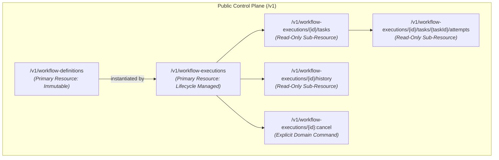

# ADR-015 — External API Architecture

**Status**: Approved — Not Frozen  
**Criticality**: Core  

---

## 1. Purpose

This Architectural Decision Record (ADR) establishes the external, client-facing control-plane API architecture for the NexusFlow orchestration engine. It defines how external clients—such as command-line interfaces (CLIs), software development kits (SDKs), operational user interfaces, and external systems—interact with the engine to register workflow definitions, initiate workflow executions, query execution status, inspect tasks and execution attempts, traverse execution history, and issue lifecycle control commands.

Furthermore, this record formalizes the structural boundary between the public client-facing control plane and internal worker coordination protocols ([ADR-008](adr-008-worker-coordination-and-liveness-model.md), [ADR-009](adr-009-task-routing-strategy.md)), the resource model and explicit domain command semantics, the synchronous-acceptance model for asynchronous workflow execution, opaque cursor-based pagination, machine-readable error envelopes, and durable mutation idempotency, while strictly preserving technology neutrality and deferring physical storage selection and framework bindings to [ADR-020](00-architecture-decision-register.md), formal error taxonomies to [ADR-018](00-architecture-decision-register.md), transport security and caller identity to [ADR-022](00-architecture-decision-register.md), and configuration thresholds to [ADR-023](00-architecture-decision-register.md).

---

## 2. Context

NexusFlow executes multi-step directed acyclic graph (DAG) workflows defined by [ADR-001](adr-001-internal-workflow-specification.md) and [ADR-003](adr-003-canonical-workflow-graph-representation.md). The runtime progression of these workflows is governed by the formal state machines established in [ADR-006](adr-006-workflow-execution-state-machine.md) (`WorkflowExecution`) and [ADR-007](adr-007-task-execution-lifecycle-and-attempt-model.md) (`TaskExecution` and `ExecutionAttempt`). Distributed worker coordination, liveness, and routing are established under [ADR-008](adr-008-worker-coordination-and-liveness-model.md) and [ADR-009](adr-009-task-routing-strategy.md). Workflow parameter passing and data flow boundaries are established in [ADR-010](adr-010-workflow-data-flow-and-parameter-passing.md).

Authoritative orchestration durability is governed by [ADR-011](adr-011-state-persistence-strategy.md), which established normalized durable current state as the authoritative orchestration truth across ten logical consistency groups. Crash recovery is governed by [ADR-012](adr-012-recovery-strategy.md) based on authoritative current state without event replay, while [ADR-013](adr-013-consistency-and-concurrency-strategy.md) established optimistic single-winner concurrency control using internal opaque concurrency revisions. [ADR-014](adr-014-execution-history-and-audit-model.md) established the append-only transactional execution history and audit log.

### The Control Plane Architectural Challenge
Without a disciplined API architecture, orchestrator interfaces commonly suffer from key architectural anti-patterns:
1. **Leaky Storage Abstractions**: Exposing internal persistence entities, table schemas, internal foreign keys, or internal lock revisions directly through generic REST CRUD endpoints, permitting external callers to corrupt state-machine progression.
2. **Ambiguous Lifecycle Mutation**: Treating state transitions (such as cancellation) as generic record field patches (`PATCH /executions/123 {"state": "CANCELLED"}`), bypassing domain transition rules, invariant checks, and asynchronous drain requirements.
3. **Accidental Worker Coupling**: Conflating the public client-facing control plane with private worker coordination protocols (e.g., exposing heartbeat or claim APIs alongside user workflow registration).
4. **Network Ambiguity on Creation**: Failing to provide client retry reconciliation, causing duplicate workflow executions or redundant definitions when network timeouts occur during transit.

---

## 3. Problem Statement

How should NexusFlow expose a stable, evolvable, and secure external control-plane API that enables client management and diagnostic visibility of workflows while:
1. Enforcing domain-driven invariants and state-machine transitions rather than exposing unconstrained persistence CRUD?
2. Strictly insulating the public control plane from private worker coordination protocols ([ADR-008](adr-008-worker-coordination-and-liveness-model.md), [ADR-009](adr-009-task-routing-strategy.md)) and internal concurrency revisions ([ADR-013](adr-013-consistency-and-concurrency-strategy.md))?
3. Supporting safe, non-blocking asynchronous execution lifecycles alongside synchronous durable resource creation?
4. Providing robust, restart-resilient client retry idempotency without prematurely freezing physical database storage schemas or caller identity models?
5. Guaranteeing bounded, performant reads, opaque pagination, and monotonic read-after-write consistency semantics without prematurely dictating physical framework bindings or storage topologies?

---

## 4. Requirements Covered

### 4.1 Functional Requirements
* **FR-API-001: WorkflowDefinition Registration**: Public API must accept human-authored workflow definitions (YAML authoring format in V1), orchestrate syntactic parsing ([ADR-002](adr-002-workflow-definition-parsing-strategy.md)) and semantic validation ([ADR-004](adr-004-workflow-validation-strategy.md)), and atomically persist immutable definition semantics ([ADR-011](adr-011-state-persistence-strategy.md)) with a stable server-issued `DefinitionId`.
* **FR-API-002: WorkflowDefinition Retrieval & Listing**: Public API must provide stable retrieval of individual registered definitions and bounded, cursor-paginated listing of registered definitions.
* **FR-API-003: WorkflowExecution Initiation**: Public API must accept execution requests specifying an exact immutable `DefinitionId` and JSON-compatible input parameters ([ADR-010](adr-010-workflow-data-flow-and-parameter-passing.md)), durably commit initial execution records ([ADR-011](adr-011-state-persistence-strategy.md)), and return immediately upon durable acceptance without waiting for asynchronous workflow completion.
* **FR-API-004: WorkflowExecution Inspection**: Public API must expose authoritative domain execution status, including lifecycle state ([ADR-006](adr-006-workflow-execution-state-machine.md)), creation/transition timestamps, output data availability, and bounded failure/cancellation summaries.
* **FR-API-005: WorkflowExecution Cancellation Command**: Public API must expose an explicit domain command to cancel an in-flight execution, validating legal state-machine transitions and durably committing the `CANCELLING` direction without blocking on remote worker termination.
* **FR-API-006: TaskExecution & Attempt Inspection**: Public API must provide read-only diagnostic inspection of task executions and their historical attempts ([ADR-007](adr-007-task-execution-lifecycle-and-attempt-model.md)), clearly distinguishing logical task identity from runtime attempt identity.
* **FR-API-007: Execution History Querying**: Public API must provide read-only, bounded, cursor-paginated access to append-only execution history entries ([ADR-014](adr-014-execution-history-and-audit-model.md)).
* **FR-API-008: External Mutation Idempotency**: Public API must support optional client-provided idempotency tokens for non-idempotent creation requests (`POST`), reconciling network retries across server restarts and detecting conflicting payloads.
* **FR-API-009: Machine-Readable Contract**: Public API must provide an OpenAPI-compatible machine-readable specification representing public resources, commands, parameters, and error envelopes.

### 4.2 Non-Functional Requirements
* **NFR-API-001: Separation of Concerns**: Public API contracts must not expose worker coordination primitives, internal persistence identities, internal OCC concurrency revisions, or internal storage schemas.
* **NFR-API-002: Bounded Resource Footprint**: All endpoints returning collections or history logs must enforce strict pagination limits; all ingestion endpoints must reject payloads exceeding configured bounds.
* **NFR-API-003: Read-After-Write Monotonicity**: Any read issued through the control plane following an acknowledged state mutation on the same resource must never observe a logically older committed state.
* **NFR-API-004: Transport and Technology Neutrality**: The API architectural design must remain independent of specific web frameworks (FastAPI, Starlette, Express), application servers (Uvicorn, Gunicorn), or physical persistence technologies.
* **NFR-API-005: Forward Compatibility**: The API must adopt explicit major URI versioning (`/v1`) and structured error envelopes, permitting backward-compatible field additions without breaking existing clients.

---

## 5. Constraints

1. **State Machine Authority**: Public API endpoints cannot mutate lifecycle states directly. All mutations must invoke domain command handlers that evaluate transitions against the authoritative state machines ([ADR-006](adr-006-workflow-execution-state-machine.md), [ADR-007](adr-007-task-execution-lifecycle-and-attempt-model.md)).
2. **Worker Coordination Isolation**: Worker heartbeats, task queue polling, task claims, and attempt completion reporting ([ADR-008](adr-008-worker-coordination-and-liveness-model.md), [ADR-009](adr-009-task-routing-strategy.md)) belong to the internal worker protocol and must not be exposed as public control-plane endpoints.
3. **History Immutability**: Historical audit entries committed under [ADR-014](adr-014-execution-history-and-audit-model.md) are strictly read-only. The external API must never expose append, edit, or replay mutations over history.
4. **No Global Total Order**: History presentation ordering must not promise a distributed, global causal total order across concurrent parallel tasks, preserving the concurrency semantics established in [ADR-013](adr-013-consistency-and-concurrency-strategy.md) and [ADR-014](adr-014-execution-history-and-audit-model.md).
5. **Payload Boundaries**: Payload ingestion and transfer must strictly adhere to the bounded data limits established in [ADR-010](adr-010-workflow-data-flow-and-parameter-passing.md).
6. **Delegated Boundaries**:
   * Formal domain error taxonomy and machine-readable error codes are governed by **ADR-018** (Error Handling Philosophy).
   * Physical persistence technology, indexing, and concrete representations are governed by **ADR-020** (Technology Selection Strategy).
   * Authentication mechanisms, transport encryption (TLS), caller identity, tenant isolation, and field-level redaction are governed by **ADR-022** (Security Model).
   * Exact numerical limits for page sizes, payload thresholds, and retention durations are governed by **ADR-023** (Configuration Strategy).
   * Workflow definition lifecycle, version aliasing, and migrations are governed by **ADR-024** (Workflow Versioning Strategy).

---

## 6. Goals

* Establish a clean, versioned, resource-oriented HTTP/JSON external control plane under `/v1`.
* Represent primary orchestration domain entities as stable, navigable public resources (`WorkflowDefinition`, `WorkflowExecution`) and read-only diagnostic resources (`TaskExecution`, `ExecutionAttempt`, `ExecutionHistoryEntry`).
* Model state changes through explicit, validated domain commands rather than arbitrary persistence CRUD operations.
* Provide non-blocking execution initiation semantics, acknowledging durable resource creation via `201 Created` while workflow tasks run asynchronously.
* Formalize client retry idempotency via optional client-supplied tokens backed by durable storage to reconcile ambiguous retries across restarts.
* Specify an explicit cancellation command lifecycle returning `202 Accepted` for new cancellations, enforcing the exact state matrix across all execution states.
* Provide bounded, opaque cursor-based pagination for listing definitions, executions, tasks, and history entries.
* Ensure unambiguous representation of absent workflow output versus valid JSON `null` output.
* Define a standardized, machine-readable JSON error envelope with illustrative status mappings.

---

## 7. Non-Goals

* **No Generic Persistence CRUD Entity Modification**: The API will not support arbitrary `PUT` or `PATCH` requests on execution states, attempt counts, worker assignments, or internal counters.
* **No Worker Protocol Ingestion**: The API does not specify or expose worker heartbeat, registration, or task execution result callback endpoints.
* **No Push-Based Streaming in V1**: WebSockets, Server-Sent Events (SSE), long-polling, and outbound webhooks are explicitly deferred from the V1 control plane.
* **No In-Place Definition Mutability or Destructive Purging in V1**: The API will not support in-place semantic updates of registered definitions or destructive deletion of definitions/executions in V1.
* **No Cross-Page Transactional Consistency**: The API does not promise frozen point-in-time snapshots across multiple distinct paginated read requests.
* **No Direct Physical Technology Binding**: This ADR does not select web frameworks (e.g., FastAPI, Starlette), ASGI runtimes, or database technologies.
* **No Authentication / Authorization Implementation**: Tokens, OAuth2/OIDC schemes, and RBAC policies are not formalized in this ADR (deferred to ADR-022).
* **No Formal Domain Error Code Taxonomy**: The comprehensive catalog of error strings and retryability classifications is not frozen here (deferred to ADR-018).

---

## 8. Candidate Solutions

### Candidate 1: Generic Persistence-Aligned CRUD over HTTP
In this model, internal persistence entities (`workflow_definitions`, `workflow_executions`, `task_executions`, `execution_attempts`) are mirrored directly as public REST resources. State updates are performed via standard HTTP verbs:
* `POST /definitions`
* `POST /executions`
* `PATCH /executions/{id}` with `{ "state": "CANCELLED" }`
* `DELETE /executions/{id}` to terminate or delete
* `PUT /tasks/{id}` to update task states

*Tradeoffs*:
* Simple initial mental model conforming to generic auto-generated CRUD frameworks.
* Compromises domain state encapsulation: clients can attempt illegal state transitions (e.g., setting `FAILED` to `RUNNING`).
* Exposes internal persistence structures, creating coupling that impedes internal refactoring.
* Fails to distinguish deletion (data lifecycle) from cancellation (workflow lifecycle progression).
* Encourages clients to manipulate attempts, retry counts, and worker ownership directly, violating state machine invariants.

### Candidate 2: Pure Remote Procedure Call (RPC / gRPC-First)
In this model, the public API is structured entirely as procedural commands defined via Protocol Buffers or JSON-RPC:
* `RegisterWorkflowDefinition(RegisterWorkflowDefinitionRequest)`
* `StartWorkflowExecution(StartWorkflowExecutionRequest)`
* `CancelWorkflowExecution(CancelWorkflowExecutionRequest)`
* `GetWorkflowExecutionStatus(GetWorkflowExecutionStatusRequest)`
* `QueryExecutionHistory(QueryExecutionHistoryRequest)`

*Tradeoffs*:
* Strict, strongly-typed contracts generated across multiple programming languages.
* High transport efficiency when using binary protocols.
* Lacks the intuitive resource-oriented URL hierarchy that makes inspecting hierarchical execution graphs (`/executions/{id}/tasks/{taskId}/attempts`) straightforward.
* Introduces higher friction for browser-based discovery, curl inspection, and lightweight HTTP toolchains prioritized for V1.

### Candidate 3: Versioned Resource-Oriented HTTP Control Plane with Explicit Domain Actions (Chosen)
This hybrid approach balances RESTful resource navigation for reads and discovery with explicit, domain-driven commands for lifecycle-altering operations:
* **Resource Navigation**: Domain entities are exposed as stable, read-only or create-only resources (`/v1/workflow-definitions`, `/v1/workflow-executions`, `/v1/workflow-executions/{id}/tasks`, `/v1/workflow-executions/{id}/history`).
* **Explicit Domain Actions**: Operations that alter state-machine lifecycles are modeled as explicit domain commands (e.g., `POST /v1/workflow-executions/{id}:cancel`), cleanly separated from persistence CRUD.
* **Asynchronous Processing**: Creating an execution via `POST /v1/workflow-executions` synchronously commits the execution resource and returns `201 Created` immediately, leaving background workflow execution to proceed asynchronously.
* **Encapsulated Mechanics**: Internal persistence identities, worker communication endpoints, and OCC revisions are completely hidden behind domain resources. Bounded reads use opaque continuation cursors.

---

## 9. Detailed Evaluation

| Architectural Criteria | Candidate 1: Generic CRUD | Candidate 2: Pure RPC / gRPC | Candidate 3: Resource-Oriented + Explicit Actions |
| :--- | :--- | :--- | :--- |
| **Domain Encapsulation** | **Fails**: Exposes raw entity columns and permits illegal state updates. | **Passes**: Procedural commands encapsulate state transitions. | **Passes**: Explicit domain actions prevent raw state tampering while exposing stable domain resources. |
| **Ergonomics & Interoperability** | **High initial / Flawed semantics**: Standard HTTP tooling, but violates lifecycle invariants. | **Moderate**: Requires protobuf toolchains or RPC clients; inconvenient for basic CLI/curl exploration. | **Strong**: Universal HTTP/JSON compatibility; intuitive URL hierarchy for inspection. |
| **Worker Boundary Isolation** | **Poor**: Tendency to expose task attempts and worker fields as mutable endpoints. | **Good**: Can isolate worker services, but requires managing separate proto packages. | **Strict**: Clean separation between public `/v1` control plane and private internal worker protocol. |
| **Asynchronous Lifecycle Fidelity** | **Misleading**: Standard `PUT`/`PATCH` suggests synchronous state mutation. | **Good**: RPC responses can return operation handles, but lack standard HTTP caching/status semantics. | **Strong**: Clear distinction between synchronous durable acceptance (`201 Created`, `202 Accepted`) and asynchronous engine execution. |
| **Implementation Complexity** | **Low initial, High maintenance hazard**: Rapidly breaks as state machines evolve. | **Moderate**: Requires build-time code generation and schema registries. | **Balanced**: Well-defined HTTP routers and domain command handlers; no custom proto build toolchain required. |

---

## 10. Decision

NexusFlow adopts **Candidate 3: Versioned Resource-Oriented HTTP Control-Plane API with Explicit Domain Actions**.

### 10.1 Core Decision Principles
1. **Major URI Namespace**: All public control-plane endpoints reside within the explicit major namespace `/v1`.
2. **Domain Resources over Persistence CRUD**: Domain concepts are exposed as stable resources (`WorkflowDefinition`, `WorkflowExecution`, `TaskExecution`, `ExecutionAttempt`, `ExecutionHistoryEntry`). Internal persistence structures and identities are never exposed directly.
3. **Explicit Domain Actions**: Lifecycle mutations are expressed as explicit domain commands (e.g., `POST /v1/workflow-executions/{id}:cancel`). Generic `PUT` or `PATCH` state modification is prohibited.
4. **Synchronous Acceptance of Asynchronous Work**: Creating an execution synchronously persists the durable execution record and returns `HTTP 201 Created` with the assigned `ExecutionId`. The API does not wait for workflow execution to complete.
5. **Immutable Workflow Definitions**: The semantic content associated with a registered `DefinitionId` is immutable. Semantic modifications require registering a new definition, producing a new `DefinitionId`.
6. **Read-Only Inspection Sub-Resources**: `TaskExecution`, `ExecutionAttempt`, and `ExecutionHistoryEntry` are strictly read-only public diagnostic resources. Clients cannot directly mutate task states or attempt records.
7. **Optional Durable Idempotency**: Resource creation operations (`POST /v1/workflow-definitions`, `POST /v1/workflow-executions`) support an optional client-supplied idempotency token (via request metadata such as the `Idempotency-Key` header). The persistence architecture must provide durable idempotency state sufficient to determine whether an idempotent logical request previously committed, verify effective-request equivalence, and recover the resulting resource identity/outcome across server restarts.
8. **Strict Worker Protocol Isolation**: Worker coordination, heartbeating, assignment polling, and attempt results are internal protocols ([ADR-008](adr-008-worker-coordination-and-liveness-model.md), [ADR-009](adr-009-task-routing-strategy.md)) and are excluded from the public API.
9. **Opaque Cursor Pagination**: All listing and history traversal endpoints use bounded, opaque continuation cursors. No cross-page transactional snapshot is promised.
10. **Structured Machine-Readable Error Envelopes**: All client errors (`4xx`) and server errors (`5xx`) return a uniform JSON error envelope containing a machine-readable error code slot, human-readable message, request/correlation identifier slot, and optional structured diagnostic details.

---

## 11. Decision Rationale

### 11.1 Resource-Oriented Reads with Command-Oriented Mutations
A workflow orchestrator exhibits a natural duality:
* **State Observation**: Users, dashboards, and CLIs frequently inspect the execution hierarchy (navigating from an execution to its constituent tasks, attempts, and historical events). A resource-oriented REST hierarchy (`/v1/workflow-executions/{id}/tasks/{taskId}/attempts`) provides an intuitive, navigable discovery model.
* **State Mutation**: Workflow state transitions are complex, multi-entity domain operations governed by rigorous state machines ([ADR-006](adr-006-workflow-execution-state-machine.md), [ADR-007](adr-007-task-execution-lifecycle-and-attempt-model.md)). Allowing clients to issue `PATCH /v1/workflow-executions/{id} {"state": "CANCELLED"}` misrepresents the operation as a simple field update. In reality, cancellation requires verifying the current state, committing a `CANCELLING` intent, notifying the scheduler, and dispatching best-effort worker fencing. Modeling this as `POST /v1/workflow-executions/{id}:cancel` accurately communicates an explicit command invocation.

### 11.2 Why HTTP 201 Created for Execution Start
When a client issues `POST /v1/workflow-executions`, the orchestrator validates the definition, validates the input payload, and synchronously commits the initial `WorkflowExecution` state to authoritative durable persistence ([ADR-011](adr-011-state-persistence-strategy.md)). At the moment the transaction commits, the execution resource exists durably in the system and possesses a stable, queryable `ExecutionId`. Returning `HTTP 201 Created` accurately reflects that the resource has been created, even though the workflow execution logic proceeds asynchronously.

### 11.3 Why Cancellation Can Return HTTP 202 Accepted
When a client issues `POST /v1/workflow-executions/{id}:cancel`, the server durably transitions the state from `RUNNING` (or `INITIALIZING`) to `CANCELLING`. However, active tasks on distributed workers may take time to drain or abort. The cancellation process is in progress, not complete. Returning `HTTP 202 Accepted` signals that the request to cancel has been accepted and durably authorized, but physical execution has not yet reached the terminal `CANCELLED` state.

### 11.4 Idempotency Token vs. Internal OCC Revision
External client retries solve a network-boundary problem: did the server receive and commit my request before the network connection dropped? An external client provides an optional `Idempotency-Key` to safely deduplicate retries. In contrast, internal OCC revisions ([ADR-013](adr-013-consistency-and-concurrency-strategy.md)) solve an internal race-prevention problem between concurrent scheduler threads and worker heartbeats. Exposing internal OCC revision integers to external clients would force clients to manage distributed lock tokens and leak internal persistence mechanics.

---

## 12. Tradeoffs

| Capability Gained | Architectural Cost / Invariant Accepted |
| :--- | :--- |
| **Strict State Encapsulation**: Clients cannot forge or corrupt state machine lifecycles. | **No Generic CRUD**: Generic REST table-editing connectors cannot directly manipulate engine entities. Custom domain commands must be integrated. |
| **Developer Ergonomics**: Intuitive HTTP/JSON URLs allow exploration via `curl` and browser tools. | **Transport Overhead**: JSON representations carry higher serialization overhead compared to binary RPC over HTTP/2. |
| **Safe Retries Across Restarts**: External idempotency keys prevent duplicate execution creation during network partitions. | **Durable Token Tracking**: The persistence architecture must retain sufficient idempotency state during token validity to reconcile retries. |
| **Bounded Memory Consumption**: Opaque cursor pagination bounds per-request result size and limits resource consumption. | **No Global Snapshot**: Clients cannot read a perfectly frozen point-in-time snapshot across multiple pages; new events may append while pagination progresses. |
| **Clean Internal Boundaries**: Workers, schedulers, and recovery engines can evolve their schemas and communication protocols without altering the public control plane. | **Contract Translation Overhead**: The control plane must explicitly map internal domain models (Validated IWS, History entries) into public JSON representations. |

---

## 13. Consequences

### 13.1 Architectural Consequences
* **Public Namespace `/v1`**: The orchestrator exposes a clear API gateway surface. All endpoints adhere to uniform URL hierarchies, request validation pipelines, and error response envelopes.
* **Decoupled Worker Architecture**: The internal worker coordination protocol ([ADR-008](adr-008-worker-coordination-and-liveness-model.md)) and task queue routing ([ADR-009](adr-009-task-routing-strategy.md)) remain strictly segregated. Workers communicate over private coordination channels; clients interact solely with `/v1`.
* **Durable Idempotency Requirement**: The persistence architecture must provide durable idempotency state sufficient to determine whether an idempotent logical request previously committed, verify effective-request equivalence, and recover the resulting resource identity/outcome. Physical storage representation is governed by ADR-020, and retention configuration is governed by ADR-023.
* **OpenAPI Machine-Readable Contract**: An OpenAPI-compatible machine-readable specification represents the public contract, enabling documentation and client tooling support without binding the architecture to a specific framework or generator.

### 13.2 Resource Modeling Hierarchy

---

## 14. Failure Modes and Mitigation Matrix

The following matrix documents 40 distinct failure scenarios across API operations, authoritative domain states, response semantics, idempotency behaviors, and owning ADRs. Error-code strings are illustrative/non-normative pending formal taxonomy in ADR-018.

| # | API Operation | Domain / System State | Response Semantics | Idempotency Behavior | Owning ADR |
| :--- | :--- | :--- | :--- | :--- | :--- |
| **1** | `POST /definitions` | Malformed JSON request envelope | `400 Bad Request` | Not processed; no idempotency state written | ADR-015 / ADR-018 |
| **2** | `POST /definitions` | Syntactically invalid YAML content | `400 Bad Request` (Parser diagnostic payload) | Not processed; no idempotency state written | ADR-002 / ADR-015 |
| **3** | `POST /definitions` | Semantically invalid workflow (cycle, missing dep) | `422 Unprocessable Entity` (Diagnostic details) | Not processed; no idempotency state written | ADR-004 / ADR-015 |
| **4** | `POST /definitions` | Definition payload exceeds configured max bytes | `413 Payload Too Large` | Rejected at gateway; no idempotency state written | ADR-010 / ADR-023 |
| **5** | `POST /definitions` | Authoritative durable persistence unavailable on commit | `503 Service Unavailable` | Commit fails; no partial definition registered | ADR-011 / ADR-013 |
| **6** | `POST /definitions` | Definition commit succeeds; network drops before response | `201 Created` committed in storage | Subsequent retry with same `Idempotency-Key` returns original `201 Created` | ADR-015 / ADR-011 |
| **7** | `POST /definitions` | Duplicate submission without idempotency token | `201 Created` (New unique `DefinitionId` assigned) | Distinct logical operations; two definitions created | ADR-015 |
| **8** | `POST /definitions` | Duplicate submission with same token & same content | `200 OK` or `201 Created` (Original `DefinitionId`) | Deduplicated; returns original resource representation | ADR-015 |
| **9** | `POST /definitions` | Duplicate submission with same token & different content | `409 Conflict` (Idempotency payload mismatch) | Rejected; existing token locked to original request | ADR-015 / ADR-018 |
| **10** | `POST /executions` | Unknown/unregistered `DefinitionId` provided | `404 Not Found` (Definition does not exist) | No execution created; no idempotency state written | ADR-015 / ADR-018 |
| **11** | `POST /executions` | Workflow input violates ADR-010 JSON value model | `400 Bad Request` or `422 Unprocessable Entity` | No execution created; no idempotency state written | ADR-010 / ADR-015 |
| **12** | `POST /executions` | Workflow input exceeds maximum byte limit | `413 Payload Too Large` | Rejected before persistence; no idempotency state written | ADR-010 / ADR-023 |
| **13** | `POST /executions` | Execution committed; client disconnects before response | Execution exists in `INITIALIZING` or `RUNNING` | Client retries with same token; receives original `201 Created` with `ExecutionId` | ADR-015 / ADR-011 |
| **14** | `POST /executions` | Duplicate start request without idempotency token | `201 Created` (New unique `ExecutionId` assigned) | Distinct logical operations; two workflows run | ADR-015 |
| **15** | `POST /executions` | Duplicate start request with same token & same input | `200 OK` or `201 Created` (Original `ExecutionId`) | Deduplicated; returns original execution status | ADR-015 |
| **16** | `POST /executions` | Duplicate start request with same token & different input | `409 Conflict` (Idempotency payload mismatch) | Rejected; token conflict | ADR-015 / ADR-018 |
| **17** | `POST /executions` | Authoritative durable persistence unavailable on start | `503 Service Unavailable` | Transaction fails; no execution created | ADR-011 / ADR-013 |
| **18** | `POST :cancel` | Execution state is `INITIALIZING` | `202 Accepted` (State transitions to `CANCELLING`) | Idempotent transition to `CANCELLING` | ADR-006 / ADR-015 |
| **19** | `POST :cancel` | Execution state is `RUNNING` | `202 Accepted` (State transitions to `CANCELLING`) | Idempotent transition to `CANCELLING` | ADR-006 / ADR-015 |
| **20** | `POST :cancel` | Execution state is already `CANCELLING` | `200 OK` (Current state is `CANCELLING`) | Idempotent no-op; returns current status | ADR-006 / ADR-015 |
| **21** | `POST :cancel` | Execution state is already `CANCELLED` | `200 OK` (Current state is `CANCELLED`) | Idempotent no-op; returns terminal cancelled status | ADR-006 / ADR-015 |
| **22** | `POST :cancel` | Execution state is `FAILING` | `409 Conflict` (Cannot cancel failing execution) | Rejection; failure progression is irrevocable | ADR-006 / ADR-015 |
| **23** | `POST :cancel` | Execution state is terminal `FAILED` | `409 Conflict` (Execution already failed) | Rejection; terminal conflict | ADR-006 / ADR-015 |
| **24** | `POST :cancel` | Execution state is terminal `SUCCEEDED` | `409 Conflict` (Execution already succeeded) | Rejection; terminal conflict | ADR-006 / ADR-015 |
| **25** | `GET /executions/{id}` | Read issued during concurrent state transition | `200 OK` (Returns committed snapshot) | Safe read; never exposes uncommitted or partial state | ADR-011 / ADR-013 |
| **26** | `GET .../tasks` | Task list read during rapid task completion | `200 OK` (Returns committed task rows) | Bounded read; reflects committed task states | ADR-007 / ADR-015 |
| **27** | `GET /executions/{id}` | Execution running or failed without output | `200 OK` (`output` field absent or omitted) | Explicitly distinguishable from JSON `null` | ADR-010 / ADR-015 |
| **28** | `GET /executions/{id}` | Execution succeeded with explicit `null` return | `200 OK` (`output: null` explicitly rendered) | Authoritative output committed as JSON `null` | ADR-010 / ADR-015 |
| **29** | `GET .../attempts/{n}` | Attempt exists in storage | `200 OK` (Diagnostic attempt details) | Read-only inspection; attempt state immutable via API | ADR-007 / ADR-015 |
| **30** | `GET .../attempts` | Unauthorized caller requests worker session details | `200 OK` (Redacted response omitting worker metadata) | Subject to ADR-022 redaction policies | ADR-022 / ADR-015 |
| **31** | `PUT /tasks/{id}` | Client attempts direct task state modification | `405 Method Not Allowed` / `404 Not Found` | Rejected; task mutations are server-internal | ADR-007 / ADR-015 |
| **32** | `PATCH .../attempts` | Client attempts to force attempt retry | `405 Method Not Allowed` / `404 Not Found` | Rejected; attempts are managed exclusively by engine | ADR-007 / ADR-015 |
| **33** | `DELETE /executions/{id}` | Client attempts to cancel execution via DELETE | `405 Method Not Allowed` | Rejected; DELETE is not cancellation | ADR-015 |
| **34** | `GET .../history` | New history entries appended during pagination traversal | `200 OK` (Page returns items up to cursor boundary) | Normal cursor progression; no snapshot isolation broken | ADR-014 / ADR-015 |
| **35** | `GET .../history` | Client provides invalid or expired continuation cursor | `400 Bad Request` (Invalid cursor token) | Rejected; client must restart traversal | ADR-015 / ADR-018 |
| **36** | `GET .../history` | History persistence / read path unavailable | `503 Service Unavailable` | Transient read failure | ADR-011 / ADR-014 |
| **37** | `GET /v2/executions` | Client requests unsupported major API version | `404 Not Found` | Unsupported API namespace | ADR-015 |
| **38** | `POST /executions` | Server crashes mid-commit; transaction status unknown | Client timeout / disconnection | Client re-issues with same token; reconciles commit state | ADR-013 / ADR-015 |
| **39** | `POST :cancel` | Concurrent cancellation and task completion OCC race | Returns response corresponding to committed winner | Cancellation wins $\to$ `202 Accepted`; Task wins terminal $\to$ `409 Conflict` | ADR-013 / ADR-015 |
| **40** | General API call | Authoritative durable persistence unavailable | `503 Service Unavailable` | Standard error envelope indicating persistence outage | ADR-011 / ADR-015 |

---

## 15. Debugging Considerations

The external control plane provides diagnostic visibility while preserving encapsulation and security boundaries:
1. **Request and Operation Correlation**: The public API should expose or propagate a stable request/correlation identifier useful for diagnostics across client and server interactions. Exact HTTP header names, field representations, trace propagation mechanisms, and log correlation belong to the concrete API specification, [ADR-016](00-architecture-decision-register.md), and low-level designs. ADR-014 may record correlation references for history-worthy state changes where appropriate; many history transitions are initiated by schedulers, timers, or recovery rather than HTTP requests.
2. **Structured Registration Diagnostics**: When a workflow definition fails parsing or validation, the response envelope provides structured diagnostic details, including location coordinates where available, affected task identifiers, violated validation rule references ([ADR-004](adr-004-workflow-validation-strategy.md)), and explanatory messages.
3. **Hierarchical Resource Inspection**: Operational debugging of an execution follows a clean drill-down path:
   * Inspect `GET /v1/workflow-executions/{id}` for overall lifecycle state, failure summaries, and timestamps.
   * Inspect `GET /v1/workflow-executions/{id}/tasks` to identify which specific tasks are `PENDING`, `RUNNABLE`, `RUNNING`, `RETRY_WAIT`, `SUCCEEDED`, `FAILED`, or `CANCELLED`. For an execution where progression appears stalled, inspecting non-terminal tasks (`PENDING`, `RUNNABLE`, `RETRY_WAIT`, `RUNNING`) reveals why progress has not occurred.
   * Inspect `GET /v1/workflow-executions/{id}/tasks/{taskId}/attempts` to view specific execution attempts, including attempt identity, attempt ordinal, attempt lifecycle state, descriptive timestamps, bounded failure/cause references, and WorkerSession correlation if authorized and available under [ADR-022](00-architecture-decision-register.md).
   * Inspect `GET /v1/workflow-executions/{id}/history` to chronologically audit authoritative history-worthy transitions committed under [ADR-014](adr-014-execution-history-and-audit-model.md).
4. **Boundary Between History and Telemetry**: The API history endpoint exposes only authoritative, history-worthy state changes committed under [ADR-014](adr-014-execution-history-and-audit-model.md). Detailed operational telemetry—including routing candidate evaluations, worker dispatch offers, rejected offers, heartbeat traffic, lost OCC races, raw worker logs, and latency distributions—belongs to [ADR-016](00-architecture-decision-register.md) and is not exposed as public execution history.

---

## 16. Testing Considerations

*All testing criteria detailed below represent planned verification requirements, not claims of completed implementation.*

1. **Definition Registration Suite**:
   * Verify successful registration of valid YAML definitions yielding HTTP `201 Created` and a stable `DefinitionId`.
   * Verify syntactically invalid YAML yields HTTP `400 Bad Request` with parser syntax diagnostics.
   * Verify semantically invalid workflows (e.g., cycles, broken dependencies) yield HTTP `422 Unprocessable Entity` with structured rule violation details.
   * Verify atomicity: ensuring no partial or invalid definition records persist if validation fails.
   * Verify rejection of in-place semantic modification attempts (`PUT`/`PATCH` to definitions).
2. **Execution Initiation Suite**:
   * Verify starting an execution with an exact `DefinitionId` returns HTTP `201 Created` containing a durable `ExecutionId`.
   * Verify response returns immediately upon durable acceptance without waiting for task scheduling or completion.
   * Verify returned initial state is `INITIALIZING` (or `RUNNING` if synchronously progressed before response generation).
   * Verify unknown `DefinitionId` yields HTTP `404 Not Found`.
   * Verify non-conforming or oversized input payloads yield HTTP `400`/`422` or `413` respectively.
3. **Idempotency & Retry Suite**:
   * Verify that retrying `POST /v1/workflow-executions` with the same idempotency token and semantically equivalent payload returns the original `ExecutionId` without creating a duplicate execution.
   * Verify that sending the same idempotency token with a conflicting payload returns HTTP `409 Conflict`.
   * Verify idempotency state persists across orchestrator restarts during the configured validity window.
   * Verify omitting an idempotency token results in distinct executions for repeated calls.
4. **Cancellation Matrix Suite**:
   * Verify cancelling an `INITIALIZING` execution transitions to `CANCELLING` and returns HTTP `202 Accepted`.
   * Verify cancelling a `RUNNING` execution transitions to `CANCELLING` and returns HTTP `202 Accepted`.
   * Verify repeating cancellation on `CANCELLING` returns HTTP `200 OK` idempotently.
   * Verify repeating cancellation on `CANCELLED` returns HTTP `200 OK` idempotently.
   * Verify cancelling `FAILING`, `FAILED`, or `SUCCEEDED` executions returns HTTP `409 Conflict`.
   * Verify `DELETE /v1/workflow-executions/{id}` returns HTTP `405 Method Not Allowed`.
5. **Output & Pagination Suite**:
   * Verify distinguishing uncommitted output (absent field) from committed JSON `null` (`"output": null`).
   * Verify opaque cursor pagination traverses definitions, tasks, and history in bounded batches without omissions or infinite loops.
   * Verify invalid or unparseable pagination continuation tokens return HTTP `400 Bad Request`.
   * Verify read-after-write consistency: a subsequent read through the control plane following an acknowledged state mutation does not observe a logically older state.
   * Verify that reading multiple resources (execution, tasks, attempts, history) does not promise a cross-resource atomic snapshot.
6. **Encapsulation & Security Suite**:
   * Verify internal worker coordination endpoints (heartbeats, claims) are inaccessible on `/v1`.
   * Verify internal OCC revision tokens are omitted from public JSON representations.
   * Verify direct state mutation attempts (`PUT .../tasks/{id}`) are rejected with HTTP `405` or `404`.
   * Verify OpenAPI contract schema accurately validates against the public control-plane endpoints.

---

## 17. Operational Considerations

1. **Synchronous Boundary**: The synchronous API path is limited to work required for validation and durable command/resource acceptance; long-running workflow execution proceeds asynchronously.
2. **Payload Ingestion Guardrails**: The API gateway must enforce maximum payload limits on definition uploads and execution inputs (governed by [ADR-023](adr-023-configuration-strategy.md)) to protect memory resources.
3. **Pagination Bounds**: Default and maximum page limits must be strictly enforced on all collection endpoints to bound per-request result sizes and limit resource consumption.
4. **Idempotency State Retention**: Idempotency records require finite, configurable retention (governed by [ADR-023](adr-023-configuration-strategy.md)) and cleanup mechanics so storage does not grow indefinitely.
5. **Admission Control & Quotas**: Future platform-level admission control, quotas, or rate limiting may be added without changing the core resource and command semantics.

---

## 18. Maintenance Considerations

1. **Additive Evolution within `/v1`**: New fields may be added to public JSON responses, and new query parameters or optional request fields may be introduced without incrementing the major API version, provided they are strictly backward-compatible.
2. **Breaking Changes Require `/v2`**: Any removal of fields, renaming of properties, alteration of existing state-machine mappings, or introduction of mandatory request parameters requires introducing a new major version namespace.
3. **Opaque Continuation Cursors**: Because continuation cursors are opaque tokens, internal index structures, sorting keys, or continuation token encodings can evolve without breaking client implementations.
4. **Machine-Readable Contract**: Maintaining an OpenAPI-compatible machine-readable specification provides a definitive public contract reference and supports future documentation and client library generation ([ADR-026](00-architecture-decision-register.md)).

---

## 19. Future Evolution

The following capabilities are explicitly deferred from V1 but accommodated by this architecture:
1. **Validation-Only Endpoint**: Adding `POST /v1/workflow-definitions:validate` to parse and validate workflow definitions without committing them to storage.
2. **Real-Time Push Notifications**: Adding Server-Sent Events (SSE) or WebSocket streams under `/v1/workflow-executions/{id}/events` for live UI updates.
3. **Outbound Webhooks**: Allowing users to register webhook subscriptions to receive HTTP callbacks upon workflow completion or failure.
4. **Workflow Definition Lifecycle & Aliasing**: Implementing mutable aliases (e.g., `latest`, `prod`) and migration semantics under [ADR-024](adr-024-workflow-versioning-strategy.md).
5. **Batch Commands**: Supporting bulk execution initiation and bulk cancellation commands via dedicated batch endpoints.
6. **Administrative Data Purging**: Explicit operator endpoints for archiving or hard-deleting historical executions subject to retention compliance.

---

## 20. Rejected Alternatives

1. **Rejected: Generic Persistence CRUD over HTTP**:
   * *Tradeoff*: Exposing internal persistence entities over REST permits clients to forge state transitions, manipulate attempt counters, and directly overwrite internal metadata, violating the deterministic state machines of ADR-006 and ADR-007.
2. **Rejected: DELETE Verb as Workflow Cancellation**:
   * *Tradeoff*: In HTTP semantics, `DELETE` denotes resource removal or data purging. Cancelling a workflow is a domain lifecycle transition (`RUNNING` $\to$ `CANCELLING` $\to$ `CANCELLED`). Conflating deletion with cancellation destroys historical audit records and prevents post-mortem diagnostics.
3. **Rejected: Synchronous Execution Blocking**:
   * *Tradeoff*: Having `POST /v1/workflow-executions` block until the workflow finishes executing leads to HTTP connection timeouts and thread/connection exhaustion for workflows that run asynchronously or over extended durations.
4. **Rejected: Exposing Internal OCC Revision Tokens**:
   * *Tradeoff*: Requiring clients to submit internal OCC revision integers (from ADR-013) couples external callers to internal transaction fencing mechanics. External clients only require request-level idempotency to handle network retries.
5. **Rejected: Merging Worker Coordination into Public API**:
   * *Tradeoff*: Exposing worker heartbeats, claims, and attempt reports alongside client control-plane endpoints complicates authentication, confuses public documentation, and increases the attack surface of the internal scheduler.
6. **Rejected: Pure RPC / gRPC as Primary Public Control Interface**:
   * *Tradeoff*: Pure RPC prioritizes binary performance over lightweight HTTP/JSON interoperability, browser accessibility, curl exploration, and intuitive resource-oriented hierarchy prioritized for V1.

---

## 21. Decision Evolution

The decision can be understood as an evolution across architectural alternatives:
1. **Generic CRUD** was evaluated and rejected because it exposes raw persistence models and permits clients to bypass domain state machines.
2. **Command-only APIs** were evaluated and found to protect state transitions effectively, but reduced the discoverability and navigation ergonomics of hierarchical execution resources.
3. **Resource-oriented reads combined with explicit domain actions** were chosen to balance discoverable hierarchical inspection with strict command-driven lifecycle protection.
4. **Network ambiguity during mutation** introduced the architectural requirement for optional durable idempotency tokens, distinct from internal concurrency controls.
5. **Unbounded query risks** introduced the requirement for bounded opaque continuation cursors, ensuring performant traversal without promising unsupported global snapshots.

---

## 22. Common Misconceptions

1. **Misconception: "REST requires everything to be manipulated via standard CRUD verbs."**
   * *Correction*: Resource-oriented architecture accommodates explicit domain actions (e.g., `POST /resource/{id}:action`) when operations represent complex business lifecycle transitions rather than field-level updates.
2. **Misconception: "Returning HTTP 201 Created means the workflow finished running."**
   * *Correction*: `HTTP 201 Created` indicates that the `WorkflowExecution` resource has been durably created in persistence. The workflow execution logic proceeds asynchronously.
3. **Misconception: "Returning HTTP 202 Accepted on cancellation means all workers have stopped."**
   * *Correction*: `HTTP 202 Accepted` means the orchestrator has durably committed the `CANCELLING` state. Distributed workers are notified and fenced on a best-effort basis, but physical task execution may take time to drain.
4. **Misconception: "The client idempotency token is just an ETag or OCC revision."**
   * *Correction*: An external idempotency token reconciles duplicate client requests across network drops. An internal OCC revision prevents race conditions between concurrent internal transitions. They are entirely separate mechanisms.
5. **Misconception: "History endpoints provide a global, distributed total order."**
   * *Correction*: History entries for concurrent, parallel tasks are recorded without causal total ordering. Presentation order is deterministic (via stable tie-breakers), but does not promise a global wall-clock causal ordering across independent tasks.
6. **Misconception: "Opaque continuation cursors are client-readable storage offsets."**
   * *Correction*: Cursors are opaque tokens whose internal structure is private to the server. Clients must never parse, decode, or construct continuation tokens.
7. **Misconception: "The `/v1` URI namespace represents the workflow definition version."**
   * *Correction*: `/v1` represents the version of the HTTP API control-plane contract. Workflow definitions have independent, immutable semantic identities (`DefinitionId`), with lifecycle versioning governed by ADR-024.

---

## 23. Open Questions

None at the ADR-015 architectural level. Concrete pagination cursor representations and storage bindings are delegated to ADR-020; payload and retention thresholds are delegated to ADR-023; push streaming and webhooks are deferred future features.

---

## 24. Interview Discussion (SDE-2 Architecture Defense)

### Q1: Why use resource-oriented REST with explicit domain actions instead of pure gRPC or pure CRUD?
> **Answer**: "Workflow engines have two primary interaction patterns: inspecting hierarchical state and executing state transitions. For inspection, resource-oriented REST provides a natural, discoverable hierarchy (`/v1/workflow-executions/{id}/tasks/{taskId}/attempts`) that is accessible via CLIs, dashboards, and standard developer tools without requiring protobuf compilation. However, pure REST CRUD falls apart on state mutations: allowing a client to issue `PATCH {"state": "CANCELLED"}` treats lifecycle transitions as arbitrary field edits, bypassing validation and asynchronous drain mechanics. By adopting explicit domain actions (`POST ...:cancel`), we preserve strict state-machine encapsulation while maintaining the ergonomics of resource-oriented discovery."

### Q2: Why does `POST /v1/workflow-executions` return HTTP 201 Created if the workflow runs asynchronously?
> **Answer**: "Because in HTTP semantics, `201 Created` pertains to the HTTP resource, not the underlying asynchronous business process. When a client starts an execution, the orchestrator synchronously validates the definition and inputs and atomically commits the `WorkflowExecution` record into authoritative persistence. The resource exists, possesses a unique `ExecutionId`, and can be queried immediately. Returning `201 Created` with a resource representation is accurate. The asynchronous nature of the background execution is reflected in the resource's lifecycle state (`INITIALIZING` or `RUNNING`), not by returning a deferred response."

### Q3: How do you handle client retries when network connections drop during workflow creation?
> **Answer**: "We implement optional durable client-supplied idempotency tokens via request metadata (such as the `Idempotency-Key` header). The resource-creation and idempotency outcome are durably coordinated strongly enough that unknown outcomes and retries cannot create a duplicate logical resource for the same valid token and request during token validity. If a retry arrives with the same token and identical payload, the server returns the original execution identity without initiating a duplicate workflow. If the payload differs, it returns `HTTP 409 Conflict`. If no token is supplied, repeated calls are treated as distinct logical creation requests."

### Q4: What is the difference between an external idempotency token and an internal OCC revision?
> **Answer**: "They operate at different architectural boundaries and solve different problems. The external idempotency token is client-scoped and transport-facing; it ensures that duplicate HTTP requests caused by network timeouts or aggressive client retries do not create duplicate domain resources. Internal OCC revisions ([ADR-013](adr-013-consistency-and-concurrency-strategy.md)) are storage-scoped; they detect and prevent concurrent server threads or worker callbacks from making conflicting state transitions on the same underlying persistence record. Exposing internal OCC tokens to external clients would leak internal persistence implementation details and force external callers to implement distributed database concurrency algorithms."

### Q5: How does your cancellation endpoint behave across different workflow states, and why is `DELETE` rejected?
> **Answer**: "`DELETE` represents data removal or purging in REST. Cancelling a workflow is not deletion; it is an authoritative lifecycle transition. Our cancellation endpoint (`POST /v1/workflow-executions/{id}:cancel`) acts as a domain command. If the execution is `INITIALIZING` or `RUNNING`, the server durably commits the transition to `CANCELLING` and returns `HTTP 202 Accepted` because physical worker drain happens asynchronously. If the execution is already `CANCELLING` or `CANCELLED`, the command is idempotent and returns `HTTP 200 OK`. However, if the execution is in `FAILING`, `FAILED`, or `SUCCEEDED`, the cancellation is rejected with `HTTP 409 Conflict` because the execution has already terminated or is irrevocably failing. This guarantees deterministic lifecycle management."

---

## 25. References

1. **HTTP Semantics**: Background standards for HTTP resource modeling and status code semantics.
2. **Problem Details for HTTP APIs**: RFC 7807 (Background reference for structured error envelopes).
3. **Idempotency-Key HTTP Header**: IETF draft specifications for client-supplied idempotency tokens.
4. **OpenAPI Specification**: Standard for machine-readable HTTP API contracts.
5. **NexusFlow Architecture References**:
   * [ADR-001: Internal Workflow Specification](adr-001-internal-workflow-specification.md)
   * [ADR-002: Workflow Definition Parsing Strategy](adr-002-workflow-definition-parsing-strategy.md)
   * [ADR-004: Workflow Validation Strategy](adr-004-workflow-validation-strategy.md)
   * [ADR-006: Workflow Execution State Machine](adr-006-workflow-execution-state-machine.md)
   * [ADR-007: Task Execution Lifecycle & Attempt Model](adr-007-task-execution-lifecycle-and-attempt-model.md)
   * [ADR-008: Worker Coordination & Liveness Model](adr-008-worker-coordination-and-liveness-model.md)
   * [ADR-009: Task Routing Strategy](adr-009-task-routing-strategy.md)
   * [ADR-010: Workflow Data Flow & Parameter Passing](adr-010-workflow-data-flow-and-parameter-passing.md)
   * [ADR-011: State Persistence Strategy](adr-011-state-persistence-strategy.md)
   * [ADR-012: Recovery Strategy](adr-012-recovery-strategy.md)
   * [ADR-013: Consistency & Concurrency Strategy](adr-013-consistency-and-concurrency-strategy.md)
   * [ADR-014: Execution History & Audit Model](adr-014-execution-history-and-audit-model.md)
   * [ADR-018: Error Handling Philosophy](adr-018-error-handling-philosophy.md) *(Deferred / Companion)*
   * [ADR-020: Technology Selection Strategy](adr-020-technology-selection-strategy.md) *(Deferred / Companion)*
   * [ADR-022: Security Model](adr-022-security-model.md) *(Deferred / Companion)*
   * [ADR-023: Configuration Strategy](adr-023-configuration-strategy.md) *(Deferred / Companion)*
   * [ADR-024: Workflow Versioning Strategy](adr-024-workflow-versioning-strategy.md) *(Deferred / Future)*

---

## 26. Traceability

### 26.1 Requirement to Decision Mapping

| Requirement ID | Requirement Description | ADR-015 Architecture Section |
| :--- | :--- | :--- |
| **FR-API-001** | WorkflowDefinition Registration | Section 10.1, Section 14 (Rows 1–9) |
| **FR-API-002** | WorkflowDefinition Retrieval & Listing | Section 10.1, Section 13.2 |
| **FR-API-003** | WorkflowExecution Initiation | Section 10.1, Section 11.2, Section 14 (Rows 10–17) |
| **FR-API-004** | WorkflowExecution Inspection | Section 10.1, Section 13.2, Section 15 |
| **FR-API-005** | WorkflowExecution Cancellation | Section 10.1, Section 11.3, Section 14 (Rows 18–24) |
| **FR-API-006** | TaskExecution & Attempt Inspection | Section 10.1, Section 13.2, Section 15 |
| **FR-API-007** | Execution History Querying | Section 10.1, Section 13.2, Section 14 (Rows 34–36) |
| **FR-API-008** | External Mutation Idempotency | Section 10.1, Section 11.4, Section 14 (Rows 6–9, 13–16) |
| **FR-API-009** | Machine-Readable Contract | Section 10.1, Section 13.1, Section 18 |
| **NFR-API-001**| Separation of Concerns | Section 10.1 (Item 8), Section 11.1 |
| **NFR-API-002**| Bounded Resource Footprint | Section 10.1 (Item 9), Section 17 |
| **NFR-API-003**| Read-After-Write Monotonicity | Section 4.2, Section 16 (Item 5) |
| **NFR-API-004**| Transport & Technology Neutrality | Section 7, Section 10.1, Section 11.1 |
| **NFR-API-005**| Forward Compatibility | Section 10.1 (Item 1), Section 18 |

---

## 27. Decision Validation Checklist

| # | Validation Item | Status | Verification Detail |
| :--- | :--- | :--- | :--- |
| **1** | Is the problem statement decoupled from specific database/broker technologies? | **Passed** | Fully decoupled; no web frameworks, ORMs, or SQL/NoSQL products selected. |
| **2** | Are the functional requirements (FRs) and non-functional requirements (NFRs) traced? | **Passed** | Mapped in Section 4 and explicitly verified in Section 26. |
| **3** | Were at least two realistic candidate designs critically evaluated? | **Passed** | Evaluated Generic CRUD, Pure RPC/gRPC, and Resource-Oriented + Domain Actions. |
| **4** | Are the tradeoffs clear (what are we giving up for simplicity or correctness)? | **Passed** | Detail in Section 12 explicitly covers sacrifices made for encapsulation. |
| **5** | Does the design preserve all mapped system invariants? | **Passed** | Preserves state machine lifecycles (ADR-006/007), worker segregation (ADR-008), history immutability (ADR-014), and payload boundaries (ADR-010). |
| **6** | Does this decision avoid introducing tight coupling between modules? | **Passed** | Public API is decoupled from internal persistence schemas and worker coordination. |
| **7** | Are the potential failure modes mapped? | **Passed** | Comprehensive 40-row failure mode matrix documented in Section 14. |
| **8** | Is there a clear explanation of how this design behaves during graceful shutdown / restart? | **Passed** | Documented in Section 11.4 and Section 14 (restart-resilient idempotency). |
| **9** | Are the debugging strategies defined? | **Passed** | Detailed in Section 15 with correlation identifiers and hierarchical inspection. |
| **10** | Does the testing strategy explain how to simulate failures and recovery? | **Passed** | Six comprehensive planned testing suites detailed in Section 16. |
| **11** | Are performance limits and resource footprints qualitatively identified? | **Passed** | Addressed in Section 17 with payload guards and bounded pagination. |
| **12** | Is the future evolution path explained? | **Passed** | Upgrades (SSE, WebSockets, Webhooks, Versioning) documented in Section 19. |
| **13** | Can this decision be defended during an SDE-2 engineering review? | **Passed** | Defended with rigorous Q&A in Section 24. |
