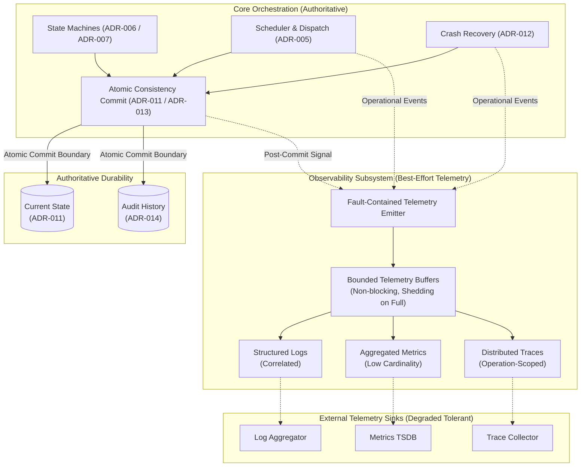

# ADR-016 — Observability Architecture

**Status**: Approved — Not Frozen  
**Criticality**: Supporting  

---

## 1. Purpose

This Architectural Decision Record (ADR) establishes the observability architecture for the NexusFlow workflow orchestration engine. It defines how the engine exposes diagnostic telemetry—encompassing structured application logging, low-cardinality aggregated metrics, and distributed tracing correlation—across API requests, workflow executions, task scheduling, attempt lifecycles, worker coordination, failure drains, and crash recovery.

Furthermore, this record formalizes the architectural boundary separating operational telemetry from the durable semantic execution audit history established in [ADR-014](adr-014-execution-history-and-audit-model.md). It codifies the foundational invariant that **telemetry is diagnostic, never authoritative**, establishes bounded fail-open export semantics, specifies metric cardinality discipline, defines asynchronous tracing correlation for long-running workflows, and outlines operational health probe boundaries, while deferring concrete technology and library selections to [ADR-020](00-architecture-decision-register.md), formal error taxonomies to [ADR-018](00-architecture-decision-register.md), secret redaction policies to [ADR-022](00-architecture-decision-register.md), numeric buffer thresholds to [ADR-023](00-architecture-decision-register.md), and custom UI dashboards to [ADR-027](00-architecture-decision-register.md).

---

## 2. Context

NexusFlow executes complex, multi-step directed acyclic graph (DAG) workflows defined by [ADR-001](adr-001-internal-workflow-specification.md) and [ADR-003](adr-003-canonical-workflow-graph-representation.md). The runtime behavior of these workflows is governed by the formal state machines defined in [ADR-006](adr-006-workflow-execution-state-machine.md) (`WorkflowExecution`) and [ADR-007](adr-007-task-execution-lifecycle-and-attempt-model.md) (`TaskExecution` and `ExecutionAttempt`). Distributed worker coordination, liveness, and routing are established under [ADR-008](adr-008-worker-coordination-and-liveness-model.md) and [ADR-009](adr-009-task-routing-strategy.md). Workflow parameter passing and payload boundaries are governed by [ADR-010](adr-010-workflow-data-flow-and-parameter-passing.md).

Authoritative orchestration durability is governed by [ADR-011](adr-011-state-persistence-strategy.md), which established normalized durable current state as authoritative orchestration truth across ten logical consistency groups. Crash recovery is governed by [ADR-012](adr-012-recovery-strategy.md) based on authoritative current state without event replay. [ADR-013](adr-013-consistency-and-concurrency-strategy.md) established optimistic single-winner concurrency control using internal opaque concurrency revisions and short atomic persistence transactions. [ADR-014](adr-014-execution-history-and-audit-model.md) established the append-only transactional execution history and audit log. Public control-plane inspection and explicit lifecycle commands are governed by [ADR-015](adr-015-external-api-architecture.md).

### The Observability Dilemma
Distributed workflow engines execute multi-stage, asynchronous, long-running business logic across distributed workers and autonomous scheduler loops. Operators, developers, and automated monitoring systems require deep diagnostic insight into system health, latency bottlenecks, failure causes, and scheduling decisions. However, observability designs in distributed systems frequently succumb to critical architectural pitfalls:
1. **Telemetry as State Authority**: Permitting log scrapers, metric counters, or trace spans to influence state machines, retry decisions, timeout enforcement, or recovery reconciliations, creating catastrophic split-brain conditions when telemetry pipelines degrade.
2. **Cascading Failure Coupling**: Allowing slow, partitioned, or crashing remote telemetry collectors (log sinks, time-series databases, APM backends) to block engine execution loops, backpressure database transactions, or fail client API requests.
3. **Conflating Audit History with Telemetry**: Attempting to use best-effort diagnostic logging as a durable compliance audit record, or conversely, attempting to store high-frequency operational chatter (heartbeats, routing candidates, query latencies) in durable transactional audit history.
4. **Metric Cardinality Explosion**: Emitting unbounded, dynamic domain identifiers (execution IDs, attempt IDs, trace IDs, raw error strings) as metric labels, leading to memory exhaustion in time-series collectors.
5. **Monolithic Trace Spans**: Attempting to model multi-day, asynchronous workflow lifecycles as single distributed trace spans, causing unbounded span graphs, memory leaks, and broken visualization tools.

---

## 3. Problem Statement

How should NexusFlow provide comprehensive operational visibility across API requests, workflow executions, task scheduling, attempt lifecycles, worker coordination, failure drains, and crash recovery while:
1. Guaranteeing that telemetry remains strictly diagnostic and never becomes a correctness authority or execution dependency for orchestration state machines?
2. Ensuring that telemetry export is bounded, fault-contained, and fail-open, so that complete outages or latency spikes in external telemetry collectors cannot stall, degrade, or fail workflow execution?
3. Maintaining a strict, unambiguous separation between durable, transactional execution audit history ([ADR-014](adr-014-execution-history-and-audit-model.md)) and best-effort operational telemetry?
4. Enabling rapid, correlated end-to-end debugging across process and asynchronous boundaries without creating metric cardinality explosion or exposing sensitive business payloads and credentials?
5. Defining clean operational health probe boundaries (liveness and readiness) that isolate required engine dependencies from optional telemetry backends?

---

## 4. Requirements Covered

### 4.1 Functional Requirements
* **FR-OBS-001: Structured Application Logging**: The engine must emit machine-readable structured logs containing stable semantic fields and contextual correlation identifiers across control-plane and worker operations.
* **FR-OBS-002: Operational Metrics Collection**: The engine must collect and expose low-cardinality aggregated metrics (counters, gauges, distributions/histograms) capturing workflow throughput, task state progression, scheduler latency, routing behavior, worker population liveness, persistence performance, and API traffic.
* **FR-OBS-003: Distributed Tracing Correlation**: The engine must support propagatable distributed trace context across client API boundaries, scheduler dispatches, and worker execution callbacks, enabling causal diagnostic correlation across asynchronous operations.
* **FR-OBS-004: Diagnostic Domain Correlation**: Telemetry records must support correlation across `WorkflowExecutionId`, `TaskExecutionId`, `AttemptId`, `WorkerSessionId`, request identifiers, and trace identifiers whenever semantically applicable.
* **FR-OBS-005: Operational Health Probes**: The engine must expose diagnostic health signals suitable for operational liveness and readiness evaluation, distinguishing local process viability and core persistence availability from optional telemetry sink availability.

### 4.2 Non-Functional Requirements
* **NFR-OBS-001: Zero Correctness Dependency**: Orchestration state progression, scheduler dispatch, worker liveness authority, timeout determination, and crash recovery must never depend on the availability, latency, or contents of logs, metrics, or traces.
* **NFR-OBS-002: Fail-Open Bounded Buffering**: Telemetry emissions must use bounded memory buffers. Under saturation or external collector outages, telemetry must shed, sample, or degrade without blocking or failing core state transitions.
* **NFR-OBS-003: Metric Cardinality Discipline**: Default metric labels must strictly exclude dynamic, high-cardinality identifiers, guaranteeing bounded memory footprints in time-series monitoring systems.
* **NFR-OBS-004: Payload & Secret Protection**: Business payloads (inputs and outputs) and authentication credentials must be excluded from diagnostic telemetry by default, providing metadata minimization and supporting redaction capabilities.
* **NFR-OBS-005: Technology Neutrality**: The observability architecture must remain independent of specific logging frameworks, monitoring systems (e.g., Prometheus, Datadog), tracing backends (e.g., Jaeger, Tempo), and application platforms.

---

## 5. Constraints

1. **Authoritative State Precedence**: Orchestration state machines ([ADR-006](adr-006-workflow-execution-state-machine.md), [ADR-007](adr-007-task-execution-lifecycle-and-attempt-model.md)), timeout evaluations, worker liveness authority ([ADR-008](adr-008-worker-coordination-and-liveness-model.md)), and crash recovery ([ADR-012](adr-012-recovery-strategy.md)) read exclusively from authoritative durable current state ([ADR-011](adr-011-state-persistence-strategy.md)). They never inspect logs, metrics, or traces to determine state progression.
2. **Audit History Segregation**: Durable execution audit records are governed exclusively by [ADR-014](adr-014-execution-history-and-audit-model.md). Telemetry is operational, ephemeral, and subject to loss, sampling, and rotation; it does not replace or redefine semantic audit history.
3. **No Dynamic Cardinality in Metrics**: Dynamic domain IDs (`execution_id`, `task_id`, `attempt_id`, `worker_session_id`, `request_id`, `trace_id`), raw URLs, and raw error strings must never be emitted as metric labels.
4. **No Telemetry-Induced Lifecycle States**: Telemetry cannot introduce artificial workflow, task, attempt, or worker lifecycle states (e.g., `BLOCKED`, `DEGRADED`, `DEAD`, `RECOVERING`, `START_TIMED_OUT`, `EXECUTION_TIMED_OUT`, `OBSERVABILITY_ERROR`). Existing state machines remain authoritative.
5. **No Centralized User Task Log Product in V1**: Centralized, durable storage and querying of user task process stdout/stderr is explicitly out of scope for V1.
6. **Delegated Boundaries**:
   * Graceful shutdown mechanics and drain sequences are governed by **ADR-017** (Graceful Shutdown Strategy).
   * Formal domain error classifications, failure taxonomies, and retryability policies are governed by **ADR-018** (Error Handling Philosophy).
   * Concrete library selections, exporter SDKs, serialization encodings, and telemetry backends are governed by **ADR-020** (Technology Selection Strategy).
   * Testing architecture and simulation harnesses are governed by **ADR-021** (Testing Strategy).
   * Security policies, credential scrubbing rules, and compliance audits are governed by **ADR-022** (Security Model).
   * Numerical configuration limits (buffer sizes, sampling percentages, exporter timeouts, retention periods) are governed by **ADR-023** (Configuration Strategy).
   * User dashboard products and visualization tools are governed by **ADR-027** (Dashboard Architecture).

---

## 6. Goals

* Establish a clear, technology-neutral observability model spanning structured logging, low-cardinality metrics, and distributed tracing.
* Insulate core orchestration completely from telemetry collector failures, partitions, or latency spikes via bounded, fail-open buffering.
* Maintain an unambiguous architectural boundary between durable semantic audit history ([ADR-014](adr-014-execution-history-and-audit-model.md)) and best-effort diagnostic telemetry.
* Establish strict metric cardinality rules to protect monitoring infrastructure from unbounded label growth.
* Model long-running workflow tracing via bounded operation-scoped traces linked asynchronously, avoiding unwieldy multi-day span graphs.
* Enable comprehensive operational troubleshooting across all engine subsystems (scheduler, routing, worker liveness, retry backoff, timeouts, recovery) using correlated domain identifiers.
* Define operational health probe semantics that decouple core engine readiness from optional telemetry exporter health.

---

## 7. Non-Goals

* **No Authoritative Telemetry**: Logs, metrics, and traces will never be used by the engine to make orchestration decisions, track retries, evaluate deadlines, or recover state.
* **No Guarantees of Exactly-Once Telemetry Delivery**: The system does not guarantee that every log, metric point, or trace span is delivered without loss or duplication during severe resource saturation or crashes.
* **No One-to-One Delivery Guarantee Between History and Telemetry**: The system does not guarantee that every durable history entry has a corresponding delivered log, metric point, or trace span.
* **No Centralized Task Stdout/Stderr Storage in V1**: The engine will not ingest, store, index, or stream user task stdout/stderr logs in V1.
* **No Direct Binding to Concrete Telemetry Vendor SDKs**: This record does not mandate specific OpenTelemetry SDK packages, Prometheus client libraries, or specific logging frameworks.
* **No Hardcoded Telemetry Thresholds or Retention Periods**: Buffer queue sizes, export batch intervals, sampling rates, and log retention TTLs are not frozen here (deferred to ADR-023).
* **No Custom Product Dashboard UI**: Building user-facing operational dashboards is deferred to ADR-027.

---

## 8. Candidate Solutions

### Candidate 1: Unified Event-Sourced Telemetry and State
In this model, all state changes, audit entries, operational logs, and metrics are unified into a single high-throughput event-streaming backbone (e.g., Kafka or a distributed log broker). State machines and recovery engines derive their state by consuming this event log, while telemetry sinks consume the same stream for operational monitoring.

*Tradeoffs*:
* *Advantages*: Single unified data pipeline; uniform event ordering across audit and diagnostics.
* *Disadvantages*: Violates ADR-011 and ADR-012 by introducing an external broker as a hard dependency for state progression and recovery; turns the telemetry pipeline into a catastrophic single point of failure; introduces immense operational and distributed consensus overhead incompatible with V1 simplicity.

### Candidate 2: Synchronous Dual-Write Telemetry
In this model, the orchestrator emits structured logs, increments metric counters, and exports distributed trace spans synchronously within the execution thread or database transaction of every state transition.

*Tradeoffs*:
* *Advantages*: Immediate telemetry availability; guarantees telemetry perfectly mirrors committed state without lag.
* *Disadvantages*: Telemetry collector latency directly impacts database transaction duration; external telemetry sink outages or network partitions cause orchestrator state transitions to fail or hang; introduces severe cascading failure modes.

### Candidate 3: Layered Best-Effort Observability with Independent Diagnostic Sinks (Chosen)
In this model, authoritative state persistence ([ADR-011](adr-011-state-persistence-strategy.md)) and transactional audit history ([ADR-014](adr-014-execution-history-and-audit-model.md)) remain strictly decoupled from operational telemetry. Telemetry (structured logs, low-cardinality metrics, operation-scoped traces) is emitted through non-blocking, fault-contained interfaces backed by bounded memory buffers. If telemetry backends become slow or unavailable, buffers shed or sample telemetry without impacting workflow execution.

*Tradeoffs*:
* *Advantages*: Zero correctness dependency on telemetry infrastructure; complete resilience against telemetry collector outages; bounded memory consumption; clean separation between durable compliance audit and operational diagnostics.
* *Disadvantages*: Telemetry delivery is best-effort and may experience loss or sampling during extreme resource saturation; metric counts are aggregated operational approximations rather than exact accounting records.

---

## 9. Detailed Evaluation

| Architectural Criteria | Candidate 1: Event-Sourced Unified | Candidate 2: Synchronous Dual-Write | Candidate 3: Layered Best-Effort (Chosen) |
| :--- | :--- | :--- | :--- |
| **Orchestration Correctness Isolation** | **Fails**: Telemetry broker outage halts state machine progression. | **Fails**: Telemetry latency or exporter errors fail state transitions. | **Passes**: Telemetry is strictly diagnostic; collector failures cannot affect orchestration. |
| **System Resilience & Fail-Open Semantics** | **Poor**: Single point of failure across storage and telemetry. | **Poor**: Tight coupling leads to cascading system-wide outages. | **Superior**: Bounded, fail-open buffering protects engine runtime under all conditions. |
| **Audit vs. Telemetry Discipline** | **Conflated**: Mixes high-frequency operational chatter with audit records. | **Conflated**: Blurs transactional boundary between state and observability. | **Strict**: Clear separation between durable ADR-014 history and best-effort ADR-016 telemetry. |
| **Operational & Resource Overhead** | **Extreme**: Requires managing distributed event-streaming clusters in V1. | **High**: Increases database commit latencies and lock hold times. | **Low / Tunable**: Bounded in-memory buffers with configurable shedding and sampling. |
| **Implementation Complexity** | **Very High**: Requires event sourcing, projection rebuilds, and consensus. | **Moderate**: Straightforward initial implementation, but brittle under fault conditions. | **Balanced**: Clean architectural abstraction behind simple, non-blocking emitter interfaces. |

---

## 10. Decision

NexusFlow adopts **Candidate 3: Layered Best-Effort Observability consisting of structured machine-readable logs, low-cardinality aggregated metrics, and bounded operation-scoped distributed tracing/correlation**.

### 10.1 Core Decision Principles
1. **Telemetry Is Diagnostic, Never Authoritative**: Logs, metrics, traces, exporters, and dashboards must never serve as orchestration correctness authority. State machines, scheduling loops, worker liveness authority ([ADR-008](adr-008-worker-coordination-and-liveness-model.md)), timeout enforcement ([ADR-007](adr-007-task-execution-lifecycle-and-attempt-model.md)), concurrency control ([ADR-013](adr-013-consistency-and-concurrency-strategy.md)), and crash recovery ([ADR-012](adr-012-recovery-strategy.md)) rely exclusively on authoritative durable current state ([ADR-011](adr-011-state-persistence-strategy.md)).
2. **Strict Separation from ADR-014 History**: Durable execution audit history ([ADR-014](adr-014-execution-history-and-audit-model.md)) is immutable while retained and atomically committed within the same durable persistence boundary as authoritative state mutations. Telemetry ([ADR-016](adr-016-observability-architecture-validation.md)) is operational, best-effort, and subject to independent buffering, sampling, rotation, and loss.
3. **No Delivery Guarantees Across Boundaries**: History-worthy semantic transitions should normally emit corresponding diagnostic telemetry where practical. However, there is no delivery guarantee that every durable history entry has a matching delivered log, metric point, or trace span.
4. **Structured Machine-Readable Logging**: Application logs must be machine-readable with stable semantic fields. Canonical serialization (e.g., JSON) belongs to implementation under ADR-020. Logs carry standard correlation identifiers when semantically applicable.
5. **Separation of Domain and Telemetry Identities**: Domain identifiers (`WorkflowExecutionId`, `TaskExecutionId`, `AttemptId`) and telemetry identifiers (`TraceId`, `SpanId`, `request_id`) are separate concepts. `WorkflowExecutionId` must not equal `TraceId`.
6. **Strict Metric Cardinality Discipline**: Dynamic domain IDs, raw URLs, raw error messages, raw payloads, and user strings are strictly prohibited as default metric labels. Metrics use bounded route templates, coarse failure categories, and low-cardinality component dimensions.
7. **Operation-Scoped Distributed Tracing**: Long-running asynchronous workflows are traced as bounded operation-scoped traces linked asynchronously across network and process boundaries via context propagation and causal links, rather than requiring monolithic workflow-lifetime spans.
8. **Fail-Open Bounded Buffering**: Telemetry emissions use bounded in-memory buffering. Under saturation or exporter failure, telemetry is shed, sampled, or degraded to protect process stability. Telemetry export failures must never fail or roll back state transitions.
9. **Fault Containment**: Instrumentation failures must be isolated from engine execution loops. An unhandled exception within logging, metric recording, or trace export must be suppressed and contained.
10. **Decoupled Operational Probes**: Liveness probes evaluate local process viability; readiness probes evaluate authoritative persistence availability and startup recovery completion. Neither probe depends on the availability of optional telemetry sinks.

---

## 11. Decision Rationale

### 11.1 Why Telemetry Cannot Be Authoritative
In a distributed orchestrator, telemetry pipelines (log collectors, time-series databases, APM tracing backends) are external systems with independent failure domains, network partitions, and ingestion latencies. If an orchestrator relies on a metric counter to decide whether a task has exceeded retries, or relies on an APM trace span to determine whether a worker has timed out, any transient network hiccup or ingestion delay in the telemetry stack will corrupt the orchestrator's state machines. Maintaining authoritative state strictly within durable persistence ([ADR-011](adr-011-state-persistence-strategy.md)) guarantees deterministic correctness regardless of telemetry collector health.

### 11.2 Why History (ADR-014) and Telemetry (ADR-016) Must Be Decoupled
ADR-014 execution history fulfills a critical compliance, audit, and user-facing role: it provides a durable, tamper-resistant record of *what authoritative state changes occurred*. If a required history record cannot be committed atomically with a state change, the entire transaction must roll back to preserve audit consistency. 

In contrast, ADR-016 telemetry fulfills an operational debugging role: it explains *how the system is executing* (e.g., routing scans, rejected offers, query timings, OCC retries, heartbeat ticks). Emitting this high-frequency chatter into durable transactional history would cause catastrophic database bloat, performance degradation, and storage coupling. Conversely, subjecting durable audit records to the sampling, rotation, and loss inherent in operational telemetry would destroy audit integrity. Decoupling them preserves the integrity of both subsystems.

### 11.3 Why Operation-Scoped Traces Outperform Workflow-Lifetime Spans
Workflows in NexusFlow are designed to execute asynchronously across hours, days, or months, pausing for worker availability, long-running batch jobs, or human approvals. Standard distributed tracing protocols (e.g., OpenTelemetry, W3C TraceContext) are optimized for synchronous RPCs lasting milliseconds to seconds. Holding a root trace span open across a multi-day workflow leads to unbounded span buffer accumulation, exporter timeouts, memory leaks in collectors, and unnavigable visualization trees. Decomposing workflow execution into discrete, operation-scoped traces (e.g., API start, dispatch loop, worker attempt execution, result callback) linked causally via propagated context and correlated by `WorkflowExecutionId` provides complete diagnostic navigability without operational instability.

### 11.4 Why Metric Cardinality Discipline Is Mandatory
Time-series databases allocate memory, indexing structures, and storage blocks proportionally to the number of unique time-series (the Cartesian product of all label values). Emitting dynamic, unbounded identifiers (such as `execution_id` or `attempt_id`) as metric labels causes exponential metric cardinality explosion, leading to out-of-memory crashes in monitoring systems. Dynamic identifiers belong in structured logs and distributed traces; metrics must remain strictly aggregated across low-cardinality operational dimensions.

---

## 12. Tradeoffs

| Capability Gained | Architectural Cost / Invariant Accepted |
| :--- | :--- |
| **Absolute Engine Resilience**: Telemetry collector outages or network partitions never stall, degrade, or fail workflow orchestration. | **Best-Effort Telemetry Delivery**: During severe memory saturation or process crashes, diagnostic telemetry may be dropped or sampled. |
| **Audit Integrity & Performance**: High-frequency operational chatter is excluded from durable history, keeping transactional storage performant and lean. | **Dual Systems**: Operators must use two distinct diagnostic paths: ADR-015 API for durable audit history, and external telemetry sinks for operational latency and debugging. |
| **Stable Monitoring Infrastructure**: Metrics remain bounded, performant, and safe from time-series cardinality explosions. | **No Per-Execution Metric Queries**: Operators cannot filter global metric graphs by a single `execution_id`; they must query logs or traces using domain IDs for per-execution investigation. |
| **Scalable Long-Running Tracing**: Multi-day workflows are traced cleanly without memory leaks or exporter timeouts. | **Discontinuous Trace Spans**: Distributed traces appear as linked, discrete operations rather than a single uninterrupted visual waterfall. |
| **Secure Diagnostics**: Prevents sensitive business payloads and credentials from leaking into external log aggregators. | **Indirect Payload Inspection**: Operators cannot inspect business parameter contents directly in logs; they must inspect authorized execution state via the secure ADR-015 API. |

---

## 13. Consequences

### 13.1 Architectural Consequences
* **Decoupled Telemetry Ingestion**: The engine exposes non-blocking telemetry emitter interfaces. Telemetry export runs asynchronously or out-of-band relative to the core state machine commit path.
* **Bounded Buffering Infrastructure**: The engine runtime must implement bounded in-memory buffers with configurable shedding/sampling policies (governed by [ADR-023](adr-023-configuration-strategy.md)).
* **Fault-Contained Instrumentation**: All telemetry emission points must be wrapped in fault-containment boundaries to ensure that unexpected serialization or export exceptions are suppressed and do not propagate into engine logic.
* **Correlation Contract**: Logging and tracing wrappers must automatically propagate contextual domain identifiers (`WorkflowExecutionId`, `TaskExecutionId`, `AttemptId`, `WorkerSessionId`, `request_id`, `trace_id`) across internal component boundaries.
* **OpenAPI & Public API Insulation**: The public control-plane API ([ADR-015](adr-015-external-api-architecture.md)) does not expose raw telemetry streaming or ingestion endpoints. Operational metrics are exposed via dedicated scraping or export interfaces governed by [ADR-020](00-architecture-decision-register.md).

### 13.2 Subsystem Interaction & Boundary Model

---

## 14. Failure Modes and Mitigation Matrix

The following matrix documents 50 distinct failure scenarios across telemetry backends, instrumentation faults, state transitions, and diagnostic edge cases.

| # | Scenario | Authoritative Engine Behavior | Telemetry / Observability Behavior | Correctness Impact | Operator Visibility | Owning ADR |
| :--- | :--- | :--- | :--- | :--- | :--- | :--- |
| **1** | Remote log sink unavailable | Orchestration continues unimpeded | Logs buffered; degraded/shed under saturation; best-effort local output | Isolated to telemetry; fail-open | Degraded log stream; self-metric for dropped items if available | ADR-016 |
| **2** | Metrics collector partitioned | Orchestration continues unimpeded | In-memory metric scrape fails or push exporter errors | Isolated to telemetry; fail-open | Dashboard flatlines; logs indicate export failure | ADR-016 |
| **3** | Trace collector crashed | Orchestration continues unimpeded | Trace spans dropped locally after buffer capacity | Isolated to telemetry; fail-open | Spans missing in UI; exporter error logged | ADR-016 |
| **4** | All telemetry backends dead | Orchestration continues unimpeded | Engine operates in headless diagnostic mode | Isolated to telemetry; fail-open | Complete external telemetry outage; workflows proceed | ADR-016 |
| **5** | Telemetry memory buffer full | Orchestration continues unimpeded | Non-blocking telemetry shedding under configured saturation policy | Isolated to telemetry; fail-open | Self-observability counter records dropped telemetry if viable | ADR-016 / ADR-023 |
| **6** | Log serialization error | Operation commits normally | Fault contained; fallback diagnostic message emitted | Isolated to telemetry; no state-machine impact | Fallback diagnostic log emitted; engine unaffected | ADR-016 |
| **7** | Metric recording exception | Operation commits normally | Fault contained; metric error suppressed | Isolated to telemetry; no state-machine impact | Minor metric inaccuracy; zero engine impact | ADR-016 |
| **8** | Incoming trace context malformed | API request parsed normally | Ignored; new local trace context generated for request | Isolated to telemetry | Logged at DEBUG; trace linkage disconnected | ADR-016 |
| **9** | Trace context missing on worker callback | Worker result processed normally | Local span created using domain IDs for correlation | Isolated to telemetry | Trace link absent; searchable by domain IDs in logs | ADR-016 |
| **10** | Worker sends invalid trace header | Result processed normally | Unparseable header dropped; diagnostic warning | Isolated to telemetry | Trace link omitted; attempt domain ID retained | ADR-016 |
| **11** | High-cardinality metric label attempted | Metric registration rejected / sanitized | Metric helper sanitizes label or assigns coarse category | Isolated to telemetry | Prevents TSDB memory explosion | ADR-016 |
| **12** | Payload passed to logger | Operation commits normally | Telemetry minimization policy filters/truncates payload | Isolated to telemetry | Prevents log flooding and secret leakage | ADR-016 / ADR-022 |
| **13** | Authentication token in diagnostic log | Operation commits normally | Redaction capability masks credentials | Isolated to telemetry | Redacted log entry; preserves security | ADR-016 / ADR-022 |
| **14** | API request fails before execution exists | Request rejected with 4xx | Logged at API level with `request_id`; no execution ID | Isolated to telemetry | Searchable by `request_id` in API logs | ADR-015 / ADR-016 |
| **15** | Start execution commits; log export fails | Execution created and scheduled | History record exists in ADR-014; log dropped | No state-machine impact; history is durable | State is authoritative; history queryable via API | ADR-011 / ADR-014 / ADR-016 |
| **16** | Task success commits; metric increment fails | Task transitions to SUCCEEDED | Authoritative state is SUCCEEDED; metric gauge lags | No state-machine impact; metric is approximate | API reports true state; metrics approximate | ADR-011 / ADR-016 |
| **17** | History write fails; log succeeds | Transaction rolls back; state reverts | Log indicates attempt was initiated, but commit failed | History preserves audit consistency; state unaffected | Pre-commit log shows 'attempting'; failure logged | ADR-014 / ADR-016 |
| **18** | History read query fails on API | API returns transient 503 | Error log emitted with `request_id` and error cause | No workflow execution impact; client retryable | Diagnostic visibility into read path failure | ADR-014 / ADR-015 |
| **19** | Duplicate worker callback received | Treated as no-op under ADR-007 | Logged at DEBUG as duplicate callback; no state change | No state-machine impact | Searchable in worker logs; duplicate discarded | ADR-007 / ADR-016 |
| **20** | Stale attempt callback (after timeout) | Rejected as stale under ADR-007/008 | Logged at WARN as stale callback; counter incremented | No state-machine impact; state protected | Anomaly metric visible to operator | ADR-007 / ADR-008 / ADR-016 |
| **21** | Lost OCC race on task claim | Worker claim fails; task remains RUNNABLE | Logged at DEBUG as OCC conflict; OCC metric increments | No state-machine impact; normal concurrency control | Scheduler retries claim on next cycle | ADR-013 / ADR-016 |
| **22** | Unknown commit result on task complete | Reconciled via reread under ADR-013 | Telemetry logs 'unknown outcome' then records resolution | State resolved deterministically by ADR-013 | Ambiguity visible in logs; resolves cleanly | ADR-013 / ADR-016 |
| **23** | No compatible worker for RUNNABLE task | Task remains RUNNABLE | Logged at DEBUG; `no_compatible_worker` metric increments | No task failure; waiting for compatible worker | Operator alerts on worker starvation metric | ADR-009 / ADR-016 |
| **24** | Worker missed heartbeat within grace | Worker liveness evaluated under ADR-008 | Logged at WARN; heartbeat missed counter increments | No premature state change; evaluation active | Proactive warning before worker loss | ADR-008 / ADR-016 |
| **25** | Worker loss determined | Worker marked not live; Attempt resolves FAILED | Logged at WARN/ERROR; worker loss metric fires; history logged | Authoritative worker-loss transition under ADR-008 | Operator sees worker loss and attempt failure | ADR-008 / ADR-014 / ADR-016 |
| **26** | Start deadline expires on CLAIMED attempt | Attempt transitions to FAILED (start-timeout cause) | Logged at WARN; timeout metric increments; history logged | Authoritative timeout transition under ADR-007/008 | Distinct from worker execution timeout | ADR-007 / ADR-008 / ADR-014 |
| **27** | Execution timeout occurs | Attempt transitions to FAILED (exec-timeout cause) | Logged at WARN; execution timeout metric increments | Authoritative timeout transition under ADR-007 | Audible in history and visible in metrics | ADR-007 / ADR-014 / ADR-016 |
| **28** | Retry scheduled | Task transitions to RETRY_WAIT | Logged at INFO with backoff duration; retry metric increments | Normal lifecycle progression under ADR-007 | Operator sees retry progression | ADR-007 / ADR-016 |
| **29** | Retry budget exhausted | Task transitions to definitive FAILED | Logged at WARN; failure metric increments; history logged | Authoritative failure progression under ADR-007 | Workflow failure progression triggered | ADR-006 / ADR-007 / ADR-014 |
| **30** | Cancellation accepted via API | State transitions to CANCELLING | Logged at INFO; cancel metric increments; history logged | Authoritative cancellation transition under ADR-006 | Client receives 202 Accepted; drain begins | ADR-006 / ADR-015 / ADR-016 |
| **31** | Remote worker cancel command drops | Local state remains CANCELLING | Logged at WARN; transport failure metric increments | Fencing rules reject stale results under ADR-008 | Bounded drain settles authoritative state | ADR-008 / ADR-016 |
| **32** | Workflow FAILING drain active | Unstarted tasks settle; active attempts settle | Logged at INFO; drain progress logged; history logged | Authoritative failure drain under ADR-006/007 | Deterministic terminal failure progression | ADR-006 / ADR-014 / ADR-016 |
| **33** | Startup recovery clean scan (no repairs) | Engine starts normally | Logged at INFO; clean scan duration recorded; no history | No state change; routine recovery verification | Zero history clutter for routine restarts | ADR-012 / ADR-014 / ADR-016 |
| **34** | Startup recovery executes repair | Authoritative state repair committed under ADR-012 | Logged at WARN; repair counter increments; history logged | Authoritative recovery repair under ADR-012 | History records durable audit of state repair | ADR-012 / ADR-014 / ADR-016 |
| **35** | Unresolvable recovery anomaly | Recovery fails closed under ADR-012/018 | Logged at ERROR; invariant violation metric fires | Fail-closed per ADR-012; prevents corruption | Operator alert triggers immediate investigation | ADR-012 / ADR-016 / ADR-018 |
| **36** | Orchestrator process restart | In-memory telemetry resets | New process incarnation ID logged at boot; metrics restart | No state loss; state resides in durable persistence | Historical continuity maintained via DB & history | ADR-012 / ADR-016 |
| **37** | Clock skew between worker & engine | Engine uses local clock for state authority | Clock discrepancy logged if observed; no state impact | No state corruption; engine clock authoritative | Prevents worker clock from manipulating timeouts | ADR-008 / ADR-016 |
| **38** | Trace span arrives out of order | Exporter handles span ingestion | Spans assembled via trace/link structure in visualizer | No state impact; diagnostic visualization only | Trace UI correlates spans asynchronously | ADR-016 |
| **39** | Metrics aggregation delayed in TSDB | Orchestration runs normally | Dashboard displays delayed points; engine healthy | No state impact; telemetry lag only | Known aggregation lag; API remains authoritative | ADR-016 |
| **40** | Dashboard disagrees with API state | Control plane API is semantic authority | Dashboard display reflects metric lag or sampling | Authoritative current state wins unconditionally | Operator trusts control-plane inspection | ADR-011 / ADR-015 / ADR-016 |
| **41** | Massive spike in logging volume | Telemetry buffers shed events per config | Shedding logged if viable; non-blocking discard | No state impact; protects process memory | Telemetry degradation metric visible | ADR-016 / ADR-023 |
| **42** | Worker emits giant stdout stream | Engine does not ingest full stdout | Stream managed at worker runtime level | No orchestrator memory saturation | Core orchestrator buffers protected | ADR-010 / ADR-016 |
| **43** | User task outputs secrets to stdout | Engine does not centralize user logs | Task logging remains at worker runtime boundary | No control-plane secret contamination | Segregated from core engine telemetry | ADR-016 / ADR-022 |
| **44** | Telemetry flush times out during shutdown | Process terminates after timeout | Incomplete telemetry flush logged; exit proceeds | Prevents hung shutdown under ADR-017 | Timely orchestrator process termination | ADR-016 / ADR-017 |
| **45** | Readiness probe during telemetry outage | Readiness returns healthy | Node serves traffic; telemetry collector down | No service degradation; avoids false outages | Prevents cascading cluster routing failures | ADR-016 |
| **46** | Readiness probe during DB outage | Readiness returns unready | Node stops accepting traffic; alert fires | Protects engine; prevents failed requests | Clear indicator of persistence failure | ADR-011 / ADR-016 |
| **47** | Readiness probe during startup recovery | Readiness returns unready until done | Node waits until recovery reconciliation commits | Guarantees recovery completes before traffic | Prevents race conditions during startup | ADR-012 / ADR-016 |
| **48** | Graceful shutdown initiated | Readiness returns unready (draining) | Shutdown phase logged at INFO; active drains tracked | Traffic routed away while engine drains per ADR-017 | Orderly shutdown progression | ADR-016 / ADR-017 |
| **49** | Telemetry code throws unhandled error | Fault contained inside isolation wrapper | Error caught and suppressed; state machine proceeds | Isolated to telemetry; zero state-machine impact | Internal instrumentation error logged if safe | ADR-016 |
| **50** | Telemetry configuration invalid | Engine falls back to safe operational defaults | Configuration warning logged; safe defaults applied | No boot failure; engine runs with safe logging | Configuration error surfaced for remediation | ADR-016 / ADR-023 |

---

## 15. Debugging Considerations

ADR-016 formalizes actionable diagnostic pathways for operators investigating edge cases across engine subsystems:

1. **Investigating a Task Stuck in `RUNNABLE`**:
   * *Domain State*: Task is `RUNNABLE`, meaning its dependencies in the DAG are satisfied.
   * *Telemetry Investigation*:
     1. Search structured logs for `task_execution_id` within the `SCHEDULER` category to verify whether scheduling loops are evaluating the task.
     2. Check routing metrics (`no_compatible_worker_count`) and logs within the `ROUTING` category to identify whether required worker capability tags or queues have zero active, accepting workers.
     3. Inspect `PERSISTENCE` logs for OCC conflict warnings to check whether concurrent dispatch attempts are repeatedly aborting ownership commits.
2. **Investigating `RETRY_WAIT`**:
   * *Domain State*: Previous execution attempt failed, but remaining retry budget exists under ADR-007.
   * *Telemetry Investigation*:
     1. Search for previous `attempt_id` logs to inspect the failure cause classification from ADR-018.
     2. Inspect the `ATTEMPT` and `SCHEDULER` logs to verify the computed exponential backoff delay and the scheduled readiness deadline.
3. **Investigating `CLAIMED` but Not Starting**:
   * *Domain State*: Attempt is claimed by a worker session, but execution start has not been observed.
   * *Telemetry Investigation*:
     1. Inspect `ATTEMPT` logs for the execution-start deadline timestamp established under ADR-008.
     2. Check `WORKER` logs for that `WorkerSessionId` to determine if heartbeat delays or communication failures occurred during dispatch handoff.
4. **Pre-Commit vs. Post-Commit Logging Discipline**:
   * To prevent misleading diagnostics, logs must clearly distinguish transition intent from confirmed state commits:
     * *Pre-Commit*: Log records indicate "attempting state transition" or "committing attempt ownership".
     * *Post-Commit*: Log records indicate "transition committed successfully".
     * *Unknown Commit*: If ADR-013 indicates transaction status is unknown, logs record "commit outcome ambiguous, awaiting reconciliation".
     * *Reconciliation*: Logs record "outcome resolved: committed" or "outcome resolved: aborted" following authoritative reread.

---

## 16. Testing Considerations

*All testing criteria detailed below represent planned verification requirements, not claims of existing implementation.*

1. **Telemetry Fail-Open Verification**:
   * Verify that completely severing connections to remote log sinks, metrics collectors, and trace exporters does not fail, delay, or alter any workflow execution, API request, or state transition.
   * Verify that throwing synthetic exceptions inside metric recording or trace export helpers is contained by fault-isolation wrappers without bubbling into core scheduling or persistence loops.
2. **Buffer Saturation and Shedding Suite**:
   * Verify that generating telemetry volumes exceeding buffer capacity triggers non-blocking shedding or degradation without causing process out-of-memory crashes or event-loop stalls.
   * Verify that self-observability metrics correctly record dropped telemetry events when viable.
3. **Metric Cardinality Protection Suite**:
   * Verify that attempting to register or record metrics with dynamic labels (`execution_id`, `attempt_id`, `worker_session_id`, `request_id`, `trace_id`, raw error strings, dynamic URLs) is rejected, sanitized, or bucketed into coarse categories.
   * Verify that API metrics record route templates rather than raw resource paths containing IDs.
4. **Context Propagation and Async Linking Suite**:
   * Verify that trace context propagates across client HTTP requests, internal scheduling loops, and worker assignment payloads.
   * Verify that malformed, corrupted, or missing incoming trace headers do not fail API requests and result in clean local trace generation.
   * Verify that operation-scoped traces across asynchronous handoffs maintain causal correlation using span links and domain IDs (`WorkflowExecutionId`).
5. **Operational Health Probe Suite**:
   * Verify that liveness probes return healthy even when external telemetry collectors are partitioned or down.
   * Verify that readiness probes return unready when authoritative persistence is unreachable or startup recovery is in progress.
   * Verify that readiness probes return healthy during complete telemetry backend outages, provided persistence is healthy and recovery is complete.
6. **Data Minimization and Redaction Suite**:
   * Verify that full workflow inputs and outputs are absent from diagnostic logs and trace span attributes by default.
   * Verify that credentials, authorization headers, and bearer tokens are redacted from diagnostic log outputs.

---

## 17. Operational Considerations

1. **Telemetry Volume Management**: In high-throughput orchestrators, DEBUG-level logging and un-sampled distributed tracing generate substantial data volumes. Production deployments must configure log levels to `INFO` or `WARN` by default, with `DEBUG` reserved for targeted subsystem troubleshooting (governed by [ADR-023](adr-023-configuration-strategy.md)).
2. **Buffer Capacity and Memory Footprints**: Telemetry queues must be bounded to a deterministic fraction of available process memory. Exporters must flush in batches and shed events gracefully when downstream collectors experience ingestion backpressure.
3. **Operational Alerting Principles**: Telemetry provides signals suitable for operational alerting without baking specific thresholds into the architecture. Recommended alert conditions include:
   * Persistence unavailability or elevated transaction commit latencies.
   * Repeated OCC conflict spikes or unknown-commit reconciliations.
   * Unresolved crash recovery anomalies or startup recovery stalls.
   * Significant drops in live or accepting worker session populations.
   * High ratios of `no_compatible_worker` routing observations.
   * Elevated 5xx status classes on public API route templates.
   * Persistent telemetry exporter failures or sustained buffer shedding.
4. **Independent Telemetry Retention**: Telemetry retention periods (in log aggregators, metrics TSDBs, and trace stores) are governed by operational capacity and cost policies, completely independent of the workflow data lifecycle and ADR-014 audit retention. Telemetry can expire or roll over without impacting running workflows.

---

## 18. Maintenance Considerations

1. **Semantic Field Stability**: Key names for structured logs and distributed trace attributes should remain stable across engine releases to prevent breaking log queries, alert filters, and dashboard visualizations.
2. **Coordinated Dashboard Evolution**: Modifying or deprecating metric names or dimension keys requires coordinated deprecation windows, as external dashboards and alert rules depend on these contracts.
3. **Instrumentation Hygiene**: Developers adding new engine subsystems must adhere strictly to cardinality rules: never emit dynamic runtime IDs as metric labels, and always wrap external telemetry calls in non-blocking, fault-contained wrappers.
4. **Keeping Telemetry Non-Authoritative**: Code reviews must strictly enforce that no business logic, state-machine transition, or recovery routine imports or reads from telemetry clients or exporters.

---

## 19. Future Evolution

The following capabilities are explicitly deferred from V1 but accommodated by this architecture:
1. **Centralized User Task Log Ingestion**: Adding dedicated pipelines to stream, ingest, index, and query user task process stdout/stderr separately from core engine control-plane logs.
2. **Dynamic / Adaptive Trace Sampling**: Implementing tail-based or error-biased trace sampling to automatically retain full distributed traces for executions that terminate in `FAILED` or `CANCELLED`.
3. **Trace Exemplars**: Linking distributed trace IDs directly to aggregated metric histograms in compatible time-series databases to allow instant drill-down from latency spikes to specific traces.
4. **Operational Dashboard Templates**: Providing pre-built dashboard definitions (e.g., Grafana templates) mapping the core metric taxonomy (governed by ADR-027).
5. **Runtime Profiling Telemetry**: Integrating continuous CPU and memory profiling telemetry for control-plane and worker processes.

---

## 20. Rejected Alternatives

1. **Rejected: Event-Sourcing Orchestration from Telemetry Streams**:
   * *Reason*: Treating logs, metrics, or trace events as the source of truth for workflow state machines introduces catastrophic dependencies on external log brokers. If the telemetry pipeline slows down or drops events, the orchestrator loses state consistency. Authoritative current state must remain in normalized durable persistence ([ADR-011](adr-011-state-persistence-strategy.md)).
2. **Rejected: Synchronous Remote Telemetry Writes During State Commits**:
   * *Reason*: Writing logs or trace spans synchronously inside state-machine transactions causes database lock hold times and API latency to balloon, and turns any telemetry network hiccup into a workflow execution failure.
3. **Rejected: Guarantees of Exactly-Once Telemetry Delivery**:
   * *Reason*: Enforcing exactly-once delivery of logs and spans requires distributed two-phase commits between the database and telemetry sinks, causing extreme performance degradation. Diagnostic telemetry is best-effort.
4. **Rejected: High-Cardinality Per-Execution Metric Labels**:
   * *Reason*: Labeling metrics with `execution_id`, `task_id`, or `attempt_id` causes exponential time-series cardinality explosions, crashing Prometheus or other TSDB collectors. Dynamic correlation belongs in logs and traces.
5. **Rejected: Monolithic Distributed Traces Spanning Workflow Lifetimes**:
   * *Reason*: Asynchronous workflows can run for days or weeks. Forcing an entire workflow into a single trace span causes exporter buffer exhaustion, memory leaks in collectors, and broken visual graph assembly in APM tools. Operation-scoped traces with causal links provide superior resilience and navigability.
6. **Rejected: Full Business Payload Logging by Default**:
   * *Reason*: Logging complete workflow inputs and outputs creates severe data privacy vulnerabilities, leaks secrets and credentials, and explodes log ingestion volumes.
7. **Rejected: Telemetry Collector Health as a Readiness Requirement**:
   * *Reason*: Failing orchestrator readiness when an optional telemetry collector is down causes Kubernetes or load balancers to route traffic away from perfectly healthy control-plane nodes, converting a harmless telemetry glitch into a catastrophic total platform outage.

---

## 21. Decision Evolution

The decision can be understood as an evolution across architectural alternatives:
1. **Initial Observability Requirement**: The need for comprehensive visibility across distributed workflow executions, scheduler decisions, and worker coordination was recognized early as an essential operational requirement.
2. **Rejection of Telemetry as Truth**: Early analysis confirmed that telemetry backends (aggregators, TSDBs, trace collectors) have vastly different availability and partition characteristics than transactional storage. Telemetry was strictly classified as diagnostic, establishing that state machines must never query logs, metrics, or traces.
3. **Separation from Durable Audit History**: The durable semantic execution audit requirements of ADR-014 were separated from the operational observability requirements of ADR-016. High-frequency operational chatter was excluded from durable history, while durable history was insulated from the sampling and rotation of telemetry.
4. **Adoption of the Three Pillars**: Structured machine-readable logs were chosen for rich, contextual troubleshooting; low-cardinality aggregated metrics were chosen for health alerting and throughput trends; and distributed tracing was selected for causal latency analysis.
5. **Resolution of the Long-Running Trace Dilemma**: Rather than attempting monolithic multi-day spans, the architecture adopted operation-scoped traces linked asynchronously via context propagation and correlated across time by durable domain identifiers (`WorkflowExecutionId`).
6. **Hardening Fail-Open and Bounded Delivery**: The architecture formalized bounded in-memory buffering, fault containment, and fail-open export, guaranteeing that telemetry failures can never impede or roll back workflow progression.

---

## 22. Common Misconceptions

1. **Misconception: "Structured logs are the same as execution audit history."**
   * *Correction*: Structured logs are ephemeral, best-effort operational diagnostics that may be sampled, rotated, or dropped under load. ADR-014 execution history is durable, immutable while retained, and atomically committed with state mutations.
2. **Misconception: "Metrics provide an exact count of workflow executions."**
   * *Correction*: Metrics are aggregated operational approximations subject to network drops, scraper timeouts, and process restarts. Authoritative execution counts reside exclusively in durable persistence.
3. **Misconception: "Distributed trace timestamp ordering determines state-machine causal ordering."**
   * *Correction*: Distributed clocks across workers and control planes are subject to clock skew. Authoritative causal ordering is established by state-machine transitions, concurrency revisions ([ADR-013](adr-013-consistency-and-concurrency-strategy.md)), and transactional commit timestamps ([ADR-014](adr-014-execution-history-and-audit-model.md)), never by trace span timestamps.
4. **Misconception: "A task timeout transitions the attempt to a `TIMED_OUT` lifecycle state."**
   * *Correction*: `TIMED_OUT` is not an Attempt lifecycle state. When an execution-start deadline or execution timeout expires and wins, the attempt transitions to `FAILED` with a timeout failure cause (governed by ADR-007 and ADR-018).
5. **Misconception: "Worker liveness is determined by the worker heartbeat metric."**
   * *Correction*: Worker liveness is determined authoritatively by the control-plane worker registry evaluation loop under [ADR-008](adr-008-worker-coordination-and-liveness-model.md). Heartbeat metrics are passive diagnostic observations.
6. **Misconception: "A failure in telemetry export fails the workflow execution."**
   * *Correction*: Telemetry is completely decoupled and fail-open. If every external log sink, metrics TSDB, and trace collector crashes, the engine continues executing workflows normally.
7. **Misconception: "WorkflowExecutionId is the root TraceId."**
   * *Correction*: `WorkflowExecutionId` is a durable domain identifier. `TraceId` is an ephemeral diagnostic identifier representing a specific distributed execution graph. They are distinct concepts.
8. **Misconception: "Observing 'No compatible worker' means the task has failed."**
   * *Correction*: 'No compatible worker' is a routing observation. The task remains `RUNNABLE` awaiting an eligible worker. It is not an attempt failure.

---

## 23. Open Questions

None at the ADR-016 architectural level. Concrete telemetry libraries, exporter protocols, and SDK bindings are delegated to ADR-020; formal error code categories are delegated to ADR-018; secret redaction rules are delegated to ADR-022; numerical buffer sizes, sampling percentages, and retention TTLs are delegated to ADR-023; product dashboard UI implementations are deferred to ADR-027.

---

## 24. Interview Discussion (SDE-2 Architecture Defense)

### Q1: Why can telemetry never be used as an authoritative source of truth for orchestration state?
> **Answer**: "Telemetry pipelines and distributed time-series collectors operate under fundamentally different availability and consistency models than transactional orchestration engines. Ingestion lag, network partitions, buffer drops, and collector restarts are routine operational realities. If an orchestrator relies on a metric counter to track retries, or relies on an APM trace span to determine whether a task has timed out, any blip in the telemetry pipeline will corrupt the engine's state machines and cause split-brain execution. Authoritative state must reside in normalized durable persistence ([ADR-011](adr-011-state-persistence-strategy.md)), leaving telemetry strictly as a best-effort diagnostic lens."

### Q2: How do you justify having both ADR-014 execution history and ADR-016 structured logging? Isn't that redundant?
> **Answer**: "They serve completely different purposes, adhere to different lifecycles, and have different failure semantics. ADR-014 history is a durable semantic audit log that records *what state transitions occurred*. It is atomically committed with state mutations—if the history record fails to commit, the state transition rolls back. It is queried through the external domain API and retained for compliance. ADR-016 structured logging records *how the engine is executing* at high frequency (e.g., routing scans, rejected offers, query timings, OCC retries, heartbeat ticks). Emitting this high-volume operational chatter into durable transactional history would cause catastrophic database bloat and performance collapse. Conversely, subjecting audit records to the sampling, rotation, and loss inherent in operational log aggregators would destroy audit integrity. Decoupling them is essential."

### Q3: Why not trace multi-day workflows as a single distributed trace?
> **Answer**: "Distributed tracing protocols and APM collectors were designed for microservice request/response cycles spanning milliseconds to seconds. Holding a root trace span open across a multi-day or multi-week asynchronous workflow creates severe operational liabilities: trace span buffers overflow, exporter timeouts occur, memory leaks accumulate in collectors, and APM visualizers struggle to render spans that span weeks. Instead, we use operation-scoped traces (e.g., API start, dispatch evaluation, worker attempt execution, result callback) connected via causal trace context and span links, correlated across time by the durable `WorkflowExecutionId`. This provides identical causal navigability without operational instability."

### Q4: How do you prevent telemetry from bringing down the orchestrator when external collectors fail?
> **Answer**: "We enforce three strict architectural layers: first, **fail-open non-blocking interfaces**, meaning the core event loop never performs synchronous network I/O to remote collectors; second, **bounded in-memory buffering**, ensuring telemetry queues consume a deterministic, bounded fraction of process memory; and third, **shedding under saturation**, where buffers drop or sample events rather than backpressuring the engine if downstream sinks stall. Additionally, all telemetry calls execute behind fault-isolation boundaries, ensuring that serialization or runtime exceptions within third-party telemetry SDKs are suppressed and never propagate into state machine transitions."

### Q5: How do operators troubleshoot a task that is stuck in `RUNNABLE` without introducing an artificial `BLOCKED` state?
> **Answer**: "`BLOCKED` was explicitly rejected in ADR-007 because state machines should reflect authoritative lifecycle reality: a task whose upstream dependencies are met is genuinely `RUNNABLE`. When a `RUNNABLE` task fails to progress, operators investigate via correlated telemetry: first, checking scheduler logs for the `task_execution_id` to confirm whether dispatch loops are evaluating the task; second, checking routing metrics (`no_compatible_worker_count`) and logs to determine if worker capability tags or queues have zero active, accepting workers; and third, checking persistence logs for OCC conflict spikes to see if concurrent dispatch attempts are contending on task claims. This makes the underlying cause immediately actionable without corrupting the formal task state machine."

---

## 25. References

1. **W3C Trace Context**: *W3C Recommendation on Distributed Tracing Context Propagation*.
2. **OpenTelemetry Specifications**: *Conceptual Architecture for Distributed Logs, Metrics, and Traces*.
3. **Google SRE Book**: *Monitoring Distributed Systems and Service Level Indicators*.
4. **NexusFlow Architecture Decisions**:
   * [ADR-001: Internal Workflow Specification](adr-001-internal-workflow-specification.md)
   * [ADR-003: Canonical Workflow Graph Representation](adr-003-canonical-workflow-graph-representation.md)
   * [ADR-005: Workflow Task Scheduling & Dispatch Architecture](adr-005-workflow-task-scheduling-and-dispatch-architecture.md)
   * [ADR-006: Workflow Execution State Machine](adr-006-workflow-execution-state-machine.md)
   * [ADR-007: Task Execution Lifecycle & Attempt Model](adr-007-task-execution-lifecycle-and-attempt-model.md)
   * [ADR-008: Worker Coordination & Liveness Model](adr-008-worker-coordination-and-liveness-model.md)
   * [ADR-009: Task Routing Strategy](adr-009-task-routing-strategy.md)
   * [ADR-010: Workflow Data Flow & Parameter Passing](adr-010-workflow-data-flow-and-parameter-passing.md)
   * [ADR-011: State Persistence Strategy](adr-011-state-persistence-strategy.md)
   * [ADR-012: Recovery Strategy](adr-012-recovery-strategy.md)
   * [ADR-013: Consistency & Concurrency Strategy](adr-013-consistency-and-concurrency-strategy.md)
   * [ADR-014: Execution History & Audit Model](adr-014-execution-history-and-audit-model.md)
   * [ADR-015: External API Architecture](adr-015-external-api-architecture.md)
   * [ADR-017: Graceful Shutdown Strategy](00-architecture-decision-register.md) *(Companion / Deferred)*
   * [ADR-018: Error Handling Philosophy](00-architecture-decision-register.md) *(Companion / Deferred)*
   * [ADR-020: Technology Selection Strategy](00-architecture-decision-register.md) *(Companion / Deferred)*
   * [ADR-021: Testing Strategy](00-architecture-decision-register.md) *(Companion / Deferred)*
   * [ADR-022: Security Model](00-architecture-decision-register.md) *(Companion / Deferred)*
   * [ADR-023: Configuration Strategy](00-architecture-decision-register.md) *(Companion / Deferred)*
   * [ADR-027: Dashboard Architecture](00-architecture-decision-register.md) *(Future / Deferred)*

---

## 26. Traceability

### 26.1 Requirement to Decision Mapping

| Requirement ID | Requirement Description | ADR-016 Architecture Section |
| :--- | :--- | :--- |
| **FR-OBS-001** | Structured Application Logging | Section 10.1 (Item 4), Section 15 |
| **FR-OBS-002** | Operational Metrics Collection | Section 10.1 (Item 6), Section 11.4 |
| **FR-OBS-003** | Distributed Tracing Correlation | Section 10.1 (Item 7), Section 11.3 |
| **FR-OBS-004** | Diagnostic Domain Correlation | Section 10.1 (Item 5), Section 15 |
| **FR-OBS-005** | Operational Health Probes | Section 10.1 (Item 10), Section 16 (Suite 5) |
| **NFR-OBS-001**| Zero Correctness Dependency | Section 10.1 (Item 1), Section 11.1 |
| **NFR-OBS-002**| Fail-Open Bounded Buffering | Section 10.1 (Item 8), Section 14 (Rows 1–5) |
| **NFR-OBS-003**| Metric Cardinality Discipline | Section 10.1 (Item 6), Section 11.4, Section 16 (Suite 3) |
| **NFR-OBS-004**| Payload & Secret Protection | Section 10.1, Section 16 (Suite 6), Section 20 (Item 6) |
| **NFR-OBS-005**| Technology Neutrality | Section 1, Section 5 (Item 6), Section 20 |

---

## 27. Decision Validation Checklist

| # | Validation Item | Status | Verification Detail |
| :--- | :--- | :--- | :--- |
| **1** | Is the problem statement decoupled from specific database/broker technologies? | **Passed** | Decoupled; no specific TSDB, logging library, or tracing vendor mandated. |
| **2** | Are the functional requirements (FRs) and non-functional requirements (NFRs) traced? | **Passed** | Mapped in Section 4 and explicitly verified in Section 26. |
| **3** | Were at least two realistic candidate designs critically evaluated? | **Passed** | Evaluated Event-Sourced Unified, Synchronous Dual-Write, and Layered Best-Effort. |
| **4** | Are the tradeoffs clear (what are we giving up for simplicity or correctness)? | **Passed** | Detailed in Section 12; explicitly covers best-effort loss vs. engine resilience. |
| **5** | Does the design preserve all mapped system invariants? | **Passed** | Preserves state machines (ADR-006/007), liveness (ADR-008), persistence (ADR-011), recovery (ADR-012), concurrency (ADR-013), and audit history (ADR-014). |
| **6** | Does this decision avoid introducing tight coupling between modules? | **Passed** | Telemetry interfaces are non-blocking and fault-contained; external sinks cannot block engine. |
| **7** | Are the potential failure modes mapped? | **Passed** | Comprehensive 50-row failure mode matrix documented in Section 14. |
| **8** | Is there a clear explanation of how this design behaves during shutdown / restart? | **Passed** | Documented in Section 14 (Rows 36, 44, 48) and Section 10.1 (Item 10). |
| **9** | Are the debugging strategies defined? | **Passed** | Detailed in Section 15 covering `RUNNABLE`, `RETRY_WAIT`, `CLAIMED`, and recovery. |
| **10** | Does the testing strategy explain how to simulate failures and recovery? | **Passed** | Six comprehensive planned verification suites detailed in Section 16. |
| **11** | Are performance limits and resource footprints qualitatively identified? | **Passed** | Addressed in Section 17 with payload guards, bounded buffers, and cardinality rules. |
| **12** | Is the future evolution path explained? | **Passed** | Upgrades (task logs, adaptive sampling, exemplars, profiling) documented in Section 19. |
| **13** | Can this decision be defended during an SDE-2 engineering review? | **Passed** | Defended with rigorous Q&A in Section 24. |
