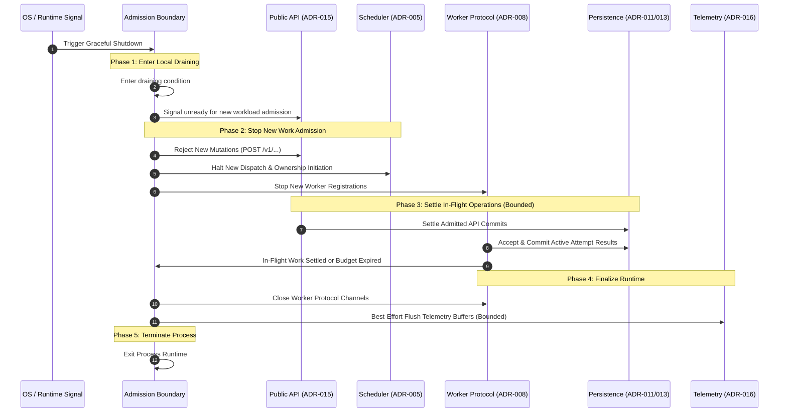

# ADR-017 — Graceful Shutdown Architecture

**Status**: Approved — Not Frozen  
**Criticality**: Supporting  

---

## 1. Purpose

This Architectural Decision Record (ADR) establishes the graceful shutdown architecture for the NexusFlow workflow orchestration engine, governing both control-plane orchestrator instances and distributed worker processes. It defines the operational lifecycle transitions, admission boundaries, in-flight operation settlement protocols, and timeout fallback mechanisms that allow instances to terminate cleanly during deployments, scaling events, and host maintenance.

Furthermore, this record formalizes the foundational invariant that **shutdown changes process admission, not workflow domain semantics**. It codifies the decoupling between ephemeral process states and durable workflow state machines, establishes that graceful shutdown is an optimization to reduce in-flight ambiguity rather than a correctness prerequisite, specifies the handling of active remote worker attempts, and ensures crash-safety across all termination phases, while deferring concrete operating system signal handling and web server mechanics to [ADR-020](00-architecture-decision-register.md), formal error taxonomies to [ADR-018](00-architecture-decision-register.md), numeric timeout thresholds to [ADR-023](00-architecture-decision-register.md), and multi-node high availability leadership handoffs to [ADR-025](00-architecture-decision-register.md).

---

## 2. Context

NexusFlow executes complex, multi-step directed acyclic graph (DAG) workflows defined by [ADR-001](adr-001-internal-workflow-specification.md) and [ADR-003](adr-003-canonical-workflow-graph-representation.md). Runtime progression is governed by formal state machines defined in [ADR-006](adr-006-workflow-execution-state-machine.md) (`WorkflowExecution`) and [ADR-007](adr-007-task-execution-lifecycle-and-attempt-model.md) (`TaskExecution` and `ExecutionAttempt`). Autonomous scheduler dispatch loops are established under [ADR-005](adr-005-workflow-task-scheduling-and-dispatch-architecture.md), while distributed worker coordination, liveness, and routing are governed by [ADR-008](adr-008-worker-coordination-and-liveness-model.md) and [ADR-009](adr-009-task-routing-strategy.md).

Authoritative orchestration durability is governed by [ADR-011](adr-011-state-persistence-strategy.md), which established normalized durable current state as authoritative orchestration truth. Crash recovery is governed by [ADR-012](adr-012-recovery-strategy.md) based on authoritative current state without event replay, and [ADR-013](adr-013-consistency-and-concurrency-strategy.md) established optimistic single-winner concurrency control using internal opaque concurrency revisions and short atomic persistence transactions. [ADR-014](adr-014-execution-history-and-audit-model.md) established the append-only transactional execution history and audit log. Public control-plane interaction and domain command semantics are governed by [ADR-015](adr-015-external-api-architecture.md), and operational telemetry is established in [ADR-016](adr-016-observability-architecture.md).

### The Shutdown Architectural Challenge
In a distributed orchestrator, control-plane instances and worker nodes terminate frequently due to host upgrades, application replacement, or operator stop signals. Systems that lack a disciplined shutdown architecture routinely fall into critical operational anti-patterns:
1. **Conflating Process Lifecycle with Domain Semantics**: Automatically marking running workflows as `FAILED` or `CANCELLED` when an orchestrator process stops, corrupting long-running business processes.
2. **Fabricating Artificial Task Failures**: Treating a control-plane restart as an execution failure, consuming task retry budgets, incrementing attempt ordinals, or abruptly revoking remote worker task authority.
3. **Unbounded Shutdown Blocking**: Attempting to wait for all asynchronous, multi-day workflows to complete before terminating, making operational deployments and restarts impossible.
4. **Fragile In-Memory Finalization**: Designing shutdown sequences that require complex in-memory state flushes or cleanup steps to preserve consistency, causing corruption if the process crashes mid-drain.
5. **Worker Liveness Misinterpretation**: Assuming that because an orchestrator is restarting and temporarily cannot receive heartbeats, all distributed workers have died, triggering unnecessary task recovery loops.

---

## 3. Problem Statement

How should a NexusFlow orchestrator instance and distributed worker processes terminate gracefully while:
1. Guaranteeing that process shutdown alters only local runtime admission and never corrupts or forces state-machine transitions on durable workflows, tasks, or attempts?
2. Ensuring that the engine remains strictly crash-safe at every micro-phase of shutdown, such that an abrupt termination or timeout expiration recovers deterministically via [ADR-012](adr-012-recovery-strategy.md) without relying on completed shutdown steps?
3. Permitting already-admitted authoritative state mutations and active worker attempt settlement callbacks a bounded opportunity to settle without permitting new task ownership commitments?
4. Ensuring that real-world deadlines, timeouts, and retry backoffs continue to elapse accurately across control-plane downtime without pausing or resetting timers?
5. Defining clear, decoupled worker process drain semantics using existing liveness concepts (`accepting_new_work=false`) without requiring artificial worker lifecycle states?

---

## 4. Requirements Covered

### 4.1 Functional Requirements
* **FR-SHT-001: Orchestrator Admission Drain**: The orchestrator must provide an operational shutdown sequence that ceases admitting new external mutations, stops scheduler dispatch loops, and prohibits new task attempt ownership commits while allowing in-flight work a bounded window to settle.
* **FR-SHT-002: In-Flight Operation Settlement**: The orchestrator must permit already-admitted external API transactions and active worker attempt callbacks (start observations, heartbeats, terminal completions) a bounded period to commit before transport channels close.
* **FR-SHT-003: Worker Process Graceful Drain**: Distributed worker processes must support graceful shutdown by advertising `accepting_new_work=false` while continuing to execute active attempts up to a bounded worker drain budget.
* **FR-SHT-004: Preservation of Domain Semantics**: Orchestrator or worker shutdown must not mark workflows or tasks as `FAILED`, `CANCELLED`, or `PAUSED`, must not consume task retry budgets, and must not increment attempt ordinals.
* **FR-SHT-005: Operational Health Signaling**: The orchestrator must integrate with operational health mechanisms ([ADR-016](adr-016-observability-architecture.md)) by signaling readiness unready immediately upon drain initiation while maintaining liveness until final runtime termination.

### 4.2 Non-Functional Requirements
* **NFR-SHT-001: Absolute Crash Safety**: Correctness of the orchestration engine must never depend on the successful completion of a graceful shutdown sequence; crash recovery ([ADR-012](adr-012-recovery-strategy.md)) must always be sufficient for safe resumption.
* **NFR-SHT-002: Bounded Termination Latency**: Shutdown must be bounded by configurable timeouts ([ADR-023](adr-023-configuration-strategy.md)), terminating forcefully if in-flight operations or telemetry flushes do not settle within the configured grace budget.
* **NFR-SHT-003: Ephemeral Shutdown State**: Process draining states must remain strictly in-memory and ephemeral, avoiding durable flags that could pollute new process incarnations upon boot.
* **NFR-SHT-004: Independent Lifecycle Boundaries**: Control-plane orchestrator lifecycles and worker process lifecycles must remain strictly independent; orchestrator shutdown does not imply worker fleet termination.
* **NFR-SHT-005: Technology Neutrality**: The shutdown architecture must remain independent of specific web frameworks, container runtimes, process supervisors, or OS signal mechanisms.

---

## 5. Constraints

1. **No Domain State Corruption**: Shutdown cannot alter `WorkflowExecution` states into `FAILED`, `CANCELLING`, or `CANCELLED`, and cannot introduce artificial states like `PAUSED`, `SUSPENDED`, or `DRAINED`.
2. **No Retry Budget Consumption**: Orchestrator or worker shutdown is an operational infrastructure event and must never consume task retry budgets or increment attempt ordinals.
3. **No New Attempt Ownership**: Once the orchestrator drain boundary is established, the engine must not commit new `TaskExecution` `RUNNABLE` $\to$ `RUNNING` transitions or create new `ExecutionAttempt` records.
4. **Deadlines Never Pause**: Execution-start deadlines, execution timeouts, and `RETRY_WAIT` backoff timers represent real-world elapsed time. They are never paused, reset, or extended due to orchestrator shutdown.
5. **No Durable History Clutter**: Process shutdown creates zero execution audit history entries in [ADR-014](adr-014-execution-history-and-audit-model.md). Operational events belong exclusively to best-effort telemetry ([ADR-016](adr-016-observability-architecture.md)).
6. **Delegated Boundaries**:
   * Startup crash reconciliation and recovery invariants are governed by **ADR-012** (Recovery Strategy).
   * Single-winner transaction commit semantics and unknown-commit reconciliation are governed by **ADR-013** (Consistency & Concurrency Strategy).
   * Public HTTP error envelopes and status mappings are governed by **ADR-015** (External API Architecture) and **ADR-018** (Error Handling Philosophy).
   * Concrete OS signal trapping, web server connection draining, and socket primitives are governed by **ADR-020** (Technology Selection Strategy).
   * Testing architecture and shutdown simulation suites are governed by **ADR-021** (Testing Strategy).
   * Numeric drain timeouts, flush intervals, and escalation thresholds are governed by **ADR-023** (Configuration Strategy).
   * Multi-node cluster leadership handoff and rolling upgrade coordination are governed by **ADR-025** (High Availability & Clustering).

---

## 6. Goals

* Establish a clear, technology-neutral shutdown architecture for orchestrator control planes and distributed worker processes.
* Define strict admission boundaries that stop new workload ingestion while allowing admitted operations a bounded opportunity to settle.
* Maintain complete crash safety across all shutdown phases, ensuring that forced termination or sudden power loss recovers cleanly without data corruption.
* Ensure active remote worker attempts continue executing without disruption during control-plane restarts.
* Specify worker drain semantics using `accepting_new_work=false` to complete active attempts cleanly without fabricating task cancellations.
* Integrate cleanly with operational readiness and liveness health probes under ADR-016.

---

## 7. Non-Goals

* **No Workflow-Draining Shutdown**: The engine will not wait for multi-step, asynchronous workflows to reach terminal states before shutting down.
* **No Automatic Cancellation of Workflows**: The engine will not issue broad cancellation commands to active workflows when stopping.
* **No Cancellation of Active Remote Attempts**: The control plane will not abort or cancel active worker attempts merely because the orchestrator is restarting.
* **No Durable Broker Drain Protocols in V1**: This record does not require or assume message broker queue flushing, consumer offset commits, or distributed broker drain protocols.
* **No Multi-Node Cluster Leadership Handoff in V1**: In V1 single-orchestrator operation, shutdown does not perform leader lease transfers or cluster epoch increments (deferred to ADR-025).
* **No Specific OS Signal Binding**: This record does not mandate specific POSIX signals (`SIGTERM`, `SIGINT`) or Windows process control events.
* **No Hardcoded Timeout Thresholds**: Specific drain budgets, flush timeouts, and escalation periods are not frozen here (deferred to ADR-023).

---

## 8. Candidate Solutions

### Candidate 1: Immediate Process Exit (Abrupt Terminate)
In this model, upon receiving a termination request, the process immediately halts execution loops, severs transport connections, and terminates without waiting for in-flight work.

*Tradeoffs*:
* *Advantages*: Simple implementation; zero shutdown delay.
* *Disadvantages*: Maximizes in-flight transaction ambiguity; severs HTTP requests mid-flight; aborts storage commits; forces every restart through crash recovery reconciliation.

### Candidate 2: Workflow-Draining Shutdown (Wait for Terminal)
In this model, upon receiving a termination request, the orchestrator stops accepting new workflows but refuses to terminate until every existing `WorkflowExecution` reaches a terminal state (`SUCCEEDED`, `FAILED`, `CANCELLED`).

*Tradeoffs*:
* *Advantages*: Zero in-flight workflow state across process restarts.
* *Disadvantages*: Unsuitable for long-running workflows spanning days or weeks; blocks software deployments and host maintenance indefinitely; conflates process lifetime with business process duration.

### Candidate 3: Cancel-All Shutdown
In this model, the orchestrator automatically issues cancellation commands to every active workflow execution before terminating.

*Tradeoffs*:
* *Advantages*: Rapidly brings workflows to terminal states before exit.
* *Disadvantages*: Severe violation of domain invariants; converts routine operational maintenance into business workflow failures; destroys user workflow progression.

### Candidate 4: Bounded Admission-Drain Shutdown with Durable Recovery (Chosen)
In this model, the orchestrator immediately disables admission for new external mutations and halts scheduler task dispatch. Already-admitted transactions and active worker attempt callbacks are granted a bounded grace window to settle. If in-flight operations settle or the shutdown budget expires, the process terminates. Any work left unsettled is cleanly resolved upon restart via [ADR-012](adr-012-recovery-strategy.md) crash recovery.

*Tradeoffs*:
* *Advantages*: Minimizes in-flight transaction ambiguity; bounds shutdown latency; fully preserves domain state machines and retry budgets; ensures crash safety across all phases.
* *Disadvantages*: May leave in-flight attempts running remotely during control-plane downtime, requiring startup reconciliation after reboot.

---

## 9. Detailed Evaluation

| Architectural Criteria | Candidate 1: Immediate Exit | Candidate 2: Workflow-Draining | Candidate 3: Cancel-All | Candidate 4: Bounded Admission-Drain (Chosen) |
| :--- | :--- | :--- | :--- | :--- |
| **Domain State Preservation** | **Acceptable**: State survives in storage, but increases ambiguity. | **Acceptable**: Preserves state, but hangs deployments. | **Fails**: Fabricates cancellations and destroys user workflows. | **Appropriate**: Preserves all domain semantics, timers, and retry budgets. |
| **Deployment & Restart Viability** | **High**: Exits instantly. | **Unsuitable**: Blocked indefinitely by long-running workflows. | **Moderate**: Fast, but causes widespread business failures. | **Bounded**: Bounded latency allows predictable deployments. |
| **In-Flight Ambiguity Reduction** | **Poor**: Aborts all in-flight requests and commits. | **High**: Zero in-flight work remains. | **Moderate**: Settles active tasks via forced cancellation. | **High**: Settles active commits and callbacks within grace budget. |
| **Crash Safety & Resilience** | **Passes**: Relies entirely on crash recovery. | **Passes**: But operationally unusable. | **Poor**: Conflates infrastructure faults with business logic. | **Strong**: Crash-safe at every phase; recovery guarantees correctness. |
| **Worker Independence** | **Moderate**: Severed connections force timeouts. | **Poor**: Holds worker fleet hostage to orchestrator. | **Fails**: Forces termination of valid worker jobs. | **Preserves Invariant**: Workers continue executing owned attempts independently. |

---

## 10. Decision

NexusFlow adopts **Candidate 4: Bounded Admission-Drain Shutdown with Durable Recovery** for control-plane orchestrator instances, and **Worker Drain through `accepting_new_work=false`** for distributed worker processes.

### 10.1 Core Decision Principles
1. **Shutdown Changes Process Admission, Not Workflow Semantics**: Process shutdown is an operational lifecycle event (conceptually progressing from normal serving through draining to termination). It must never mutate `WorkflowExecution` states into `FAILED` or `CANCELLED`, never pause workflows, never consume task retry budgets, and never modify attempt ordinals.
2. **Crash-Safety Invariant**: Graceful shutdown is an optimization to reduce in-flight transaction ambiguity. Correctness does not depend on graceful shutdown completion; durable persistence ([ADR-011](adr-011-state-persistence-strategy.md)), concurrency semantics ([ADR-013](adr-013-consistency-and-concurrency-strategy.md)), and crash recovery ([ADR-012](adr-012-recovery-strategy.md)) remain sufficient to restore correct orchestration.
3. **Strict Admission Boundaries**:
   * The orchestrator enters its local draining condition and ceases admitting new public mutations (`POST /v1/...`).
   * The scheduler halts dispatch loops and strictly prohibits initiating new `TaskExecution` `RUNNABLE` $\to$ `RUNNING` transitions or creating new `ExecutionAttempt` records.
4. **Bounded In-Flight Settlement**: Already-admitted transactions and active worker attempt callbacks (start observations, heartbeats, terminal results) receive a bounded opportunity to settle before transport channels close.
5. **Worker Independence & Remote Attempt Continuation**: Control-plane shutdown does not abort active remote worker attempts. Workers continue executing owned attempts; temporary callback delivery failures during orchestrator downtime do not fabricate task failures and are handled under [ADR-008](adr-008-worker-coordination-and-liveness-model.md) protocol semantics.
6. **Real-World Deadlines Never Pause**: Start deadlines, execution timeouts, and retry backoffs continue to elapse across orchestrator downtime. Overdue deadlines are reconciled authoritatively upon boot under [ADR-012](adr-012-recovery-strategy.md).
7. **Worker Graceful Drain via `accepting_new_work=false`**: A draining worker process advertises `accepting_new_work=false` via its heartbeat protocol ([ADR-008](adr-008-worker-coordination-and-liveness-model.md)), continues its active attempt within a bounded worker drain budget, submits the result if completed, and terminates. If the budget expires, it exits without fabricating attempt cancellation.
8. **Decoupled Health Signaling**: The instance ceases advertising itself as available for new normal workload admission (e.g., readiness probe unready), while liveness probes remain healthy until final process termination.
9. **Ephemeral Shutdown State**: Process draining states exist solely in memory and are never persisted as workflow state in storage.

---

## 11. Decision Rationale

### 11.1 Why Process Shutdown Cannot Alter Workflow State
Workflows in NexusFlow model critical business logic that may run for hours, days, or months. In modern containerized and host environments, host maintenance and application deployments occur routinely. If an orchestrator process stop caused active workflows to fail or cancel, no multi-day business process could ever complete. By decoupling ephemeral process lifecycles from durable workflow domain lifecycles, workflow durable state survives process downtime, and orchestration progression resumes or reconciles after restart.

### 11.2 Why Bounded Admission-Drain Outperforms Immediate Exit
While immediate exit is crash-safe under [ADR-012](adr-012-recovery-strategy.md), it creates substantial operational churn: client HTTP requests are severed mid-transaction, connections abort abruptly, and mutations that are already substantially progressed are left uncommitted, forcing them to be re-executed after restart. A bounded admission-drain window allows mutations that are already in flight an opportunity to settle cleanly, drastically reducing restart reconciliation overhead while bounding shutdown latency.

### 11.3 Why Active Worker Attempts Must Continue During Orchestrator Downtime
Workers execute tasks out-of-process, often on separate compute infrastructure. If an orchestrator shuts down for a brief rolling upgrade, revoking active worker attempts would waste computational work and consume task retry budgets. Because attempt ownership is committed in authoritative persistence ([ADR-011](adr-011-state-persistence-strategy.md), [ADR-013](adr-013-consistency-and-concurrency-strategy.md)), remote workers can safely continue executing their assigned tasks. When the orchestrator reboots, surviving workers with valid authority can reconnect and deliver their results cleanly.

### 11.4 Why Deadlines and Timers Must Not Pause
Execution timeouts and start deadlines protect the system from abandoned compute resources and hung tasks. Real-world wall-clock time does not pause when an orchestrator process restarts. Pausing or resetting timers across restarts would compromise the preservation of configured deadline semantics and cause unpredictable scheduling delays.

---

## 12. Tradeoffs

| Capability Gained | Architectural Cost / Invariant Accepted |
| :--- | :--- |
| **Deterministic Business Execution**: Workflows survive deployments and restarts without arbitrary cancellation or failure. | **Temporary Control-Plane Unavailability**: In V1 single-orchestrator deployments, external API clients experience temporary unavailability during the restart interval. |
| **Bounded Shutdown Latency**: Deployments and process stops complete predictably within configured grace budgets. | **Unsettled Operations at Deadline**: Operations that exceed the shutdown grace budget are severed, relying on post-restart recovery. |
| **Reduced In-Flight Ambiguity**: Settles admitted mutations and worker results where possible during Phase 3. | **Admission Boundary Enforcement**: The engine must enforce an admission boundary distinguishing admitted from non-admitted work. |
| **Autonomous Worker Execution**: Workers do not abort computational jobs during control-plane restarts. | **Possible Post-Restart Callback Burst**: Reconnected workers may deliver buffered results in a burst upon orchestrator reboot. |
| **Crash Safety**: Engine correctness is completely decoupled from shutdown completion. | **Recovery Must Handle Partial State**: Startup recovery ([ADR-012](adr-012-recovery-strategy.md)) must remain robust enough to reconcile state under all crash conditions. |

---

## 13. Consequences

### 13.1 Architectural Consequences
* **Admission Boundary Coordination**: The orchestrator must implement an internal admission boundary that transitions to local draining, blocking new mutations while tracking active in-flight operations.
* **Non-Blocking Scheduler Termination**: The scheduler dispatch loop must respect the admission boundary, stopping its loop without waiting for tasks to finish. No-op evaluations may be discarded immediately.
* **Worker Redelivery Capability**: Distributed workers must preserve the ADR-008 capability to retry and reconcile result delivery across temporary control-plane unavailability.
* **Readiness Decoupling**: External traffic-routing infrastructure, if present, may use readiness to stop routing new work while allowing in-flight sockets to drain. V1 operates correctly with or without external load balancers.

### 13.2 Orchestrator Shutdown Sequence Model

---

## 14. Failure Modes and Mitigation Matrix

The following matrix documents 50 distinct failure scenarios across orchestrator shutdown, worker shutdown, boundary races, and recovery resumption.

| # | Scenario | Authoritative Engine Behavior | Shutdown Behavior | State Machine Impact | Recovery / Post-Restart Behavior | Owning ADR |
| :--- | :--- | :--- | :--- | :--- | :--- | :--- |
| **1** | Shutdown signal while idle | Instance enters draining; unready for new work | Telemetry flushed; process terminates cleanly | Shutdown causes no domain transition | Boots into normal serving; recovery performs clean scan | ADR-017 / ADR-012 |
| **2** | Second shutdown signal during drain | Ignored or escalates to abrupt termination per config | Preserves idempotent drain state; exits cleanly | Shutdown causes no domain transition | Boots normally; recovers via standard recovery | ADR-017 / ADR-020 |
| **3** | Start execution request before drain boundary | Admitted into persistence transaction | Completes commit within bounded Phase 3 | Workflow created in INITIALIZING/RUNNING | Resumed normally by scheduler after boot | ADR-015 / ADR-017 |
| **4** | Start execution request after drain boundary | Request rejected at admission boundary | Returns transient unavailable/retryable error | No workflow created | Client retries against restarted instance | ADR-015 / ADR-017 |
| **5** | Definition registration during drain | Request rejected at admission boundary | Returns transient unavailable/retryable error | No definition registered | Client retries registration after restart | ADR-015 / ADR-017 |
| **6** | Cancel request during drain | Request rejected at admission boundary | Returns transient unavailable/retryable error | State unchanged | Client retries cancellation after restart | ADR-015 / ADR-017 |
| **7** | Read request during drain | Served if within early drain, else rejected | Read-only; does not modify state | Shutdown causes no domain transition | Gateways redirect traffic away if present | ADR-015 / ADR-017 |
| **8** | Scheduler evaluation running at drain start | Current evaluation pass stops cleanly | No new dispatch cycle started; loop exits | Shutdown causes no domain transition | Scheduler starts clean scan after boot | ADR-005 / ADR-017 |
| **9** | Ownership commit before drain boundary | Admitted commit executes in storage | If commits, task RUNNING and attempt CLAIMED | Authoritative ownership established | Attempt active; worker executes attempt | ADR-007 / ADR-013 / ADR-017 |
| **10** | Ownership commit racing drain boundary | Evaluated against admission boundary | Boundary rejects $\to$ aborted; Boundary permits $\to$ commits | Valid single-winner transition | If aborted, task stays RUNNABLE in storage | ADR-013 / ADR-017 |
| **11** | Routing candidate exists when drain starts | Ephemeral candidate dropped | No ownership committed; task remains RUNNABLE | Task stays RUNNABLE | Rediscovered by scheduler upon restart | ADR-009 / ADR-017 |
| **12** | RUNNABLE task with no ownership at shutdown | Task remains in durable storage | Untouched during shutdown | Remains RUNNABLE | Rediscovered and dispatched upon restart | ADR-005 / ADR-012 |
| **13** | RETRY_WAIT deadline passes during shutdown | Timer elapses in real time | Control plane offline; no action taken | Remains RETRY_WAIT | Recovery evaluates: if valid $\to$ RUNNABLE | ADR-007 / ADR-012 |
| **14** | CLAIMED Attempt active during shutdown | Start deadline elapses in real time | Attempt remains CLAIMED in storage | Remains CLAIMED | ADR-008/012 reconcile: if expired $\to$ FAILED | ADR-008 / ADR-012 |
| **15** | RUNNING Attempt active during shutdown | Worker continues execution remotely | Control plane does not abort attempt | Remains RUNNING | Surviving worker may deliver result under ADR-008 | ADR-007 / ADR-008 |
| **16** | Worker start callback during early drain | Admitted and processed | Attempt transitions CLAIMED $\to$ RUNNING | Transitions to RUNNING | Execution tracked normally | ADR-007 / ADR-017 |
| **17** | Worker result callback during early drain | Admitted and processed | Result committed; task transitions terminal | Transitions terminal | Downstream tasks evaluated after restart | ADR-007 / ADR-011 |
| **18** | Worker result callback after protocol closure | Callback fails transport delivery | Worker receives connection failure | Remains RUNNING in storage | Worker protocol retries result delivery | ADR-008 / ADR-017 |
| **19** | Cancellation ack during early drain | Admitted and processed | Attempt settles CANCELLED; drain progresses | Transitions CANCELLED | Recovery continues drain after boot | ADR-006 / ADR-007 |
| **20** | Worker heartbeat during early drain | Processed normally | Liveness observation recorded | Session observed live | Reflects active status during drain | ADR-008 / ADR-017 |
| **21** | Worker session live after orchestrator exit | Worker process continues executing | Control plane offline; registry discarded | Worker session survives | Reconciled after boot under ADR-008/012 | ADR-008 / ADR-012 |
| **22** | Active worker completes while server offline | Result held on worker | Worker retries connection per ADR-008 | Remains RUNNING in storage | Delivered when orchestrator reboots | ADR-008 / ADR-012 |
| **23** | Worker loses connection during shutdown | Worker handles disconnect | Worker retries connection to control plane | Remains RUNNING in storage | Reconnects or resolves via timeout/loss | ADR-008 / ADR-012 |
| **24** | Orchestrator restart after clean shutdown | Normal startup sequence | Recovery performs reconciliation scan | Durable state remains authoritative | Normal scheduling resumes cleanly | ADR-012 / ADR-017 |
| **25** | Orchestrator restart after forced shutdown | Normal startup sequence | Recovery reconciles uncommitted/stale state | Durable state remains authoritative | Normal scheduling resumes cleanly | ADR-012 / ADR-017 |
| **26** | Crash before readiness removed | Equivalent to abrupt crash | Process terminates immediately | Handled by ADR-012 | Startup recovery reconciles all state | ADR-012 / ADR-017 |
| **27** | Crash after readiness removed | Gateway stops routing traffic if present | Process terminates abruptly | Handled by ADR-012 | Startup recovery reconciles all state | ADR-012 / ADR-017 |
| **28** | Crash after scheduler stopped | No new tasks claimed | Process terminates abruptly | Handled by ADR-012 | Existing state reconciled cleanly | ADR-012 / ADR-017 |
| **29** | Crash during state commit | Transaction atomicity protects storage | Storage rolls back or commits fully | Transaction boundary preserves consistency | Deterministic state in storage | ADR-011 / ADR-013 |
| **30** | Crash after commit before response | Operation committed in storage | Client observes connection drop | Resource exists | Client retries with Idempotency-Key | ADR-013 / ADR-015 |
| **31** | Crash during telemetry flush | Telemetry dropped | Process exits immediately | No domain state impact | Telemetry is non-authoritative; state safe | ADR-016 / ADR-017 |
| **32** | Persistence unavailable during drain | Commit fails or outcome unknown | Bounded drain aborts mutations; exits | Storage failure handled by ADR-013 | Recovery resumes when persistence returns | ADR-011 / ADR-012 |
| **33** | History commit failure during drain | Transaction rolled back | Mutation does not commit independently | Preserves audit integrity | No partial writes; audit consistent | ADR-014 / ADR-017 |
| **34** | Telemetry sink failure during drain | Telemetry flush fails or hangs | Flusher times out per ADR-023; exits | No domain state impact | Telemetry shed; process exits cleanly | ADR-016 / ADR-017 |
| **35** | Drain budget expires with API mutation in-flight | Mutation may commit, abort, or remain unknown | Process terminates forcefully | Resolved under ADR-013 | Client retries request after restart | ADR-015 / ADR-017 |
| **36** | Drain budget expires with callback in-flight | Callback may commit or remain unknown | Process terminates forcefully | Resolved under ADR-013 | Reconciled after restart under ADR-012 | ADR-008 / ADR-012 |
| **37** | Drain budget expires with active remote attempts | Remote attempts left running | Process exits without aborting attempts | Remains RUNNING | Reconciled after restart via ADR-012 | ADR-007 / ADR-012 |
| **38** | INITIALIZING workflow at shutdown | Initialization may commit or remain in-flight | Remains INITIALIZING or progresses | Incomplete init reconciled | Startup recovery completes initialization | ADR-006 / ADR-012 |
| **39** | RUNNING workflow at shutdown | Active attempts continue on workers | Remains RUNNING in storage | Remains RUNNING | Scheduler resumes dispatch upon restart | ADR-006 / ADR-012 |
| **40** | FAILING workflow at shutdown | Bounded drain settles active callbacks | Remains FAILING in storage | Remains FAILING | Recovery resumes failure drain on boot | ADR-006 / ADR-012 |
| **41** | CANCELLING workflow at shutdown | Bounded drain settles active callbacks | Remains CANCELLING in storage | Remains CANCELLING | Recovery resumes cancel drain on boot | ADR-006 / ADR-012 |
| **42** | Terminal workflow at shutdown | Completed; output committed | Untouched | Terminal | Preserved in storage | ADR-006 / ADR-011 |
| **43** | Worker receives shutdown with no attempts | Sets accepting_new_work=false | Heartbeat sent; worker terminates cleanly | No domain state impact | Session unregistered; clean exit | ADR-008 / ADR-017 |
| **44** | Worker shutdown with active attempt | Sets accepting_new_work=false | Continues executing attempt up to budget | Attempt runs normally | Submits result if finishes in budget | ADR-008 / ADR-017 |
| **45** | Worker drain deadline expires | Worker terminates process | Local attempt execution stops | Attempt remains unsettled | ADR-008/012 reconcile: if loss wins $\to$ FAILED | ADR-008 / ADR-012 |
| **46** | Worker finishes attempt during drain | Submits result callback | Control plane commits SUCCEEDED/FAILED | Transitions terminal | Clean settlement before worker exits | ADR-007 / ADR-017 |
| **47** | Worker result submission fails on drain | Result delivery errors or unknown | Worker exits on timeout | ADR-008/013 govern settlement | Resolved via retry, loss, or timeout | ADR-008 / ADR-012 |
| **48** | Worker restarts after graceful shutdown | Registers with new WorkerSessionId | Clean new session | Does not inherit attempt | Previous attempt resolved by recovery | ADR-008 / ADR-012 |
| **49** | Old WorkerSession result arrives after restart | Rejected as stale session under ADR-008 | Result discarded; anomaly logged | Concurrency fencing protects state | Concurrency fencing protects state | ADR-008 / ADR-013 |
| **50** | Idempotent API retry after shutdown disconnect | Request re-issued with same token | Server resolves committed outcome | Original result returned | Prevents duplicate workflow execution | ADR-013 / ADR-015 |

---

## 15. Debugging Considerations

The graceful shutdown subsystem provides diagnostic visibility without introducing state-machine corruption:
1. **Observable Shutdown Milestones**: The orchestrator emits structured logs ([ADR-016](adr-016-observability-architecture.md)) across conceptual shutdown milestones where emission is possible:
   * Drain initiation: Emitted with process incarnation ID and configured drain timeout.
   * Admission disabled: Emitted when public mutation and scheduler dispatch gates close.
   * In-flight drain started: Emitted with counts of active in-flight API transactions and active worker attempt sessions.
   * Telemetry flush completed: Emitted with flush durations and any dropped event counts.
   * Termination milestone: Emitted prior to final runtime exit.
2. **Worker Drain Visibility**: Draining workers emit heartbeat logs and metrics showing `accepting_new_work=false` and active attempt execution status, allowing operators to track worker fleet drains during maintenance.
3. **Diagnosing Shutdown Timeout Expirations**: When an orchestrator or worker exceeds its shutdown budget and exits forcefully, logs identify which specific operations or worker sessions were still active, guiding configuration tuning under [ADR-023](adr-023-configuration-strategy.md).

---

## 16. Testing Considerations

*All testing criteria detailed below represent planned verification requirements, not claims of existing implementation.*

1. **Orchestrator Admission Boundary Verification**:
   * Verify that initiating graceful shutdown immediately signals unready for new workload admission while maintaining liveness.
   * Verify that new `POST /v1/...` mutation requests arriving after drain initiation are rejected with transient retryable error envelopes.
   * Verify that already-admitted `POST /v1/...` requests commit successfully and return valid responses within Phase 3.
2. **Scheduler & Ownership Boundary Verification**:
   * Verify that active scheduler loops halt upon entering Phase 2, with zero new `RUNNABLE` $\to$ `RUNNING` transitions committed.
   * Verify that in-flight ownership commit races resolve cleanly under ADR-013 single-winner rules without corrupting task state.
   * Verify that un-dispatched `RUNNABLE` tasks remain untouched in storage and are eligible for rediscovery upon restart.
3. **Worker Continuation & Callback Verification**:
   * Verify that remote workers holding active attempts continue execution without receiving synthetic abort commands when the orchestrator shuts down.
   * Verify that worker callbacks arriving during Phase 3 commit successfully to persistence.
   * Verify that worker callbacks arriving after Phase 4 experience transport retry loops and deliver cleanly once the orchestrator reboots.
4. **Deadline & Timer Continuity Suite**:
   * Verify that start deadlines, execution timeouts, and `RETRY_WAIT` timers continue elapsing across simulated orchestrator downtime.
   * Verify that overdue deadlines are detected and transitioned by startup recovery upon reboot under first-valid-winner semantics.
5. **Crash-at-Every-Phase Resilience Suite**:
   * Verify that forcefully killing the process at Phase 1, Phase 2, Phase 3, Phase 4, and Phase 5 leaves durable persistence in a consistent state reconcilable by ADR-012.
6. **Worker Graceful Drain Suite**:
   * Verify that a worker receiving a shutdown signal advertises `accepting_new_work=false` via heartbeat.
   * Verify that a draining worker with an active attempt finishes execution, submits the result, and exits cleanly.
   * Verify that a draining worker whose attempt exceeds the drain budget terminates forcefully without marking the attempt cancelled locally.

---

## 17. Operational Considerations

1. **Bounded Deployment Windows**: Graceful shutdown allows deployments in container environments without causing client request drops or corrupted state machines. External traffic-routing infrastructure, if present, can route traffic away from draining instances, while the bounded drain budget ensures deployments proceed predictably.
2. **Temporary V1 Control-Plane Downtime**: In single-instance V1 deployments, orchestrator restarts create a temporary control-plane outage. Upstream API clients experience transient unavailability (e.g., connection reset or retryable 503), but existing remote worker tasks execute uninterrupted.
3. **Forced Termination Fallbacks**: If deadlocks, network hangs, or third-party SDKs stall Phase 3 or Phase 4, the hard shutdown budget terminates the process runtime. Relying on crash recovery ([ADR-012](adr-012-recovery-strategy.md)) eliminates hung deployments.
4. **Telemetry Loss Acceptance**: Telemetry flush attempts are strictly best-effort. If remote log or trace aggregators partition, the orchestrator terminates anyway, prioritizing process termination over diagnostic completeness.

---

## 18. Maintenance Considerations

1. **Preserving Crash-Safety Invariants**: Future code additions must never introduce shutdown logic that assumes in-memory finalization is guaranteed to complete. Every state transition must remain crash-safe.
2. **Admission Boundary Discipline**: Any new public mutation endpoint or internal scheduler dispatch loop must register with the admission boundary to ensure it halts cleanly upon drain initiation.
3. **Decoupled Worker Protocol Evolution**: As worker protocols evolve under ADR-008, worker drain semantics must continue to rely on capability advertisements (`accepting_new_work=false`) rather than bespoke shutdown protocols.

---

## 19. Future Evolution

The following capabilities are explicitly deferred from V1 but accommodated by this architecture:
1. **Multi-Node Cluster Leadership Handoff**: Transitioning active orchestrator leadership to another standby node during graceful shutdown under [ADR-025](00-architecture-decision-register.md).
2. **Dedicated Worker Drain APIs**: Adding explicit operator endpoints to command specific worker nodes to enter drain mode remotely.
3. **Pre-Stop Admission Hooks**: Supporting external orchestration lifecycle hooks to coordinate network draining before internal process draining begins.
4. **Selective Command Admission**: Allowing authenticated operator emergency commands (e.g., high-priority cancellations) during early drain phases.

---

## 20. Rejected Alternatives

1. **Rejected: Immediate Process Exit as Default**:
   * *Reason*: While crash-safe, abruptly killing processes severs active client connections, rolls back substantially progressed transactions, and causes unnecessary worker result delivery retries.
2. **Rejected: Workflow-Draining Shutdown (Wait for Terminal)**:
   * *Reason*: Multi-step workflows can run for days. Waiting for all workflows to finish blocks deployments and host recycling indefinitely.
3. **Rejected: Cancel-All Workflows on Shutdown**:
   * *Reason*: Infrastructure restarts must never alter business domain semantics. Cancelling user workflows during routine maintenance destroys workflow integrity.
4. **Rejected: Persisting Process `DRAINING` State into Workflow Storage**:
   * *Reason*: Draining is an ephemeral runtime condition of a single process instance. Persisting it into database tables causes stale flags and split-brain confusion when new process incarnations boot.
5. **Rejected: Cancelling Active Remote Worker Attempts**:
   * *Reason*: Active attempts represent expensive, valid compute jobs. Cancelling them during a brief orchestrator restart wastes compute and consumes task retry budgets.
6. **Rejected: Pausing Real-World Timers During Shutdown**:
   * *Reason*: Execution timeouts protect against hung tasks. Pausing timers across restarts violates configured deadline semantics and causes unpredictable scheduling delays.
7. **Rejected: Requiring Worker Fleet Shutdown Alongside Orchestrator**:
   * *Reason*: Orchestrators and workers are decoupled distributed processes. Coupling their lifecycles prevents independent scaling and zero-downtime rolling upgrades.
8. **Rejected: Requiring Completed Shutdown for Correctness**:
   * *Reason*: In distributed systems, power loss, OOM kills, and hardware failures occur without warning. Any architecture requiring a clean shutdown to prevent corruption is fundamentally flawed.

---

## 21. Decision Evolution

The decision can be understood as an evolution across architectural alternatives:
1. **Immediate Exit Evaluation**: While immediate exit is crash-safe, it creates unnecessary operational ambiguity by aborting substantially progressed in-flight transactions.
2. **Rejection of Workflow-Draining and Cancel-All**: Waiting for all workflows to terminate conflates ephemeral process lifetimes with durable domain lifetimes, while cancelling workflows directly violates user business semantics.
3. **Adoption of Bounded Admission-Drain**: Bounded admission-drain was chosen because it cleanly reduces in-flight transaction ambiguity without altering domain state machines or blocking deployments.
4. **Worker Drain via Existing Protocol**: Existing ADR-008 worker liveness capabilities (`accepting_new_work=false`) were selected to provide clean worker drain without inventing artificial worker lifecycle states.
5. **Decoupling Correctness from Shutdown**: The architecture formalized that graceful shutdown is an operational optimization, ensuring that crash recovery ([ADR-012](adr-012-recovery-strategy.md)) and concurrency controls ([ADR-013](adr-013-consistency-and-concurrency-strategy.md)) remain sufficient for safety if the process stops at any instant.

---

## 22. Common Misconceptions

1. **Misconception: "Graceful shutdown cancels running workflows."**
   * *Correction*: Shutdown is an infrastructure lifecycle event. It never cancels, fails, or pauses running workflows.
2. **Misconception: "The orchestrator must wait for all workflows to finish before shutting down."**
   * *Correction*: The orchestrator waits only for in-flight storage commits and active attempt callbacks within its bounded budget; workflows persist in storage across restarts.
3. **Misconception: "Active worker attempts are aborted when the orchestrator terminates."**
   * *Correction*: Workers continue running their owned attempts remotely. Result callbacks are retried until the orchestrator reboots.
4. **Misconception: "Execution deadlines and timers pause while the orchestrator is offline."**
   * *Correction*: Deadlines represent real-world elapsed time. They continue elapsing across restarts; overdue timeouts are reconciled upon boot.
5. **Misconception: "Worker absence during orchestrator downtime triggers immediate worker loss."**
   * *Correction*: The orchestrator cannot detect missed heartbeats while offline. Upon restart, bounded recovery reconciliation ([ADR-008](adr-008-worker-coordination-and-liveness-model.md), [ADR-012](adr-012-recovery-strategy.md)) allows surviving workers to reconnect.
6. **Misconception: "Durable audit history must be flushed during shutdown."**
   * *Correction*: Required execution history ([ADR-014](adr-014-execution-history-and-audit-model.md)) commits atomically with state mutations. Only best-effort operational telemetry ([ADR-016](adr-016-observability-architecture.md)) undergoes an asynchronous buffer flush.
7. **Misconception: "A worker process stop marks its active attempt as cancelled."**
   * *Correction*: The worker exits without altering attempt state. The orchestrator authoritatively resolves the attempt via liveness detection and timeout enforcement under ADR-008.

---

## 23. Open Questions

None at the ADR-017 architectural level. Concrete operating system signal trapping, socket primitives, and web server drain hooks are delegated to ADR-020; error classifications and status envelopes are delegated to ADR-015 and ADR-018; numeric drain budgets and telemetry flush timeouts are delegated to ADR-023; and multi-node cluster leadership handoffs are delegated to ADR-025.

---

## 24. Interview Discussion (SDE-2 Architecture Defense)

### Q1: Why must orchestrator shutdown never automatically cancel running workflows?
> **Answer**: "Workflows in NexusFlow represent durable, multi-step business logic that may run for days or weeks. In modern environments, processes restart frequently due to host migration, deployments, or scaling. If an orchestrator process stop caused workflows to cancel or fail, routine infrastructure maintenance would destroy active business operations. By maintaining normalized durable state in persistence ([ADR-011](adr-011-state-persistence-strategy.md)), workflow durable state survives process downtime, and orchestration progression resumes or reconciles after restart via startup recovery ([ADR-012](adr-012-recovery-strategy.md))."

### Q2: How does the orchestrator prevent new tasks from being scheduled during shutdown without cancelling active ones?
> **Answer**: "We implement an admission boundary. Upon entering local draining, the orchestrator halts scheduler dispatch loops and rejects new API mutations. No new `TaskExecution` `RUNNABLE` $\to$ `RUNNING` transitions or `CLAIMED` attempts are permitted to commit. However, the worker communication protocol remains open during Phase 3 to accept start observations, heartbeats, and terminal results for attempts that were *already claimed* before the drain boundary. This allows active work an opportunity to settle cleanly without admitting new work."

### Q3: What happens if the orchestrator's graceful shutdown budget expires before in-flight operations finish?
> **Answer**: "The process terminates forcefully. Graceful shutdown is an optimization to minimize in-flight ambiguity; it is never a correctness prerequisite. If an external telemetry sink or storage commit stalls and exhausts the configured shutdown budget ([ADR-023](adr-023-configuration-strategy.md)), the runtime terminates. When the orchestrator reboots, [ADR-012](adr-012-recovery-strategy.md) startup recovery executes, scanning authoritative durable persistence, reconciling uncommitted state, and resuming scheduling exactly as if an abrupt crash had occurred."

### Q4: How do distributed workers behave during an orchestrator shutdown? Do they fail their tasks?
> **Answer**: "No. Worker task execution is decoupled from orchestrator availability. An attempt owned by a worker session remains authoritative in persistent storage. While the orchestrator is restarting, the worker continues executing its assigned task. If the worker finishes while the orchestrator is offline, ADR-008 result-delivery and reconciliation semantics handle temporary control-plane unavailability; a surviving worker may retry delivery, while restart reconciliation protects authoritative state."

### Q5: How does a worker process shut down gracefully without corrupting state?
> **Answer**: "When a worker receives a shutdown signal, it advertises `accepting_new_work=false` via its heartbeat protocol, prompting the orchestrator task router to stop offering it new tasks. If the worker has an active attempt, it continues executing up to its configured worker drain budget, maintaining heartbeats. If the attempt completes within the budget, it delivers the result and terminates cleanly. If the budget expires, the worker exits forcefully without fabricating an attempt cancellation. Later, ADR-008 and ADR-012 reconcile the session and attempt; if worker-loss determination is the authoritative winner, the attempt normally settles `FAILED` with worker-loss cause."

---

## 25. References

1. **POSIX.1-2017**: *Standard for Information Technology — Portable Operating System Interface (POSIX)* (Non-normative background reference for process lifecycle management).
2. **Kubernetes Container Lifecycle Hooks**: *PreStop Hooks and Termination Grace Periods* (Non-normative background operational pattern reference).
3. **NexusFlow Architecture Decisions**:
   * [ADR-001: Internal Workflow Specification](adr-001-internal-workflow-specification.md)
   * [ADR-003: Canonical Workflow Graph Representation](adr-003-canonical-workflow-graph-representation.md)
   * [ADR-005: Workflow Task Scheduling & Dispatch Architecture](adr-005-workflow-task-scheduling-and-dispatch-architecture.md)
   * [ADR-006: Workflow Execution State Machine](adr-006-workflow-execution-state-machine.md)
   * [ADR-007: Task Execution Lifecycle & Attempt Model](adr-007-task-execution-lifecycle-and-attempt-model.md)
   * [ADR-008: Worker Coordination & Liveness Model](adr-008-worker-coordination-and-liveness-model.md)
   * [ADR-009: Task Routing Strategy](adr-009-task-routing-strategy.md)
   * [ADR-010: Workflow Data Flow & Parameter Passing](adr-010-workflow-data-flow-and-parameter-passing.md)
   * [ADR-011: State Persistence Strategy](adr-011-state-persistence-strategy.md)
   * [ADR-012: Recovery Strategy](adr-012-recovery-strategy.md)
   * [ADR-013: Consistency & Concurrency Strategy](adr-013-consistency-and-concurrency-strategy.md)
   * [ADR-014: Execution History & Audit Model](adr-014-execution-history-and-audit-model.md)
   * [ADR-015: External API Architecture](adr-015-external-api-architecture.md)
   * [ADR-016: Observability Architecture](adr-016-observability-architecture.md)
   * [ADR-018: Error Handling Philosophy](00-architecture-decision-register.md) *(Companion / Deferred)*
   * [ADR-020: Technology Selection Strategy](00-architecture-decision-register.md) *(Companion / Deferred)*
   * [ADR-021: Testing Strategy](00-architecture-decision-register.md) *(Companion / Deferred)*
   * [ADR-023: Configuration Strategy](00-architecture-decision-register.md) *(Companion / Deferred)*
   * [ADR-025: High Availability & Clustering](00-architecture-decision-register.md) *(Future / Deferred)*

---

## 26. Traceability

### 26.1 Requirement to Decision Mapping

| Requirement ID | Requirement Description | ADR-017 Architecture Section |
| :--- | :--- | :--- |
| **FR-SHT-001** | Orchestrator Admission Drain | Section 10.1 (Items 1, 3), Section 13.2 |
| **FR-SHT-002** | In-Flight Operation Settlement | Section 10.1 (Item 4), Section 13.2 |
| **FR-SHT-003** | Worker Process Graceful Drain | Section 10.1 (Item 7), Section 11.5 |
| **FR-SHT-004** | Preservation of Domain Semantics | Section 10.1 (Items 1, 6), Section 11.1 |
| **FR-SHT-005** | Operational Health Signaling | Section 10.1 (Item 8), Section 15 |
| **NFR-SHT-001**| Absolute Crash Safety | Section 10.1 (Item 2), Section 11.2 |
| **NFR-SHT-002**| Bounded Termination Latency | Section 10.1 (Item 4), Section 17 |
| **NFR-SHT-003**| Ephemeral Shutdown State | Section 10.1 (Item 9), Section 11.1 |
| **NFR-SHT-004**| Independent Lifecycle Boundaries | Section 10.1 (Item 5), Section 11.3 |
| **NFR-SHT-005**| Technology Neutrality | Section 1, Section 5 (Item 6), Section 20 |

---

## 27. Decision Validation Checklist

| # | Validation Item | Status | Verification Detail |
| :--- | :--- | :--- | :--- |
| **1** | Is the problem statement decoupled from specific database/broker technologies? | **Passed** | Decoupled; no web frameworks, brokers, or OS signals mandated. |
| **2** | Are the functional requirements (FRs) and non-functional requirements (NFRs) traced? | **Passed** | Mapped in Section 4 and explicitly verified in Section 26. |
| **3** | Were at least two realistic candidate designs critically evaluated? | **Passed** | Evaluated Immediate Exit, Workflow-Draining, Cancel-All, and Bounded Admission-Drain. |
| **4** | Are the tradeoffs clear (what are we giving up for simplicity or correctness)? | **Passed** | Detailed in Section 12; covers transient unavailability vs. workflow preservation. |
| **5** | Does the design preserve all mapped system invariants? | **Passed** | Preserves state machines (ADR-006/007), worker liveness (ADR-008), persistence (ADR-011), recovery (ADR-012), and audit history (ADR-014). |
| **6** | Does this decision avoid introducing tight coupling between modules? | **Passed** | Orchestrator and worker lifecycles are independent; telemetry is non-blocking. |
| **7** | Are the potential failure modes mapped? | **Passed** | Comprehensive 50-row failure mode matrix documented in Section 14. |
| **8** | Is there a clear explanation of how this design behaves during shutdown / restart? | **Passed** | Fully detailed across Section 10, Section 13, and Section 14. |
| **9** | Are the debugging strategies defined? | **Passed** | Detailed in Section 15 covering shutdown milestones and timeout diagnosis. |
| **10** | Does the testing strategy explain how to simulate failures and recovery? | **Passed** | Six comprehensive planned verification suites detailed in Section 16. |
| **11** | Are performance limits and resource footprints qualitatively identified? | **Passed** | Addressed in Section 17 with bounded budgets and admission limits. |
| **12** | Is the future evolution path explained? | **Passed** | Upgrades (cluster handoff, pre-stop hooks, drain APIs) documented in Section 19. |
| **13** | Can this decision be defended during an SDE-2 engineering review? | **Passed** | Defended with rigorous Q&A in Section 24. |
