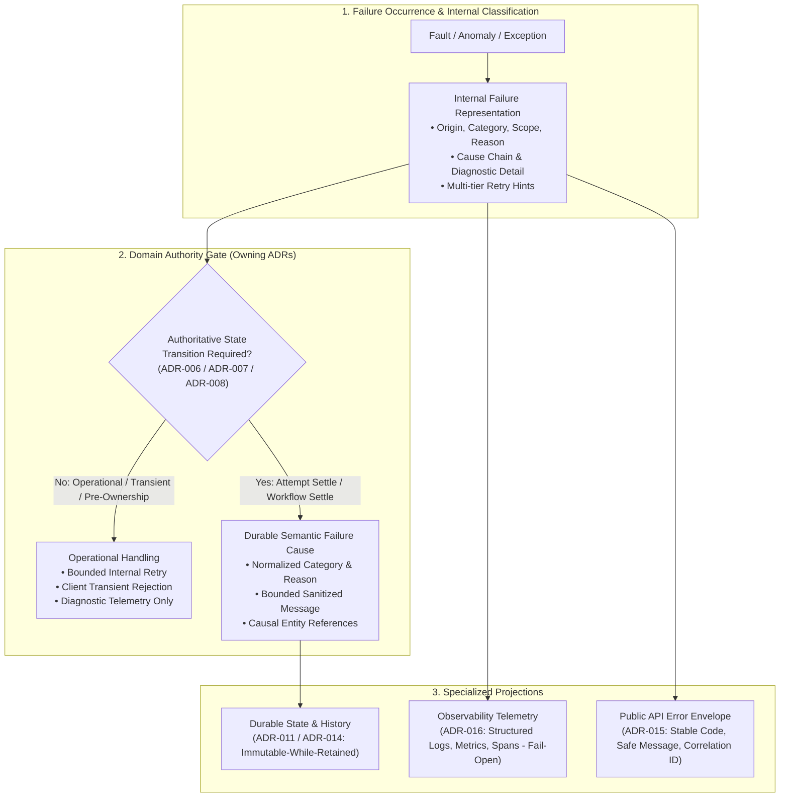

# ADR-018 — Error Handling Philosophy

**Status**: Approved — Not Frozen  
**Criticality**: Core  

---

## 1. Purpose

This Architectural Decision Record (ADR) establishes the error handling philosophy, failure taxonomy, multidimensional classification model, and projection rules for the NexusFlow workflow orchestration engine. It formalizes how failures are classified and processed across authoring, semantic validation, client API interactions, scheduling, task routing, worker coordination, execution attempts, task lifecycle retries, persistence commits, concurrency contention, recovery passes, telemetry emission, and graceful shutdown.

The central architectural invariant established by this record is:

> **A failure condition is NOT automatically a lifecycle state transition.**  
> **An error or failure cause is diagnostic and causal metadata describing why an operation or state transition failed; it must NEVER invent, replace, or masquerade as a domain lifecycle state.**

This document enforces a strict separation between causal failure conditions and domain lifecycle states, isolates business task failures from infrastructure and operational faults, decouples retryability across distinct architectural tiers, and defines specialized failure projections for internal runtime handling, durable history/state, public API clients, and operational telemetry. Concrete language exception hierarchies, framework middleware, and driver mappings are deferred to [ADR-020](00-architecture-decision-register.md); service module boundaries to [ADR-019](00-architecture-decision-register.md); security redaction to [ADR-022](00-architecture-decision-register.md); and numeric retry/timeout configurations to [ADR-023](00-architecture-decision-register.md).

---

## 2. Context

Distributed workflow orchestration engines operate across inherently heterogeneous, asynchronous, and failure-prone operational boundaries. In NexusFlow, an orchestration workflow passes through multiple distinct subsystems:
1. **Client & API Boundaries**: External clients submit workflow definitions and lifecycle commands over HTTP ([ADR-015](adr-015-external-api-architecture.md)). Requests may be syntactically malformed, violate schema constraints ([ADR-002](adr-002-workflow-definition-parsing-and-normalization.md)), breach semantic DAG invariants ([ADR-004](adr-004-workflow-semantic-validation-rules.md)), or conflict with existing resource states.
2. **Scheduling & Routing Boundaries**: The scheduler evaluates task dependencies ([ADR-005](adr-005-workflow-task-scheduling-and-dispatch-architecture.md)) and routes runnable tasks to eligible workers ([ADR-009](adr-009-task-routing-strategy.md)). Workers may reject dispatches, experience transport dropouts, or be unavailable.
3. **Execution & Coordination Boundaries**: Active worker sessions execute user task logic ([ADR-008](adr-008-worker-coordination-and-liveness-model.md)). Tasks may exit with non-zero codes, panic, exceed start deadlines, or exceed task execution timeouts ([ADR-007](adr-007-task-execution-lifecycle-and-attempt-model.md)). Workers may crash or lose network connectivity mid-attempt.
4. **Persistence & Concurrency Boundaries**: Orchestrators commit state changes and execution history atomically to durable storage ([ADR-011](adr-011-state-persistence-strategy.md), [ADR-014](adr-014-execution-history-and-audit-model.md)). Concurrent processes encounter optimistic concurrency control (OCC) version collisions or ambiguous commit acknowledgments ([ADR-013](adr-013-consistency-and-concurrency-strategy.md)). Storage may suffer temporary outages.
5. **Operational Lifecycle Boundaries**: Orchestrators undergo graceful shutdown and admission drain ([ADR-017](adr-017-graceful-shutdown-architecture.md)), recovery reconcilers inspect cold checkpoints ([ADR-012](adr-012-fault-recovery-and-state-reconstruction.md)), and diagnostic telemetry exporters encounter backpressure ([ADR-016](adr-016-observability-architecture.md)).

Without a unified, disciplined error handling philosophy, distributed engines degrade into common architectural failure patterns: conflating operational exceptions with domain lifecycle states (e.g., adding `ERROR` or `TIMED_OUT` states to state machines), consuming user task retry budgets on infrastructure network glitches, exposing internal database driver exceptions or sensitive filesystem paths to public API clients, and overloading single boolean `retryable` flags across incompatible operational contexts. NexusFlow requires an explicit, structured architecture to classify, contain, and project failures deterministically.

---

## 3. Problem Statement

How should NexusFlow classify, contain, and project errors and failures across all operational boundaries while ensuring that:
1. Failure conditions do not proliferate or distort the authoritative lifecycle state machines of `WorkflowExecution` ([ADR-006](adr-006-workflow-execution-state-machine.md)), `TaskExecution` and `ExecutionAttempt` ([ADR-007](adr-007-task-execution-lifecycle-and-attempt-model.md)), or `WorkerSession` ([ADR-008](adr-008-worker-coordination-and-liveness-model.md))?
2. Infrastructure faults (such as database disconnects, scheduler OCC contention, or orchestrator restarts) are strictly prevented from fabricating business task failures or prematurely exhausting task retry budgets?
3. Faults occurring prior to authoritative worker ownership commit do not create attempt records or consume retry budgets?
4. Retryability is decoupled across distinct architectural tiers (client request retry, internal operational retry, task lifecycle retry) rather than collapsed into an ambiguous global flag?
5. Public API clients receive sanitized, stable, machine-readable error contracts without leaking internal runtime types, driver exceptions, or secrets?
6. Durable history captures bounded, normalized semantic causes without bloating storage with ephemeral, unbounded stack traces?
7. Authoritative state persistence fails closed on ambiguity while operational observability fails open?

---

## 4. Requirements Covered

### 4.1. Functional Requirements
* **FR-ERR-001 (Multidimensional Failure Classification)**: The engine must classify every failure along orthogonal dimensions: Origin, Category, Semantic Scope, Machine-Readable Reason, Retryability, Exposure Policy, and Durability Policy.
* **FR-ERR-002 (Error Metadata Independence)**: Error details must be captured as causal metadata attached to operations or transitions, never as auxiliary lifecycle states.
* **FR-ERR-003 (Pre-Ownership Failure Isolation)**: Routing rejections, candidate negotiation dropouts, and transport disconnections occurring prior to authoritative attempt ownership commit must leave tasks in `RUNNABLE` and consume zero retry budget.
* **FR-ERR-004 (Business vs. System Isolation)**: The engine must distinguish domain task execution failures from infrastructure/operational faults, ensuring infrastructure faults never directly trigger task retry exhaustion.
* **FR-ERR-005 (Decoupled Retry Tiers)**: The architecture must independently model: (1) Client Retry Safety, (2) Internal Operational Retryability, and (3) Task Lifecycle Retry Eligibility.
* **FR-ERR-006 (Standardized Public Projection)**: Public API errors must project a stable machine-readable code, safe human-readable message, correlation identifier, and client-specific retry guidance conforming to [ADR-015](adr-015-external-api-architecture.md).
* **FR-ERR-007 (Bounded Durable Causality)**: Failure metadata persisted in current state ([ADR-011](adr-011-state-persistence-strategy.md)) and execution history ([ADR-014](adr-014-execution-history-and-audit-model.md)) must be normalized, bounded in length, and sanitized of raw stack traces and credentials.
* **FR-ERR-008 (Authoritative Reconciliation for Unknown Commits)**: Operations resulting in ambiguous persistence commit outcomes must perform an authoritative reread of durable state before retrying or failing closed per [ADR-013](adr-013-consistency-and-concurrency-strategy.md).

### 4.2. Non-Functional Requirements
* **NFR-ERR-001 (Auditability & Explainability)**: Workflow and task terminal failure causes must remain permanently explainable in durable history without requiring retention of gigabytes of ephemeral diagnostic logs.
* **NFR-ERR-002 (Information Security & Redaction)**: Public API responses and durable audit logs must strictly redact credentials, internal IP addresses, database connection strings, and language exception class hierarchies per [ADR-022](00-architecture-decision-register.md).
* **NFR-ERR-003 (Technology Independence)**: The error handling philosophy and durable failure taxonomy must not be coupled to any specific programming language runtime exception model, database driver, or serialization protocol.
* **NFR-ERR-004 (Fail-Closed Authoritative Integrity)**: Ambiguities in state persistence, concurrency validation, or security authorization must fail closed to protect system integrity.
* **NFR-ERR-005 (Fail-Open Observability)**: Diagnostic telemetry failures must fail open, ensuring logging or metrics backpressure never impedes workflow execution progression per [ADR-016](adr-016-observability-architecture.md).

---

## 5. Constraints

1. **State Machine Inviolability**: Error handling must not add new states to [ADR-006](adr-006-workflow-execution-state-machine.md) (`INITIALIZING`, `RUNNING`, `FAILING`, `FAILED`, `CANCELLING`, `CANCELLED`, `SUCCEEDED`), [ADR-007](adr-007-task-execution-lifecycle-and-attempt-model.md) (`PENDING`, `RUNNABLE`, `RUNNING`, `RETRY_WAIT`, `SUCCEEDED`, `FAILED`, `CANCELLED`, and attempts `CLAIMED`, `RUNNING`, `SUCCEEDED`, `FAILED`, `CANCELLED`), or [ADR-008](adr-008-worker-coordination-and-liveness-model.md).
2. **First-Valid-Authoritative-Winner Semantics**: In accordance with [ADR-013](adr-013-consistency-and-concurrency-strategy.md), competing outcomes (success callback, failure callback, start deadline expiry, execution timeout, worker-loss determination, cancellation command) race to commit; the first valid authoritative transaction commits, and all subsequent racing attempts are fenced and rejected.
3. **Atomic Persistence Boundary**: In accordance with [ADR-011](adr-011-state-persistence-strategy.md) and [ADR-014](adr-014-execution-history-and-audit-model.md), state transitions and their corresponding execution history entries must commit within the same durable atomic persistence boundary.
4. **No V1 Workflow Execution Timeout**: V1 workflow execution state progression is event-driven; workflow-level execution timeouts are not defined in [ADR-006](adr-006-workflow-execution-state-machine.md) and are deferred to future revisions.
5. **No Per-Attempt Leases**: In accordance with [ADR-008](adr-008-worker-coordination-and-liveness-model.md), worker coordination uses `WorkerSession` heartbeat liveness and attempt ownership fencing, not per-attempt renewable leases.
6. **Bounded Payload Boundaries**: In accordance with [ADR-010](adr-010-workflow-data-flow-and-parameter-passing.md), task failure diagnostic messages and payloads stored in state or history must enforce strict size bounds.

---

## 6. Goals

* Establish a unified taxonomy and multidimensional classification model for all operational failures.
* Enforce the absolute boundary between causal failure metadata and domain lifecycle state.
* Protect user task retry budgets from being consumed by pre-ownership and infrastructure faults.
* Decouple client retry safety, internal operational retryability, and task lifecycle retry eligibility.
* Guarantee that public API error projections are stable, sanitized, and version-controlled.
* Ensure durable execution history records bounded, normalized causal metadata while operational telemetry captures rich diagnostics.
* Define clear fail-closed boundaries for authoritative state and fail-open boundaries for telemetry.

---

## 7. Non-Goals

* **Defining Concrete Exception Classes**: Specifying language-specific class hierarchies (e.g., Python `Exception` subclasses, Rust error enums) is deferred to [ADR-020](00-architecture-decision-register.md).
* **Defining Service Module Topography**: Assigning error translation handlers to specific code modules or packages is deferred to [ADR-019](00-architecture-decision-register.md).
* **Configuring Numeric Thresholds**: Establishing specific retry counts, exponential backoff curves, jitter algorithms, or maximum payload byte limits is deferred to [ADR-023](00-architecture-decision-register.md).
* **Defining Security Protocols**: Authoring authentication mechanisms, RBAC/ABAC policy engines, or encryption key managers is deferred to [ADR-022](00-architecture-decision-register.md).
* **Creating a Workflow-Level Timeout Architecture**: Establishing workflow-level execution deadline timers is out of scope for V1.
* **Implementing Tamper-Evident History**: Establishing cryptographic verification for execution history was explicitly deferred by [ADR-014](adr-014-execution-history-and-audit-model.md).

---

## 8. Candidate Solutions

### Candidate A: Exception-Driven Ad-Hoc Propagation
Each subsystem throws native runtime exceptions. Boundaries catch exceptions opportunistically and serialize raw error strings to database records and API responses.
* **Strengths**: Minimal architectural overhead; familiar to developers; low initial code complexity.
* **Weaknesses**: Couples public API contracts and durable history schemas to ephemeral runtime classes; leaks database credentials, connection strings, and internal file paths; makes retry policies unpredictable; collapses distinct retry tiers into ad-hoc try/catch blocks; violates technology neutrality.

### Candidate B: Monolithic Global Flat Error Enum
A single global enum of hundreds of detailed error codes across all engine components (e.g., `ERR_PARSER_SYNTAX_INVALID`, `ERR_WORKER_HEARTBEAT_TIMEOUT`, `ERR_OCC_COLLISION`, `ERR_DB_UNREACHABLE`).
* **Strengths**: Centralized code repository; easy to cross-reference in documentation.
* **Weaknesses**: High coupling across subsystems; forces breaking changes across API and internal modules whenever internal implementation details change; conflates origin, operational nature, retryability, and lifecycle impact into a single rigid identifier.

### Candidate C: HTTP-Centric Error Architecture
All engine errors, from worker heartbeats to database OCC collisions, are modeled around HTTP status codes (400, 404, 409, 500, 503) and RFC 7807 Problem Details envelopes throughout the entire codebase.
* **Strengths**: Direct alignment with REST API requirements; simple translation for API gateway handlers.
* **Weaknesses**: HTTP semantics do not map cleanly to worker coordination, attempt deadline races, concurrency fences, or recovery reconciliation; forces non-HTTP internal subsystems (scheduler, worker protocols, recovery sweepers) to adopt web transport idioms.

### Candidate D: Layered Typed Failure Model with Semantic Projection (Selected)
Failures are classified internally using orthogonal conceptual dimensions (Origin, Category, Scope, Reason, Retryability, Exposure, Durability). Durable history and current state record bounded, normalized semantic causes only when an authoritative lifecycle transition commits. Specialized projections translate the internal failure into safe public API envelopes, rich operational telemetry, or durable audit entries.
* **Strengths**: Completely decouples causal metadata from lifecycle states; protects state machines from pseudo-state pollution; decouples retry tiers; preserves technology neutrality; guarantees public API sanitization; bounds durable storage growth.
* **Weaknesses**: Requires explicit error translation layers at architectural subsystem boundaries.

---

## 9. Detailed Evaluation

| Evaluation Criteria | Candidate A: Ad-Hoc Exceptions | Candidate B: Flat Global Enum | Candidate C: HTTP-Centric | Candidate D: Layered Semantic Projection |
| :--- | :--- | :--- | :--- | :--- |
| **State Machine Independence** | Poor (leaks exceptions into state fields) | Moderate (enums get reused as states) | Poor (HTTP codes mapped to states) | **Excellent (strict Error ≠ State invariant)** |
| **Pre-Ownership Isolation** | Poor (infrastructure drops consume retries)| Moderate (requires ad-hoc filtering) | Poor (503s conflated with task retry) | **Excellent (strict pre-ownership boundary)** |
| **Business vs. System Separation**| Poor (system crashes mark tasks failed) | Moderate (manual tagging) | Poor (500 treated as business failure) | **Excellent (distinct causal families)** |
| **Decoupled Retry Tiers** | Poor (single boolean or catch block) | Poor (retryability tied to error code) | Moderate (relies on HTTP 503 headers)| **Excellent (3 independent retry dimensions)** |
| **Public API Safety** | Critical Risk (leaks internals/secrets) | Moderate (safe codes, rigid schema) | Good (standard RFC 7807) | **Excellent (sanitized public envelope)** |
| **Durable Audit Boundedness** | Poor (stores unbounded stack traces) | Good (stores enum code only) | Moderate (stores JSON problem envelope)| **Excellent (bounded, normalized causality)** |
| **Technology Independence** | Poor (coupled to runtime language) | Moderate (tied to shared enum file) | Moderate (tied to web transport) | **Excellent (pure conceptual architecture)** |

Candidate D is conclusively superior across all architectural invariants and requirements.

---

## 10. Decision

NexusFlow adopts the **Layered Typed Failure Model with Semantic Projection** architecture. 

### 10.1. Bedrock Invariant: Error ≠ State
An error, fault, or exception is descriptive causal metadata explaining why an operation or attempt failed; it must **NEVER** constitute, invent, or replace a domain lifecycle state.
* The authoritative lifecycle states of `WorkflowExecution` ([ADR-006](adr-006-workflow-execution-state-machine.md)), `TaskExecution` and `ExecutionAttempt` ([ADR-007](adr-007-task-execution-lifecycle-and-attempt-model.md)), and `WorkerSession` ([ADR-008](adr-008-worker-coordination-and-liveness-model.md)) remain strictly inviolable.
* Pseudo-states (`ERROR`, `TIMED_OUT`, `RECOVERING`, `BLOCKED`, `WORKER_LOST`, `HEALTHY`, `UNHEALTHY`, `DEAD`, `DEGRADED`, `CORRUPTED`, `QUARANTINE`) are strictly prohibited from domain state machines.
* Failure conditions produce domain state changes **only** when an authoritative state transition is evaluated and committed by the owning lifecycle ADR.

### 10.2. Multidimensional Classification Model
Every failure condition in NexusFlow is classified along seven orthogonal conceptual dimensions:
1. **Failure Origin**: The architectural subsystem where the condition manifested (`CLIENT`, `DEFINITION`, `API`, `SCHEDULER`, `ROUTING`, `COORDINATION`, `WORKER`, `ATTEMPT`, `PERSISTENCE`, `CONCURRENCY`, `RECOVERY`, `TELEMETRY`, `SHUTDOWN`, `SYSTEM`).
2. **Failure Category**: High-level causal family (`CLIENT_INPUT`, `VALIDATION`, `DOMAIN_CONFLICT`, `DOMAIN_EXECUTION`, `TIME_BASED`, `WORKER_AVAILABILITY`, `SYSTEM_TRANSIENT`, `SYSTEM_PERMANENT`, `CONCURRENCY`, `INTEGRITY`, `UNKNOWN_OUTCOME`, `SECURITY`).
3. **Semantic Scope**: Entity blast radius (`REQUEST`, `DEFINITION`, `WORKFLOW`, `TASK`, `ATTEMPT`, `WORKER_SESSION`, `SYSTEM`).
4. **Machine-Readable Reason**: Normalized semantic identifier denoting the precise condition (e.g., `WORKFLOW_CYCLE_DETECTED`, `START_DEADLINE_EXPIRED`, `TASK_APPLICATION_FAILURE`).
5. **Retryability Classification**: Tri-state classification evaluated independently across Client, Internal, and Task tiers.
6. **Public Exposure Policy**: Explicit determination of external visibility and sanitization requirements.
7. **Durability & History Policy**: Strict determination of whether the failure metadata is attached to an atomic state change and persisted to execution history ([ADR-014](adr-014-execution-history-and-audit-model.md)).

### 10.3. Specialized Failure Projections
NexusFlow separates the internal handling of failures into four specialized projections:
1. **Internal Failure Representation**: Rich in-memory data structures utilized by orchestrator and worker runtimes. Contains full causal exception chains, low-level driver details, subsystem origins, and diagnostic context. Never exposed across public boundaries.
2. **Durable Semantic Failure Cause**: Normalized, bounded, schema-governed metadata persisted to current state tables ([ADR-011](adr-011-state-persistence-strategy.md)) and execution history ([ADR-014](adr-014-execution-history-and-audit-model.md)) **only** when an authoritative state transition commits. Contains normalized category, reason, bounded message, and causal references. Strictly excludes raw stack traces, memory addresses, and secrets.
3. **Public API Error Projection**: Safe, version-controlled error envelopes returned to external HTTP clients ([ADR-015](adr-015-external-api-architecture.md)). Exposes stable machine-readable codes, sanitized human-readable descriptions, correlation IDs (`request_id`), and client-specific retry guidance. Never leaks internal runtime types or database schemas.
4. **Operational Telemetry Projection**: Structured operational logs, aggregated metrics, and distributed tracing spans emitted to observability channels ([ADR-016](adr-016-observability-architecture.md)). Emits diagnostic context asynchronously and strictly fail-open.

### 10.4. Pre-Ownership and Pre-Attempt Boundary
* A task execution remains in `RUNNABLE` until an authoritative `ExecutionAttempt` record is committed to durable storage with worker session ownership per [ADR-007](adr-007-task-execution-lifecycle-and-attempt-model.md), [ADR-008](adr-008-worker-coordination-and-liveness-model.md), and [ADR-009](adr-009-task-routing-strategy.md).
* Pre-ownership failures—including worker routing rejection, absence of compatible workers, candidate negotiation disconnections, or orchestrator restarts—**must never** settle an `ExecutionAttempt` as `FAILED` and **must never** decrement task retry budgets.
* The task remains `RUNNABLE` for subsequent scheduling passes; operational waiting conditions emit backlog telemetry only.

### 10.5. Post-Ownership Attempt Settlement & Competing Races
* Once an `ExecutionAttempt` ownership record is committed, only a valid authoritative failure cause that wins the settlement race per [ADR-013](adr-013-consistency-and-concurrency-strategy.md) can settle the attempt as `FAILED`:
  * **User Task Failure**: Worker reports non-zero exit code, unhandled task exception, or task application failure (`DOMAIN_EXECUTION`).
  * **Start Deadline Expiration**: Authoritative timer resolves start deadline expiry before worker reports attempt start (`TIME_BASED`).
  * **Execution Timeout Expiration**: Authoritative timer resolves execution timeout expiry before task completion (`TIME_BASED`).
  * **Worker Authority Loss**: Orchestrator coordination detects worker session heartbeat liveness expiration before attempt completion (`WORKER_AVAILABILITY`).
* Operational faults occurring after ownership commit—such as transient persistence disconnections, callback transport disconnections, telemetry backpressure, OCC collisions, or orchestrator process drain—**do not** settle the attempt as `FAILED`.
* **Workflow Drain Rules**: If an active attempt settles while the parent workflow is `FAILING` or `CANCELLING`, settlement adheres strictly to [ADR-007](adr-007-task-execution-lifecycle-and-attempt-model.md):
  * Attempt `SUCCEEDED` $\to$ TaskExecution `SUCCEEDED`
  * Attempt `FAILED` $\to$ TaskExecution `FAILED` (zero retry budget allocated; no new attempt created)
  * Attempt `CANCELLED` $\to$ TaskExecution `CANCELLED`
  * Unstarted tasks during workflow drain settle as `CANCELLED` per [ADR-006](adr-006-workflow-execution-state-machine.md) and [ADR-007](adr-007-task-execution-lifecycle-and-attempt-model.md).

### 10.6. Decoupled Three-Tier Retryability Architecture
Retryability is modeled across three independent architectural boundaries:
1. **Client Retry Safety ([ADR-015](adr-015-external-api-architecture.md))**: Indicates whether an external client can safely repeat an HTTP request. Guaranteed for read-only queries (`GET`) and mutating requests (`POST`, `PUT`, `DELETE`) protected by a valid idempotency token. Non-idempotent mutating requests encountering transport disconnects cannot be assumed safe to retry.
2. **Internal Operational Retryability ([ADR-013](adr-013-consistency-and-concurrency-strategy.md))**: Indicates whether the engine runtime can transparently retry an operational transaction (e.g., retrying an OCC contention pass or reconnecting to persistence). Governed by internal bounded backoff; completely invisible to clients and workflow domain state machines.
3. **Task Lifecycle Retry Eligibility ([ADR-007](adr-007-task-execution-lifecycle-and-attempt-model.md))**: The domain state machine decision to transition a failed `TaskExecution` into `RETRY_WAIT`. Evaluated **only** after an authoritative attempt has committed terminal `FAILED`, requiring that: (a) the failure cause is classified as retry-eligible, (b) task retry budget remains, and (c) the parent `WorkflowExecution` is `RUNNING`.

### 10.7. Handling Unknown Commit Outcomes (Ambiguity)
When a state mutation encounters a network disconnection or timeout before receiving commit acknowledgment from storage:
* The orchestrator classifies the condition as `UNKNOWN_OUTCOME`.
* The orchestrator **must not guess** the result and **must not immediately retry** an un-fenced mutation.
* The orchestrator must perform an authoritative reread of durable state (evaluating opaque revisions and lifecycle state guards per [ADR-013](adr-013-consistency-and-concurrency-strategy.md)).
* If the commit succeeded: Proceed normally.
* If the commit failed: Re-evaluate preconditions before initiating a bounded retry.
* If certainty cannot be established: Fail closed, return a transient error to the client, and defer resolution to recovery reconciliation ([ADR-012](adr-012-fault-recovery-and-state-reconstruction.md)).

### 10.8. Subsystem Fail-Closed vs. Fail-Open Boundaries
* **Fail-Closed**: State persistence, concurrency verification, semantic definition validation, security authorization, and recovery integrity fail closed on ambiguity to prevent state corruption or unauthorized access.
* **Fail-Open**: Diagnostic logging, metric collection, and distributed tracing fail open per [ADR-016](adr-016-observability-architecture.md); telemetry buffer exhaustion or collector downtime must never block workflow execution or alter state transitions.

---

## 11. Decision Rationale

1. **State Machine Purity**: Workflow orchestration correctness depends entirely on strict, formal mathematical state machines. Allowing failure causes (`ERROR`, `TIMED_OUT`, `WORKER_LOST`) to become lifecycle states causes exponential state space explosion, invalidates invariants, and complicates recovery logic. Treating error as descriptive metadata keeps state machines clean and deterministic.
2. **Fault Isolation**: User tasks must not be penalized for cloud infrastructure instability. By enforcing that pre-ownership dispatches and orchestrator infrastructure dropouts leave tasks in `RUNNABLE` with zero budget consumed, NexusFlow guarantees reliable execution on spot instances, transient networks, and auto-scaling orchestrator pools.
3. **Auditability Without Bloat**: Storing raw language stack traces, AST memory trees, or un-sanitized exception chains in durable history destroys storage scalability and risks persisting credentials. Bounded, normalized causal metadata guarantees audit explainability while offloading voluminous diagnostic text to operational telemetry.
4. **Security by Design**: Direct exposure of internal errors is a primary source of information leakage in distributed systems. Separating internal representations from public envelopes ensures that clients receive actionable error codes without exposing internal topologies, software versions, or database schemas.

---

## 12. Tradeoffs

* **Translation Overhead vs. Clean Decoupling**: Mapping internal exceptions to normalized reasons and specialized projections requires explicit error mapping code at every architectural boundary. This overhead is accepted to guarantee long-term stability and security.
* **Bounded Causal Detail vs. Deep Debuggability**: Restricting durable history to bounded, sanitized causal metadata means deep debugging of complex task panics requires correlating execution IDs with operational log sinks. This tradeoff is accepted to maintain storage scalability and audit integrity.
* **Fail-Closed Rigor vs. Operational Availability**: Halting progression when state integrity cannot be verified prioritizes data correctness over speculative availability, requiring human or recovery intervention for corrupted records.

---

## 13. Consequences

### 13.1. Positive Consequences
* Clear separation between why an operation failed (causal metadata) and what the entity is doing (lifecycle state).
* Total protection of user task retry budgets against infrastructure and operational failures.
* Stable, version-controlled public API error contracts that protect internal engine implementation details.
* Independent tuning of client retry safety, internal transaction retries, and task lifecycle retries.
* High-cardinality protection and fail-open resilience across the observability subsystem.

### 13.2. Negative Consequences & Mitigations
* Developers must write explicit error translation mappers across subsystem boundaries.  
  * *Mitigation*: Provide reusable, standardized mapping abstractions in [ADR-019](00-architecture-decision-register.md) and [ADR-020](00-architecture-decision-register.md).
* Correlating public API errors with internal logs requires tracking correlation IDs.  
  * *Mitigation*: Enforce automated request and trace context injection across all ingress and background operations per [ADR-016](adr-016-observability-architecture.md).

---

## 14. Failure Modes & Defenses

### 14.1. Concurrency Collision During Attempt Settlement
* **Failure Mode**: A worker completion callback and an execution timeout timer race to settle the same active attempt.
* **Defense**: Handled per [ADR-013](adr-013-consistency-and-concurrency-strategy.md) first-valid-winner semantics. The first transaction to commit terminal settlement succeeds; the racing transaction is fenced via OCC version checking and rejected as an idempotent no-op or stale callback.

### 14.2. Ambiguous State Commit (Network Timeout)
* **Failure Mode**: An orchestrator commits task settlement to persistence but network drops before acknowledgment is received.
* **Defense**: Handled via `UNKNOWN_OUTCOME` protocol. The orchestrator refrains from blind retries and performs an authoritative reread of durable state using opaque revision guards before proceeding.

### 14.3. Persistence Outage During Execution
* **Failure Mode**: The authoritative database becomes completely unreachable while tasks are running on workers.
* **Defense**: Orchestrators fail closed for new mutations and reject API requests with transient 503 errors. Workers holding active attempts continue physical execution per [ADR-008](adr-008-worker-coordination-and-liveness-model.md); callback delivery and settlement remain unresolved until persistence recovers and reconciliation runs. No artificial workflow failure states are created.

### 14.4. Telemetry Collector Saturation
* **Failure Mode**: Central log or metric collector becomes unresponsive, filling internal telemetry buffers.
* **Defense**: Handled via [ADR-016](adr-016-observability-architecture.md) fail-open semantics. Buffers drop telemetry or shed load; workflow execution progression continues with zero interruption.

---

## 15. Debugging & Troubleshooting

1. **Root-Cause Correlation**: Public API error envelopes return a `request_id`. Operators search structured operational logs using `request_id` or `trace_id` to inspect internal exception stack traces and diagnostic context.
2. **Execution History Inspection**: Historical failures are investigated by querying execution history ([ADR-014](adr-014-execution-history-and-audit-model.md)). The `AttemptFailed` and `TaskFailed` entries provide the normalized causal category, reason, bounded message, and failing attempt reference.
3. **Distinguishing Business from Infrastructure Faults**: If a task fails with category `DOMAIN_EXECUTION`, the failure originated within user code. If an attempt fails with `TIME_BASED` or `WORKER_AVAILABILITY`, the failure stemmed from deadline expiration or worker loss. If an API call fails with `SYSTEM_TRANSIENT`, the failure is operational infrastructure contention.

---

## 16. Testing Strategy

Verification of error handling architecture is formalized in [ADR-021](00-architecture-decision-register.md) and requires:
1. **State Purity Invariant Tests**: Fault injection suites asserting that no error condition can force a workflow, task, or attempt into an unapproved pseudo-state (`ERROR`, `TIMED_OUT`, `BLOCKED`).
2. **Pre-Ownership Fault Injection**: Simulating network dropouts, worker offer rejections, and queue timeouts prior to lease commit, asserting zero retry budget consumption and zero attempt records created.
3. **OCC Contention Testing**: Inducing high-concurrency callback and scheduling races, asserting transparent internal retries and zero spurious history entries.
4. **Unknown Commit Reconciliation**: Injecting socket resets during persistence commits, asserting that orchestrators perform authoritative rereads before retrying.
5. **Sanitization Auditing**: Scanning public API envelopes and durable history records under fault injection to assert zero leakage of stack traces, database schemas, or credentials.
6. **Telemetry Fail-Open Tests**: Severing telemetry collector connections under heavy workflow load, asserting that state machine progression operates with zero interruption.

---

## 17. Operational Considerations

* **Alert Quality & Signal-to-Noise**: Monitoring systems must alert on spikes in `SYSTEM_PERMANENT` or `INTEGRITY` categories. Expected domain failures (`DOMAIN_EXECUTION`) and client syntax errors (`CLIENT_INPUT`) represent normal business operations and must not trigger infrastructure on-call alerts.
* **Storage Growth Management**: Restricting durable history failure causes to bounded, normalized metadata ensures predictable database storage consumption, even during extended workflow failure storms.
* **Graceful Degradation**: When persistence is degraded, the engine exposes transient availability errors on API mutation endpoints while preserving all existing committed workflow states intact.

---

## 18. Maintenance & Supportability

* **Error Code Immutability**: Public machine-readable error codes are contractual API guarantees under [ADR-015](adr-015-external-api-architecture.md). Existing codes are never repurposed within a supported API version.
* **Subsystem Refactoring Safety**: Internal persistence drivers, transport protocols, or scheduling algorithms can be refactored or replaced without breaking public API error contracts, provided cross-boundary translation rules are maintained.

---

## 19. Future Evolution

* **Workflow-Level Timeout Policy (V2+)**: If a future ADR introduces workflow-level execution timeout architecture, it will be modeled as a `TIME_BASED` causal family triggering workflow transition to `FAILING`/`FAILED` without inventing a `TIMED_OUT` state.
* **Advanced Error Matching & Task Catch Blocks (V2+)**: Declarative workflow definitions may introduce error-handling catch branches that match on normalized failure categories or reasons (e.g., catching `TIME_BASED` vs. `DOMAIN_EXECUTION` to route to alternative tasks).
* **Multi-Language SDK Error Hierarchies ([ADR-026](00-architecture-decision-register.md))**: Client SDKs will project public machine-readable error codes into idiomatic typed language exceptions for client developers.

---

## 20. Rejected Alternatives

1. **Ad-Hoc Exception Bubbling**: Rejected because it couples API and storage contracts to language runtimes, leaks sensitive infrastructure details, and makes retry behavior non-deterministic.
2. **Single Monolithic Global Error Enum**: Rejected because it tightly couples independent subsystems, creates severe maintenance bottlenecks, and conflates origin, retryability, and lifecycle impact.
3. **HTTP Status Codes as Engine-Wide Domain Errors**: Rejected because HTTP semantics cannot adequately model worker leasing, attempt deadlines, optimistic concurrency fences, or recovery reconciliation.
4. **Storing Full Stack Traces in Execution History**: Rejected because it bloats durable audit storage, violates bounded payload principles ([ADR-010](adr-010-workflow-data-flow-and-parameter-passing.md)), risks persisting secrets, and couples audit logs to ephemeral runtime environments.
5. **Universal Single `is_retryable` Boolean**: Rejected because client HTTP retry safety, internal transaction retries, and task domain retries represent fundamentally different architectural authorities that must be modeled independently.

---

## 21. Decision Evolution

* **Phase 1 (Lifecycle State Formalization - ADR-006, ADR-007, ADR-008)**: Established formal state machines for workflows, tasks, attempts, and worker sessions, intentionally excluding pseudo-states like `ERROR` and `TIMED_OUT`.
* **Phase 2 (Persistence, Concurrency & History - ADR-011, ADR-013, ADR-014)**: Established atomic persistence boundaries, optimistic concurrency control, and immutable execution history, requiring bounded, atomic commit rules.
* **Phase 3 (External Interfaces & Observability - ADR-015, ADR-016, ADR-017)**: Formalized external API envelopes, best-effort fail-open telemetry, and admission drain shutdown semantics.
* **Phase 4 (Error Handling Philosophy - ADR-018)**: Synthesizes all preceding decisions into a unified, typed, layered error handling philosophy that enforces the bedrock invariant that error metadata is not lifecycle state.

---

## 22. Common Misconceptions

* **Misconception: "If a task times out, its state is TIMED_OUT."**  
  *Correction*: Timeout is a causal trigger (`TIME_BASED`), not a lifecycle state. If the timeout wins the race, the attempt settles as `FAILED`. The task transitions to `RETRY_WAIT` (if retry budget remains) or `FAILED`.
* **Misconception: "A 503 Service Unavailable means the client can always safely retry."**  
  *Correction*: A 503 indicates transient server unavailability. Repeating a non-idempotent mutating request without an idempotency token risks creating duplicate resources. Client retry safety requires idempotency protection.
* **Misconception: "If an infrastructure fault occurs while an attempt is running, the task failed."**  
  *Correction*: An infrastructure fault (such as an orchestrator restart or temporary persistence disconnect) does not settle the attempt as `FAILED`. Physical execution continues on the worker, and settlement is resolved via session coordination and reconciliation.
* **Misconception: "Every error must be recorded in execution history."**  
  *Correction*: Execution history ([ADR-014](adr-014-execution-history-and-audit-model.md)) records authoritative state transitions. Rejected API requests, OCC collisions, pre-ownership routing drops, and telemetry exporter errors do not mutate state and produce zero history entries.

---

## 23. Open Questions

* *Should future workflow specifications support user-defined error code matching in conditional branch transitions?*  
  *Status*: Deferred to V2 workflow definition enhancements. The normalized reason and category taxonomy established in ADR-018 provides the necessary foundation.
* *What specific byte limits should be enforced for bounded error messages in durable history?*  
  *Status*: Delegated to [ADR-023](00-architecture-decision-register.md) configuration thresholds.

---

## 24. Failure Mode Matrix (Representative Scenarios)

| # | Failure Mode Scenario | Failure Category | Semantic Scope | Authoritative State Impact | Retry Behavior | Public Exposure | History Relevance | Telemetry Relevance | Owning ADR |
| :--- | :--- | :--- | :--- | :--- | :--- | :--- | :--- | :--- | :--- |
| 1 | Malformed JSON in request | `CLIENT_INPUT` | `REQUEST` | None | Client: fix & retry. Engine: none. | 400 Bad Request | None | Diagnostic Log, 4xx Metric | [ADR-015](adr-015-external-api-architecture.md) |
| 2 | Semantic DAG cycle detected | `VALIDATION` | `DEFINITION` | None | Client: fix & retry. Engine: none. | 422 Unprocessable | None | Diagnostic Log, 4xx Metric | [ADR-004](adr-004-workflow-semantic-validation-rules.md) |
| 3 | Conflicting idempotency payload | `DOMAIN_CONFLICT`| `REQUEST` | None | Client: none. Engine: none. | 409 Conflict | None | Diagnostic Log, 4xx Metric | [ADR-015](adr-015-external-api-architecture.md) |
| 4 | Persistence down on start | `SYSTEM_TRANSIENT`| `REQUEST` | None (if uncommitted) | Client: retry with token. Engine: bounded. | 503 Service Unavailable | None | Diagnostic Log, 5xx Metric | [ADR-011](adr-011-state-persistence-strategy.md), [ADR-015](adr-015-external-api-architecture.md) |
| 5 | Start request commit unknown | `UNKNOWN_OUTCOME` | `REQUEST` | Unclear until reread | Engine: reread state before retry. | 503 or resolved outcome | None | Diagnostic Log, Anomaly Metric| [ADR-013](adr-013-consistency-and-concurrency-strategy.md) |
| 6 | Scheduler OCC collision | `CONCURRENCY` | `TASK` | None (commit aborted) | Engine: bounded internal retry. | None (internal) | None | Diagnostic Log, OCC Metric | [ADR-013](adr-013-consistency-and-concurrency-strategy.md) |
| 7 | No compatible worker available | None (operational)| `TASK` | Task remains `RUNNABLE` | Operational waiting condition. | Diagnostic status: runnable | None | Diagnostic Log, Backlog Metric| [ADR-008](adr-008-worker-coordination-and-liveness-model.md), [ADR-009](adr-009-task-routing-strategy.md) |
| 8 | Worker rejects pre-ownership offer | None (operational)| `TASK` | Task remains `RUNNABLE` | Engine dispatches according ADR-009. | None (internal) | None | Diagnostic Log, Dispatch Metric| [ADR-009](adr-009-task-routing-strategy.md) |
| 9 | Start deadline expired (wins race)| `TIME_BASED` | `ATTEMPT` | Attempt -> `FAILED` | Task evaluates retry budget (ADR-007).| Public status reflects cause | Attempt Settle History Entry | Diagnostic Log, Timeout Metric | [ADR-007](adr-007-task-execution-lifecycle-and-attempt-model.md) |
| 10 | Worker reports task failure | `DOMAIN_EXECUTION`| `ATTEMPT` | Attempt -> `FAILED` | Task evaluates retry budget (ADR-007).| Public status reflects cause | Attempt Settle History Entry | Diagnostic Log, Task Fail Metric| [ADR-007](adr-007-task-execution-lifecycle-and-attempt-model.md) |
| 11 | Worker failure retry-eligible | `DOMAIN_EXECUTION`| `ATTEMPT` | Attempt `FAILED`; Task `RETRY_WAIT`| Task retries per ADR-007 policy. | Public status: `RETRY_WAIT` | Attempt & Task History Entries | Diagnostic Log, Retry Metric | [ADR-007](adr-007-task-execution-lifecycle-and-attempt-model.md) |
| 12 | Worker failure non-retryable | `DOMAIN_EXECUTION`| `ATTEMPT` | Attempt `FAILED`; Task `FAILED` | Workflow evaluates FAILING (if RUNNING).| Public status: `FAILED` | Attempt & Task History Entries | Diagnostic Log, Task Fail Metric| [ADR-006](adr-006-workflow-execution-state-machine.md), [ADR-007](adr-007-task-execution-lifecycle-and-attempt-model.md) |
| 13 | Worker authority lost (wins race)| `WORKER_AVAILABILITY`| `ATTEMPT`| Attempt -> `FAILED` | Task evaluates retry budget (ADR-007).| Public status reflects cause | Attempt Settle History Entry | Diagnostic Log, Worker Metric | [ADR-007](adr-007-task-execution-lifecycle-and-attempt-model.md), [ADR-008](adr-008-worker-coordination-and-liveness-model.md) |
| 14 | Execution timeout (wins race) | `TIME_BASED` | `ATTEMPT` | Attempt -> `FAILED` | Task evaluates retry budget (ADR-007).| Public status reflects cause | Attempt Settle History Entry | Diagnostic Log, Timeout Metric | [ADR-007](adr-007-task-execution-lifecycle-and-attempt-model.md) |
| 15 | Task retry budget exhausted | Final Attempt Cause | `TASK` | Task -> `FAILED` | No retry; workflow evaluates FAILING. | Public status: `FAILED` | Task Settle History Entry | Diagnostic Log, Budget Metric | [ADR-006](adr-006-workflow-execution-state-machine.md), [ADR-007](adr-007-task-execution-lifecycle-and-attempt-model.md) |
| 16 | Stale callback (fenced attempt) | `DOMAIN_CONFLICT`| `ATTEMPT` | State unchanged (fenced) | Reject stale callback. | None (internal) | None | Diagnostic Log, Fenced Metric | [ADR-007](adr-007-task-execution-lifecycle-and-attempt-model.md), [ADR-008](adr-008-worker-coordination-and-liveness-model.md) |
| 17 | Task output structural invalidity| Invalid Output | `ATTEMPT`| Success rejected; classified per catalog| Evaluates retry budget per ADR-007. | Public status reflects cause | Settle History Entry (if commit)| Diagnostic Log, Output Metric | [ADR-007](adr-007-task-execution-lifecycle-and-attempt-model.md), [ADR-010](adr-010-workflow-data-flow-and-parameter-passing.md) |
| 18 | Persisted output corrupted | `INTEGRITY` | `TASK` | Fail closed where integrity unverified | Fail closed; operational escalation. | 500 Internal Error | None | Diagnostic Log, Alert Metric | [ADR-011](adr-011-state-persistence-strategy.md), [ADR-012](adr-012-fault-recovery-and-state-reconstruction.md) |
| 19 | Telemetry collector unreachable | Telemetry Fault | `SYSTEM` | None (fail open; drop or buffer) | Fail open; execution unaffected. | None | None | Diagnostic Telemetry Log | [ADR-016](adr-016-observability-architecture.md) |
| 20 | API mutation during drain | Operational Availability | `REQUEST` | None (rejected before intake) | Client: route according client policy. | Unavailable Error (e.g. 503) | None | Diagnostic Log, Drain Metric | [ADR-015](adr-015-external-api-architecture.md), [ADR-017](adr-017-graceful-shutdown-architecture.md) |

---

## 25. Core Architectural Invariants

* **Invariant 1**: An error or failure cause is diagnostic metadata describing why an operation or attempt failed; it must NEVER invent, replace, or masquerade as a domain lifecycle state.
* **Invariant 2**: Failures occurring before an authoritative `ExecutionAttempt` ownership commit leave the task in `RUNNABLE` and consume zero retry budget.
* **Invariant 3**: Transient infrastructure and operational faults must never be recorded as domain task execution failures.
* **Invariant 4**: Client retry safety, internal operational retryability, and task lifecycle retry eligibility are strictly decoupled architectural dimensions.
* **Invariant 5**: Durable failure causes must be bounded, normalized, and sanitized of raw stack traces and credentials.
* **Invariant 6**: Public API error projections expose stable machine-readable codes and safe descriptions without leaking internal implementation details.
* **Invariant 7**: Authoritative state persistence fails closed on ambiguity; operational observability fails open.

---

## 26. References & Standards

* **NexusFlow Architecture Decision Register**: [00-architecture-decision-register.md](00-architecture-decision-register.md)
* **ADR-002**: Workflow Definition Parsing & Normalization
* **ADR-004**: Workflow Semantic Validation Rules
* **ADR-005**: Workflow Task Scheduling & Dispatch Architecture
* **ADR-006**: WorkflowExecution State Machine
* **ADR-007**: TaskExecution Lifecycle & Attempt Model
* **ADR-008**: Worker Coordination & Liveness Model
* **ADR-009**: Task Routing Strategy
* **ADR-010**: Workflow Data Flow & Parameter Passing
* **ADR-011**: State Persistence Strategy
* **ADR-012**: Fault Recovery & State Reconstruction
* **ADR-013**: Consistency & Concurrency Strategy
* **ADR-014**: Execution History & Audit Model
* **ADR-015**: External API Architecture
* **ADR-016**: Observability Architecture
* **ADR-017**: Graceful Shutdown Architecture
* **RFC 7807**: Problem Details for HTTP APIs (referenced for public API error envelope concepts)

---

## 27. Architectural Sign-off

* **Status**: Approved — Not Frozen
* **Decision Authority**: Core Orchestration Architecture
* **Classification**: Core Subsystem Architecture Record
