# NexusFlow V1 — High-Level Design (HLD)

---

## 1. Document Purpose

This document provides the canonical High-Level Design (HLD) for NexusFlow V1. It synthesizes the complete set of approved architectural decisions ([ADR-001 through ADR-023](docs/architecture/00-architecture-decision-register.md)) into a unified, implementation-oriented system design. 

The primary objective of this HLD is to answer:
> **How do all approved NexusFlow V1 architectural decisions operate together as a single, coherent distributed orchestration system?**

This document serves as the authoritative blueprint bridging high-level architectural invariants to Low-Level Design (LLD), component implementation, persistence mapping, and integration testing.

---

## 2. Scope

### In-Scope (NexusFlow V1)
- **Modular Monolith Control Plane**: Single-instance Python 3.12 control plane orchestrating workflow lifecycles, dependency evaluation, candidate selection, ownership commits, and crash recovery.
- **Distributed Worker Runtime**: External Python V1 workers executing business activities over an HTTP/JSON pull/long-poll protocol.
- **Authoritative Persistence**: PostgreSQL 16 relational data store with `READ COMMITTED` isolation and explicit integer-revision Optimistic Concurrency Control (OCC).
- **Public Management API**: RESTful HTTP/JSON control plane interface with Bearer token authentication and coarse permissions.
- **Observability & Diagnostics**: Structured logging, Prometheus metrics, and OpenTelemetry distributed tracing (targeting Jaeger or compatible OTLP collectors).
- **Reference Deployment**: Containerized multi-service topology managed via Docker Compose.

### Out-of-Scope (Deferred to V2+)
- Multi-node control plane high availability, clustering, and leader election ([ADR-025](docs/architecture/adr-025-high-availability-and-clustering.md)).
- Dynamic workflow definition version migration ([ADR-024](docs/architecture/adr-024-workflow-versioning-strategy.md)).
- Multi-language worker SDKs ([ADR-026](docs/architecture/adr-026-multi-language-sdk-architecture.md)).
- Graphical operations dashboard UI ([ADR-027](docs/architecture/adr-027-dashboard-architecture.md)).
- Multi-tenancy, dynamic quotas, Redis/message broker integration, and arbitrary activity container sandboxing.

---

## 3. Architecture Principles

The design of NexusFlow V1 is governed by twelve foundational engineering principles:

1. **Correctness Over Performance**: State corruption, duplicate progression, lost completions, or orphaned entities are completely unacceptable. Latency is secondary to consistency.
2. **Configuration Tunes Mechanisms; It Does Not Redefine Architecture**: Configuration parameterizes operational thresholds (timeouts, pool sizes, batch limits); it cannot alter state machines, dependency rules, or persistence atomicity ([ADR-023](docs/architecture/adr-023-configuration-architecture.md)).
3. **Explicit Behavior Over Implicit Magic**: Transitions, timeouts, retries, and worker coordination follow explicit state-machine events and OCC revisions. No hidden background state synthesis.
4. **Recovery as a First-Class Citizen**: System crashes are expected operational events. Control-plane startup reconciliation restores orchestration truth strictly from durable database snapshots without replaying history or reparsing YAML ([ADR-012](docs/architecture/adr-012-recovery.md)).
5. **Separation of Authentication from Orchestration Authority**: Identity verification (`Bearer` token) proves membership in a security domain; execution authority (`WorkerSessionId`, `AttemptId`, OCC revision) proves rights to mutate a specific attempt ([ADR-022](docs/architecture/adr-022-security-architecture.md)).
6. **Two-Phase Coordination (Candidate $\to$ Ownership)**: Offering work to a worker creates no attempt and consumes no retries. Authoritative ownership commits atomically in PostgreSQL before execution dispatch ([ADR-008](docs/architecture/adr-008-worker-coordination-and-liveness.md)).
7. **Transactional Atomicity Across Consistency Groups**: State transitions, authoritative outputs, and audit history entries commit all-or-nothing in single SQL transactions ([ADR-011](docs/architecture/adr-011-state-persistence.md), [ADR-013](docs/architecture/adr-013-consistency-and-concurrency.md)).
8. **No Remote Network I/O Inside State Transactions**: Database transactions never block on worker HTTP requests, telemetry exports, or external services ([ADR-013](docs/architecture/adr-013-consistency-and-concurrency.md)).
9. **Current State is Authoritative; History is Audit**: Orchestration decisions inspect current relational state records. History is an append-only, immutable audit trail, not an event-sourced reconstruction mechanism ([ADR-014](docs/architecture/adr-014-execution-history-and-audit-model.md)).
10. **Telemetry is Non-Authoritative and Fail-Open**: Telemetry exporter drops or collector outages never block or fail orchestration transactions ([ADR-016](docs/architecture/adr-016-observability.md)).
11. **Trusted Worker Activity Execution**: In V1, worker activity code runs in a worker-local thread pool under an organizational trusted-code assumption; no process or container sandboxing is promised ([ADR-008](docs/architecture/adr-008-worker-coordination-and-liveness.md), [ADR-022](docs/architecture/adr-022-security-architecture.md)).
12. **Single Control-Plane Invariant ($N=1$)**: V1 enforces exactly one authoritative control-plane process to guarantee the integrity of the in-process Worker Registry and scheduler loops ([ADR-019](docs/architecture/adr-019-project-and-service-boundaries.md), [ADR-023](docs/architecture/adr-023-configuration-architecture.md)).

---

## 4. System Context

The following diagram illustrates NexusFlow V1 within its operational environment, distinguishing between **authoritative state boundaries** and **non-authoritative ephemeral/telemetry systems**:

```mermaid
graph TD
    Client[API Client / Operator / CI] -->|HTTP/HTTPS: Public REST API<br>[Authorization: Bearer Public Token]| CP[NexusFlow Control Plane<br>Single Process Modular Monolith]
    Worker[Distributed Worker Processes<br>Python V1 Runtime] -->|HTTP/HTTPS: Worker Protocol<br>[Authorization: Bearer Worker Token]| CP
    
    subgraph Authoritative State Boundary
        CP -->|TCP / TLS: SQLAlchemy 2.0 Async<br>asyncpg / READ COMMITTED + OCC| DB[(PostgreSQL 16 Database<br>Authoritative Relational Snapshot)]
    end
    
    subgraph Non-Authoritative Telemetry Boundary
        CP -.->|OTLP / gRPC: Non-Blocking Traces| Jaeger[Jaeger / Tracing Backend]
        Prometheus[Prometheus Server] -.->|HTTP Scrape: /metrics| CP
        Prometheus -.-> Grafana[Grafana Dashboards]
    end

    classDef auth fill:#e1f5fe,stroke:#01579b,stroke-width:2px;
    classDef nonauth fill:#fff3e0,stroke:#e65100,stroke-width:1px,stroke-dasharray: 5 5;
    class DB auth;
    class Jaeger,Prometheus,Grafana nonauth;
```

### Context Boundary Rules:
- **Authoritative Boundary**: PostgreSQL 16 holds all orchestration truth (execution states, attempt bindings, revision numbers, outputs, and audit history).
- **Control Plane**: Sole component holding direct database credentials.
- **Workers**: Physically isolated from PostgreSQL; communicate strictly via the pull/long-poll HTTP API.
- **Telemetry Infrastructure**: Non-authoritative sink. An exporter failure never rolls back a database transaction.

---

## 5. Deployment Architecture

NexusFlow V1 deploys as a set of decoupled containers within a reference Docker Compose environment:

```mermaid
graph TD
    subgraph Host / External Network
        IngressTraffic[External Traffic / API Requests]
    end

    subgraph Docker Network: nexusflow-net
        subgraph Control Plane Container
            Uvicorn[Uvicorn ASGI Server<br>Workers = 1]
            CP_App[NexusFlow Control Plane Core]
            Uvicorn --> CP_App
        end

        subgraph Database Container
            PG[(PostgreSQL 16 Engine<br>Port 5432 - Internal Only)]
        end

        subgraph Worker Containers [Distributed Worker Pool]
            W1[Worker Process 1<br>Host A / Thread Pool]
            W2[Worker Process 2<br>Host B / Thread Pool]
        end

        subgraph Observability Containers
            JaegerNode[Jaeger All-In-One]
            PromNode[Prometheus Engine]
        end
    end

    IngressTraffic -->|HTTP/HTTPS Port 8000| Uvicorn
    CP_App -->|Internal Network| PG
    W1 -->|Pull / Poll HTTP(S)| Uvicorn
    W2 -->|Pull / Poll HTTP(S)| Uvicorn
    CP_App -.->|OTLP :4317| JaegerNode
    PromNode -.->|Scrape :8000/metrics| Uvicorn
```

### Deployment Invariants:
1. **Exactly One Control Plane ($N=1$)**: Only one container instance of the control plane runs against the database. Uvicorn `--workers` is strictly locked to `1`.
2. **Database Port Segregation**: PostgreSQL binds exclusively to the internal container network (`nexusflow-net`). Host port publication is disabled in production reference deployments.
3. **Worker Autonomy**: Workers are independently deployable processes that scale horizontally across compute hosts without database configuration.
4. **Network Trust Boundaries**: TLS (HTTPS) is enforced across external untrusted boundaries, while explicit local trusted development or isolated Docker Compose networks may operate over HTTP as configured.

---

## 6. Logical Architecture

The control plane is organized as a **Modular Monolith** ([ADR-019](docs/architecture/adr-019-project-and-service-boundaries.md)) following clean architectural layering:

```
+─────────────────────────────────────────────────────────────────────────────────────+
|                               INTERFACES & INGRESS ADAPTERS                         |
|  [Public REST API Adapter (FastAPI)]          [Worker Protocol Adapter (FastAPI)]   |
+─────────────────────────────────────────────────────────────────────────────────────+
                                           │
                                           ▼
+─────────────────────────────────────────────────────────────────────────────────────+
|                                APPLICATION USE CASES                                |
|  • RegisterDefinition                         • CommitAttemptOwnership              |
|  • StartExecution                             • ProcessExecutionStart               |
|  • CancelExecution                            • ProcessWorkerResult                 |
|  • ReconcileExecution                         • ProcessDeadlines                    |
+─────────────────────────────────────────────────────────────────────────────────────+
                                           │
                    ┌──────────────────────┴──────────────────────┐
                    ▼                                             ▼
+───────────────────────────────────────+   +─────────────────────────────────────────+
|           DEFINITION DOMAIN           |   |            EXECUTION DOMAIN             |
|  • YAML Parser & Normalizer           |   |  • WorkflowExecution State Machine      |
|  • Candidate IWS Generator            |   |  • TaskExecution State Machine          |
|  • Semantic Validator (ADR-004)       |   |  • ExecutionAttempt Lifecycle           |
|  • Canonical Graph (Sparse DAG)       |   |  • Data Flow Binding Resolver           |
+───────────────────────────────────────+   +─────────────────────────────────────────+
                    │                                             │
                    └──────────────────────┬──────────────────────┘
                                           ▼
+─────────────────────────────────────────────────────────────────────────────────────+
|                              ORCHESTRATION & COORDINATION                           |
|  • Task Scheduling Coordinator (Eligibility)  • WorkerSession Registry (In-Memory)  |
|  • Canonical Activity Routing Engine          • Heartbeat & Liveness Evaluator      |
|  • Startup Reconciliation Engine              • Deadline Processing Coordinator     |
+─────────────────────────────────────────────────────────────────────────────────────+
                                           │
                                           ▼
+─────────────────────────────────────────────────────────────────────────────────────+
|                         PERSISTENCE & INFRASTRUCTURE ADAPTERS                       |
|  • SQLAlchemy 2.0 Async ORM / Core Hybrid     • PostgreSQL 16 Persistence Unit      |
|  • Revision-Guarded OCC Unit of Work          • History Audit Writer                |
|  • OpenTelemetry & Prometheus Adapters        • Pydantic Settings Loader            |
+─────────────────────────────────────────────────────────────────────────────────────+
```

---

## 7. Module Responsibilities

| Module | Core Responsibilities | Governing ADRs |
| :--- | :--- | :--- |
| **Public API Adapter** | Exposes REST endpoints, validates Bearer tokens, extracts `Idempotency-Key`, returns safe error envelopes. | ADR-015, ADR-018, ADR-022 |
| **Worker Protocol Adapter**| Handles worker registration, heartbeats, candidate long-polling, start observations, and result callbacks. | ADR-008, ADR-018, ADR-022 |
| **Definition Domain** | Parses YAML, normalizes IWS, validates acyclicity and graph constraints, builds bidirectional adjacency DAG. | ADR-001, ADR-002, ADR-003, ADR-004 |
| **Execution Domain** | Executes state machines, validates lifecycle transitions, manages retry budgets, resolves whole-value data bindings. | ADR-006, ADR-007, ADR-010 |
| **Scheduling Coordinator** | Evaluates dependency satisfaction, requests `PENDING $\to$ RUNNABLE` transitions, coordinates defensive rediscovery. | ADR-005, ADR-012 |
| **Worker Coordination** | Manages ephemeral in-memory worker registry, monitors heartbeats, evaluates liveness thresholds. | ADR-008, ADR-022 |
| **Routing Engine** | Evaluates candidate eligibility via exact string match between `activity_type` and stable session capabilities. | ADR-009 |
| **Persistence Layer** | Implements multi-entity transactional consistency groups, enforces OCC revision guards, manages connection pools. | ADR-011, ADR-013, ADR-020 |
| **Recovery Engine** | Executes bounded startup reconciliation, restores stranded work, handles overdue deadlines. | ADR-012 |
| **Observability Layer** | Formats structured JSON logs, exposes low-cardinality Prometheus metrics, records OTLP trace spans. | ADR-016 |
| **Composition Root** | Bootstraps configuration, verifies migrations, manages graceful shutdown draining. | ADR-017, ADR-020, ADR-023 |

---

## 8. Dependency Direction

NexusFlow strictly enforces **inward dependency direction** per [ADR-019](docs/architecture/adr-019-project-and-service-boundaries.md):

```
Interfaces / Frameworks (FastAPI, Uvicorn)
       │
       ▼
Application Use Cases (Orchestration Workflows)
       │
       ▼
Domain Core (State Machines, Graph Algorithms, IWS Entities)
       ▲
       │ (implements interfaces/ports)
Infrastructure Adapters (SQLAlchemy, asyncpg, OTel, Alembic)
```

*(Note: V1 contains no CLI interface; command-line execution is deferred).*

### Prohibited Dependencies:
- **Domain Core** must NEVER import FastAPI, SQLAlchemy, asyncpg, Prometheus, OpenTelemetry, or Uvicorn.
- **Worker Runtime** must NEVER import control-plane persistence modules, database drivers, or control-plane use cases.
- **Protocol DTOs** must remain distinct from internal Domain Entities and Persistence ORM Models.

---

## 9. Authoritative State Model

The logical data model comprises five primary durable entities persisted in PostgreSQL 16.

> [!NOTE]
> The ERD below represents **conceptual logical persistence shape**, not the physical database schema. Exact table names, column types, foreign keys, index structures, and physical normalization are deferred to Persistence LLD.

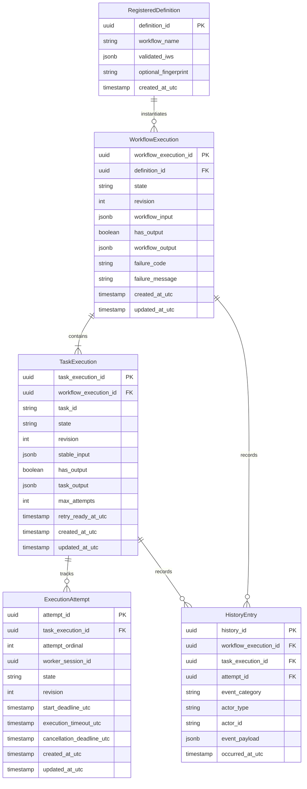

### Critical Data Modeling Requirement:
To preserve correctness under ADR-010, **output presence/commit status must be distinguishable from the committed output value itself**. Both `WorkflowExecution` and `TaskExecution` must explicitly distinguish:
- **Output absent / uncommitted** (entity still in progress, failed, or cancelled).
- **Output committed**, where the committed value may be an arbitrary JSON document, array, primitive, or an explicit JSON `null`.

---

## 10. Definition Lifecycle & Registration Flow

Workflow definition registration translates external YAML into an immutable, validated internal specification:

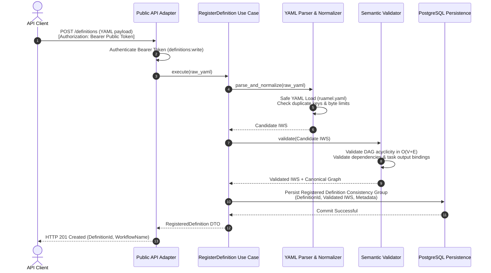

---

## 11. Execution Lifecycle State Machines

### 11.1 WorkflowExecution State Machine ([ADR-006](docs/architecture/adr-006-workflow-execution-state-machine.md))

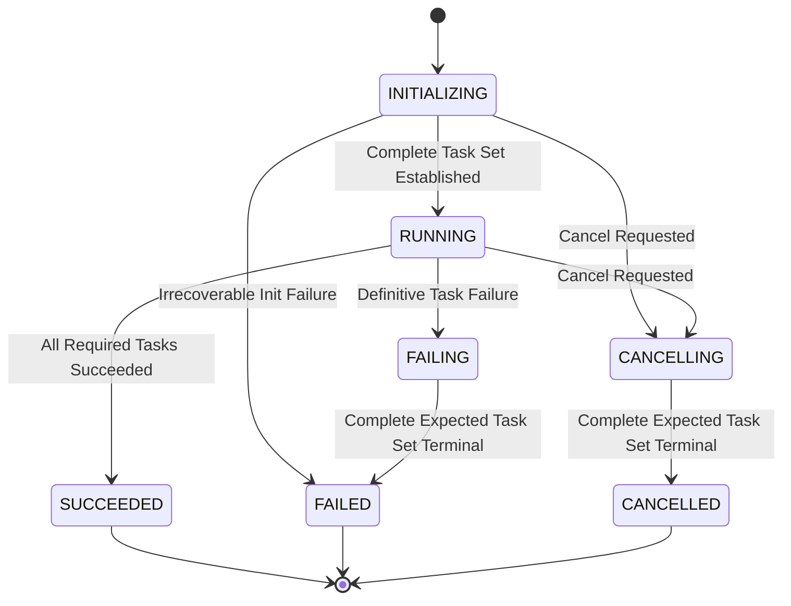

*(Note: Cancellation of an `INITIALIZING` workflow transitions `INITIALIZING $\to$ CANCELLING $\to$ CANCELLED`; direct transition to `CANCELLED` is forbidden).*

### 11.2 TaskExecution Lifecycle ([ADR-007](docs/architecture/adr-007-task-execution-lifecycle-and-attempt-model.md))

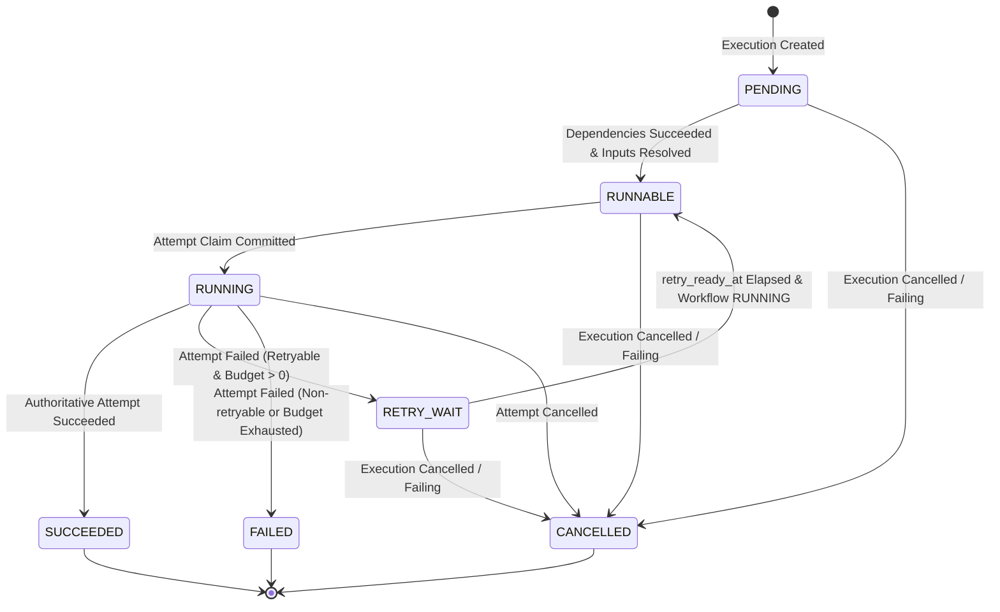

*(Note: States `BLOCKED` and `DISPATCHED` are strictly rejected).*

### 11.3 ExecutionAttempt Lifecycle ([ADR-007](docs/architecture/adr-007-task-execution-lifecycle-and-attempt-model.md))

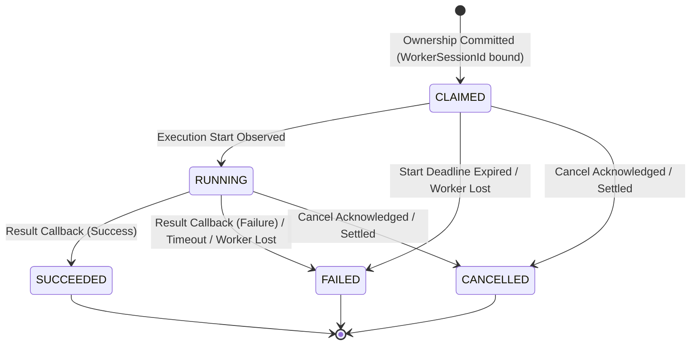

*(Note: States `PENDING` and `CANCELLING` do not exist for attempts. Direct `CLAIMED $\to$ SUCCEEDED` is prohibited).*

---

## 12. Scheduling Architecture

The scheduling engine coordinates task readiness based on canonical graph topology and current database state:
1. **Separation of Concerns**: The scheduling coordinator evaluates readiness and coordinates `PENDING $\to$ RUNNABLE` transitions. It does not own persistence storage or directly dispatch tasks to worker networks.
2. **Eligibility Predicate**:
   A task in `PENDING` state becomes eligible for `RUNNABLE` if and only if:
   - The workflow execution is currently in `RUNNING` state.
   - All direct upstream dependency tasks in the canonical graph are in terminal `SUCCEEDED` state.
   - All named input bindings resolve successfully whole-value.
3. **Transactional Input Readiness**:
   Upon satisfaction of the eligibility predicate, the scheduling coordinator requests execution of the **Input Readiness Consistency Group** in PostgreSQL:
   - Transition `TaskExecution` from `PENDING` to `RUNNABLE`.
   - Materialize resolved `stable_input` payload.
   - Append corresponding history entry under OCC guard.
4. **Rediscovery vs. In-Memory Queues**:
   `RUNNABLE` tasks in PostgreSQL represent the durable, discoverable truth of pending work. In-process wakeups improve latency, but lost wakeups are recovered via periodic targeted defensive rediscovery sweeps. There is no mandatory in-memory queue required for correctness.

---

## 13. Worker Coordination Architecture

Worker coordination is governed by an **ephemeral in-process registry** combined with durable database attempt records ([ADR-008](docs/architecture/adr-008-worker-coordination-and-liveness.md)):

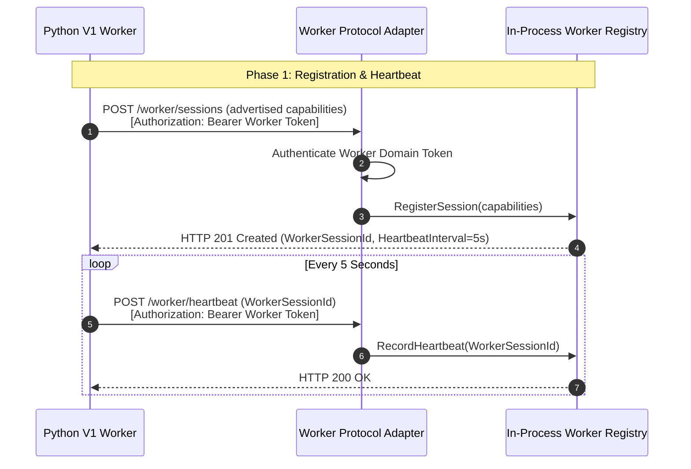

### Worker Registry Invariants:
- **Registry Owns Session Facts Only**: The Worker Registry tracks `WorkerSessionId`, heartbeat timestamps, liveness status, `accepting_new_work`, and advertised capabilities. It does **not** own task state, scheduler queues, or routing candidates.
- **Stable Session Capabilities**: Worker capabilities are registered during session establishment and remain stable for the life of that session. Poll requests do not redefine session capabilities.
- **Ephemeral & Reconstructible**: The registry is completely empty at control-plane startup. Surviving workers reconnect and register their incarnation; no recovery state depends on restoring in-memory registry memory.

---

## 14. Routing Architecture

Routing evaluates candidate compatibility per [ADR-009](docs/architecture/adr-009-task-routing.md):
- **Candidate Evaluation**: When a worker issues a poll request, the Worker Poll use case queries the Routing/Scheduling coordinator. The coordinator inspects durable `RUNNABLE` tasks against active worker sessions.
- **Eligibility Criteria**:
  1. Worker session is registered and currently **live** ($T_{\text{last\_heartbeat}} + L > \text{now}$).
  2. Worker session has `accepting_new_work == true`.
  3. The task's `activity_type` matches an item in the worker session's stable capability list via exact byte-for-byte string equality.
- **Ephemeral Candidate Offer**: A successful match produces an ephemeral candidate offer. **A candidate offer does not create an `ExecutionAttempt`, does not consume retries, and does not transition the task to `RUNNING`**.
- **Long-Poll Behavior**: If no compatible task is runnable, the request may suspend awaiting compatible work until the poll timeout elapses. The exact waiter/channel mechanism is an LLD detail.

---

## 15. Candidate $\to$ Ownership Architecture

The transition from an ephemeral candidate offer to authoritative ownership is the central concurrency boundary in NexusFlow.

> [!IMPORTANT]
> In accordance with [ADR-013](docs/architecture/adr-013-consistency-and-concurrency.md), ownership commit uses **Durable Optimistic Single-Winner Concurrency (OCC)**. The transaction uses conditional semantic predicates and OCC revision checks. No global or table-wide pessimistic locks are required for correctness.

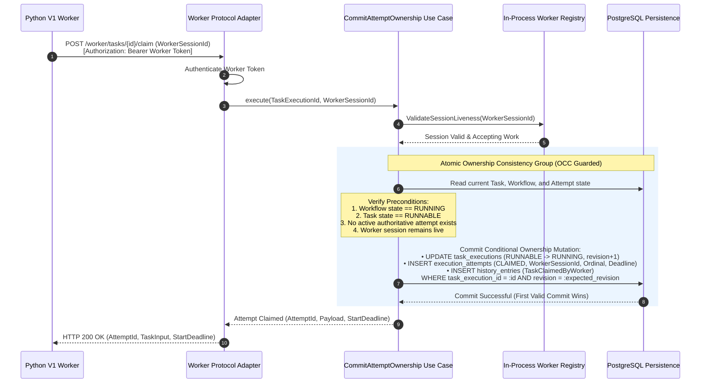

---

## 16. Execution-Start Flow

Before executing business logic, the worker confirms that execution has commenced, transitioning the attempt from `CLAIMED` to `RUNNING`:

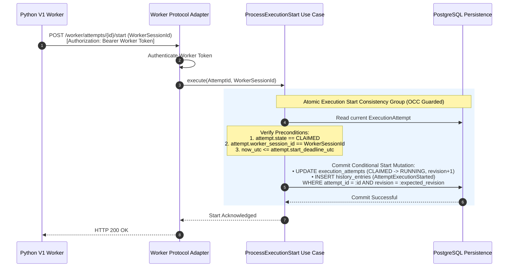

---

## 17. Task Success Flow

When an activity completes successfully, the worker reports output. Task success and output commit **atomically** in PostgreSQL:

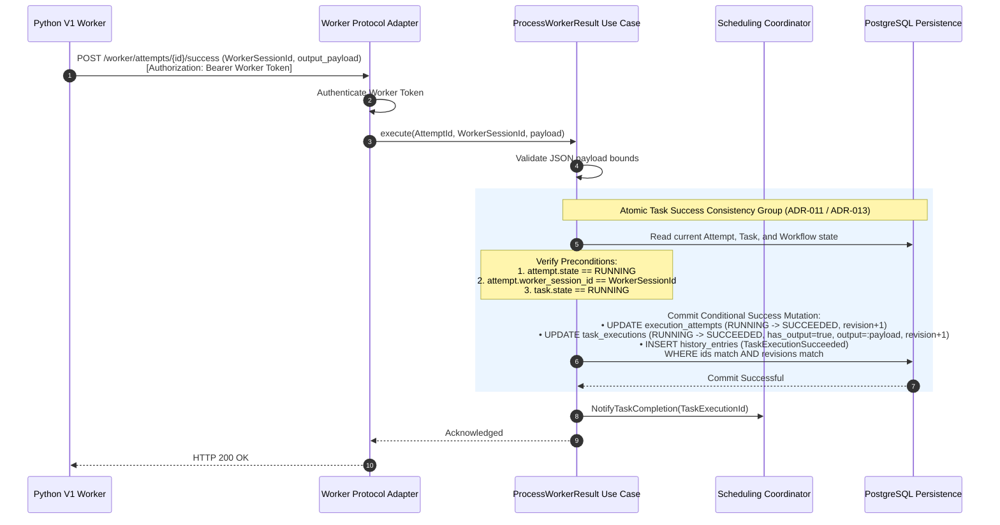

---

## 18. Task Failure & Retry Architecture

When an attempt fails, NexusFlow strictly separates **Task Failure Settlement** from **Workflow Failure Direction Arbitration** ([ADR-011](docs/architecture/adr-011-state-persistence.md), [ADR-013](docs/architecture/adr-013-consistency-and-concurrency.md)):

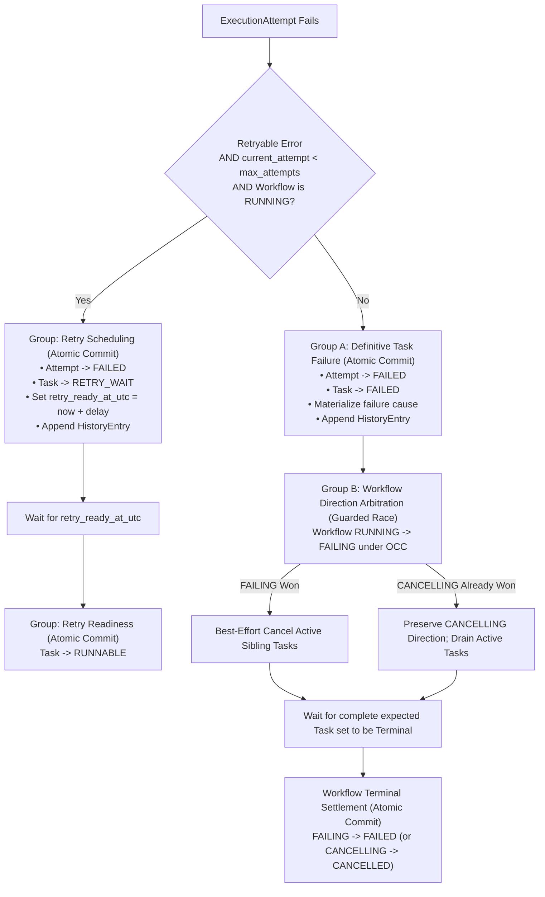

### First-Direction-Wins Arbitration:
If a definitive task failure races against a user cancellation request, **the first valid atomic commit wins**:
- If `RUNNING $\to$ FAILING` commits first, the workflow locks into `FAILING` and cannot switch to `CANCELLING`.
- If `RUNNING $\to$ CANCELLING` commits first, the task failure settles as `FAILED`, no retries are scheduled, and the workflow preserves its `CANCELLING` direction until reaching `CANCELLED`.

---

## 19. Worker Loss Architecture

Worker loss is an operational cause, not a domain lifecycle state ([ADR-008](docs/architecture/adr-008-worker-coordination-and-liveness.md)):
1. **Detection**: Background liveness loop detects that a registered session has missed heartbeats beyond `liveness_timeout_seconds` ($T_{\text{last\_heartbeat}} + L < \text{now}$).
2. **Session Eviction**: The session is marked evicted in the in-process registry; capability advertisements are withdrawn.
3. **Attempt Settlement**:
   - The control plane identifies all active attempts (`CLAIMED` or `RUNNING`) bound to the dead `WorkerSessionId`.
   - For each still-authoritative active attempt, the recovery engine attempts the valid attempt failure transition under OCC.
   - **Race Resolution**: If a late result callback races against worker loss, **the first valid atomic commit wins under OCC**. If the result committed first, it remains authoritative. If worker loss committed first, the late callback is rejected as stale.
4. **Retry Prohibition During Drain**: If the workflow is already in `FAILING` or `CANCELLING` state, no retry is scheduled regardless of remaining task retry budgets.

---

## 20. Workflow Cancellation Flow

Cancellation requests transition workflow direction and settle task executions ([ADR-006](docs/architecture/adr-006-workflow-execution-state-machine.md)):

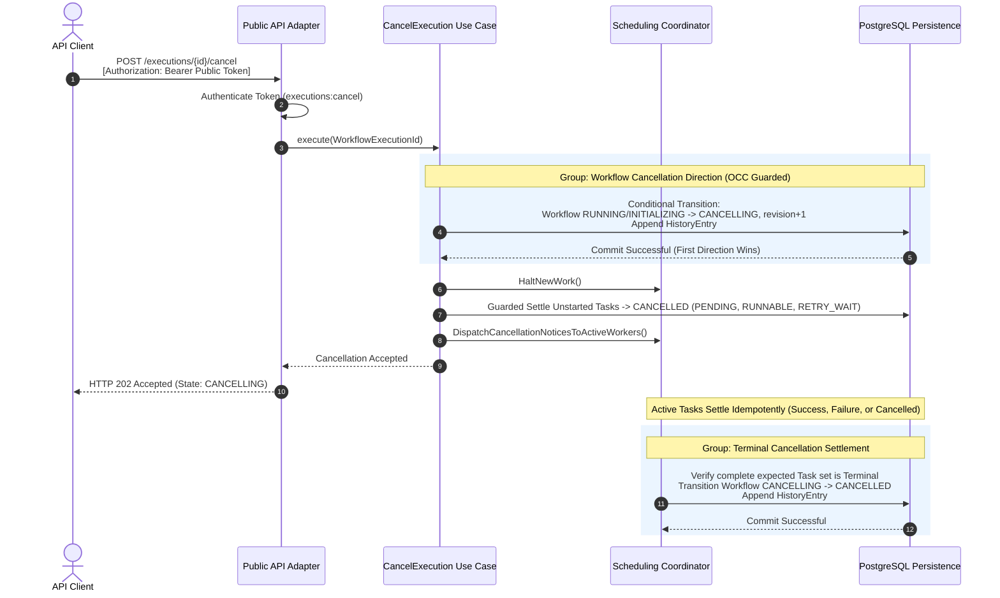

---

## 21. Failure Direction Architecture

When a task definitively fails:
1. **Direction Locking**: Workflow transitions from `RUNNING` to `FAILING`. Once locked in `FAILING`, subsequent cancellation requests cannot reverse the failure direction.
2. **Scheduling Halt**: No new tasks are scheduled; unstarted tasks settle into `CANCELLED`.
3. **Active Task Settlement**: In-flight sibling attempts receive best-effort cancellation notices, but valid completions may still settle.
4. **Terminal Settlement**: Only when the complete expected task set reaches terminal state does the workflow transition from `FAILING` to `FAILED`.

---

## 22. Workflow Success Architecture

A workflow transitions from `RUNNING` to `SUCCEEDED` if and only if:
1. Complete expected task execution membership has been established.
2. **Every required task execution in the canonical graph has reached terminal `SUCCEEDED` state**. (NexusFlow V1 contains no conditional branch skipping or `SKIPPED` states).
3. The workflow output bindings resolve completely against terminal task outputs.
4. The workflow output payload and `SUCCEEDED` state commit **atomically** in the same SQL transaction alongside a corresponding history entry.
5. If no workflow output bindings are declared, the workflow commits an explicit JSON `null` output.
6. **Race Guard**: Success terminalization is guarded by workflow OCC revision; if `CANCELLING` or `FAILING` already committed, success terminalization aborts.

---

## 23. Data Flow Architecture

Data flow is strictly declarative and deterministic ([ADR-010](docs/architecture/adr-010-workflow-data-flow-and-parameter-passing.md)):
- **Named Input Map**: A task execution's logical input is structured as a named input map.
- **Whole-Value Bindings**: Each named input binding resolves exactly one of:
  - `Literal`: Injects an immutable JSON-compatible value.
  - `WorkflowInput`: Binds the **entire immutable workflow execution input value**. (No JSON paths, field selectors, or object expressions).
  - `TaskOutput(upstream_task_id)`: Binds the **entire committed output value** of that direct upstream dependency task.
- **No Expression Language**: V1 prohibits arbitrary expressions, template rendering, and `eval()`.
- **Input Immutability**: Task input is resolved once when the task transitions to `RUNNABLE` and stored durably in `TaskExecution.stable_input`. Retries always execute with identical inputs.
- **Distinguishable Output Presence**: Committed JSON `null` is a valid, authoritative output value and is strictly distinguishable from an uncommitted/absent output.

---

## 24. Persistence Model & Consistency Groups

Database mutations are partitioned into explicit, multi-entity transactional consistency groups ([ADR-011](docs/architecture/adr-011-state-persistence.md), [ADR-013](docs/architecture/adr-013-consistency-and-concurrency.md)):

| Consistency Group | Mutated Entities | Preconditions | History Event Category |
| :--- | :--- | :--- | :--- |
| **Workflow Creation** | `WorkflowExecution` (INITIALIZING) | Validated IWS exists | `WorkflowExecutionCreated` |
| **Task Population** | `TaskExecution`s (PENDING) | Workflow INITIALIZING | `TaskExecutionsPopulated` |
| **Initialization Complete** | `WorkflowExecution` (INITIALIZING $\to$ RUNNING) | Complete expected task set verified | `WorkflowExecutionStarted` |
| **Input Readiness** | `TaskExecution` (PENDING $\to$ RUNNABLE) | Upstream dependencies `SUCCEEDED` | `TaskMarkedRunnable` |
| **Attempt Ownership** | `TaskExecution` (RUNNING), `ExecutionAttempt` (CLAIMED) | Task RUNNABLE, Worker live, no active attempt | `TaskClaimedByWorker` |
| **Execution Start** | `ExecutionAttempt` (CLAIMED $\to$ RUNNING) | Attempt CLAIMED, deadline valid | `AttemptExecutionStarted` |
| **Task Success + Output** | `ExecutionAttempt` (SUCCEEDED), `TaskExecution` (SUCCEEDED) | Attempt RUNNING, output valid | `TaskExecutionSucceeded` |
| **Retry Scheduling** | `ExecutionAttempt` (FAILED), `TaskExecution` (RETRY_WAIT) | Attempt RUNNING, budget remains | `TaskExecutionRetrying` |
| **Definitive Task Failure** | `ExecutionAttempt` (FAILED), `TaskExecution` (FAILED) | Budget exhausted / non-retryable | `TaskExecutionFailed` |
| **Workflow Failure Direction** | `WorkflowExecution` (RUNNING $\to$ FAILING) | Definitive task failure occurred | `WorkflowExecutionFailing` |
| **Workflow Cancellation** | `WorkflowExecution` (CANCELLING) | Workflow RUNNING / INITIALIZING | `WorkflowCancellationRequested` |
| **Terminal Settlement** | `WorkflowExecution` (SUCCEEDED / FAILED / CANCELLED) | Complete expected task set terminal | `WorkflowExecutionSettled` |

---

## 25. Concurrency & OCC Model

NexusFlow V1 utilizes **Durable Optimistic Single-Winner Concurrency (OCC)** on top of PostgreSQL `READ COMMITTED` transactions ([ADR-013](docs/architecture/adr-013-consistency-and-concurrency.md)):
- Every mutable entity table (`workflow_executions`, `task_executions`, `execution_attempts`) includes an integer `revision` column.
- Updates assert revision matching and semantic predicates:
  - If rows updated equals `0`, an OCC conflict occurred. The transaction aborts and rolls back.
  - The caller performs an authoritative reread and either retries under bounded backoff or accepts that another valid winner committed.
- **No Table-Wide Pessimistic Locks**: System correctness does not rely on global `SELECT FOR UPDATE` locking strategies.
- **Unknown Commit Outcomes**: If a database connection drops during commit, the control plane **never** blindly retries the write. It performs an authoritative reread of the database to determine whether the commit succeeded before taking corrective action.

---

## 26. History & Audit Architecture

- **Authoritative vs. Audit**: Current state tables are the sole source of truth for orchestration logic. The `history_entries` table is an append-only audit trail ([ADR-014](docs/architecture/adr-014-execution-history-and-audit-model.md)).
- **Atomicity**: A history entry is written in the exact same SQL transaction as the state mutation it records.
- **No Event Sourcing**: History entries are never replayed to reconstruct state during crash recovery.
- **Illustrative Semantic Categories**: Event names (`TaskMarkedRunnable`, `TaskClaimedByWorker`, `TaskExecutionSucceeded`, etc.) represent illustrative semantic categories; exact event naming schemas and payloads belong to History LLD.
- **Excluded Operations**: Ephemeral candidate evaluations, worker heartbeats, losing OCC attempts, and no-op duplicate callbacks do not generate history entries.

---

## 27. Public API Architecture

The public API is a RESTful HTTP/JSON interface implemented with FastAPI ([ADR-015](docs/architecture/adr-015-external-api-architecture.md)):
- **Resource Families**:
  - `/definitions`: Workflow registration and inspection.
  - `/executions`: Workflow start, inspection, cancellation, and task listing.
  - `/executions/{id}/history`: Cursor-paginated execution history.
- **Idempotent Starts**: Workflow start endpoints accept an optional `Idempotency-Key` header. Requests presenting an identical key and matching payload return the original execution resource; conflicting payloads return `HTTP 409 Conflict`.
- **Start Execution Acknowledgement**: The API acknowledges execution creation as soon as the workflow is durably created. The returned authoritative state may be `INITIALIZING` or `RUNNING`; clients do not block waiting for task scheduling or worker assignment.
- **Standard Error Envelopes**: All error responses adhere to normalized error structures ([ADR-018](docs/architecture/adr-018-error-handling-philosophy.md)), preventing stack traces, raw SQL queries, or database connection strings from leaking to clients.

---

## 28. Security Architecture

NexusFlow V1 implements a defense-in-depth security model ([ADR-022](docs/architecture/adr-022-security-architecture.md)):

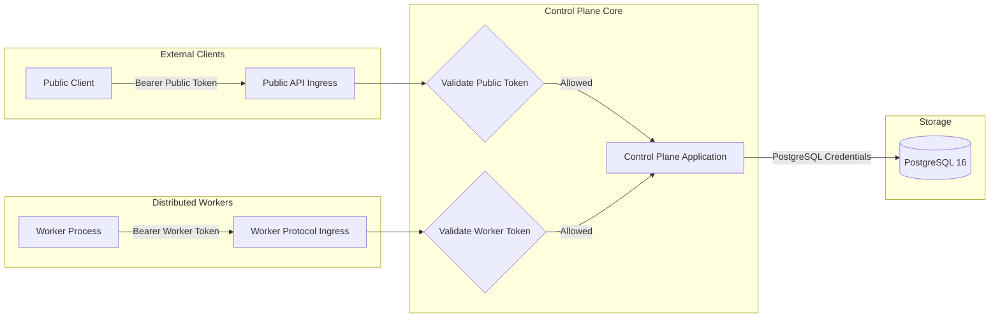

### Security Controls:
1. **Distinct Credential Domains**: Public API tokens cannot access worker protocol routes; worker tokens cannot invoke public management APIs.
2. **Credential Placement**: Worker authentication is supplied via `Authorization: Bearer <token>` HTTP headers. Tokens are never passed in JSON request bodies, query strings, or logged to telemetry.
3. **Constant-Time Verification**: Tokens are compared against stored SHA-256 digests using `hmac.compare_digest`.
4. **Transport Encryption**: TLS (HTTPS) is enforced across untrusted network boundaries, while isolated local development environments may use HTTP as configured.
5. **Database Isolation**: Workers have zero database credentials and no network route to PostgreSQL.
6. **Safe Deserialization**: `ruamel.yaml` runs in safe mode with strict document size and structural limits. Payloads are validated via Pydantic v2 without `eval()`.
7. **Calibrated Redaction**: Telemetry formatters apply structured allowlisting and known-field redaction for authorization headers and database credentials. Payload logging is disabled by default.

---

## 29. Observability Architecture

Observability is decoupled from orchestration correctness ([ADR-016](docs/architecture/adr-016-observability.md)):
- **Structured Logging**: Emits machine-readable JSON logs to `stdout` containing correlation identifiers (`workflow_execution_id`, `task_execution_id`, `attempt_id`).
- **Prometheus Metrics**: Exposes operational counters and histograms at `/metrics`. Metric labels are restricted to bounded, low-cardinality keys (e.g., `status`, or `activity_type` if bounded and cardinality-safe). Dynamic IDs and unbounded names are strictly forbidden as labels.
- **OpenTelemetry Tracing**: Exporters operate asynchronously; exporter failures fail open without impacting transaction commits. Distributed trace context propagation across worker boundaries via W3C TraceContext is recommended as an implementation-level standard.

---

## 30. Configuration Architecture

Configuration is managed via Pydantic v2 / `pydantic-settings` ([ADR-023](docs/architecture/adr-023-configuration-architecture.md)):
- **Source Hierarchy**: Explicit Test Injection > Environment Variables (`NEXUSFLOW_*`) > Mounted Secret Files > Local `.env` > Code Defaults.
- **Process Lifetime Immutability**: Settings are loaded, validated, and frozen at boot. Runtime hot-reloading is deferred.
- **Fail-Closed Validation**: Missing required credentials, malformed URLs, or invalid cross-field bounds halt startup immediately.
- **Single-Process Guard**: Configuration detects and forbids multi-process ASGI configurations (e.g., Uvicorn `--workers > 1`), enforcing $N=1$.

---

## 31. Startup & Shutdown Lifecycles

### 31.1 Startup Lifecycle ([ADR-020](docs/architecture/adr-020-technology-selection.md), [ADR-023](docs/architecture/adr-023-configuration-architecture.md))

```
1. Load & Validate Configuration (Pydantic v2)
2. Assert Single Control-Plane Invariant (process_count == 1)
3. Construct Ephemeral In-Process Components (Worker Registry initialized empty)
4. Initialize PostgreSQL Connection Pool (SQLAlchemy Async / asyncpg)
5. Verify Schema Compatibility & Alembic Migrations
6. Execute Bounded Startup Reconciliation & Recovery (ADR-012)
7. Launch Invariant-Critical Background Tasks (Liveness Sweeper, Deadlines)
8. Transition Health Endpoint to READY
```

### 31.2 Graceful Shutdown Lifecycle ([ADR-017](docs/architecture/adr-017-graceful-shutdown-architecture.md))

```
1. Receive Termination Signal (e.g., SIGTERM / SIGINT)
2. Transition Process State to DRAINING (Process lifecycle only; not a workflow state)
3. Withdraw Readiness (Health probe returns unready)
4. Close Ingress Admission (Reject new execution starts and ownership claims)
5. Enter Bounded Drain Window (Allow in-flight callbacks and start observations to commit)
6. Stop Ephemeral Coordination Loops (Liveness, Scheduler)
7. Flush Observability Exporters (OpenTelemetry)
8. Close PostgreSQL Connection Pool & Terminate Process
```

---

## 32. Recovery & Reconciliation Architecture

Crash recovery relies exclusively on **current database state snapshots** ([ADR-012](docs/architecture/adr-012-recovery.md)):
- **No History Replay**: Recovery never replays history entries or reparses YAML files.
- **No Synthetic States**: The engine never transitions entities to artificial states like `RECOVERING`.
- **Snapshot Scenarios**:
  - `INITIALIZING`: Incomplete task populations are populated to complete the expected set, or safely transitioned to `FAILED` if unrecoverable.
  - `RUNNABLE`: Remains durable rediscoverable work and becomes eligible for candidate evaluation after startup.
  - `CLAIMED`: Start deadline inspected; if expired, attempt transitions to `FAILED`.
  - `RUNNING`: Durable Attempt $\leftrightarrow$ WorkerSession mapping is preserved. The empty worker registry reconstructs dynamically as surviving workers reconnect. Bounded reconciliation eventually evaluates worker loss or timeout if heartbeats do not resume.
  - `RETRY_WAIT`: Evaluates `retry_ready_at_utc`; if elapsed, task transitions to `RUNNABLE`.
  - `CANCELLING` / `FAILING`: Resumes background cancellation notices and settlement checks.

---

## 33. Failure Handling Taxonomy

Failure modes are classified into distinct architectural categories ([ADR-018](docs/architecture/adr-018-error-handling-philosophy.md)):

```
                                SYSTEM FAILURE TAXONOMY
                                
   INGRESS / VALIDATION                           DOMAIN & EXECUTION
   ────────────────────                           ──────────────────
   • CLIENT_INPUT (Malformed JSON/Headers)        • DOMAIN_CONFLICT (Invalid state transition)
   • VALIDATION (Malformed DAG / cycle)           • DOMAIN_EXECUTION (Business task failure)
   • SECURITY (Invalid token / forbidden)         • TIME_BASED (Timeout / deadline expiry)
                                                  • WORKER_AVAILABILITY (Heartbeat loss)
   
   INFRASTRUCTURE & SYSTEM                        TRANSACTIONAL CONCURRENCY
   ───────────────────────                        ─────────────────────────
   • SYSTEM_TRANSIENT (DB connection drop)        • CONCURRENCY (OCC revision conflict)
   • SYSTEM_PERMANENT (Integrity constraint)      • UNKNOWN_OUTCOME (Commit drop / reread)
```

---

## 34. Major Sequence Diagrams

### 34.1 Start Execution Flow

```mermaid
sequenceDiagram
    autonumber
    actor Client as API Client
    participant API as Public API Adapter
    participant UseCase as StartExecution Use Case
    participant Sched as Scheduling Coordinator
    participant DB as PostgreSQL Persistence

    Client->>API: POST /executions (DefinitionId, Input)<br>[Authorization: Bearer Public Token, Idempotency-Key]
    API->>API: Authenticate Token (executions:start)
    API->>UseCase: execute(DefinitionId, Input, IdempotencyKey)
    
    rect rgb(235, 245, 255)
        Note over UseCase,DB: Phase 1: Durable Workflow Creation (INITIALIZING)
        UseCase->>DB: Check IdempotencyKey; Read Validated IWS
        UseCase->>DB: Commit Workflow Creation Consistency Group:<br>• INSERT workflow_executions (state='INITIALIZING', input=:input)<br>• Append HistoryEntry
        DB-->>UseCase: Commit Successful
    end
    
    rect rgb(235, 245, 255)
        Note over UseCase,DB: Phase 2: Task Population & Completeness Verification
        UseCase->>DB: Commit Task Population Consistency Group:<br>• INSERT task_executions (All declared tasks in PENDING state)
        DB-->>UseCase: Commit Successful
        UseCase->>DB: Commit Initialization Completion Consistency Group:<br>• Verify complete expected task set exists<br>• UPDATE workflow_executions (INITIALIZING -> RUNNING, revision+1)<br>• Append HistoryEntry
        DB-->>UseCase: Commit Successful
    end
    
    UseCase->>Sched: EvaluateInitialReadiness(WorkflowExecutionId)
    UseCase-->>API: Execution Created (WorkflowExecutionId, State: RUNNING or INITIALIZING)
    API-->>Client: HTTP 201 Created (WorkflowExecutionId, State: RUNNING or INITIALIZING)
```

### 34.2 Control-Plane Crash & Recovery Flow

```mermaid
sequenceDiagram
    autonumber
    participant Host as OS Process Supervisor
    participant Boot as Control Plane Startup Hook
    participant Rec as Recovery Engine
    participant Sched as Scheduling Coordinator
    participant DB as PostgreSQL Persistence

    Note over Host: Control Plane Process Crashes (SIGKILL / Power Outage)
    Host->>Boot: Restart Control Plane Process
    Boot->>Boot: Load & Validate Configuration
    Boot->>DB: Initialize asyncpg Connection Pool
    Boot->>Rec: ExecuteStartupReconciliation()
    
    rect rgb(235, 245, 255)
        Note over Rec,DB: Authoritative Snapshot Recovery (ADR-012)
        Rec->>DB: Scan active WorkflowExecutions ('INITIALIZING', 'RUNNING', 'FAILING', 'CANCELLING')
        Rec->>DB: Identify expired start_deadline_utc and execution_timeout_utc
        Rec->>DB: Fail overdue CLAIMED attempts; reschedule or fail tasks
        Rec->>DB: Identify elapsed retry_ready_at_utc in RETRY_WAIT tasks; transition to RUNNABLE
        Rec->>DB: Reconcile incomplete task populations in INITIALIZING workflows
        Rec->>DB: Commit Reconciled Transitions & History Entries under OCC
        DB-->>Rec: Commit Successful
    end
    
    Boot->>Sched: Launch Background Tasks (Scheduler, Liveness, Deadlines)
    Boot->>Boot: Mark Readiness Endpoint = READY
    Note over Boot: System Resumes Normal Ingress & Coordination
```

---

## 35. Module Interaction Matrix

| Module | Owns | Reads | Writes | Directly Calls | Forbidden Calls |
| :--- | :--- | :--- | :--- | :--- | :--- | :--- |
| **Public API** | REST Ingress DTOs | Definitions, Executions | None (Delegates) | Application Use Cases | Domain State Machines, DB Persistence |
| **Worker API** | Worker Protocol DTOs | Ephemeral Registry | None (Delegates) | Coordination Use Cases | Public API Use Cases, DB Persistence |
| **Use Cases** | Application Coordination| Domain Entities, Persistence | Consistency Groups | Domain Entities, Persistence Unit | Direct SQL Queries, Web Adapters |
| **Domain Core**| State Machines, Graphs | Input Payloads | New State Instances | Pure Math / Algorithms | I/O, Network, Frameworks, DB |
| **Persistence**| Database Transactions | SQL Tables | SQL Tables | asyncpg, SQLAlchemy Core | Application Use Cases, Worker API |
| **Registry** | In-Memory Sessions | Session Heartbeats | Ephemeral Registry | Clock | Database Writes, External Network |
| **Scheduler** | Eligibility Evaluation | Canonical Graph, DB States| Requests RUNNABLE State | Persistence Unit | Direct Worker Dispatches |

---

## 36. Authoritative Data Matrix

| Information Entity | Authoritative Source | Durable? | Reconstructible? | Recovery Usage |
| :--- | :--- | :--- | :--- | :--- |
| **Validated IWS** | PostgreSQL (`registered_definitions`) | Yes | No (Registered once)| Loaded to evaluate workflow structure |
| **Canonical Graph** | Memory (Derived from IWS) | No | Yes (From Validated IWS)| Traversed for task eligibility |
| **Workflow State** | PostgreSQL (`workflow_executions`) | Yes | No | Evaluated to resume execution |
| **Task State** | PostgreSQL (`task_executions`) | Yes | No | Evaluated for eligibility/settlement |
| **Attempt State** | PostgreSQL (`execution_attempts`) | Yes | No | Reconciled against deadlines |
| **Worker Registry** | Memory (Control Plane In-Process) | No | Yes (Workers heartbeat) | Empty at boot; repopulates dynamically |
| **Routing Candidates** | Ephemeral In-Process State | No | Yes (From RUNNABLE tasks)| Evaluated dynamically; no durable queue |
| **Task Input** | PostgreSQL (`task_executions.stable_input`)| Yes | No | Passed to worker on claim |
| **Task Output** | PostgreSQL (`task_executions.task_output`)| Yes | No | Passed to downstream task inputs |
| **Workflow Output**| PostgreSQL (`workflow_executions.output`)| Yes | No | Returned to client upon completion |
| **Execution History**| PostgreSQL (`history_entries`) | Yes | No | Immutable audit; not used for recovery |
| **Telemetry Metrics**| Prometheus Memory / Jaeger Spans | No | No | Never used for recovery or decisions |

---

## 37. Critical Cross-Cutting Invariants

The following twenty invariants represent the core operational laws of NexusFlow V1:

1. **Control-Plane Singularity**: Exactly one control-plane process runs against the database ($N=1$). Multi-worker ASGI is forbidden.
2. **Terminal Lifecycle Immutability**: A terminal lifecycle state (`SUCCEEDED`, `FAILED`, `CANCELLED`) is immutable. No semantic event can alter a terminal entity.
3. **Success-Only Dependencies**: A task becomes `RUNNABLE` if and only if all direct upstream dependencies are in terminal `SUCCEEDED` state.
4. **No Pre-Ownership Attempt**: No `ExecutionAttempt` record is created until an authoritative ownership transaction commits in PostgreSQL under OCC.
5. **Single Authoritative Ownership**: A `TaskExecution` has at most one non-terminal `ExecutionAttempt` at any time.
6. **Monotonic Attempt Ordinals**: Committed attempt ordinals for a task are 1-based, unique, and monotonically increasing ($1, 2, 3\dots$); physical gaps are permitted, but numbers are never reused.
7. **Exact Callback Authority**: A worker callback is processed if and only if the caller authenticates with the worker token, presents the exact `(AttemptId, WorkerSessionId)` matching the current attempt, and satisfies the applicable lifecycle and OCC concurrency predicates. Duplicate terminal callbacks are recognized idempotently.
8. **No Direct `CLAIMED $\to$ SUCCEEDED`**: An attempt must observe execution start (`CLAIMED $\to$ RUNNING`) before reporting completion.
9. **Atomic Output Persistence**: A task cannot be observed as `SUCCEEDED` without its authoritative output committed in the same SQL transaction.
10. **Atomic History Persistence**: Every semantic state mutation must commit atomically with its corresponding `HistoryEntry`.
11. **Directional Locking**: A workflow in `FAILING` state can never transition to `CANCELLING` or `SUCCEEDED`. First valid committed direction wins.
12. **No Retries During Drain Directions**: No new attempts or retries are scheduled while a workflow is in `FAILING` or `CANCELLING` state.
13. **Snapshot Recovery**: Crash recovery restores state strictly from PostgreSQL table snapshots without replaying history or reparsing YAML.
14. **Isolated Worker Data Path**: Distributed workers never connect to PostgreSQL; all coordination occurs via the control-plane HTTP API.
15. **Non-Authoritative Telemetry**: Telemetry failures (traces, metrics, logs) must fail open and never roll back a domain transaction.
16. **No Network I/O in Transactions**: Database transactions never block on worker HTTP requests or external network communication.
17. **Durable Deadlines**: Operational durations are resolved into absolute UTC timestamps upon transition; restart never recalculates active deadlines.
18. **Explicit JSON Null**: Committed JSON `null` is a valid, authoritative output distinct from absent or uncommitted data.
19. **Fail-Closed Security**: Unauthenticated or unauthorized requests reject immediately without altering domain state or writing history.
20. **Trusted Activity Code**: Worker activities run in a worker-local thread pool without process sandboxing under an organizational trust assumption.

---

## 38. Low-Level Design (LLD) Boundaries

To maintain clear separation between architecture and implementation, the following details are explicitly deferred to Low-Level Design:
- Exact internal Python module names, package paths, and file layouts.
- Specific repository class names, method signatures, and unit-of-work abstractions.
- Exact SQL schema definitions, DDL scripts, constraint names, and index configurations.
- Concrete FastAPI route handler dependency injection wiring.
- Specific worker-local thread pool sizing algorithms and queue structures.
- Exact Pydantic model field validators and serializer functions.
- Detailed coroutine sleeping patterns in the worker polling loop.

---

## 39. Implementation Implications

The realization of this High-Level Design maps into a **recommended sequence of ten implementation slices** (with foundational persistence primitives and state-machine tests capable of overlapping execution):

1. **Slice 1: Project Foundation & Tooling**: Repository layout, `uv` environment, Ruff, Pyright, and Pydantic settings loading.
2. **Slice 2: Definition Parsing & Validation**: YAML parsing, Candidate IWS normalization, acyclicity validation, and canonical graph building.
3. **Slice 3: Database Persistence & Migrations**: SQLAlchemy 2.0 Async tables, Alembic migrations, and transactional unit-of-work abstractions.
4. **Slice 4: Domain State Machines**: Pure in-memory state transition logic, table-driven test suites, and whole-value data flow binding resolvers.
5. **Slice 5: Scheduling & In-Process Coordination**: Task eligibility evaluation, in-memory worker registry, and routing engine.
6. **Slice 6: Worker Protocol & Transport**: HTTP worker endpoints, pull/long-poll handling, and the Python V1 worker runtime with thread pooling.
7. **Slice 7: Execution Lifecycles & Retries**: End-to-end task execution, start observations, callbacks, OCC retry loops, and failure settling.
8. **Slice 8: Crash Recovery & Reconciliation**: Startup recovery sweeps, deadline enforcement, and lost-wakeup rediscovery.
9. **Slice 9: Public API & Security**: REST management endpoints, Bearer token authentication, permissions, and error sanitization.
10. **Slice 10: Observability & End-to-End Hardening**: Structured logging, Prometheus `/metrics`, OpenTelemetry tracing, and Docker Compose E2E smoke tests.

---

## 40. Traceability Matrix

| HLD Section | Primary Architecture Decision Record References |
| :--- | :--- |
| **Section 4: System Context** | ADR-019 (Boundaries), ADR-020 (Tech Selection) |
| **Section 5: Deployment Architecture** | ADR-019 (Boundaries), ADR-020 (Docker Compose), ADR-023 (Config) |
| **Section 6–8: Logical Architecture & Modules**| ADR-001 (IWS), ADR-003 (Graph), ADR-004 (Validation), ADR-019 (Modularity) |
| **Section 9: Authoritative State Model** | ADR-001 (IWS), ADR-006 (Workflow), ADR-007 (Task), ADR-011 (Persistence) |
| **Section 10: Definition Lifecycle** | ADR-001 (IWS), ADR-002 (Parsing), ADR-004 (Validation) |
| **Section 11: Execution Lifecycles** | ADR-006 (Workflow SM), ADR-007 (Task SM & Attempt) |
| **Section 12: Scheduling Architecture** | ADR-003 (Graph), ADR-005 (Scheduler) |
| **Section 13: Worker Coordination** | ADR-008 (Worker Coordination & Liveness) |
| **Section 14: Routing Architecture** | ADR-009 (Task Routing) |
| **Section 15–16: Ownership & Start** | ADR-007 (Attempt), ADR-008 (Worker Coordination), ADR-013 (OCC) |
| **Section 17–18: Success, Failure & Retries**| ADR-006 (Workflow), ADR-007 (Task), ADR-010 (Data Flow), ADR-018 (Errors) |
| **Section 19: Worker Loss** | ADR-007 (Attempt), ADR-008 (Worker Coordination), ADR-013 (OCC) |
| **Section 20–22: Cancellation & Settlement**| ADR-006 (Workflow), ADR-007 (Task), ADR-010 (Data Flow) |
| **Section 23: Data Flow Architecture** | ADR-010 (Workflow Data Flow & Parameter Passing) |
| **Section 24–26: Persistence, OCC & History**| ADR-011 (Persistence), ADR-013 (OCC), ADR-014 (History & Audit) |
| **Section 27: Public API Architecture** | ADR-015 (External API), ADR-018 (Error Handling) |
| **Section 28: Security Architecture** | ADR-022 (Security Architecture) |
| **Section 29: Observability Architecture** | ADR-016 (Observability Architecture) |
| **Section 30–31: Configuration & Lifecycles** | ADR-017 (Graceful Shutdown), ADR-023 (Configuration Architecture) |
| **Section 32: Recovery Architecture** | ADR-012 (Recovery Strategy) |
| **Section 33: Failure Taxonomy** | ADR-018 (Error Handling Philosophy) |
| **Section 37: Critical Cross-Cutting Invariants**| ADR-001 through ADR-023 (Universal System Invariants) |

---

## 41. Design Validation Checklist

- [x] **ADR Alignment**: Systematically synthesizes all architectural invariants established in ADR-001 through ADR-023 without introducing contradictory mechanisms.
- [x] **Single-Process Constraint**: Enforces the single-instance ($N=1$) control-plane execution model across configuration, deployment, and coordination layers.
- [x] **Separation of Concerns**: Strictly separates security authentication from attempt execution authority, candidate evaluation from durable ownership, and current relational state from history audit records.
- [x] **OCC-First Concurrency**: Ownership claims, start observations, completions, retries, and failure directions are guarded by explicit revision checks and semantic predicates rather than mandatory table-level pessimistic locks.
- [x] **Clean Boundary Layering**: Inward dependency direction prevents domain leakage into web frameworks, database drivers, or telemetry collectors.
- [x] **Robust Recovery Model**: Relies entirely on durable database snapshots; completely eliminates YAML reparsing and event-sourced history replay from crash recovery.
- [x] **Whole-Value Data Flow**: Restricts parameter bindings to whole-value literals, workflow inputs, and direct task outputs; eliminates expression languages.
- [x] **LLD Scope Boundary**: Successfully protects implementation flexibility by deferring physical schemas, DDL, internal class signatures, and exact coroutine loop structures to Low-Level Design.

---

### Classification

**HLD Architecture-Ready / Approved for LLD**
