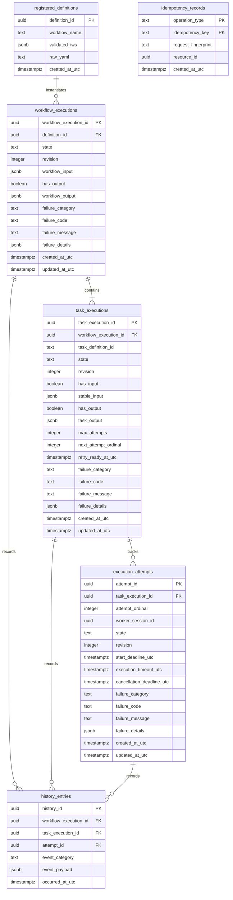

# NexusFlow V1 — LLD-02: PostgreSQL Schema & Persistence Transactions

---

## 1. Document Purpose

This Low-Level Design (LLD) document establishes the concrete physical PostgreSQL 16 schema, constraints, indexing strategies, SQLAlchemy 2.x Async mappings, and transactional consistency groups for NexusFlow V1.

It bridges the architectural decisions (**ADR-001 through ADR-023**), the **NexusFlow V1 High-Level Design (HLD)**, and the domain contracts defined in **LLD-01 (Domain Model & Module Contracts)** into an executable, concurrency-safe persistence implementation.

The primary objective of this document is to answer:
> **Exactly what durable relational state exists, what constraints protect it, and how is each approved semantic consistency group committed safely under concurrency and crash conditions?**

---

## 2. Scope

### In-Scope
- PostgreSQL 16 physical table DDL specifications, native data types, and primary/foreign keys.
- Relational integrity constraints (CHECK constraints, foreign keys, unique constraints, partial indexes).
- Distinguishable output presence representation (`has_output` boolean + nullable `jsonb`).
- Integer revision-based Optimistic Concurrency Control (OCC) under `READ COMMITTED` isolation.
- Monotonic attempt ordinal allocation with physical gap tolerance.
- Strict defense-in-depth enforcement of the at-most-one active attempt invariant via partial unique indexes.
- Append-only audit history table committed atomically with domain mutations.
- Multi-operation idempotency storage distinguishing identical retry requests from conflicting reuse.
- Implementation-grade transaction pseudocode for all consistency groups in `ExecutionMutationPort`.
- Bounded, index-backed query shapes supporting startup reconciliation and lost-wakeup rediscovery.
- SQLAlchemy 2.x Async declarative models, session lifecycles, and domain mapping protocols.
- Alembic migration baseline and schema compatibility validation.

### Out-of-Scope (Deferred to Subsequent LLDs)
- **LLD-03**: Definition Ingestion & Validation Pipeline (`ruamel.yaml` parser, AST normalizer, cycle checker).
- **LLD-04**: Scheduling, Routing & Candidate Matching (In-process worker registry, ephemeral long-polling).
- **LLD-05**: Worker Protocol & Worker Runtime (FastAPI worker routes, thread pools, HTTP client).
- **LLD-06**: Execution Results, Retries, Timeouts & Cancellation (Callback wire protocol, deadline sweeps).
- **LLD-07**: Recovery & Reconciliation (Startup sweeper orchestration, lost-wakeup rediscovery loops).
- **LLD-08**: Public Management API & Security (FastAPI endpoints, Bearer authentication, permission guards).

---

## 3. Persistence Principles & Concurrency Strategy

1. **PostgreSQL Current State is the Sole Authoritative Truth**: The orchestrator's state machines inspect current relational records. History is an immutable audit trail, never replayed to reconstruct state during crash recovery.
2. **Optimistic Concurrency Control (OCC) is the Primary Arbiter**: All state transitions conditionalize on `WHERE revision = :expected_revision` and semantic state predicates. The first valid durable commit wins; concurrent losers detect zero affected rows and abort.
3. **No Network I/O Inside State Transactions**: Database transactions never block on worker HTTP requests, external network calls, or telemetry exporters. Telemetry is emitted after commit or queued non-blockingly.
4. **Consistency Groups Over Entity CRUD**: Mutations operate across multi-entity transaction boundaries (e.g., Ownership Commit, Task Success + Output, Definitive Task Failure) within a single atomic SQL transaction.
5. **Workflow Direction Serialization & Deadlock-Free Ordering**: Under PostgreSQL `READ COMMITTED`, an un-locked `SELECT` on workflow state does not prevent a concurrent transaction from mutating the workflow to `CANCELLING` or `FAILING` before the dependent task/attempt update executes. To eliminate this TOCTOU race:
   - Any transaction requiring Workflow `RUNNING` (Initial Readiness, Retry Ready, Ownership Commit, Retry Scheduling) acquires a row-level lock on the owning `workflow_executions` row via `SELECT state, revision FROM workflow_executions WHERE workflow_execution_id = :id FOR UPDATE`.
   - Workflow direction mutations (`RUNNING -> FAILING`, `INITIALIZING/RUNNING -> CANCELLING`) acquire the exact same `FOR UPDATE` lock on `workflow_executions`.
   - **Deadlock-Free Ordering**:
     - When parent Workflow serialization is required (readiness, ownership, retry scheduling, drain cancellation settlement), transactions lock `workflow_executions` first before mutating dependent `task_executions` and `execution_attempts`.
     - For active result settlements that do not require Workflow `RUNNING` (worker success, worker definitive failure), mutations update the child `execution_attempts` row first under OCC conditional check, followed by the parent `task_executions` row under OCC. This bottom-up settlement sequence is safe because all concurrent worker callbacks for a task target the exact same attempt, while competing direction changes only touch the parent workflow row.
   - If the Workflow direction transaction commits first, no subsequent scheduling, retry, or ownership mutation can commit. If scheduling/ownership commits first, the later direction change commits and drains it according to ADR-006/007.
6. **No Partial Multi-Entity Commits**: If any statement within a multi-entity consistency group fails its OCC revision or state predicate, the transaction **must immediately abort and rollback**. Returning an error outcome without rolling back will cause earlier successful SQL statements to commit upon context exit. A dedicated transaction helper or explicit `await session.rollback()` is mandatory.
7. **Defense-in-Depth Relational Constraints**: Database CHECK constraints, foreign keys, and partial unique indexes physically enforce domain invariants regardless of application logic bugs.
8. **Unknown Commit Protocol**: A dropped connection during transaction commit leaves the outcome uncertain (`UNKNOWN_OUTCOME`). The application must execute an operation-specific authoritative reread prior to retrying any mutation.

---

## 4. PostgreSQL Technology Model & Conventions

### 4.1 Database Engine & Isolation
- **Database Engine**: PostgreSQL 16.x.
- **Transaction Isolation Level**: `READ COMMITTED`.
- **Database Driver**: `asyncpg` via SQLAlchemy 2.x Async engine.
- **Dedicated Schema**: All tables reside in the `public` schema in V1 to avoid unnecessary schema-qualification overhead in Docker Compose reference deployments.

### 4.2 Naming Conventions
- **Tables**: Lowercase, snake_case, plural nouns (e.g., `workflow_executions`, `task_executions`).
- **Columns**: Lowercase, snake_case, singular terms (e.g., `task_execution_id`, `state`).
- **Primary Keys**: Named `<singular_table_name>_id` with native PostgreSQL `uuid` type.
- **Foreign Keys**: Named `<parent_entity_singular>_id` referencing parent PK.
- **Timestamps**: Suffix `_at_utc` with native PostgreSQL `timestamptz` storing timezone-aware UTC instants.
- **Revisions**: Column named `revision` with integer type, initialized to `1`.
- **Booleans**: Prefixed with `has_` or `is_` (e.g., `has_input`, `has_output`).

### 4.3 Identifier Generation Strategy
- **UUIDv4**: Generated application-side using Python `uuid.uuid4()` and passed to PostgreSQL. This guarantees stable correlation IDs before issuing SQL statements and enables deterministic unknown-commit reconciliation.

---

## 5. Relational Schema Overview & ERD



---

## 6. Table Definitions & Physical DDL

### 6.1 `registered_definitions`
Stores immutable, semantically validated workflow specifications (ADR-001, ADR-004).

```sql
CREATE TABLE registered_definitions (
    definition_id UUID PRIMARY KEY,
    workflow_name TEXT NOT NULL,
    validated_iws JSONB NOT NULL,
    raw_yaml TEXT NULL,  -- Non-authoritative diagnostic artifact only
    created_at_utc TIMESTAMPTZ NOT NULL,

    CONSTRAINT chk_definitions_name_non_empty CHECK (length(trim(workflow_name)) > 0)
);
```

#### Validated IWS JSONB Encoding Schema:
```json
{
  "workflow_name": "order_processing",
  "tasks": {
    "validate_cart": {
      "id": "validate_cart",
      "activity_type": "ecommerce.validate_cart",
      "dependencies": [],
      "input_bindings": {
        "cart_id": { "type": "WorkflowInput" }
      },
      "max_attempts": 3
    },
    "charge_card": {
      "id": "charge_card",
      "activity_type": "payment.charge",
      "dependencies": ["validate_cart"],
      "input_bindings": {
        "amount": { "type": "TaskOutput", "upstream_task_id": "validate_cart" }
      },
      "max_attempts": 2
    }
  },
  "output_bindings": {
    "order_id": { "type": "WorkflowTaskOutput", "source_task_id": "charge_card" }
  }
}
```

---

### 6.2 `workflow_executions`
Authoritative execution lifecycle state machine for workflows (ADR-006).

```sql
CREATE TABLE workflow_executions (
    workflow_execution_id UUID PRIMARY KEY,
    definition_id UUID NOT NULL REFERENCES registered_definitions(definition_id) ON DELETE RESTRICT,
    state TEXT NOT NULL,
    revision INTEGER NOT NULL DEFAULT 1,
    workflow_input JSONB NOT NULL,
    has_output BOOLEAN NOT NULL DEFAULT FALSE,
    workflow_output JSONB NULL,
    failure_category TEXT NULL,
    failure_code TEXT NULL,
    failure_message TEXT NULL,
    failure_details JSONB NULL,
    created_at_utc TIMESTAMPTZ NOT NULL,
    updated_at_utc TIMESTAMPTZ NOT NULL,

    CONSTRAINT chk_workflow_state CHECK (
        state IN ('INITIALIZING', 'RUNNING', 'FAILING', 'CANCELLING', 'SUCCEEDED', 'FAILED', 'CANCELLED')
    ),
    CONSTRAINT chk_workflow_revision CHECK (revision >= 1),
    -- Output Presence Invariant: has_output=FALSE implies workflow_output IS NULL; has_output=TRUE implies workflow_output IS NOT NULL (stores 'null'::jsonb or JSON payload)
    CONSTRAINT chk_workflow_output_consistency CHECK (
        (has_output = FALSE AND workflow_output IS NULL) OR
        (has_output = TRUE AND workflow_output IS NOT NULL)
    ),
    CONSTRAINT chk_workflow_terminal_success CHECK (
        state != 'SUCCEEDED' OR (has_output = TRUE)
    )
);
```

---

### 6.3 `task_executions`
Authoritative execution lifecycle for workflow tasks (ADR-007, ADR-010).

```sql
CREATE TABLE task_executions (
    task_execution_id UUID PRIMARY KEY,
    workflow_execution_id UUID NOT NULL REFERENCES workflow_executions(workflow_execution_id) ON DELETE RESTRICT,
    task_definition_id TEXT NOT NULL,
    state TEXT NOT NULL,
    revision INTEGER NOT NULL DEFAULT 1,
    has_input BOOLEAN NOT NULL DEFAULT FALSE,
    stable_input JSONB NULL,
    has_output BOOLEAN NOT NULL DEFAULT FALSE,
    task_output JSONB NULL,
    max_attempts INTEGER NOT NULL,
    next_attempt_ordinal INTEGER NOT NULL DEFAULT 1,
    retry_ready_at_utc TIMESTAMPTZ NULL,
    failure_category TEXT NULL,
    failure_code TEXT NULL,
    failure_message TEXT NULL,
    failure_details JSONB NULL,
    created_at_utc TIMESTAMPTZ NOT NULL,
    updated_at_utc TIMESTAMPTZ NOT NULL,

    CONSTRAINT uq_task_definition_per_workflow UNIQUE (workflow_execution_id, task_definition_id),
    CONSTRAINT chk_task_state CHECK (
        state IN ('PENDING', 'RUNNABLE', 'RUNNING', 'RETRY_WAIT', 'SUCCEEDED', 'FAILED', 'CANCELLED')
    ),
    CONSTRAINT chk_task_revision CHECK (revision >= 1),
    CONSTRAINT chk_task_max_attempts CHECK (max_attempts >= 1),
    CONSTRAINT chk_task_next_ordinal CHECK (next_attempt_ordinal >= 1),
    -- Stable Input Representation Invariant
    CONSTRAINT chk_task_input_presence CHECK (
        (has_input = FALSE AND stable_input IS NULL) OR
        (has_input = TRUE AND stable_input IS NOT NULL)
    ),
    -- Stable Input must be locked for RUNNABLE, RUNNING, RETRY_WAIT, SUCCEEDED, and FAILED (terminal failure reached after becoming executable)
    CONSTRAINT chk_task_stable_input_established CHECK (
        state NOT IN ('RUNNABLE', 'RUNNING', 'RETRY_WAIT', 'SUCCEEDED', 'FAILED') OR (has_input = TRUE AND jsonb_typeof(stable_input) = 'object')
    ),
    -- Output Presence Invariant: has_output=FALSE implies task_output IS NULL; has_output=TRUE implies task_output IS NOT NULL (stores 'null'::jsonb or JSON payload)
    CONSTRAINT chk_task_output_consistency CHECK (
        (has_output = FALSE AND task_output IS NULL) OR
        (has_output = TRUE AND task_output IS NOT NULL)
    ),
    CONSTRAINT chk_task_terminal_success CHECK (
        state != 'SUCCEEDED' OR (has_output = TRUE)
    ),
    CONSTRAINT chk_task_retry_wait_deadline CHECK (
        state != 'RETRY_WAIT' OR retry_ready_at_utc IS NOT NULL
    )
);
```

---

### 6.4 `execution_attempts`
Authoritative execution attempt tracking bound to a worker session (ADR-007, ADR-008).

```sql
CREATE TABLE execution_attempts (
    attempt_id UUID PRIMARY KEY,
    task_execution_id UUID NOT NULL REFERENCES task_executions(task_execution_id) ON DELETE RESTRICT,
    attempt_ordinal INTEGER NOT NULL,
    worker_session_id UUID NOT NULL,  -- Non-secret runtime incarnation correlation ID
    state TEXT NOT NULL,
    revision INTEGER NOT NULL DEFAULT 1,
    start_deadline_utc TIMESTAMPTZ NOT NULL,
    execution_timeout_utc TIMESTAMPTZ NULL,
    cancellation_deadline_utc TIMESTAMPTZ NULL,
    failure_category TEXT NULL,
    failure_code TEXT NULL,
    failure_message TEXT NULL,
    failure_details JSONB NULL,
    created_at_utc TIMESTAMPTZ NOT NULL,
    updated_at_utc TIMESTAMPTZ NOT NULL,

    CONSTRAINT uq_attempt_ordinal_per_task UNIQUE (task_execution_id, attempt_ordinal),
    CONSTRAINT chk_attempt_state CHECK (
        state IN ('CLAIMED', 'RUNNING', 'SUCCEEDED', 'FAILED', 'CANCELLED')
    ),
    CONSTRAINT chk_attempt_ordinal CHECK (attempt_ordinal >= 1),
    CONSTRAINT chk_attempt_revision CHECK (revision >= 1)
);

-- Defense-in-depth: Enforce at-most-one active attempt per task physically
CREATE UNIQUE INDEX uq_single_active_attempt_per_task
ON execution_attempts (task_execution_id)
WHERE state IN ('CLAIMED', 'RUNNING');
```

---

### 6.5 `history_entries`
Append-only semantic audit trail committed atomically with mutations (ADR-014).

```sql
CREATE TABLE history_entries (
    history_id UUID PRIMARY KEY,
    workflow_execution_id UUID NOT NULL REFERENCES workflow_executions(workflow_execution_id) ON DELETE RESTRICT,
    task_execution_id UUID NULL REFERENCES task_executions(task_execution_id) ON DELETE RESTRICT,
    attempt_id UUID NULL REFERENCES execution_attempts(attempt_id) ON DELETE RESTRICT,
    event_category TEXT NOT NULL,
    event_payload JSONB NOT NULL,
    occurred_at_utc TIMESTAMPTZ NOT NULL
);
```

---

### 6.6 `idempotency_records`
Durable idempotency tokens for definition registration and execution start (ADR-015, ADR-020).

```sql
CREATE TABLE idempotency_records (
    operation_type TEXT NOT NULL,
    idempotency_key TEXT NOT NULL,
    request_fingerprint TEXT NOT NULL,  -- SHA-256 hex digest of normalized request
    resource_id UUID NOT NULL,          -- Points to definition_id or workflow_execution_id depending on operation_type
    created_at_utc TIMESTAMPTZ NOT NULL,

    PRIMARY KEY (operation_type, idempotency_key),
    CONSTRAINT chk_idempotency_op_type CHECK (
        operation_type IN ('REGISTER_DEFINITION', 'START_EXECUTION')
    ),
    CONSTRAINT chk_idempotency_fingerprint_len CHECK (length(request_fingerprint) = 64)
);
```

---

## 7. Output Presence & JSON Representation

To satisfy ADR-010 and eliminate ambiguity under PostgreSQL JSONB:

| Output State | `has_output` | `output_payload` Column Value | JSON Semantic Interpretation |
| :--- | :--- | :--- | :--- |
| **Uncommitted / In-Progress**| `FALSE` | `NULL` (SQL NULL) | Output is absent; entity not terminal. |
| **Committed JSON `null`** | `TRUE` | `'null'::jsonb` (JSON null) | Output committed; explicit `null` value. |
| **Committed JSON Document** | `TRUE` | `'{"status": "ok"}'::jsonb` | Output committed; explicit JSON object/array/primitive. |

The database CHECK constraints enforce:
```sql
(has_output = FALSE AND output_payload IS NULL)
OR
(has_output = TRUE AND output_payload IS NOT NULL)
```
Because PostgreSQL JSONB `'null'` is **NOT SQL NULL**, committed JSON `null` evaluates to `output_payload IS NOT NULL`, preserving full mathematical and relational consistency.

### 7.1 SQLAlchemy JSONB Adapter & None Mapping (`none_as_null=False`)
By default, SQLAlchemy maps Python `None` to SQL `NULL`. To properly persist domain JSON `null` as PostgreSQL `'null'::jsonb`, SQLAlchemy columns must be configured with `none_as_null=False` or explicit JSON null literals:
```python
from sqlalchemy.dialects.postgresql import JSONB
from sqlalchemy.sql import null
import json

# When has_output=False:
output_sql_val = null()  # SQL NULL

# When has_output=True and domain output is None (OutputCommitted(None)):
output_sql_val = cast("null", JSONB)  # 'null'::jsonb

# When has_output=True and domain output is valid object:
output_sql_val = thaw_json(output.value)
```

### 7.2 Domain $\longleftrightarrow$ DB JSON Conversion: `thaw_json` & `freeze_json`
In accordance with LLD-01, domain models use frozen, immutable JSON structures (`MappingProxyType` and `tuple`), rejecting non-string dictionary keys. SQLAlchemy cannot directly serialize `MappingProxyType`.

```python
from types import MappingProxyType
from typing import Any
import math


def thaw_json(val: Any) -> Any:
    """Recursively converts frozen domain JSON into mutable dict/list for DB serialization.

    Fails closed: strictly rejects non-string keys and non-finite floats (NaN/Infinity).
    Never converts non-string keys to strings via str(k).
    """
    if val is None or isinstance(val, (int, str, bool)):
        return val
    if isinstance(val, float):
        if not math.isfinite(val):
            raise ValueError(f"Non-finite float value {val} is not valid JSON")
        return val
    if isinstance(val, tuple):
        return [thaw_json(x) for x in val]
    if isinstance(val, (MappingProxyType, dict)):
        result = {}
        for k, v in val.items():
            if not isinstance(k, str):
                raise TypeError(f"JSON object keys must be strings, found: {type(k).__name__}")
            result[k] = thaw_json(v)
        return result
    raise TypeError(f"Unsupported domain JSON type for thawing: {type(val)}")
```
Upon reading JSONB from PostgreSQL, the persistence layer **must call `freeze_json(...)`** before constructing domain entity snapshots.

### 7.3 Failure Details Optionality Contract
In domain models, `FailureCause.details` is typed as `JsonObject | None`.
- When `failure_details` column is SQL `NULL`, the mapper returns `None` (representing the absence of diagnostic details).
- It does **not** wrap SQL `NULL` into a synthetic `freeze_json(None)` (which would yield a JSON null value).
- Only when `failure_details` contains a committed JSON object does the mapper invoke `freeze_json(record.failure_details)` to produce an immutable `MappingProxyType`.


---

## 8. Index Strategy

Indexes are tailored strictly to approved query patterns with keyset progress support:

```sql
-- 1. Workflow Listing & Filter Queries (ADR-015)
CREATE INDEX idx_workflow_executions_state_created 
ON workflow_executions (state, created_at_utc DESC, workflow_execution_id);

CREATE INDEX idx_workflow_executions_definition 
ON workflow_executions (definition_id, created_at_utc DESC, workflow_execution_id);

-- 2. Task Lookup by Workflow (ADR-005, ADR-015)
CREATE INDEX idx_task_executions_workflow_id 
ON task_executions (workflow_execution_id);

-- 3. Bounded Scheduler Rediscovery Queries (ADR-005, ADR-012)
-- Keyset traversal on (created_at_utc, task_execution_id) prevents starvation
CREATE INDEX idx_task_executions_runnable_rediscovery 
ON task_executions (created_at_utc, task_execution_id) 
WHERE state = 'RUNNABLE';

-- 4. Bounded Retry Timer Sweep Queries (ADR-007, ADR-012)
CREATE INDEX idx_task_executions_retry_timer 
ON task_executions (retry_ready_at_utc, task_execution_id) 
WHERE state = 'RETRY_WAIT';

-- 5. Bounded Start Deadline Sweep Queries (ADR-007, ADR-008)
CREATE INDEX idx_execution_attempts_start_deadline 
ON execution_attempts (start_deadline_utc, attempt_id) 
WHERE state = 'CLAIMED';

-- 6. Bounded Execution Timeout Sweep Queries (ADR-007, ADR-012)
CREATE INDEX idx_execution_attempts_execution_timeout 
ON execution_attempts (execution_timeout_utc, attempt_id) 
WHERE state = 'RUNNING' AND execution_timeout_utc IS NOT NULL;

-- 7. Bounded Cancellation Resolution Deadline Sweep Queries (ADR-008, ADR-012)
CREATE INDEX idx_execution_attempts_cancel_deadline 
ON execution_attempts (cancellation_deadline_utc, attempt_id) 
WHERE cancellation_deadline_utc IS NOT NULL;

-- 8. Worker Loss Reconciler (ADR-008, ADR-012)
CREATE INDEX idx_execution_attempts_worker_session 
ON execution_attempts (worker_session_id) 
WHERE state IN ('CLAIMED', 'RUNNING');

-- 9. History Pagination by Workflow (ADR-014, ADR-015)
CREATE INDEX idx_history_entries_pagination 
ON history_entries (workflow_execution_id, occurred_at_utc ASC, history_id ASC);
```

---

## 9. Attempt Ordinal Allocation & Concurrency

Attempt ordinals are:
1. **1-based** ($1, 2, 3\dots$).
2. **Monotonically increasing** per `TaskExecution`.
3. **Never reused** once committed.
4. **Physical gaps permitted** by architecture, but with allocation occurring inside the atomic Ownership Commit transaction, a transaction rollback does **not** consume an ordinal. Committed ordinals in normal V1 operation will therefore be contiguous.

### Allocation Mechanism:
`task_executions.next_attempt_ordinal` tracks the next ordinal to allocate. During **Ownership Commit**, the transaction updates `task_executions`:
```sql
UPDATE task_executions
SET state = 'RUNNING',
    revision = revision + 1,
    next_attempt_ordinal = next_attempt_ordinal + 1,
    updated_at_utc = :now_utc
WHERE task_execution_id = :task_id
  AND state = 'RUNNABLE'
  AND revision = :expected_task_revision
RETURNING next_attempt_ordinal - 1 AS allocated_ordinal;
```
If concurrent claims race, only the OCC revision winner updates the row and retrieves `allocated_ordinal`. The loser receives zero rows, triggers transaction rollback, and consumes no ordinal.

---

## 10. Consistency Groups Implementation Pseudocode

All consistency groups adhere to the **Workflow Direction Serialization Rule** and **Atomic Rollback Invariant**: if any statement fails its OCC check or relational predicate, the transaction immediately calls `await session.rollback()` and returns an appropriate error outcome.

### 10.1 Definition Registration (`commit_registered_definition`)
Implements `DefinitionPersistencePort.register_definition_if_absent` with conflict-safe idempotency handling.
- Without an idempotency key, every accepted registration creates a distinct `DefinitionId` (no silent deduplication by content fingerprint).
- With an idempotency key, concurrent equivalent requests return the original `DefinitionId`, while conflicting requests receive `PRECONDITION_FAILED`.

```python
async def commit_registered_definition(
    session: AsyncSession,
    definition_id: DefinitionId,
    workflow_name: str,
    spec: ValidatedWorkflowSpec,
    raw_yaml: str | None,
    idempotency_key: IdempotencyKey | None,
    fingerprint: RequestFingerprint | None,
    now_utc: datetime,
) -> tuple[CommitOutcome, DefinitionId]:
    async with session.begin():
        if idempotency_key is not None:
            if fingerprint is None:
                raise ValueError("Fingerprint cannot be None when idempotency_key is supplied")

            stmt_idem = (
                insert(IdempotencyRecord)
                .values(
                    operation_type="REGISTER_DEFINITION",
                    idempotency_key=idempotency_key.value,
                    request_fingerprint=fingerprint.digest,
                    resource_id=definition_id.value,
                    created_at_utc=now_utc,
                )
                .on_conflict_do_nothing(index_elements=["operation_type", "idempotency_key"])
            )
            res = await session.execute(stmt_idem)
            if res.rowcount == 0:
                # Concurrent creator raced; reread existing record
                existing = await session.scalar(
                    select(IdempotencyRecord).where(
                        IdempotencyRecord.operation_type == "REGISTER_DEFINITION",
                        IdempotencyRecord.idempotency_key == idempotency_key.value,
                    )
                )
                if existing.request_fingerprint == fingerprint.digest:
                    return CommitOutcome(
                        status=CommitStatus.COMMITTED, message="Idempotent match"
                    ), DefinitionId(existing.resource_id)
                return CommitOutcome(
                    status=CommitStatus.PRECONDITION_FAILED, message="Conflicting idempotency key"
                ), definition_id

        # Insert immutable definition row
        session.add(
            RegisteredDefinitionRecord(
                definition_id=definition_id.value,
                workflow_name=workflow_name,
                validated_iws=thaw_json(spec.to_dict()),
                raw_yaml=raw_yaml,
                created_at_utc=now_utc,
            )
        )

    return CommitOutcome(status=CommitStatus.COMMITTED), definition_id
```

---

### 10.2 Workflow Creation (`commit_workflow_creation`)
Uses conflict-safe `INSERT ... ON CONFLICT DO NOTHING` on `idempotency_records` to prevent concurrent key collisions.

```python
async def commit_workflow_creation(
    session: AsyncSession,
    execution: WorkflowExecution,
    idempotency_key: IdempotencyKey | None,
    fingerprint: RequestFingerprint | None,
    now_utc: datetime,
) -> tuple[CommitOutcome, WorkflowExecutionId]:
    async with session.begin():
        if idempotency_key is not None:
            if fingerprint is None:
                raise ValueError("Fingerprint cannot be None when idempotency_key is supplied")

            # Conflict-safe idempotency insert
            stmt_idem = (
                insert(IdempotencyRecord)
                .values(
                    operation_type="START_EXECUTION",
                    idempotency_key=idempotency_key.value,
                    request_fingerprint=fingerprint.digest,
                    resource_id=execution.id.value,
                    created_at_utc=now_utc,
                )
                .on_conflict_do_nothing(index_elements=["operation_type", "idempotency_key"])
            )
            res = await session.execute(stmt_idem)
            if res.rowcount == 0:
                # Concurrent creator raced; reread existing record
                existing = await session.scalar(
                    select(IdempotencyRecord).where(
                        IdempotencyRecord.operation_type == "START_EXECUTION",
                        IdempotencyRecord.idempotency_key == idempotency_key.value,
                    )
                )
                if existing.request_fingerprint == fingerprint.digest:
                    return CommitOutcome(
                        status=CommitStatus.COMMITTED, message="Idempotent match"
                    ), WorkflowExecutionId(existing.resource_id)
                return CommitOutcome(
                    status=CommitStatus.PRECONDITION_FAILED, message="Conflicting idempotency key"
                ), execution.id

        # Insert WorkflowExecution in INITIALIZING state
        session.add(
            WorkflowExecutionRecord(
                workflow_execution_id=execution.id.value,
                definition_id=execution.definition_id.value,
                state="INITIALIZING",
                revision=1,
                workflow_input=thaw_json(execution.workflow_input),
                has_output=False,
                workflow_output=None,
                created_at_utc=now_utc,
                updated_at_utc=now_utc,
            )
        )

        # Insert Summarized History Entry
        session.add(
            HistoryEntryRecord(
                history_id=uuid4(),
                workflow_execution_id=execution.id.value,
                event_category="WorkflowExecutionCreated",
                event_payload={"definition_id": str(execution.definition_id.value)},
                occurred_at_utc=now_utc,
            )
        )

    return CommitOutcome(status=CommitStatus.COMMITTED), execution.id
```

---

### 10.2 Task Population (`commit_task_population`)
Guards against concurrent cancellation direction commits by locking the owning workflow row.

```python
async def commit_task_population(
    session: AsyncSession,
    workflow_id: WorkflowExecutionId,
    tasks: Sequence[TaskExecution],
    now_utc: datetime,
) -> CommitOutcome:
    async with session.begin():
        # Lock workflow row to serialize against cancellation direction
        wf = await session.execute(
            select(WorkflowExecutionRecord.state)
            .where(WorkflowExecutionRecord.workflow_execution_id == workflow_id.value)
            .with_for_update()
        )
        wf_state = wf.scalar_one_or_none()
        if wf_state != "INITIALIZING":
            await session.rollback()
            return CommitOutcome(
                status=CommitStatus.PRECONDITION_FAILED, message="Workflow is not INITIALIZING"
            )

        # Idempotently insert tasks (ON CONFLICT DO NOTHING)
        for task in tasks:
            stmt = (
                insert(TaskExecutionRecord)
                .values(
                    task_execution_id=task.id.value,
                    workflow_execution_id=workflow_id.value,
                    task_definition_id=task.task_definition_id.value,
                    state="PENDING",
                    revision=1,
                    has_input=False,
                    stable_input=None,
                    has_output=False,
                    task_output=None,
                    max_attempts=task.max_attempts,
                    next_attempt_ordinal=1,
                    created_at_utc=now_utc,
                    updated_at_utc=now_utc,
                )
                .on_conflict_do_nothing(
                    index_elements=["workflow_execution_id", "task_definition_id"]
                )
            )
            await session.execute(stmt)

        # Summarized initialization history event (ADR-014)
        session.add(
            HistoryEntryRecord(
                history_id=uuid4(),
                workflow_execution_id=workflow_id.value,
                event_category="TaskPopulationEstablished",
                event_payload={"task_count": len(tasks)},
                occurred_at_utc=now_utc,
            )
        )

    return CommitOutcome(status=CommitStatus.COMMITTED)
```

---

### 10.3 Initialization Complete (`commit_initialization_complete`)
Validates **exact expected task membership** derived from `registered_definitions.validated_iws` rather than relying on caller-supplied counts alone.

```python
async def commit_initialization_complete(
    session: AsyncSession,
    workflow_id: WorkflowExecutionId,
    expected_revision: int,
    now_utc: datetime,
) -> CommitOutcome:
    async with session.begin():
        # Lock workflow row and fetch definition_id
        wf_row = (
            await session.execute(
                select(WorkflowExecutionRecord.definition_id, WorkflowExecutionRecord.revision)
                .where(
                    WorkflowExecutionRecord.workflow_execution_id == workflow_id.value,
                    WorkflowExecutionRecord.state == "INITIALIZING",
                )
                .with_for_update()
            )
        ).one_or_none()

        if wf_row is None or wf_row.revision != expected_revision:
            await session.rollback()
            return CommitOutcome(status=CommitStatus.OCC_CONFLICT)

        # Retrieve exact expected task set from durable immutable definition
        def_row = await session.scalar(
            select(RegisteredDefinitionRecord.validated_iws).where(
                RegisteredDefinitionRecord.definition_id == wf_row.definition_id
            )
        )
        expected_task_ids = set(def_row["tasks"].keys())

        # Retrieve actual populated task set
        actual_task_ids = set(
            await session.scalars(
                select(TaskExecutionRecord.task_definition_id).where(
                    TaskExecutionRecord.workflow_execution_id == workflow_id.value
                )
            )
        )

        if expected_task_ids != actual_task_ids:
            await session.rollback()
            return CommitOutcome(
                status=CommitStatus.PRECONDITION_FAILED,
                message="Task membership incomplete or mismatched",
            )

        # Transition INITIALIZING -> RUNNING
        await session.execute(
            update(WorkflowExecutionRecord)
            .where(WorkflowExecutionRecord.workflow_execution_id == workflow_id.value)
            .values(
                state="RUNNING",
                revision=WorkflowExecutionRecord.revision + 1,
                updated_at_utc=now_utc,
            )
        )

        session.add(
            HistoryEntryRecord(
                history_id=uuid4(),
                workflow_execution_id=workflow_id.value,
                event_category="WorkflowExecutionStarted",
                event_payload={"state": "RUNNING"},
                occurred_at_utc=now_utc,
            )
        )

    return CommitOutcome(status=CommitStatus.COMMITTED)
```

---

### 10.4 Initialization Failure (`commit_initialization_failure`)
Atomically terminalizes an unrecoverable workflow initialization failure.

```python
async def commit_initialization_failure(
    session: AsyncSession,
    workflow_id: WorkflowExecutionId,
    expected_revision: int,
    cause: FailureCause,
    now_utc: datetime,
) -> CommitOutcome:
    async with session.begin():
        stmt = (
            update(WorkflowExecutionRecord)
            .where(
                WorkflowExecutionRecord.workflow_execution_id == workflow_id.value,
                WorkflowExecutionRecord.state == "INITIALIZING",
                WorkflowExecutionRecord.revision == expected_revision,
            )
            .values(
                state="FAILED",
                failure_category=cause.category.value,
                failure_code=cause.code,
                failure_message=cause.message,
                failure_details=thaw_json(cause.details),
                revision=WorkflowExecutionRecord.revision + 1,
                updated_at_utc=now_utc,
            )
        )
        res = await session.execute(stmt)
        if res.rowcount == 0:
            await session.rollback()
            return CommitOutcome(status=CommitStatus.OCC_CONFLICT)

        session.add(
            HistoryEntryRecord(
                history_id=uuid4(),
                workflow_execution_id=workflow_id.value,
                event_category="WorkflowInitializationFailed",
                event_payload={"code": cause.code, "message": cause.message},
                occurred_at_utc=now_utc,
            )
        )

    return CommitOutcome(status=CommitStatus.COMMITTED)
```

---

### 10.5 Input Readiness (`commit_task_readiness`)
Serializes against workflow direction changes by acquiring `FOR UPDATE` on `workflow_executions`.

```python
async def commit_task_readiness(
    session: AsyncSession,
    task_id: TaskExecutionId,
    expected_task_revision: int,
    workflow_id: WorkflowExecutionId,
    stable_input: JsonObject,
    now_utc: datetime,
) -> CommitOutcome:
    async with session.begin():
        # Anti-TOCTOU: Lock owning workflow row and verify RUNNING state
        wf_state = await session.scalar(
            select(WorkflowExecutionRecord.state)
            .where(WorkflowExecutionRecord.workflow_execution_id == workflow_id.value)
            .with_for_update()
        )
        if wf_state != "RUNNING":
            await session.rollback()
            return CommitOutcome(
                status=CommitStatus.PRECONDITION_FAILED, message="Workflow is not RUNNING"
            )

        # Update Task PENDING -> RUNNABLE verifying it belongs to the locked workflow
        stmt = (
            update(TaskExecutionRecord)
            .where(
                TaskExecutionRecord.task_execution_id == task_id.value,
                TaskExecutionRecord.workflow_execution_id == workflow_id.value,
                TaskExecutionRecord.state == "PENDING",
                TaskExecutionRecord.revision == expected_task_revision,
            )
            .values(
                state="RUNNABLE",
                has_input=True,
                stable_input=thaw_json(stable_input),
                revision=TaskExecutionRecord.revision + 1,
                updated_at_utc=now_utc,
            )
        )
        result = await session.execute(stmt)
        if result.rowcount == 0:
            await session.rollback()
            return CommitOutcome(status=CommitStatus.OCC_CONFLICT)

        session.add(
            HistoryEntryRecord(
                history_id=uuid4(),
                workflow_execution_id=workflow_id.value,
                task_execution_id=task_id.value,
                event_category="TaskMarkedRunnable",
                event_payload={"task_id": str(task_id.value)},
                occurred_at_utc=now_utc,
            )
        )

    return CommitOutcome(status=CommitStatus.COMMITTED)
```

---

### 10.6 Retry Readiness (`commit_retry_ready`)
```python
async def commit_retry_ready(
    session: AsyncSession,
    task_id: TaskExecutionId,
    expected_task_revision: int,
    workflow_id: WorkflowExecutionId,
    now_utc: datetime,
) -> CommitOutcome:
    async with session.begin():
        # Anti-TOCTOU: Lock owning workflow row and verify RUNNING
        wf_state = await session.scalar(
            select(WorkflowExecutionRecord.state)
            .where(WorkflowExecutionRecord.workflow_execution_id == workflow_id.value)
            .with_for_update()
        )
        if wf_state != "RUNNING":
            await session.rollback()
            return CommitOutcome(
                status=CommitStatus.PRECONDITION_FAILED, message="Workflow is not RUNNING"
            )

        # Update Task RETRY_WAIT -> RUNNABLE verifying it belongs to the locked workflow
        stmt = (
            update(TaskExecutionRecord)
            .where(
                TaskExecutionRecord.task_execution_id == task_id.value,
                TaskExecutionRecord.workflow_execution_id == workflow_id.value,
                TaskExecutionRecord.state == "RETRY_WAIT",
                TaskExecutionRecord.retry_ready_at_utc <= now_utc,
                TaskExecutionRecord.revision == expected_task_revision,
            )
            .values(
                state="RUNNABLE",
                retry_ready_at_utc=None,
                revision=TaskExecutionRecord.revision + 1,
                updated_at_utc=now_utc,
            )
        )
        result = await session.execute(stmt)
        if result.rowcount == 0:
            await session.rollback()
            return CommitOutcome(status=CommitStatus.OCC_CONFLICT)

        session.add(
            HistoryEntryRecord(
                history_id=uuid4(),
                workflow_execution_id=workflow_id.value,
                task_execution_id=task_id.value,
                event_category="TaskRetryReady",
                event_payload={"task_id": str(task_id.value)},
                occurred_at_utc=now_utc,
            )
        )

    return CommitOutcome(status=CommitStatus.COMMITTED)
```

---

### 10.7 Attempt Ownership Commit (`commit_attempt_ownership`)
Locks the workflow row, allocates ordinal atomically, and creates the CLAIMED attempt.

```python
async def commit_attempt_ownership(
    session: AsyncSession,
    task_id: TaskExecutionId,
    expected_task_revision: int,
    workflow_id: WorkflowExecutionId,
    worker_session_id: WorkerSessionId,
    new_attempt_id: AttemptId,
    start_deadline_utc: datetime,
    now_utc: datetime,
) -> tuple[CommitOutcome, int | None]:
    async with session.begin():
        # Anti-TOCTOU: Lock owning workflow row
        wf_state = await session.scalar(
            select(WorkflowExecutionRecord.state)
            .where(WorkflowExecutionRecord.workflow_execution_id == workflow_id.value)
            .with_for_update()
        )
        if wf_state != "RUNNING":
            await session.rollback()
            return CommitOutcome(
                status=CommitStatus.PRECONDITION_FAILED, message="Workflow not RUNNING"
            ), None

        # Conditionally transition Task RUNNABLE -> RUNNING and allocate ordinal
        stmt = (
            update(TaskExecutionRecord)
            .where(
                TaskExecutionRecord.task_execution_id == task_id.value,
                TaskExecutionRecord.workflow_execution_id == workflow_id.value,
                TaskExecutionRecord.state == "RUNNABLE",
                TaskExecutionRecord.revision == expected_task_revision,
            )
            .values(
                state="RUNNING",
                revision=TaskExecutionRecord.revision + 1,
                next_attempt_ordinal=TaskExecutionRecord.next_attempt_ordinal + 1,
                updated_at_utc=now_utc,
            )
            .returning(TaskExecutionRecord.next_attempt_ordinal - 1)
        )

        allocated_ordinal = await session.scalar(stmt)
        if allocated_ordinal is None:
            await session.rollback()
            return CommitOutcome(status=CommitStatus.OCC_CONFLICT), None

        # Insert new ExecutionAttempt in CLAIMED state
        session.add(
            ExecutionAttemptRecord(
                attempt_id=new_attempt_id.value,
                task_execution_id=task_id.value,
                attempt_ordinal=allocated_ordinal,
                worker_session_id=worker_session_id.value,
                state="CLAIMED",
                revision=1,
                start_deadline_utc=start_deadline_utc,
                created_at_utc=now_utc,
                updated_at_utc=now_utc,
            )
        )

        session.add(
            HistoryEntryRecord(
                history_id=uuid4(),
                workflow_execution_id=workflow_id.value,
                task_execution_id=task_id.value,
                attempt_id=new_attempt_id.value,
                event_category="TaskClaimedByWorker",
                event_payload={
                    "worker_session_id": str(worker_session_id.value),
                    "attempt_ordinal": allocated_ordinal,
                },
                occurred_at_utc=now_utc,
            )
        )

    return CommitOutcome(status=CommitStatus.COMMITTED), allocated_ordinal
```

---

### 10.8 Execution Start (`commit_worker_execution_start`)
Worker callback verifying exact `(attempt_id, worker_session_id)` pair.

```python
async def commit_worker_execution_start(
    session: AsyncSession,
    attempt_id: AttemptId,
    worker_session_id: WorkerSessionId,
    expected_attempt_revision: int,
    now_utc: datetime,
) -> CommitOutcome:
    async with session.begin():
        stmt = (
            update(ExecutionAttemptRecord)
            .where(
                ExecutionAttemptRecord.attempt_id == attempt_id.value,
                ExecutionAttemptRecord.worker_session_id == worker_session_id.value,
                ExecutionAttemptRecord.state == "CLAIMED",
                ExecutionAttemptRecord.start_deadline_utc >= now_utc,
                ExecutionAttemptRecord.revision == expected_attempt_revision,
            )
            .values(
                state="RUNNING",
                revision=ExecutionAttemptRecord.revision + 1,
                updated_at_utc=now_utc,
            )
            .returning(ExecutionAttemptRecord.task_execution_id)
        )

        task_id = await session.scalar(stmt)
        if task_id is None:
            await session.rollback()
            return CommitOutcome(status=CommitStatus.OCC_CONFLICT)

        wf_id = await session.scalar(
            select(TaskExecutionRecord.workflow_execution_id).where(
                TaskExecutionRecord.task_execution_id == task_id
            )
        )

        session.add(
            HistoryEntryRecord(
                history_id=uuid4(),
                workflow_execution_id=wf_id,
                task_execution_id=task_id,
                attempt_id=attempt_id.value,
                event_category="AttemptExecutionStarted",
                event_payload={"state": "RUNNING"},
                occurred_at_utc=now_utc,
            )
        )

    return CommitOutcome(status=CommitStatus.COMMITTED)
```

---

### 10.9 Task Success (`commit_worker_task_success`)
Verifies that `Attempt.task_execution_id == target_task_id`. Allows owning workflow to be `RUNNING`, `FAILING`, or `CANCELLING` (permits active outcome settlement during drain).

```python
async def commit_worker_task_success(
    session: AsyncSession,
    attempt_id: AttemptId,
    worker_session_id: WorkerSessionId,
    expected_attempt_revision: int,
    task_id: TaskExecutionId,
    expected_task_revision: int,
    output: OutputCommitted,
    now_utc: datetime,
) -> CommitOutcome:
    async with session.begin():
        # Transition Attempt RUNNING -> SUCCEEDED verifying task association and worker session
        stmt_attempt = (
            update(ExecutionAttemptRecord)
            .where(
                ExecutionAttemptRecord.attempt_id == attempt_id.value,
                ExecutionAttemptRecord.worker_session_id == worker_session_id.value,
                ExecutionAttemptRecord.task_execution_id == task_id.value,
                ExecutionAttemptRecord.state == "RUNNING",
                ExecutionAttemptRecord.revision == expected_attempt_revision,
            )
            .values(
                state="SUCCEEDED",
                revision=ExecutionAttemptRecord.revision + 1,
                updated_at_utc=now_utc,
            )
        )
        if (await session.execute(stmt_attempt)).rowcount == 0:
            # Check for duplicate callback
            existing = await session.scalar(
                select(ExecutionAttemptRecord).where(
                    ExecutionAttemptRecord.attempt_id == attempt_id.value
                )
            )
            if existing and existing.state == "SUCCEEDED":
                current_task = await session.scalar(
                    select(TaskExecutionRecord).where(
                        TaskExecutionRecord.task_execution_id == task_id.value
                    )
                )
                if current_task and thaw_json(output.value) == current_task.task_output:
                    await session.rollback()
                    return CommitOutcome(
                        status=CommitStatus.COMMITTED, message="Duplicate callback matches"
                    )
            await session.rollback()
            return CommitOutcome(status=CommitStatus.OCC_CONFLICT)

        # Prepare JSONB payload (handles explicit JSON null)
        output_payload = cast("null", JSONB) if output.value is None else thaw_json(output.value)

        # Transition Task RUNNING -> SUCCEEDED with Output
        stmt_task = (
            update(TaskExecutionRecord)
            .where(
                TaskExecutionRecord.task_execution_id == task_id.value,
                TaskExecutionRecord.state == "RUNNING",
                TaskExecutionRecord.revision == expected_task_revision,
            )
            .values(
                state="SUCCEEDED",
                has_output=True,
                task_output=output_payload,
                revision=TaskExecutionRecord.revision + 1,
                updated_at_utc=now_utc,
            )
            .returning(TaskExecutionRecord.workflow_execution_id)
        )

        wf_id = await session.scalar(stmt_task)
        if wf_id is None:
            await session.rollback()
            return CommitOutcome(status=CommitStatus.OCC_CONFLICT)

        # Semantic Task Success History Entry
        session.add(
            HistoryEntryRecord(
                history_id=uuid4(),
                workflow_execution_id=wf_id,
                task_execution_id=task_id.value,
                attempt_id=attempt_id.value,
                event_category="TaskExecutionSucceeded",
                event_payload={"has_output": True},
                occurred_at_utc=now_utc,
            )
        )

    return CommitOutcome(status=CommitStatus.COMMITTED)
```

---

### 10.10 Worker Failure with Retry (`commit_worker_failure_with_retry`)
Handles worker-reported retryable failure callbacks.
- **WorkerSession Fencing**: Verifies exact `(AttemptId, WorkerSessionId)` pair at the persistence mutation boundary.
- **Durable Budget Verification**: Re-validates attempt budget directly against database state (`task.next_attempt_ordinal <= task.max_attempts`). If exhausted, retry is forbidden and caller must use definitive failure instead.
- **Anti-TOCTOU**: Locks owning workflow row and verifies Workflow is `RUNNING`.
- Atomically transitions Attempt $\to$ `FAILED` and Task $\to$ `RETRY_WAIT`.

```python
async def commit_worker_failure_with_retry(
    session: AsyncSession,
    attempt_id: AttemptId,
    worker_session_id: WorkerSessionId,
    expected_attempt_revision: int,
    task_id: TaskExecutionId,
    expected_task_revision: int,
    workflow_id: WorkflowExecutionId,
    ready_at_utc: datetime,
    cause: FailureCause,
    now_utc: datetime,
) -> CommitOutcome:
    async with session.begin():
        # Anti-TOCTOU: Lock owning workflow row and verify RUNNING
        wf_state = await session.scalar(
            select(WorkflowExecutionRecord.state)
            .where(WorkflowExecutionRecord.workflow_execution_id == workflow_id.value)
            .with_for_update()
        )
        if wf_state != "RUNNING":
            await session.rollback()
            return CommitOutcome(
                status=CommitStatus.PRECONDITION_FAILED, message="Workflow is not RUNNING"
            )

        # Transition Attempt -> FAILED verifying exact worker session and task association
        stmt_attempt = (
            update(ExecutionAttemptRecord)
            .where(
                ExecutionAttemptRecord.attempt_id == attempt_id.value,
                ExecutionAttemptRecord.worker_session_id == worker_session_id.value,
                ExecutionAttemptRecord.task_execution_id == task_id.value,
                ExecutionAttemptRecord.state.in_(["CLAIMED", "RUNNING"]),
                ExecutionAttemptRecord.revision == expected_attempt_revision,
            )
            .values(
                state="FAILED",
                failure_category=cause.category.value,
                failure_code=cause.code,
                failure_message=cause.message,
                failure_details=thaw_json(cause.details),
                revision=ExecutionAttemptRecord.revision + 1,
                updated_at_utc=now_utc,
            )
        )
        if (await session.execute(stmt_attempt)).rowcount == 0:
            await session.rollback()
            return CommitOutcome(status=CommitStatus.OCC_CONFLICT)

        # Transition Task RUNNING -> RETRY_WAIT verifying:
        # 1. Belongs to locked workflow
        # 2. Durable budget remains: next_attempt_ordinal <= max_attempts
        # (With next_attempt_ordinal incremented on ownership, next attempt is allowed iff next_attempt_ordinal <= max_attempts)
        stmt_task = (
            update(TaskExecutionRecord)
            .where(
                TaskExecutionRecord.task_execution_id == task_id.value,
                TaskExecutionRecord.workflow_execution_id == workflow_id.value,
                TaskExecutionRecord.state == "RUNNING",
                TaskExecutionRecord.next_attempt_ordinal <= TaskExecutionRecord.max_attempts,
                TaskExecutionRecord.revision == expected_task_revision,
            )
            .values(
                state="RETRY_WAIT",
                retry_ready_at_utc=ready_at_utc,
                revision=TaskExecutionRecord.revision + 1,
                updated_at_utc=now_utc,
            )
        )
        if (await session.execute(stmt_task)).rowcount == 0:
            await session.rollback()
            return CommitOutcome(
                status=CommitStatus.PRECONDITION_FAILED,
                message="OCC conflict or retry budget exhausted",
            )

        session.add(
            HistoryEntryRecord(
                history_id=uuid4(),
                workflow_execution_id=workflow_id.value,
                task_execution_id=task_id.value,
                attempt_id=attempt_id.value,
                event_category="TaskExecutionRetrying",
                event_payload={"retry_ready_at": ready_at_utc.isoformat(), "code": cause.code},
                occurred_at_utc=now_utc,
            )
        )

    return CommitOutcome(status=CommitStatus.COMMITTED)
```

---

### 10.11 Worker Definitive Failure (`commit_worker_definitive_failure`)
Settles Attempt and Task as `FAILED` from a worker failure callback.
- **WorkerSession Fencing**: Verifies exact `(AttemptId, WorkerSessionId)` pair.
- **Workflow State Flexibility**: Permitted while Workflow is `RUNNING`, `FAILING`, or `CANCELLING` (allows active failure settlement during drain without forcing Workflow `RUNNING`).
- Does not mutate workflow state (direction lock occurs separately).

```python
async def commit_worker_definitive_failure(
    session: AsyncSession,
    attempt_id: AttemptId,
    worker_session_id: WorkerSessionId,
    expected_attempt_revision: int,
    task_id: TaskExecutionId,
    expected_task_revision: int,
    cause: FailureCause,
    now_utc: datetime,
) -> CommitOutcome:
    async with session.begin():
        stmt_attempt = (
            update(ExecutionAttemptRecord)
            .where(
                ExecutionAttemptRecord.attempt_id == attempt_id.value,
                ExecutionAttemptRecord.worker_session_id == worker_session_id.value,
                ExecutionAttemptRecord.task_execution_id == task_id.value,
                ExecutionAttemptRecord.state.in_(["CLAIMED", "RUNNING"]),
                ExecutionAttemptRecord.revision == expected_attempt_revision,
            )
            .values(
                state="FAILED",
                failure_category=cause.category.value,
                failure_code=cause.code,
                failure_message=cause.message,
                failure_details=thaw_json(cause.details),
                revision=ExecutionAttemptRecord.revision + 1,
                updated_at_utc=now_utc,
            )
        )
        if (await session.execute(stmt_attempt)).rowcount == 0:
            await session.rollback()
            return CommitOutcome(status=CommitStatus.OCC_CONFLICT)

        stmt_task = (
            update(TaskExecutionRecord)
            .where(
                TaskExecutionRecord.task_execution_id == task_id.value,
                TaskExecutionRecord.state == "RUNNING",
                TaskExecutionRecord.revision == expected_task_revision,
            )
            .values(
                state="FAILED",
                failure_category=cause.category.value,
                failure_code=cause.code,
                failure_message=cause.message,
                failure_details=thaw_json(cause.details),
                revision=TaskExecutionRecord.revision + 1,
                updated_at_utc=now_utc,
            )
            .returning(TaskExecutionRecord.workflow_execution_id)
        )

        wf_id = await session.scalar(stmt_task)
        if wf_id is None:
            await session.rollback()
            return CommitOutcome(status=CommitStatus.OCC_CONFLICT)

        session.add(
            HistoryEntryRecord(
                history_id=uuid4(),
                workflow_execution_id=wf_id,
                task_execution_id=task_id.value,
                attempt_id=attempt_id.value,
                event_category="TaskExecutionFailed",
                event_payload={"code": cause.code},
                occurred_at_utc=now_utc,
            )
        )

    return CommitOutcome(status=CommitStatus.COMMITTED)
```

---

### 10.12 Workflow Failure Direction (`commit_workflow_failure_direction`)
Acquires `FOR UPDATE` on `workflow_executions` to participate in canonical lock ordering.

```python
async def commit_workflow_failure_direction(
    session: AsyncSession,
    workflow_id: WorkflowExecutionId,
    expected_workflow_revision: int,
    cause: FailureCause,
    now_utc: datetime,
) -> CommitOutcome:
    async with session.begin():
        stmt = (
            update(WorkflowExecutionRecord)
            .where(
                WorkflowExecutionRecord.workflow_execution_id == workflow_id.value,
                WorkflowExecutionRecord.state == "RUNNING",
                WorkflowExecutionRecord.revision == expected_workflow_revision,
            )
            .values(
                state="FAILING",
                failure_category=cause.category.value,
                failure_code=cause.code,
                failure_message=cause.message,
                failure_details=thaw_json(cause.details),
                revision=WorkflowExecutionRecord.revision + 1,
                updated_at_utc=now_utc,
            )
        )
        res = await session.execute(stmt)
        if res.rowcount == 0:
            await session.rollback()
            return CommitOutcome(status=CommitStatus.OCC_CONFLICT)

        session.add(
            HistoryEntryRecord(
                history_id=uuid4(),
                workflow_execution_id=workflow_id.value,
                event_category="WorkflowExecutionFailing",
                event_payload={"failure_code": cause.code},
                occurred_at_utc=now_utc,
            )
        )

    return CommitOutcome(status=CommitStatus.COMMITTED)
```

---

### 10.13 Workflow Cancellation Direction (`commit_workflow_cancellation_direction`)
Locks workflow row; can transition from `INITIALIZING` or `RUNNING` to `CANCELLING`.

```python
async def commit_workflow_cancellation_direction(
    session: AsyncSession,
    workflow_id: WorkflowExecutionId,
    expected_workflow_revision: int,
    now_utc: datetime,
) -> CommitOutcome:
    async with session.begin():
        stmt = (
            update(WorkflowExecutionRecord)
            .where(
                WorkflowExecutionRecord.workflow_execution_id == workflow_id.value,
                WorkflowExecutionRecord.state.in_(["INITIALIZING", "RUNNING"]),
                WorkflowExecutionRecord.revision == expected_workflow_revision,
            )
            .values(
                state="CANCELLING",
                revision=WorkflowExecutionRecord.revision + 1,
                updated_at_utc=now_utc,
            )
        )
        res = await session.execute(stmt)
        if res.rowcount == 0:
            await session.rollback()
            return CommitOutcome(status=CommitStatus.OCC_CONFLICT)

        session.add(
            HistoryEntryRecord(
                history_id=uuid4(),
                workflow_execution_id=workflow_id.value,
                event_category="WorkflowCancellationRequested",
                event_payload={"state": "CANCELLING"},
                occurred_at_utc=now_utc,
            )
        )

    return CommitOutcome(status=CommitStatus.COMMITTED)
```

---

### 10.14 Drain Sibling Task Cancellation (`commit_drain_task_cancellation`)
Atomically verifies that the owning workflow is in `FAILING` or `CANCELLING` state before cancelling unstarted tasks (`PENDING`, `RUNNABLE`, `RETRY_WAIT`).

```python
async def commit_drain_task_cancellation(
    session: AsyncSession, task_id: TaskExecutionId, expected_task_revision: int, now_utc: datetime
) -> CommitOutcome:
    async with session.begin():
        # Derive workflow ID and verify drain state
        task_row = (
            await session.execute(
                select(TaskExecutionRecord.workflow_execution_id, TaskExecutionRecord.state).where(
                    TaskExecutionRecord.task_execution_id == task_id.value
                )
            )
        ).one_or_none()

        if task_row is None or task_row.state not in ["PENDING", "RUNNABLE", "RETRY_WAIT"]:
            await session.rollback()
            return CommitOutcome(
                status=CommitStatus.PRECONDITION_FAILED,
                message="Task not eligible for drain cancellation",
            )

        wf_state = await session.scalar(
            select(WorkflowExecutionRecord.state).where(
                WorkflowExecutionRecord.workflow_execution_id == task_row.workflow_execution_id
            )
        )
        if wf_state not in ["FAILING", "CANCELLING"]:
            await session.rollback()
            return CommitOutcome(
                status=CommitStatus.PRECONDITION_FAILED, message="Owning workflow is not draining"
            )

        stmt = (
            update(TaskExecutionRecord)
            .where(
                TaskExecutionRecord.task_execution_id == task_id.value,
                TaskExecutionRecord.state.in_(["PENDING", "RUNNABLE", "RETRY_WAIT"]),
                TaskExecutionRecord.revision == expected_task_revision,
            )
            .values(
                state="CANCELLED",
                retry_ready_at_utc=None,
                revision=TaskExecutionRecord.revision + 1,
                updated_at_utc=now_utc,
            )
        )
        if (await session.execute(stmt)).rowcount == 0:
            await session.rollback()
            return CommitOutcome(status=CommitStatus.OCC_CONFLICT)

        session.add(
            HistoryEntryRecord(
                history_id=uuid4(),
                workflow_execution_id=task_row.workflow_execution_id,
                task_execution_id=task_id.value,
                event_category="TaskExecutionCancelled",
                event_payload={"reason": "Workflow draining"},
                occurred_at_utc=now_utc,
            )
        )

    return CommitOutcome(status=CommitStatus.COMMITTED)
```

---

### 10.15 Active Attempt Cancellation Settlement — Worker Acknowledgement (`commit_worker_cancellation_ack`)
Settles an active attempt (`CLAIMED` or `RUNNING`) and its parent task as `CANCELLED` upon receiving a valid worker cancellation acknowledgement.
- Re-verifies exact caller session fencing: `(attempt_id, worker_session_id)`.
- Enforces canonical lock order: Locks owning `workflow_executions` row first and verifies it is in drain state (`FAILING` or `CANCELLING`).
- Transport notice delivery alone has **zero** persistence authority; settlement requires valid worker acknowledgement.

```python
async def commit_worker_cancellation_ack(
    session: AsyncSession,
    attempt_id: AttemptId,
    worker_session_id: WorkerSessionId,
    expected_attempt_revision: int,
    task_id: TaskExecutionId,
    expected_task_revision: int,
    now_utc: datetime,
) -> CommitOutcome:
    async with session.begin():
        # Derive parent workflow_execution_id from task
        task_wf = (
            await session.execute(
                select(TaskExecutionRecord.workflow_execution_id).where(
                    TaskExecutionRecord.task_execution_id == task_id.value
                )
            )
        ).scalar_one_or_none()
        if task_wf is None:
            await session.rollback()
            return CommitOutcome(status=CommitStatus.PRECONDITION_FAILED, message="Task not found")

        # Canonical lock order: Lock owning workflow row first and verify drain state
        wf_state = await session.scalar(
            select(WorkflowExecutionRecord.state)
            .where(WorkflowExecutionRecord.workflow_execution_id == task_wf)
            .with_for_update()
        )
        if wf_state not in ["FAILING", "CANCELLING"]:
            await session.rollback()
            return CommitOutcome(
                status=CommitStatus.PRECONDITION_FAILED, message="Workflow not in drain state"
            )

        # Transition Attempt CLAIMED/RUNNING -> CANCELLED verifying exact worker session and task association
        stmt_attempt = (
            update(ExecutionAttemptRecord)
            .where(
                ExecutionAttemptRecord.attempt_id == attempt_id.value,
                ExecutionAttemptRecord.worker_session_id == worker_session_id.value,
                ExecutionAttemptRecord.task_execution_id == task_id.value,
                ExecutionAttemptRecord.state.in_(["CLAIMED", "RUNNING"]),
                ExecutionAttemptRecord.revision == expected_attempt_revision,
            )
            .values(
                state="CANCELLED",
                revision=ExecutionAttemptRecord.revision + 1,
                updated_at_utc=now_utc,
            )
        )
        if (await session.execute(stmt_attempt)).rowcount == 0:
            await session.rollback()
            return CommitOutcome(status=CommitStatus.OCC_CONFLICT)

        # Transition Task RUNNING -> CANCELLED verifying locked workflow parent
        stmt_task = (
            update(TaskExecutionRecord)
            .where(
                TaskExecutionRecord.task_execution_id == task_id.value,
                TaskExecutionRecord.workflow_execution_id == task_wf,
                TaskExecutionRecord.state == "RUNNING",
                TaskExecutionRecord.revision == expected_task_revision,
            )
            .values(
                state="CANCELLED", revision=TaskExecutionRecord.revision + 1, updated_at_utc=now_utc
            )
        )
        if (await session.execute(stmt_task)).rowcount == 0:
            await session.rollback()
            return CommitOutcome(status=CommitStatus.OCC_CONFLICT)

        session.add(
            HistoryEntryRecord(
                history_id=uuid4(),
                workflow_execution_id=task_wf,
                task_execution_id=task_id.value,
                attempt_id=attempt_id.value,
                event_category="AttemptCancellationAcknowledged",
                event_payload={"worker_session_id": str(worker_session_id.value)},
                occurred_at_utc=now_utc,
            )
        )

    return CommitOutcome(status=CommitStatus.COMMITTED)
```

---

### 10.16 Active Attempt Cancellation Settlement — Internal Deadline Expiry (`commit_internal_cancellation_deadline`)
Settles an active attempt and task as `CANCELLED` when the cancellation-resolution deadline elapses without worker response.
- Internal control-plane trigger: requires **no** worker credentials.
- Re-verifies `cancellation_deadline_utc <= now_utc`.
- Enforces canonical lock order: Locks owning `workflow_executions` row and verifies drain state (`FAILING` or `CANCELLING`).

```python
async def commit_internal_cancellation_deadline(
    session: AsyncSession,
    attempt_id: AttemptId,
    expected_attempt_revision: int,
    task_id: TaskExecutionId,
    expected_task_revision: int,
    now_utc: datetime,
) -> CommitOutcome:
    async with session.begin():
        task_wf = (
            await session.execute(
                select(TaskExecutionRecord.workflow_execution_id).where(
                    TaskExecutionRecord.task_execution_id == task_id.value
                )
            )
        ).scalar_one_or_none()
        if task_wf is None:
            await session.rollback()
            return CommitOutcome(status=CommitStatus.PRECONDITION_FAILED, message="Task not found")

        # Canonical lock order: Lock owning workflow row first and verify drain state
        wf_state = await session.scalar(
            select(WorkflowExecutionRecord.state)
            .where(WorkflowExecutionRecord.workflow_execution_id == task_wf)
            .with_for_update()
        )
        if wf_state not in ["FAILING", "CANCELLING"]:
            await session.rollback()
            return CommitOutcome(
                status=CommitStatus.PRECONDITION_FAILED, message="Workflow not in drain state"
            )

        # Transition Attempt CLAIMED/RUNNING -> CANCELLED verifying deadline expiry and task association
        stmt_attempt = (
            update(ExecutionAttemptRecord)
            .where(
                ExecutionAttemptRecord.attempt_id == attempt_id.value,
                ExecutionAttemptRecord.task_execution_id == task_id.value,
                ExecutionAttemptRecord.state.in_(["CLAIMED", "RUNNING"]),
                ExecutionAttemptRecord.cancellation_deadline_utc.is_not(None),
                ExecutionAttemptRecord.cancellation_deadline_utc <= now_utc,
                ExecutionAttemptRecord.revision == expected_attempt_revision,
            )
            .values(
                state="CANCELLED",
                revision=ExecutionAttemptRecord.revision + 1,
                updated_at_utc=now_utc,
            )
        )
        if (await session.execute(stmt_attempt)).rowcount == 0:
            await session.rollback()
            return CommitOutcome(status=CommitStatus.OCC_CONFLICT)

        # Transition Task RUNNING -> CANCELLED
        stmt_task = (
            update(TaskExecutionRecord)
            .where(
                TaskExecutionRecord.task_execution_id == task_id.value,
                TaskExecutionRecord.workflow_execution_id == task_wf,
                TaskExecutionRecord.state == "RUNNING",
                TaskExecutionRecord.revision == expected_task_revision,
            )
            .values(
                state="CANCELLED", revision=TaskExecutionRecord.revision + 1, updated_at_utc=now_utc
            )
        )
        if (await session.execute(stmt_task)).rowcount == 0:
            await session.rollback()
            return CommitOutcome(status=CommitStatus.OCC_CONFLICT)

        session.add(
            HistoryEntryRecord(
                history_id=uuid4(),
                workflow_execution_id=task_wf,
                task_execution_id=task_id.value,
                attempt_id=attempt_id.value,
                event_category="AttemptCancellationDeadlineExpired",
                event_payload={"expired_at": now_utc.isoformat()},
                occurred_at_utc=now_utc,
            )
        )

    return CommitOutcome(status=CommitStatus.COMMITTED)
```

---

### 10.17 Internal Attempt Failure Settlement (`commit_internal_attempt_failure`)
Unified consistency group for internal failure triggers.
- **Typed Internal Trigger**: Dispatches strictly via `InternalFailureTrigger` enum, **not** arbitrary failure-code strings. `FailureCause` only supplies normalized failure metadata and does not grant mutation authority.
- **No Fallthrough**: If trigger conditions are not met, the transaction aborts with zero mutations.
- **Durable Budget Verification**: When `is_retryable=True`, retry is allowed only if Workflow is `RUNNING`, `retry_ready_at_utc` is set, and attempt budget remains (`task.next_attempt_ordinal <= task.max_attempts`).
- **No Half-Settled States**: Transitions `Attempt -> FAILED` and atomically settles `Task -> RETRY_WAIT` (if retry allowed) or `Task -> FAILED` (otherwise or if workflow is draining). Never leaves `Attempt FAILED + Task RUNNING`.
- Canonical lock hierarchy: `workflow_executions` $\to$ `task_executions` $\to$ `execution_attempts`.

```python
from enum import Enum


class InternalFailureTrigger(str, Enum):
    START_DEADLINE_EXPIRED = "START_DEADLINE_EXPIRED"
    EXECUTION_TIMEOUT = "EXECUTION_TIMEOUT"
    WORKER_LOSS = "WORKER_LOSS"


async def commit_internal_attempt_failure(
    session: AsyncSession,
    attempt_id: AttemptId,
    expected_attempt_revision: int,
    task_id: TaskExecutionId,
    expected_task_revision: int,
    trigger: InternalFailureTrigger,
    cause: FailureCause,
    is_retryable: bool,
    retry_ready_at_utc: datetime | None,
    expected_lost_worker_session_id: WorkerSessionId | None,
    now_utc: datetime,
) -> CommitOutcome:
    async with session.begin():
        # Derive workflow ID
        task_wf = (
            await session.execute(
                select(TaskExecutionRecord.workflow_execution_id).where(
                    TaskExecutionRecord.task_execution_id == task_id.value
                )
            )
        ).scalar_one_or_none()
        if task_wf is None:
            await session.rollback()
            return CommitOutcome(status=CommitStatus.PRECONDITION_FAILED, message="Task not found")

        # Canonical lock hierarchy: Lock workflow row
        wf_state = await session.scalar(
            select(WorkflowExecutionRecord.state)
            .where(WorkflowExecutionRecord.workflow_execution_id == task_wf)
            .with_for_update()
        )

        # Build Attempt predicate based on typed InternalFailureTrigger
        attempt_filters = [
            ExecutionAttemptRecord.attempt_id == attempt_id.value,
            ExecutionAttemptRecord.task_execution_id == task_id.value,
            ExecutionAttemptRecord.revision == expected_attempt_revision,
        ]

        if trigger == InternalFailureTrigger.START_DEADLINE_EXPIRED:
            attempt_filters.append(ExecutionAttemptRecord.state == "CLAIMED")
            attempt_filters.append(ExecutionAttemptRecord.start_deadline_utc <= now_utc)
        elif trigger == InternalFailureTrigger.EXECUTION_TIMEOUT:
            attempt_filters.append(ExecutionAttemptRecord.state == "RUNNING")
            attempt_filters.append(ExecutionAttemptRecord.execution_timeout_utc.is_not(None))
            attempt_filters.append(ExecutionAttemptRecord.execution_timeout_utc <= now_utc)
        elif trigger == InternalFailureTrigger.WORKER_LOSS:
            if expected_lost_worker_session_id is None:
                await session.rollback()
                return CommitOutcome(
                    status=CommitStatus.PRECONDITION_FAILED,
                    message="Missing expected lost WorkerSessionId",
                )
            attempt_filters.append(
                ExecutionAttemptRecord.worker_session_id == expected_lost_worker_session_id.value
            )
            attempt_filters.append(ExecutionAttemptRecord.state.in_(["CLAIMED", "RUNNING"]))
        else:
            await session.rollback()
            return CommitOutcome(
                status=CommitStatus.PRECONDITION_FAILED,
                message=f"Unrecognized internal trigger: {trigger}",
            )

        stmt_attempt = (
            update(ExecutionAttemptRecord)
            .where(*attempt_filters)
            .values(
                state="FAILED",
                failure_category=cause.category.value,
                failure_code=cause.code,
                failure_message=cause.message,
                failure_details=thaw_json(cause.details),
                revision=ExecutionAttemptRecord.revision + 1,
                updated_at_utc=now_utc,
            )
        )
        if (await session.execute(stmt_attempt)).rowcount == 0:
            await session.rollback()
            return CommitOutcome(status=CommitStatus.OCC_CONFLICT)

        # Atomic Task Settlement:
        # Retry requires: Workflow RUNNING, trusted is_retryable, retry_ready_at_utc set,
        # AND durable budget remains (next_attempt_ordinal <= max_attempts)
        can_retry_condition = (
            (wf_state == "RUNNING") and is_retryable and (retry_ready_at_utc is not None)
        )
        if can_retry_condition:
            stmt_task = (
                update(TaskExecutionRecord)
                .where(
                    TaskExecutionRecord.task_execution_id == task_id.value,
                    TaskExecutionRecord.workflow_execution_id == task_wf,
                    TaskExecutionRecord.state == "RUNNING",
                    TaskExecutionRecord.next_attempt_ordinal <= TaskExecutionRecord.max_attempts,
                    TaskExecutionRecord.revision == expected_task_revision,
                )
                .values(
                    state="RETRY_WAIT",
                    retry_ready_at_utc=retry_ready_at_utc,
                    revision=TaskExecutionRecord.revision + 1,
                    updated_at_utc=now_utc,
                )
            )
            res = await session.execute(stmt_task)
            if res.rowcount == 0:
                # If budget exhausted, settle as definitive FAILED instead of failing closed
                can_retry_condition = False

        if not can_retry_condition:
            stmt_task = (
                update(TaskExecutionRecord)
                .where(
                    TaskExecutionRecord.task_execution_id == task_id.value,
                    TaskExecutionRecord.workflow_execution_id == task_wf,
                    TaskExecutionRecord.state == "RUNNING",
                    TaskExecutionRecord.revision == expected_task_revision,
                )
                .values(
                    state="FAILED",
                    failure_category=cause.category.value,
                    failure_code=cause.code,
                    failure_message=cause.message,
                    failure_details=thaw_json(cause.details),
                    revision=TaskExecutionRecord.revision + 1,
                    updated_at_utc=now_utc,
                )
            )
            if (await session.execute(stmt_task)).rowcount == 0:
                await session.rollback()
                return CommitOutcome(status=CommitStatus.OCC_CONFLICT)

        session.add(
            HistoryEntryRecord(
                history_id=uuid4(),
                workflow_execution_id=task_wf,
                task_execution_id=task_id.value,
                attempt_id=attempt_id.value,
                event_category="InternalAttemptFailureSettled",
                event_payload={
                    "trigger": trigger.value,
                    "cause_code": cause.code,
                    "task_state": "RETRY_WAIT" if can_retry_condition else "FAILED",
                },
                occurred_at_utc=now_utc,
            )
        )

    return CommitOutcome(status=CommitStatus.COMMITTED)
```

---

### 10.16 Workflow Success Settlement (`commit_workflow_success`)
Verifies **exact complete expected membership** and confirms that every expected task is `SUCCEEDED`.

```python
async def commit_workflow_success(
    session: AsyncSession,
    workflow_id: WorkflowExecutionId,
    expected_workflow_revision: int,
    output: OutputCommitted,
    now_utc: datetime,
) -> CommitOutcome:
    async with session.begin():
        wf_row = (
            await session.execute(
                select(WorkflowExecutionRecord.definition_id, WorkflowExecutionRecord.revision)
                .where(
                    WorkflowExecutionRecord.workflow_execution_id == workflow_id.value,
                    WorkflowExecutionRecord.state == "RUNNING",
                )
                .with_for_update()
            )
        ).one_or_none()

        if wf_row is None or wf_row.revision != expected_workflow_revision:
            await session.rollback()
            return CommitOutcome(status=CommitStatus.OCC_CONFLICT)

        # Retrieve exact expected task set from durable immutable definition
        def_row = await session.scalar(
            select(RegisteredDefinitionRecord.validated_iws).where(
                RegisteredDefinitionRecord.definition_id == wf_row.definition_id
            )
        )
        expected_task_ids = set(def_row["tasks"].keys())

        # Retrieve successful task set
        succeeded_task_ids = set(
            await session.scalars(
                select(TaskExecutionRecord.task_definition_id).where(
                    TaskExecutionRecord.workflow_execution_id == workflow_id.value,
                    TaskExecutionRecord.state == "SUCCEEDED",
                )
            )
        )

        # Proof of validity: all expected tasks must be SUCCEEDED; missing tasks prevent commit
        if expected_task_ids != succeeded_task_ids:
            await session.rollback()
            return CommitOutcome(
                status=CommitStatus.PRECONDITION_FAILED,
                message="Not all expected tasks are SUCCEEDED",
            )

        output_payload = cast("null", JSONB) if output.value is None else thaw_json(output.value)

        await session.execute(
            update(WorkflowExecutionRecord)
            .where(WorkflowExecutionRecord.workflow_execution_id == workflow_id.value)
            .values(
                state="SUCCEEDED",
                has_output=True,
                workflow_output=output_payload,
                revision=WorkflowExecutionRecord.revision + 1,
                updated_at_utc=now_utc,
            )
        )

        session.add(
            HistoryEntryRecord(
                history_id=uuid4(),
                workflow_execution_id=workflow_id.value,
                event_category="WorkflowExecutionSucceeded",
                event_payload={"has_output": True},
                occurred_at_utc=now_utc,
            )
        )

    return CommitOutcome(status=CommitStatus.COMMITTED)
```

---

### 10.17 Workflow Terminal Failure (`commit_workflow_failure`)
Verifies that exact expected membership exists and all tasks are in a terminal state (`SUCCEEDED`, `FAILED`, `CANCELLED`).

```python
async def commit_workflow_failure(
    session: AsyncSession,
    workflow_id: WorkflowExecutionId,
    expected_workflow_revision: int,
    now_utc: datetime,
) -> CommitOutcome:
    async with session.begin():
        wf_row = (
            await session.execute(
                select(WorkflowExecutionRecord.definition_id, WorkflowExecutionRecord.revision)
                .where(
                    WorkflowExecutionRecord.workflow_execution_id == workflow_id.value,
                    WorkflowExecutionRecord.state == "FAILING",
                )
                .with_for_update()
            )
        ).one_or_none()

        if wf_row is None or wf_row.revision != expected_workflow_revision:
            await session.rollback()
            return CommitOutcome(status=CommitStatus.OCC_CONFLICT)

        def_row = await session.scalar(
            select(RegisteredDefinitionRecord.validated_iws).where(
                RegisteredDefinitionRecord.definition_id == wf_row.definition_id
            )
        )
        expected_task_ids = set(def_row["tasks"].keys())

        terminal_task_ids = set(
            await session.scalars(
                select(TaskExecutionRecord.task_definition_id).where(
                    TaskExecutionRecord.workflow_execution_id == workflow_id.value,
                    TaskExecutionRecord.state.in_(["SUCCEEDED", "FAILED", "CANCELLED"]),
                )
            )
        )

        if expected_task_ids != terminal_task_ids:
            await session.rollback()
            return CommitOutcome(
                status=CommitStatus.PRECONDITION_FAILED, message="Tasks remain active or missing"
            )

        await session.execute(
            update(WorkflowExecutionRecord)
            .where(WorkflowExecutionRecord.workflow_execution_id == workflow_id.value)
            .values(
                state="FAILED",
                revision=WorkflowExecutionRecord.revision + 1,
                updated_at_utc=now_utc,
            )
        )

        session.add(
            HistoryEntryRecord(
                history_id=uuid4(),
                workflow_execution_id=workflow_id.value,
                event_category="WorkflowExecutionFailed",
                event_payload={"state": "FAILED"},
                occurred_at_utc=now_utc,
            )
        )

    return CommitOutcome(status=CommitStatus.COMMITTED)
```

---

### 10.18 Workflow Terminal Cancellation (`commit_workflow_cancellation`)
Verifies that exact expected membership exists and all tasks are terminal.

```python
async def commit_workflow_cancellation(
    session: AsyncSession,
    workflow_id: WorkflowExecutionId,
    expected_workflow_revision: int,
    now_utc: datetime,
) -> CommitOutcome:
    async with session.begin():
        wf_row = (
            await session.execute(
                select(WorkflowExecutionRecord.definition_id, WorkflowExecutionRecord.revision)
                .where(
                    WorkflowExecutionRecord.workflow_execution_id == workflow_id.value,
                    WorkflowExecutionRecord.state == "CANCELLING",
                )
                .with_for_update()
            )
        ).one_or_none()

        if wf_row is None or wf_row.revision != expected_workflow_revision:
            await session.rollback()
            return CommitOutcome(status=CommitStatus.OCC_CONFLICT)

        def_row = await session.scalar(
            select(RegisteredDefinitionRecord.validated_iws).where(
                RegisteredDefinitionRecord.definition_id == wf_row.definition_id
            )
        )
        expected_task_ids = set(def_row["tasks"].keys())

        terminal_task_ids = set(
            await session.scalars(
                select(TaskExecutionRecord.task_definition_id).where(
                    TaskExecutionRecord.workflow_execution_id == workflow_id.value,
                    TaskExecutionRecord.state.in_(["SUCCEEDED", "FAILED", "CANCELLED"]),
                )
            )
        )

        if expected_task_ids != terminal_task_ids:
            await session.rollback()
            return CommitOutcome(
                status=CommitStatus.PRECONDITION_FAILED, message="Tasks remain active or missing"
            )

        await session.execute(
            update(WorkflowExecutionRecord)
            .where(WorkflowExecutionRecord.workflow_execution_id == workflow_id.value)
            .values(
                state="CANCELLED",
                revision=WorkflowExecutionRecord.revision + 1,
                updated_at_utc=now_utc,
            )
        )

        session.add(
            HistoryEntryRecord(
                history_id=uuid4(),
                workflow_execution_id=workflow_id.value,
                event_category="WorkflowExecutionCancelled",
                event_payload={"state": "CANCELLED"},
                occurred_at_utc=now_utc,
            )
        )

    return CommitOutcome(status=CommitStatus.COMMITTED)
```

---

## 11. Unknown Commit Handling & Reconciliation Protocol

When a network or connection error occurs at the commit boundary, the client receives `UNKNOWN_OUTCOME`. The application must **never** blindly repeat the mutation. Instead, it runs an **operation-specific reconciliation query**:

| Consistency Group | Operation-Specific Reconciliation Query | Evaluated Invariants |
| :--- | :--- | :--- |
| **Definition Registration** | Query `idempotency_records` by `('REGISTER_DEFINITION', idempotency_key)` and `registered_definitions` by `definition_id`. | If definition exists with matching idempotency fingerprint, return `COMMITTED` with original ID. If absent and no idempotency row, safe to retry. |
| **Workflow Creation** | Query `idempotency_records` by `('START_EXECUTION', idempotency_key)` or `workflow_executions` by `workflow_execution_id`. | If found with matching fingerprint, return `COMMITTED` with original ID. If absent, safe to retry. |
| **Initial Readiness** | Query `task_executions` by `task_execution_id`. | If Task is `RUNNABLE`, `has_input=TRUE`, and `revision = expected_revision + 1`, return `COMMITTED`. If still `PENDING`, retry under OCC. |
| **Retry Ready** | Query `task_executions` by `task_execution_id`. | If Task is `RUNNABLE`, `retry_ready_at_utc IS NULL`, and `revision = expected_revision + 1`, return `COMMITTED`. If still `RETRY_WAIT`, re-evaluate timer. |
| **Ownership Commit** | Query `execution_attempts` by pre-generated `new_attempt_id`. | If row exists in `CLAIMED` with matching `(task_execution_id, worker_session_id)`, ownership committed. Return `COMMITTED`. If absent, re-evaluate under OCC. |
| **Execution Start** | Query `execution_attempts` by `attempt_id`. | If Attempt is `RUNNING` with `revision = expected_revision + 1`, return `COMMITTED`. |
| **Task Success** | Query `execution_attempts` and `task_executions` by IDs. | If Attempt is `SUCCEEDED` and Task is `SUCCEEDED` with matching output payload, return `COMMITTED`. |
| **Worker Failure with Retry** | Query `execution_attempts` and `task_executions`. | If Attempt is `FAILED`, bound to expected `worker_session_id`, and Task is `RETRY_WAIT` with matching `retry_ready_at_utc` and expected revision, return `COMMITTED`. |
| **Worker Definitive Failure** | Query `execution_attempts` and `task_executions`. | If Attempt is `FAILED`, bound to expected `worker_session_id`, and Task is `FAILED` with matching error code, return `COMMITTED`. |
| **Workflow Failure Direction** | Query `workflow_executions` by `workflow_execution_id`. | If Workflow is `FAILING` with incremented revision, return `COMMITTED`. If already `CANCELLING`, cancellation won (do not overwrite). |
| **Workflow Cancellation Direction** | Query `workflow_executions` by `workflow_execution_id`. | If Workflow is `CANCELLING` with incremented revision, return `COMMITTED`. |
| **Drain Task Cancellation** | Query `task_executions` by `task_execution_id`. | If Task is `CANCELLED`, return `COMMITTED`. If still `PENDING/RUNNABLE/RETRY_WAIT`, retry under OCC. |
| **Active Attempt Cancellation Settlement** | Query `execution_attempts` and `task_executions`. | If Attempt is `CANCELLED` and Task is `CANCELLED`, return `COMMITTED`. |
| **Internal Attempt Failure Settlement** | Query `execution_attempts` and `task_executions`. | If Attempt is `FAILED` and Task is in target state (`RETRY_WAIT` with matching deadline, or `FAILED`) matching trigger and cause code, return `COMMITTED`. |
| **Workflow Success** | Query `workflow_executions` by `workflow_execution_id`. | If Workflow is `SUCCEEDED` with `has_output=TRUE`, return `COMMITTED`. |
| **Workflow Failure** | Query `workflow_executions` by `workflow_execution_id`. | If Workflow is `FAILED`, return `COMMITTED`. |
| **Workflow Cancellation** | Query `workflow_executions` by `workflow_execution_id`. | If Workflow is `CANCELLED`, return `COMMITTED`. |

---

## 12. Query Architecture & Bounded Recovery Sweeps

Recovery queries use **keyset pagination** on composite keys `(sort_col, id)` to prevent row starvation during continuous processing:

```python
# 1. Bounded Startup Sweep: Active Workflows with Keyset Cursor
stmt_active_wf = (
    select(WorkflowExecutionRecord)
    .where(
        WorkflowExecutionRecord.state.in_(["INITIALIZING", "RUNNING", "FAILING", "CANCELLING"]),
        tuple_(
            WorkflowExecutionRecord.created_at_utc, WorkflowExecutionRecord.workflow_execution_id
        )
        > (cursor_created_at, cursor_wf_id),
    )
    .order_by(
        WorkflowExecutionRecord.created_at_utc.asc(),
        WorkflowExecutionRecord.workflow_execution_id.asc(),
    )
    .limit(batch_size)
)

# 2. Bounded Scheduler Sweep: RUNNABLE Tasks with Keyset Cursor
stmt_runnable_tasks = (
    select(TaskExecutionRecord)
    .where(
        TaskExecutionRecord.state == "RUNNABLE",
        tuple_(TaskExecutionRecord.created_at_utc, TaskExecutionRecord.task_execution_id)
        > (cursor_created_at, cursor_task_id),
    )
    .order_by(TaskExecutionRecord.created_at_utc.asc(), TaskExecutionRecord.task_execution_id.asc())
    .limit(batch_size)
)

# 3. Bounded Retry Timer Sweep: Overdue RETRY_WAIT Tasks
stmt_retry_ready = (
    select(TaskExecutionRecord)
    .where(
        TaskExecutionRecord.state == "RETRY_WAIT",
        TaskExecutionRecord.retry_ready_at_utc <= now_utc,
        tuple_(TaskExecutionRecord.retry_ready_at_utc, TaskExecutionRecord.task_execution_id)
        > (cursor_retry_at, cursor_task_id),
    )
    .order_by(
        TaskExecutionRecord.retry_ready_at_utc.asc(), TaskExecutionRecord.task_execution_id.asc()
    )
    .limit(batch_size)
)

# 4. Bounded Start Deadline Sweep
stmt_start_deadline = (
    select(ExecutionAttemptRecord)
    .where(
        ExecutionAttemptRecord.state == "CLAIMED",
        ExecutionAttemptRecord.start_deadline_utc <= now_utc,
    )
    .order_by(
        ExecutionAttemptRecord.start_deadline_utc.asc(), ExecutionAttemptRecord.attempt_id.asc()
    )
    .limit(batch_size)
)

# 5. Bounded Execution Timeout Sweep
stmt_exec_timeout = (
    select(ExecutionAttemptRecord)
    .where(
        ExecutionAttemptRecord.state == "RUNNING",
        ExecutionAttemptRecord.execution_timeout_utc.is_not(None),
        ExecutionAttemptRecord.execution_timeout_utc <= now_utc,
    )
    .order_by(
        ExecutionAttemptRecord.execution_timeout_utc.asc(), ExecutionAttemptRecord.attempt_id.asc()
    )
    .limit(batch_size)
)

# 6. Bounded Cancellation Resolution Deadline Sweep
stmt_cancel_deadline = (
    select(ExecutionAttemptRecord)
    .where(
        ExecutionAttemptRecord.cancellation_deadline_utc.is_not(None),
        ExecutionAttemptRecord.cancellation_deadline_utc <= now_utc,
    )
    .order_by(
        ExecutionAttemptRecord.cancellation_deadline_utc.asc(),
        ExecutionAttemptRecord.attempt_id.asc(),
    )
    .limit(batch_size)
)
```

---

## 13. Domain $\longleftrightarrow$ Persistence Mappings

The persistence mapper converts relational records into frozen domain snapshots, strictly applying `freeze_json`:

```python
def map_task_record_to_snapshot(record: TaskExecutionRecord) -> TaskExecution:
    output_presence: OutputPresence
    if record.has_output:
        # JSONB 'null' converts to Python None, wrapped in OutputCommitted(None)
        output_presence = OutputCommitted(value=freeze_json(record.task_output))
    else:
        output_presence = OutputAbsent()

    cause = None
    if record.failure_code:
        cause = FailureCause(
            category=FailureCategory(record.failure_category),
            code=record.failure_code,
            message=record.failure_message or "",
            details=freeze_json(record.failure_details),
        )

    return TaskExecution(
        id=TaskExecutionId(record.task_execution_id),
        workflow_execution_id=WorkflowExecutionId(record.workflow_execution_id),
        task_definition_id=TaskDefinitionId(record.task_definition_id),
        state=TaskState(record.state),
        revision=record.revision,
        stable_input=freeze_json(record.stable_input) if record.stable_input is not None else None,
        output=output_presence,
        max_attempts=record.max_attempts,
        retry_ready_at_utc=record.retry_ready_at_utc,
        terminal_failure_cause=cause,
    )
```

---

## 14. Alembic Migrations & Schema Compatibility

1. **Explicit Migrations Only**: The application runtime **never** auto-applies migrations at boot (`alembic upgrade head` is prohibited inside application startup hooks).
2. **Startup Verification**: At startup, the control plane inspects the database `alembic_version` table against expected application versions:
   ```python
   async def verify_schema_compatibility(engine: AsyncEngine, expected_version: str) -> None:
       async with engine.connect() as conn:
           version = await conn.scalar(text("SELECT version_num FROM alembic_version;"))
           if version != expected_version:
               raise RuntimeError(
                   f"Database schema mismatch: expected {expected_version}, found {version}"
               )
   ```
   If mismatched, startup halts immediately with a clear diagnostic error.

## 15. Testing Strategy

1. **Real PostgreSQL 16 Testing**: All persistence integration tests run against real PostgreSQL 16 instances via Docker; SQLite is strictly prohibited.
2. **Deterministic Concurrency Tests**: Concurrency tests use explicit barriers (`asyncio.Event`) across concurrent `AsyncSession` connections to verify:
   - Competing ownership claims (first commit wins; second rolls back and returns `OCC_CONFLICT`).
   - Workflow cancellation racing with Task Readiness (readiness acquires lock or detects cancellation; cannot commit `RUNNABLE`).
   - Late worker result callback vs. worker loss sweep race.
   - Definitive failure vs. cancellation direction race.
3. **Parent Workflow Mismatch Rejection**:
   - Create Workflow A in `RUNNING` and Task B belonging to Workflow B in `CANCELLING`.
   - Calling `commit_task_readiness` or `commit_retry_ready` with `(Task B, Workflow A)` is rejected without mutation.
   - Calling `commit_worker_failure_with_retry` with mismatched `(Task, Workflow)` is rejected.
4. **Retry Budget Revalidation at Boundary**:
   - With `max_attempts = 1`, when Attempt 1 fails, `commit_worker_failure_with_retry` must reject transition to `RETRY_WAIT`. Task settles `FAILED` via `commit_worker_definitive_failure`.
   - With `max_attempts = 3`, Attempt 1 and Attempt 2 failure callbacks can commit `RETRY_WAIT`. When Attempt 3 fails, `next_attempt_ordinal = 4` exceeds `max_attempts`; retry scheduling is rejected and task settles `FAILED`.
5. **Worker Session Callback Fencing on Failure**:
   - Attempt is bound to `WorkerSession A`.
   - Worker failure callback from `WorkerSession B` to either `commit_worker_failure_with_retry` or `commit_worker_definitive_failure` is rejected without any state change.
6. **Typed Internal Trigger & Non-Fallthrough Verification**:
   - `commit_internal_attempt_failure` called with `START_DEADLINE_EXPIRED` before `start_deadline_utc` elapses is rejected without mutation.
   - `commit_internal_attempt_failure` called with `EXECUTION_TIMEOUT` before `execution_timeout_utc` elapses is rejected without mutation.
   - `commit_internal_attempt_failure` called with `WORKER_LOSS` matching an incorrect `WorkerSessionId` is rejected without mutation.
   - An unrecognized/unknown trigger cannot fall through or transition an attempt to `FAILED`.
   - Calling internal failure settlement during Workflow `CANCELLING` or `FAILING` settles Task `FAILED` with no retry, regardless of `is_retryable`.
7. **Active Cancellation Authority & Drain Fencing**:
   - Active cancellation settlement (`commit_worker_cancellation_ack` or `commit_internal_cancellation_deadline`) called while Workflow is `RUNNING` is strictly rejected.
   - When Workflow is in `CANCELLING` or `FAILING`:
     - Worker cancellation acknowledgement with matching `WorkerSessionId` settles both Attempt and Task to `CANCELLED`.
     - Worker cancellation acknowledgement with wrong `WorkerSessionId` is rejected.
     - Internal cancellation deadline settlement succeeds only when `cancellation_deadline_utc <= now_utc` without requiring worker credentials.
8. **Internal Failure & Loss Atomicity**:
   - Verify that start deadline expiry, execution timeout, and worker loss transactions atomically result in either `Attempt FAILED + Task RETRY_WAIT` or `Attempt FAILED + Task FAILED`.
   - Assert that no execution path can commit an intermediate `Attempt FAILED + Task RUNNING` state.
9. **Partial Multi-Row Rollback Verification**: Force an error on the second update of a multi-entity transaction and assert that the first update was completely rolled back.
10. **Idempotency Matrix**:
    - Test concurrent identical definition registrations and execution starts resolving to the single created resource ID.
    - Conflicting fingerprints return `PRECONDITION_FAILED`.
    - Accepted registration requests without an idempotency key create distinct `DefinitionId` rows.
11. **Membership Hole Injection**: Test that a workflow with missing tasks cannot commit `INITIALIZING -> RUNNING`, `RUNNING -> SUCCEEDED`, `FAILING -> FAILED`, or `CANCELLING -> CANCELLED`.
12. **SQL NULL vs JSON NULL Verification**: Directly verify that `has_output = FALSE` produces SQL `NULL`, and `OutputCommitted(None)` produces `'null'::jsonb`.
13. **`thaw_json` Key Rejection**: Verify that any dictionary containing non-string keys (e.g. integer `1`) raises `TypeError` immediately and is never stringified to `"1"`.

---

## 16. LLD-03 Handoff (Definition Ingestion & Validation Pipeline)

The Definition Ingestion pipeline (**LLD-03**) must deliver the following inputs to persistence:
1. **ValidatedWorkflowSpec**: Fully validated, immutable specification conforming to the JSONB encoding schema in Section 6.1.
2. **DefinitionId**: Pre-generated application UUIDv4.
3. **Workflow Name**: Extracted non-empty workflow identifier string.
4. **Registration Fingerprint**: Deterministic SHA-256 digest of canonical normalized request structure.
5. **Raw YAML**: Diagnostic raw string payload (optional).

---

## 17. Design Validation Checklist

- [x] **PostgreSQL 16 Native**: Designed strictly for PostgreSQL 16 with `READ COMMITTED` and asyncpg.
- [x] **Anti-TOCTOU Workflow Direction Serialization**: Owning workflow row is locked via `FOR UPDATE` before mutating dependent task/attempt states during scheduling/ownership/retry mutations.
- [x] **No Partial Commits on Abort**: All consistency group pseudocode invokes `await session.rollback()` on any predicate or OCC failure before returning error status.
- [x] **Distinguishable Output Null**: CHECK constraints physically enforce that `has_output = TRUE` requires `output_payload IS NOT NULL`, correctly supporting PostgreSQL `'null'::jsonb`.
- [x] **Deep Domain Immutability**: All JSONB loads pass through `freeze_json()`; domain JSON thaws via `thaw_json()` failing closed on non-string keys and non-finite floats.
- [x] **At-Most-One Active Attempt**: Enforced physically via partial unique index `uq_single_active_attempt_per_task`.
- [x] **Attempt Ordinal Guarantees**: Monotonically allocated via `next_attempt_ordinal` update with transaction rollback gap preservation.
- [x] **Durable Retry Budget Verification**: Both worker-reported retry scheduling and internal failure retry verify `task.next_attempt_ordinal <= task.max_attempts` directly against database state before committing `RETRY_WAIT`.
- [x] **Worker Session Callback Fencing**: Worker success, failure with retry, definitive failure, and cancellation acknowledgement all enforce exact `(AttemptId, WorkerSessionId)` fencing at the persistence boundary.
- [x] **Typed Internal Failure Triggers**: Internal failure settlements dispatch strictly via `InternalFailureTrigger` with proof of deadline expiry or lost session identity; `FailureCause` does not grant mutation authority and there is no generic fallthrough.
- [x] **Internal Failure Atomicity**: Start timeout, execution timeout, and worker loss transactions atomically settle Attempt and Task together (never `Attempt FAILED + Task RUNNING`).
- [x] **Active Cancellation Fencing**: Active cancellation settlement requires owning workflow to be in drain state (`FAILING` or `CANCELLING`); worker ack enforces `WorkerSessionId` while internal deadline requires elapsed timestamp without worker credentials.
- [x] **Exact Expected Membership Verification**: Initialization completion, success, failure, and cancellation all verify complete task membership from the durable specification.
- [x] **Active Outcomes During Drain**: Active attempts are permitted to settle `SUCCEEDED` or `FAILED` while the owning workflow is `FAILING` or `CANCELLING`.
- [x] **Bounded Recovery Queries**: Keyset pagination implemented for all query sweeps to prevent starvation.
- [x] **Conflict-Safe Idempotency**: `INSERT ... ON CONFLICT DO NOTHING` prevents concurrent race conditions on definition registration and workflow creation.

---

### Classification

**LLD-02 Architecture-Ready / Approved as LLD-03 Input**
